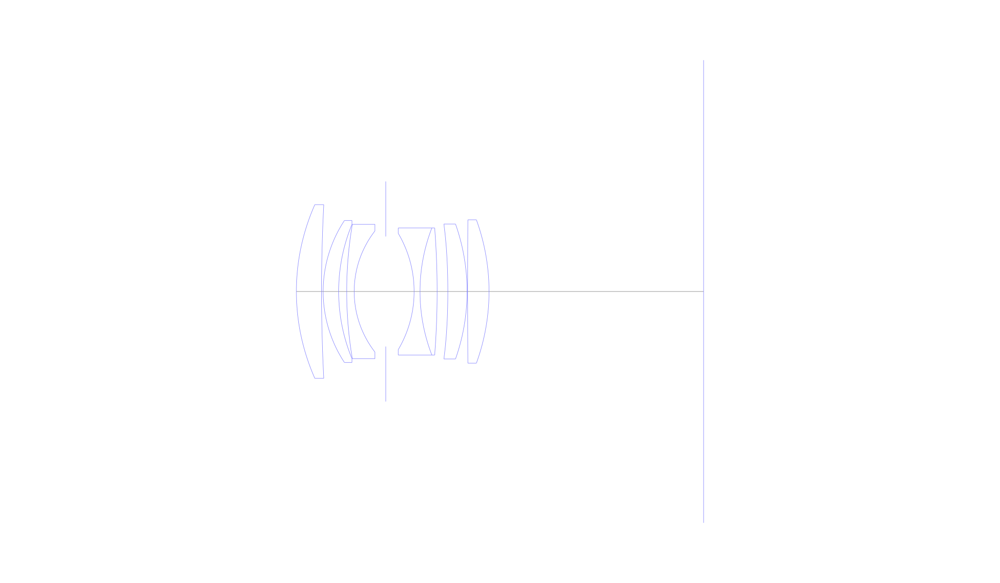
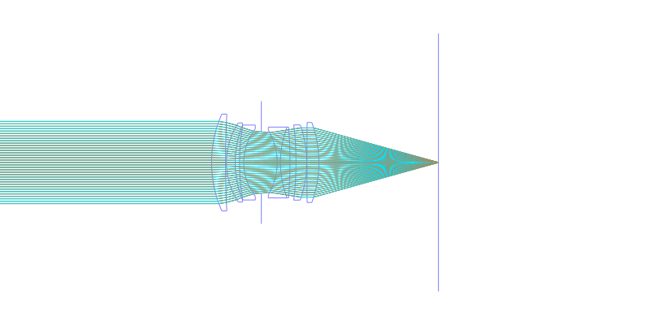
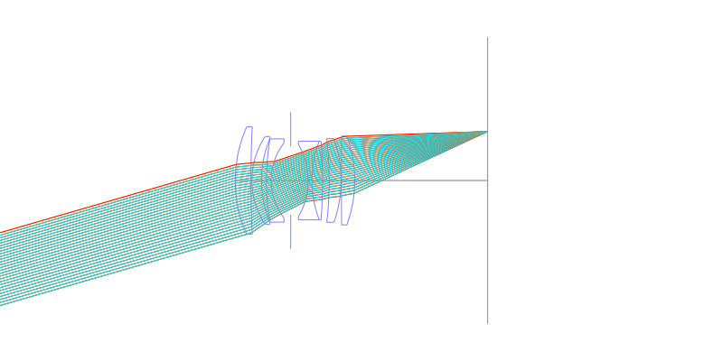
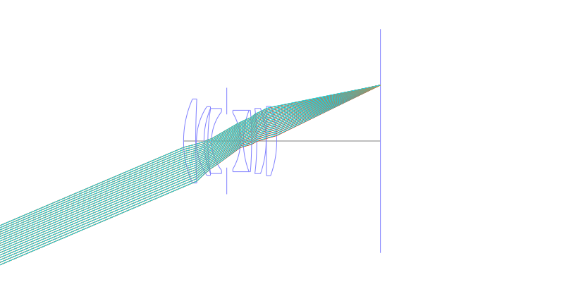
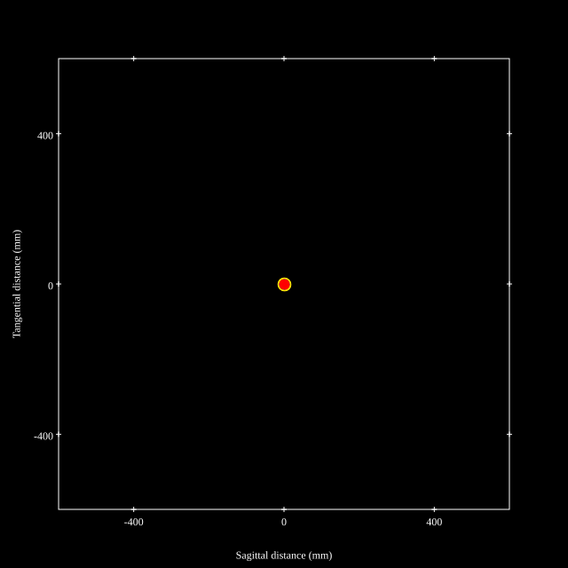
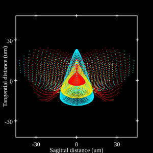
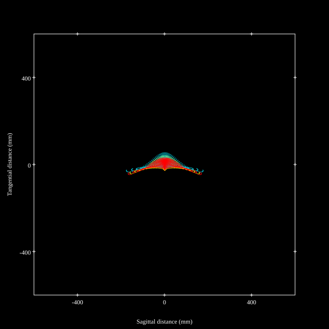
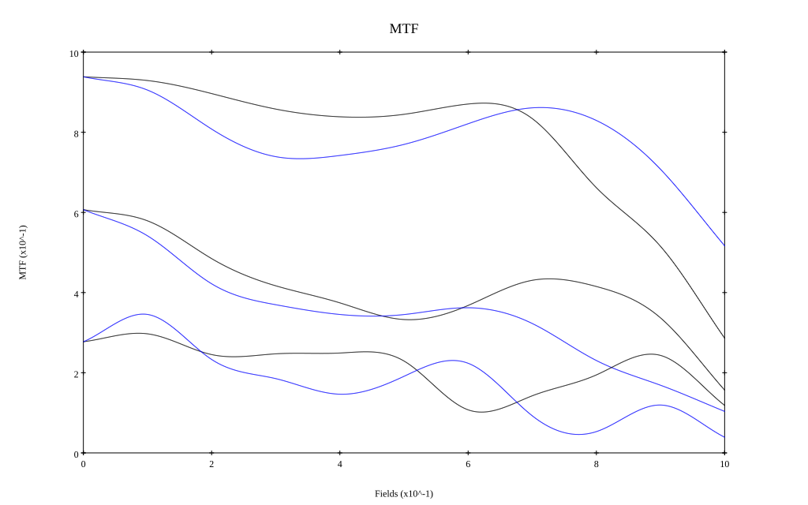
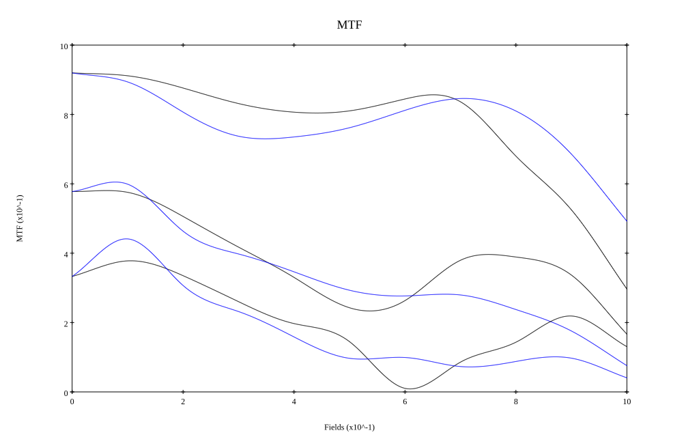

## Surface Data
Note that where glass types are shown the refractive index and abbe number is as per assigned glass type

| ID  | Radius | Thickness | Diameter | nd  | vd  | Glass Make | Glass |
| --- | ---    | ---       | ---      | --- | --- | ---        | ---   |
| 1 | 40.0 | 4.7 | 32.48 | 1.83481 | 42.73 | Hikari | J-LASF05 |
| 2 | 320.2167 | 0.3 | 32.48 |  |  |  |
| 3 | 24.15 | 2.9 | 26.54 | 1.804 | 46.6 | Hikari | J-LASF015 |
| 4 | 33.0 | 1.5 | 25.14 |  |  |  |
| 5 | 75.2087 | 1.4 | 25.14 | 1.6727 | 32.19 | Hikari | J-SF5 |
| 6 | 18.4804 | 5.9 | 22.64 |  |  |  |
| 7 | AS | 5.3 | 20.579 |  |  |  |
| 8 | -21.408 | 1.1 | 21.72 | 1.69895 | 30.13 | Hikari | J-SF15 |
| 9 | 32.983 | 3.2 | 23.76 | 1.804 | 46.6 | Hikari | J-LASF015 |
| 10 | -154.0 | 2.0 | 23.76 |  |  |  |
| 11 | -125.0 | 3.6 | 25.22 | 1.85135 | 40.1 | Hoya | M-TAFD305 |
| 12 | -37.8007 | 0.1 | 25.22 |  |  |  |
| 13 | 1843.2441 | 4.0 | 26.82 | 1.804 | 46.6 | Hikari | J-LASF015 |
| 14 | -39.1647 | 40.1 | 26.82 |  |  |  |
## Aspherical Data
| ID  | k   | P1  | P2  | P3  | P3 | P5 | P6 | P7 | P8 | P9 | P10 |
| --- | --- | --- | --- | --- | --- | --- | --- | --- | --- | --- | --- |
| 11 | 0.0 | 0.0 | -3.6998E-6 | -1.7387E-9 | 0.0 | 0.0 | 0.0 | 0.0 | 0.0 | 0.0 | 0.0 |
## Layouts

## Spot Diagrams

## Paraxial Parameters
| parameter | value |
| ---       | ---   |
| effective_focal_length |51.602
| back_focal_length | 40.165
| optical_invariant | 5.905
| object_distance | 1.0E10
| image_distance | 40.165
| power | 0.019
| pp1_H | 29.196
| ppk_H' | -11.437
| ffl_F | -22.406
| fno | 1.86
| enp_dist_P | 18.52
| enp_radius | 13.871
| exp_dist_P' | -24.832
| exp_radius | 17.49
| m | -0
| red | -1.9379180537882844E8
| n_obj | 1
| n_img | 1
| img_ht | 21.967
| obj_ang | 23.06
| obj_na | 0
| img_na | -0.26|
## Spot Analysis
| Field | Spot Mean Radius | Spot Max Radius |
| ---   | ---              | ---             |
 | Field(x=0.0, y=0.0) | 7.745 | 16.468|
 | Field(x=0.0, y=0.1) | 8.771 | 29.416|
 | Field(x=0.0, y=0.2) | 12.499 | 38.257|
 | Field(x=0.0, y=0.3) | 15.55 | 50.552|
 | Field(x=0.0, y=0.4) | 14.932 | 44.614|
 | Field(x=0.0, y=0.5) | 13.842 | 51.688|
 | Field(x=0.0, y=0.6) | 12.052 | 37.791|
 | Field(x=0.0, y=0.7) | 12.465 | 40.937|
 | Field(x=0.0, y=0.8) | 19.493 | 74.91|
 | Field(x=0.0, y=0.9) | 34.121 | 123.148|
 | Field(x=0.0, y=1.0) | 54.3 | 178.244|
## Polychromatic Geometric MTF

* 10,30,50 cycles/mm
* Black lines represent sagittal, blue tangential
* To generate above, MTFs for wavelengths 587.5618(d), 486.1327(F), 656.2725(C) were calculated across 10 fields, and then averaged
## Polychromatic Geometric MTF (Weighted)

* 10,30,50 cycles/mm
* Black lines represent sagittal, blue tangential
* To generate above, MTFs for wavelengths 587.5618(d) wt(1.0), 656.2725(C) wt(0.475), 546.074(e) wt(0.98), 486.1327(F) wt(0.49), 435.8343(g) wt(0.15) were calculated across 10 fields, and then combined using weighted average
## Resources
* [OpticalBench Compatible Data File, tab delimited](./JP2011-175123_Example07.txt)
* [Zemax file](./JP2011-175123_Example07.zmx)
