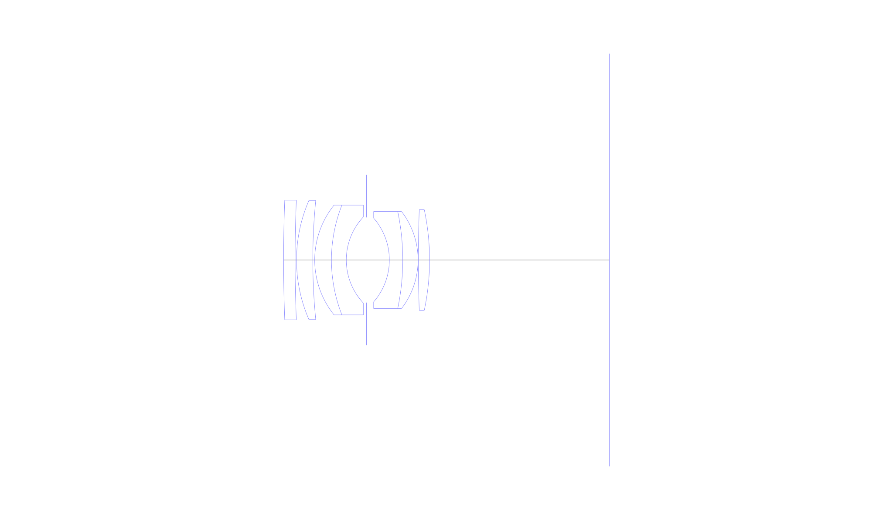
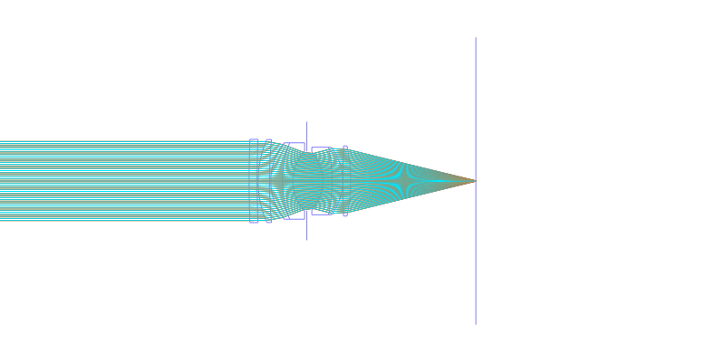
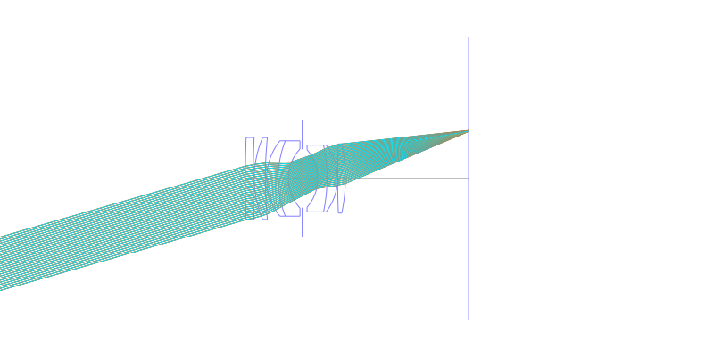
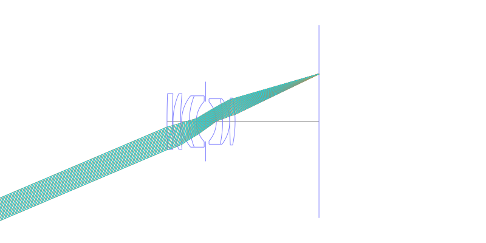
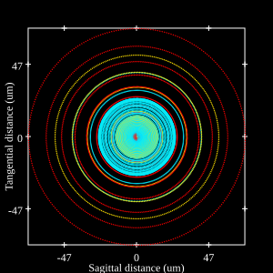
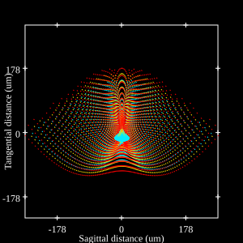
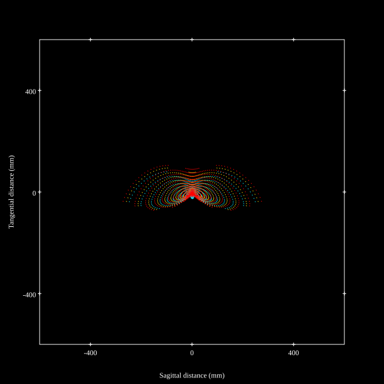
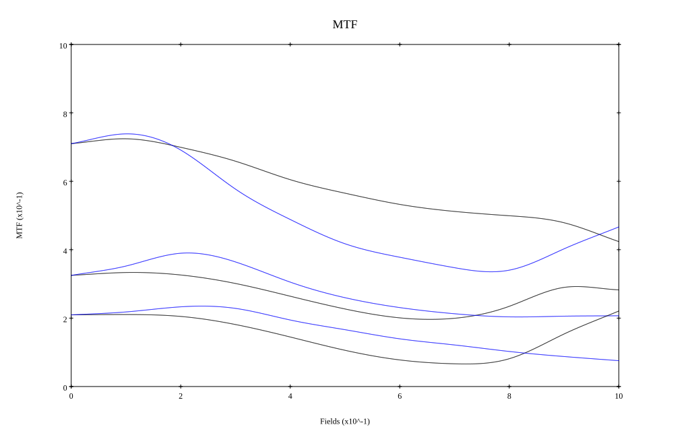
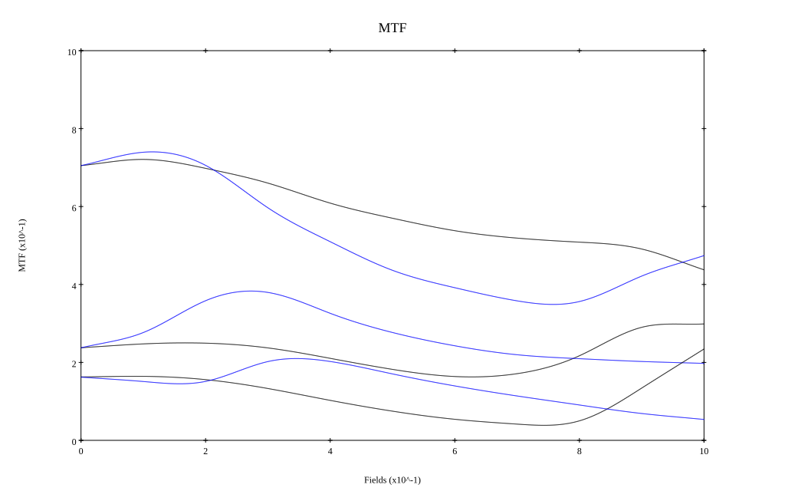

# Nikkor-S Auto 50mm f/2 v1
## Patent Information
| Country | Patent Number | Example | Year of Application | Inventors | Organisation | Link |
| ---     | ---           | ---     | ---                 | ---       | ---          | ---  |
|JP | JP,39-025754,B(1964) | EX 1 | 1959 | Saburo Murakami | Nikon Corp | [link](https://www.j-platpat.inpit.go.jp/c1801/PU/JP-S39-025754/12/en) |
## Surface Data
Note that where glass types are shown the refractive index and abbe number is as per assigned glass type

| ID  | Radius | Thickness | Diameter | nd  | vd  | Glass Make | Glass |
| --- | ---    | ---       | ---      | --- | --- | ---        | ---   |
| 1 | 328.5 | 2.4 | 25.04 | 1.61272 | 58.54 | Hikari | J-SK4 |
| 2 | 299.0 | 0.3 | 25.04 |  |  |  |
| 3 | 31.3 | 3.4 | 24.96 | 1.61405 | 54.99 | Ohara | S-BSM9 |
| 4 | 125.95 | 0.4 | 24.96 |  |  |  |
| 5 | 18.36 | 3.5 | 22.98 | 1.61405 | 54.99 | Ohara | S-BSM9 |
| 6 | 31.3 | 3.1 | 22.98 | 1.64831 | 33.84 | Schott | SF12 |
| 7 | 13.18 | 4.23 | 18.02 |  |  |  |
| 8 | AS | 4.77 | 17.826 |  |  |  |
| 9 | -13.35 | 2.8 | 17.53 | 1.7408 | 28.09 | Schott | SF54 |
| 10 | -49.54 | 3.2 | 20.35 | 1.744 | 44.8 | Hikari | J-LAF2 |
| 11 | -16.67 | 0.05 | 20.35 |  |  |  |
| 12 | 274.25 | 2.35 | 21.08 | 1.744 | 44.8 | Hikari | J-LAF2 |
| 13 | -50.7 | 37.585 | 21.08 |  |  |  |
## Layouts

## Spot Diagrams

## Paraxial Parameters
| parameter | value |
| ---       | ---   |
| effective_focal_length |50.035
| back_focal_length | 37.589
| optical_invariant | 5.31
| object_distance | 1.0E10
| image_distance | 37.589
| power | 0.02
| pp1_H | 20.296
| ppk_H' | -12.447
| ffl_F | -29.739
| fno | 2
| enp_dist_P | 17.785
| enp_radius | 12.509
| exp_dist_P' | -15.087
| exp_radius | 13.17
| m | -0
| red | -1.9986003221017337E8
| n_obj | 1
| n_img | 1
| img_ht | 21.239
| obj_ang | 23
| obj_na | 0
| img_na | -0.243|
## Spot Analysis
| Field | Spot Mean Radius | Spot Max Radius |
| ---   | ---              | ---             |
 | Field(x=0.0, y=0.0) | 21.082 | 58.209|
 | Field(x=0.0, y=0.1) | 19.474 | 89.393|
 | Field(x=0.0, y=0.2) | 23.931 | 100.062|
 | Field(x=0.0, y=0.3) | 33.074 | 117.758|
 | Field(x=0.0, y=0.4) | 46.382 | 146.918|
 | Field(x=0.0, y=0.5) | 53.79 | 167.388|
 | Field(x=0.0, y=0.6) | 59.649 | 197.341|
 | Field(x=0.0, y=0.7) | 64.339 | 226.826|
 | Field(x=0.0, y=0.8) | 67.588 | 254.677|
 | Field(x=0.0, y=0.9) | 69.686 | 271.532|
 | Field(x=0.0, y=1.0) | 68.62 | 274.722|
## Polychromatic Geometric MTF

* 10,30,50 cycles/mm
* Black lines represent sagittal, blue tangential
* To generate above, MTFs for wavelengths 587.5618(d), 486.1327(F), 656.2725(C) were calculated across 10 fields, and then averaged
## Polychromatic Geometric MTF (Weighted)

* 10,30,50 cycles/mm
* Black lines represent sagittal, blue tangential
* To generate above, MTFs for wavelengths 587.5618(d) wt(1.0), 656.2725(C) wt(0.475), 546.074(e) wt(0.98), 486.1327(F) wt(0.49), 435.8343(g) wt(0.15) were calculated across 10 fields, and then combined using weighted average
## Resources
* [OpticalBench Compatible Data File, tab delimited](./JP1964-025754_Example01.txt)
* [Zemax file](./JP1964-025754_Example01.zmx)
