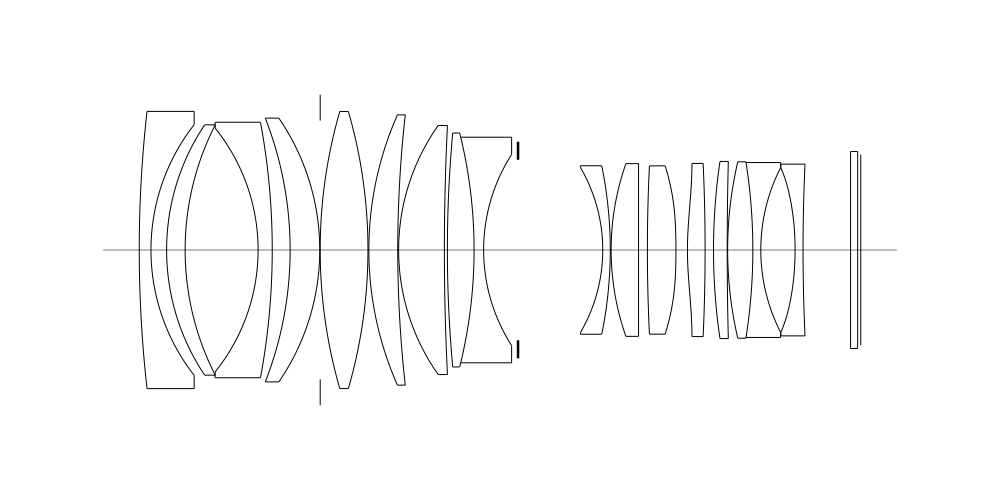
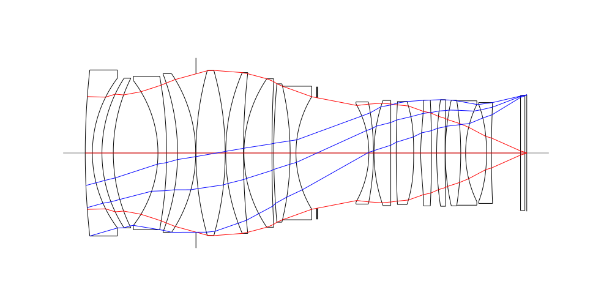
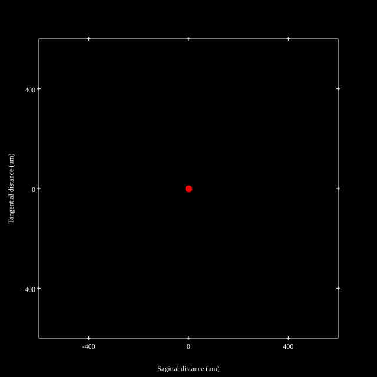
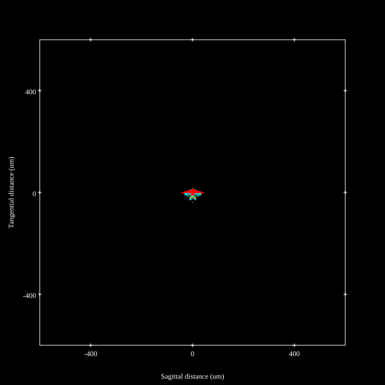
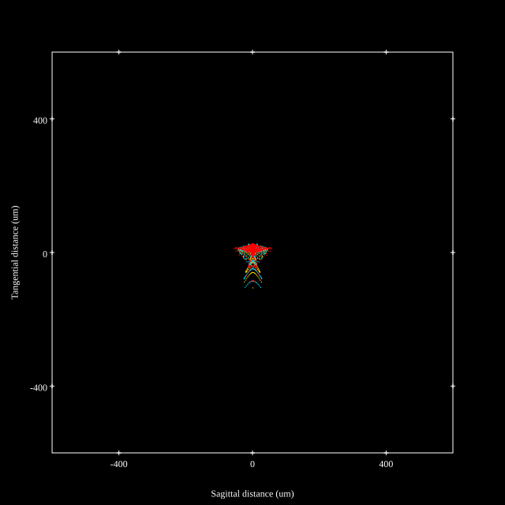
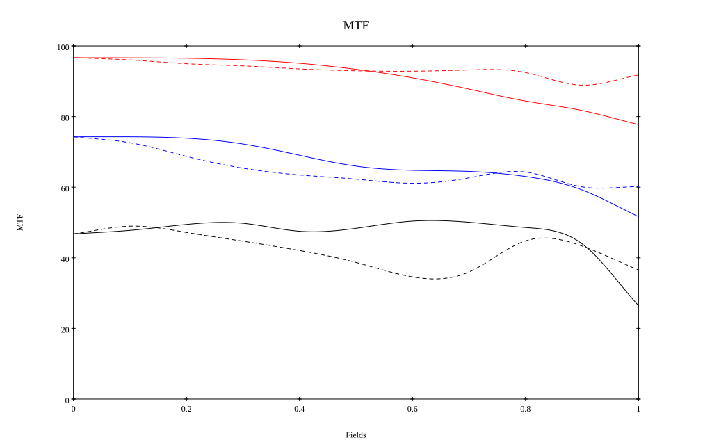
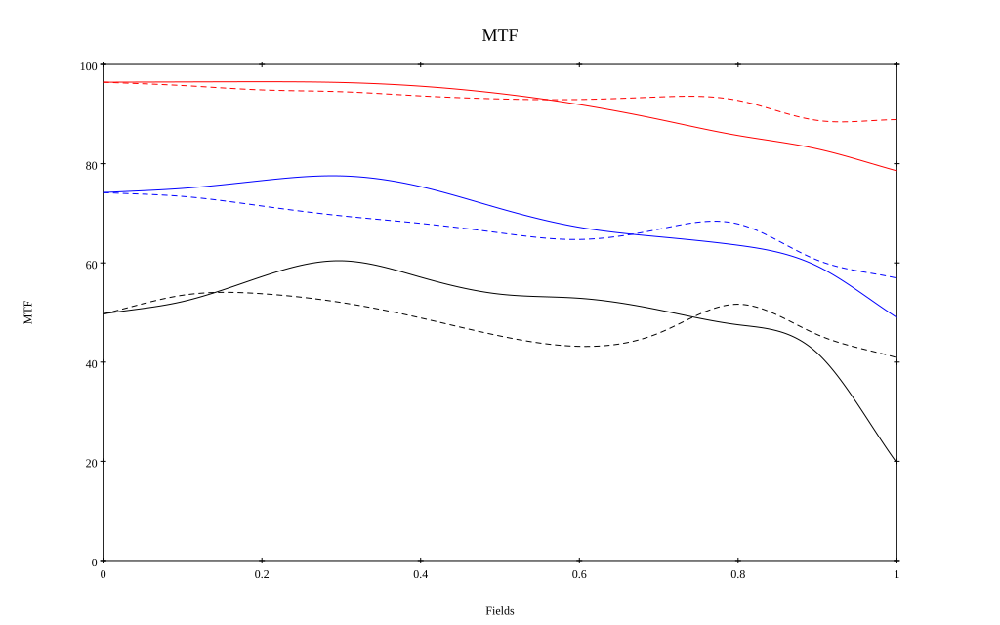

# NIKKOR Z 50mm f/1.2 S
## Patent Information
| Country | Patent Number | Example | Year of Application | Inventors | Organisation | Link |
| ---     | ---           | ---     | ---                 | ---       | ---          | ---  |
|EU | WO 2021/241230 | EX 1 | 2021 | Hiroki Harada | Nikon Corp | [link](https://patents.google.com/patent/WO2021241230A1/en) |
## Surface Data
Note that where glass types are shown the refractive index and abbe number is as per assigned glass type

| ID  | Radius | Thickness | Diameter | nd  | vd  | Glass Make | Glass |
| --- | ---    | ---       | ---      | --- | --- | ---        | ---   |
| 1 | 280.6827 | 2.65 | 61.3982 | 1.64 | 60.19 | Hikari | J-LAK01 |
| 2 | 46.02198 | 3.54 | 55.4211 |  |  |  |
| 3 | 50.87481 | 4.19 | 55.2952 | 1.94594 | 17.98 | Hoya | FDS18 |
| 4 | 62.23366 | 16.51 | 53.938 |  |  |  |
| 5 | -43.98849 | 3.2 | 53.5133 | 1.55298 | 55.07 | Hikari | J-KZFH4 |
| 6 | -158.30791 | 4.05 | 56.7495 |  |  |  |
| 7 | -82.01412 | 6.7 | 57.2121 | 1.59349 | 67.0 | Hikari | J-PSKH4 |
| 8 | -52.72274 | 0.1 | 58.6067 |  |  |  |
| 9 | FS | 0.0 | 58.56 |  |  |  |
| 10 | 113.04472 | 10.81 | 60.8352 | 1.59349 | 67.0 | Hikari | J-PSKH4 |
| 11 | -113.04472 | 0.2 | 61.105 |  |  |  |
| 12 | 75.49059 | 6.54 | 59.4501 | 1.59349 | 67.0 | Hikari | J-PSKH4 |
| 13 | 275.33026 | 0.2 | 58.6273 |  |  |  |
| 14 | 48.85546 | 10.35 | 54.8865 | 1.59349 | 67.0 | Hikari | J-PSKH4 |
| 15 | 571.46325 | 0.68 | 52.8298 |  |  |  |
| 16 | 290.13527 | 6.04 | 51.1625 | 1.59319 | 67.9 | Hikari | J-PSKH1 |
| 17 | -109.11 | 2.16 | 49.3791 | 1.738 | 32.26 | Hikari | J-KZFH9 |
| 18 | 40.04126 | 7.79 | 41.6017 |  |  |  |
| 19 | AS | 19.164 | 40.8399 |  |  |  |
| 20 | -37.07012 | 1.7 | 36.392 | 1.72047 | 34.7 | Schott | N-KZFS8 |
| 21 | -95.03209 | 0.2 | 37.7351 |  |  |  |
| 22 | 58.85968 | 6.2 | 38.8871 | 1.59319 | 67.9 | Hikari | J-PSKH1 |
| 23 | 0.0 | 2.0 | 38.5144 |  |  |  |
| 24 | 391.6081 | 6.46 | 38.08 | 1.59349 | 67.0 | Hikari | J-PSKH4 |
| 25 | -165.0 | 2.6 | 38.08 |  |  |  |
| 26 | 71.0 | 4.0 | 38.9446 | 1.7645 | 49.1 | Ohara | L-LAH91 |
| 27 | -430.72555 | 1.9 | 39.143 |  |  |  |
| 28 | 137.78125 | 3.1 | 39.4009 | 1.618 | 63.34 | Hikari | J-PSK02 |
| 29 | 795.36428 | 0.1 | 39.27 |  |  |  |
| 30 | 87.92389 | 5.7 | 39.1064 | 1.90265 | 35.77 | Hikari | J-LASFH9A |
| 31 | -127.68 | 1.8 | 38.5846 | 1.61266 | 44.46 | Hikari | J-KZFH1 |
| 32 | 40.89766 | 7.76 | 35.8918 |  |  |  |
| 33 | -64.58764 | 1.8 | 35.8896 | 1.5168 | 64.13 | Hikari | J-BK7A |
| 34 | 423.87378 | 10.755 | 37.2869 |  |  |  |
| 35 | CG | 1.6 | 42.1185 | 1.5168 | 64.13 | Hikari | J-BK7A |
| 36 | CG | 0.702 | 42.6038 |  |  |  |
## Aspherical Data
| ID  | Type | k   | P1 | P2 | P3 | P4 | P5 | P6 | P7 | P8 |
| --- | --- | --- | --- | --- | --- | --- | --- | --- | --- | --- |
| 25| EVEN | 14.2295 | 0.0 | -2.31391E-5 | 7.84797E-8 | -2.2244E-10 | 4.8526E-13 | -7.0843E-16 | 6.0146E-19 | -2.2772E-22 |
| 26| EVEN | -1.1159 | 0.0 | -2.104E-5 | 5.52111E-8 | -1.4476E-10 | 2.0461E-13 | 1.6362E-16 | -1.0877E-18 | 1.1704E-21 |
| 33| EVEN | 8.4794 | 0.0 | 9.45827E-7 | 1.06743E-8 | -3.9491E-11 | 1.6764E-13 | -4.439E-16 | 6.5373E-19 | 0  |
## Layouts

## Spot Diagrams

## Paraxial Parameters
| parameter | value |
| ---       | ---   |
| effective_focal_length |51.281
| back_focal_length | 0.753
| optical_invariant | 8.763
| object_distance | 1.0E10
| image_distance | 0.753
| power | 0.02
| pp1_H | 61.198
| ppk_H' | -50.528
| ffl_F | 9.918
| fno | 1.23
| enp_dist_P | 50.619
| enp_radius | 20.846
| exp_dist_P' | -63.806
| exp_radius | 26.264
| m | -0
| red | -1.9500518046394414E8
| n_obj | 1
| n_img | 1
| img_ht | 21.556
| obj_ang | 22.8
| obj_na | 0
| img_na | -0.407|
## Spot Analysis
| Field | Spot Mean Radius (µm) | Spot Max Radius (µm) |
| ---   | ---              | ---             |
 | Field(x=0.0, y=0.0) | 5.811 | 11.638|
 | Field(x=0.0, y=0.1) | 6.154 | 23.565|
 | Field(x=0.0, y=0.2) | 6.706 | 28.391|
 | Field(x=0.0, y=0.3) | 7.117 | 33.168|
 | Field(x=0.0, y=0.4) | 7.838 | 37.042|
 | Field(x=0.0, y=0.5) | 8.692 | 38.862|
 | Field(x=0.0, y=0.6) | 9.615 | 39.358|
 | Field(x=0.0, y=0.7) | 10.722 | 46.43|
 | Field(x=0.0, y=0.8) | 12.318 | 53.735|
 | Field(x=0.0, y=0.9) | 14.715 | 76.334|
 | Field(x=0.0, y=1.0) | 16.462 | 121.146|
## Polychromatic Geometric MTF

* 10=red,30=blue,50=black cycles/mm
* Solid lines represent sagittal, dashed lines tangential
* To generate above, MTFs for wavelengths 587.5618(d), 486.1327(F), 656.2725(C) were calculated across 10 fields, and then averaged
## Polychromatic Geometric MTF (Weighted)

* 10=red,30=blue,50=black cycles/mm
* Solid lines represent sagittal, dashed lines tangential
* To generate above, MTFs for wavelengths 587.5618(d) wt(1.0), 656.2725(C) wt(0.475), 546.074(e) wt(0.98), 486.1327(F) wt(0.49), 435.8343(g) wt(0.15) were calculated across 10 fields, and then combined using weighted average
## Resources
* [OpticalBench Compatible Data File, tab delimited](./prescription.txt)
* [Zemax file](./Nikkor-Z-50mm-f1.2.zmx)

Generated from `Nikkor-Z-50mm-f1.2.txt`, status **Accepted**

Report / Zemax file generated using [Beam42](https://github.com/BeamFour/Beam42) on 2026-10-02
