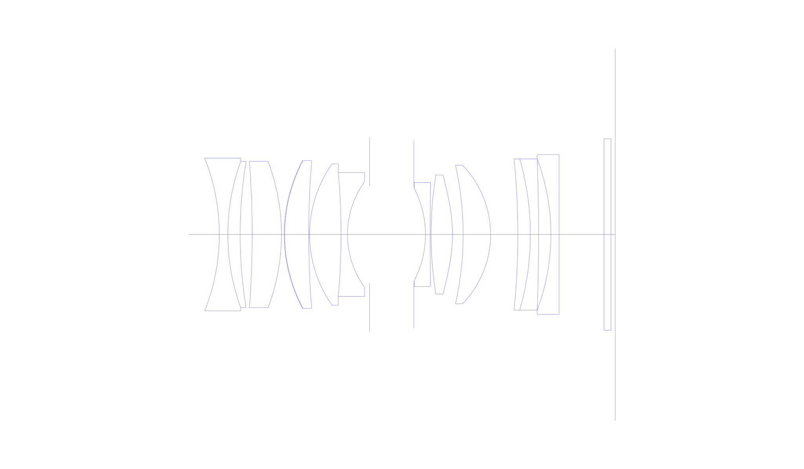
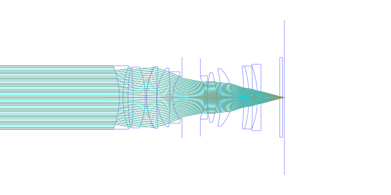
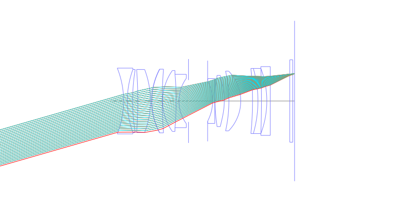
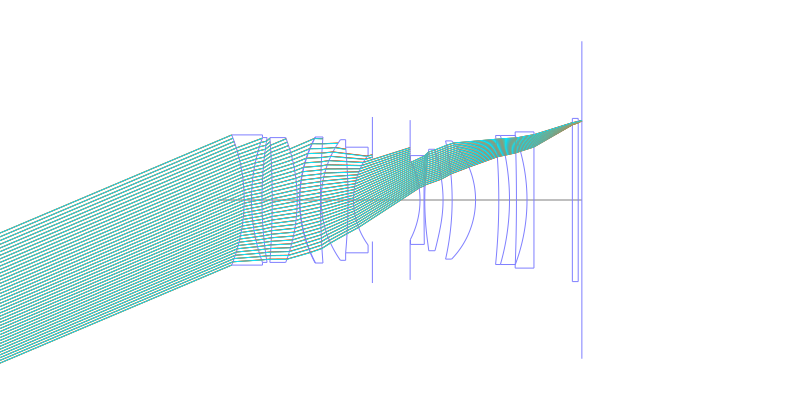
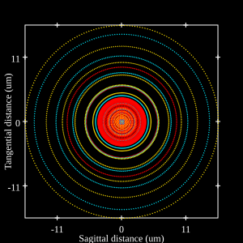
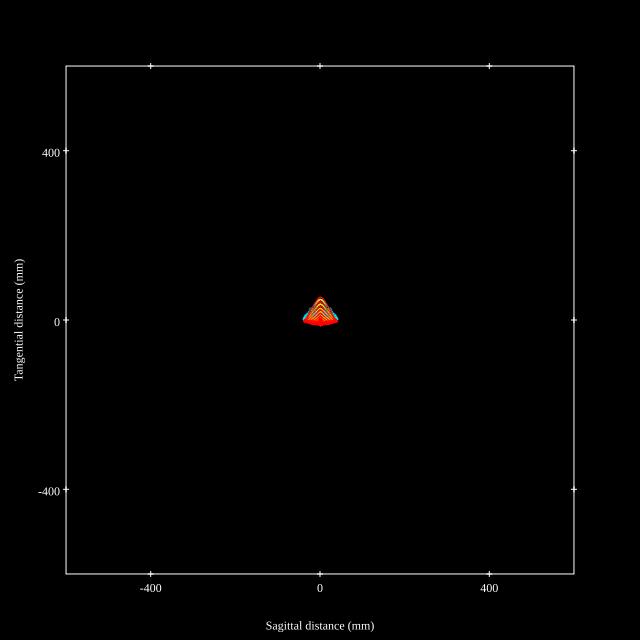
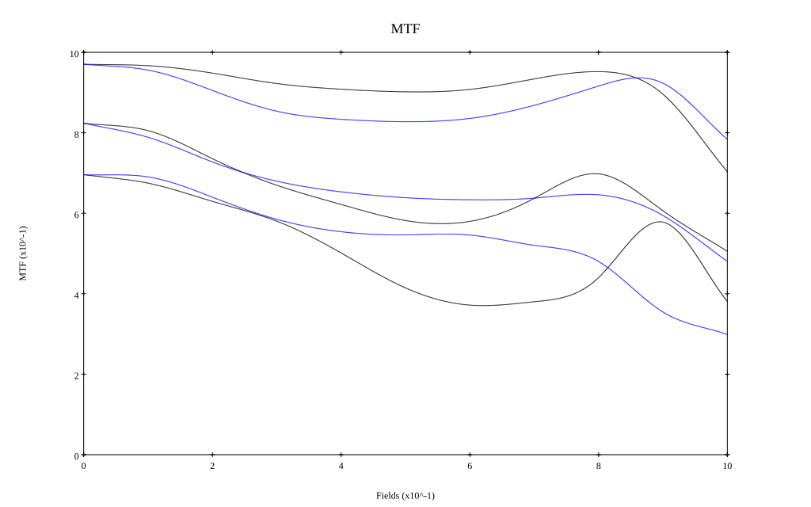
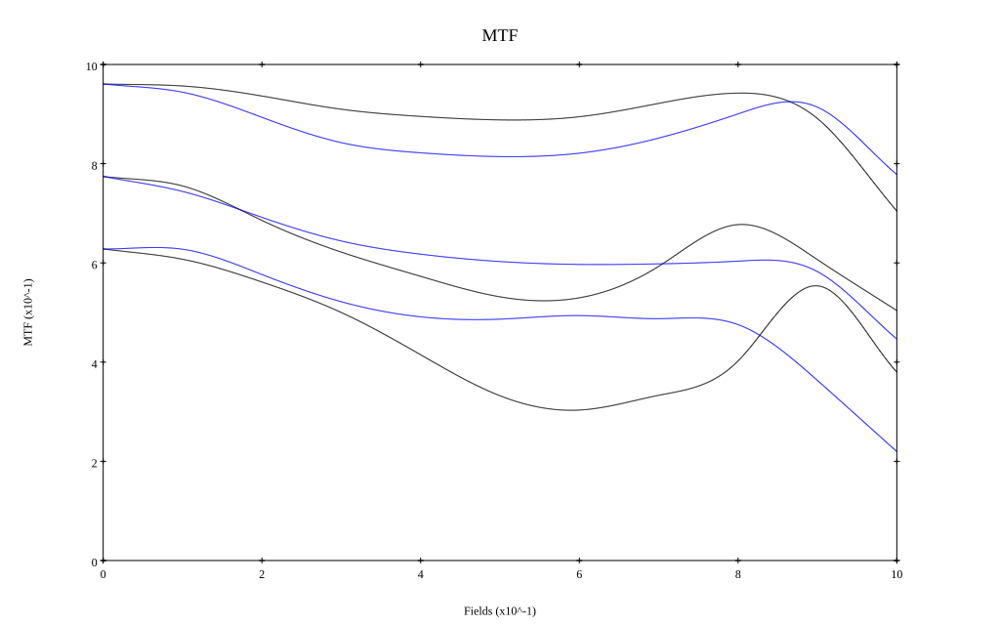

# NIKKOR Z 50mm f/1.8 S
## Patent Information
| Country | Patent Number | Example | Year of Application | Inventors | Organisation | Link |
| ---     | ---           | ---     | ---                 | ---       | ---          | ---  |
|EU | WO 2019/220618 | EX 9 | 2018 | MASUGI SABURO, SASHIMA TOMOYUKI | Nikon Corp  | [link](https://patents.google.com/patent/WO2019220618A1/en) |
## Surface Data
Note that where glass types are shown the refractive index and abbe number is as per assigned glass type

| ID  | Radius | Thickness | Diameter | nd  | vd  | Glass Make | Glass |
| --- | ---    | ---       | ---      | --- | --- | ---        | ---   |
| 1 | -48.06457 | 2.0 | 35.6 | 1.6727 | 32.19 | Hikari | J-SF5 |
| 2 | 50.03333 | 2.861 | 34.12 | 1.94594 | 17.98 | Hoya | FDS18 |
| 3 | 105.0 | 2.805 | 34.12 |  |  |  |
| 4 | -226.31231 | 6.827 | 34.12 | 1.72916 | 54.61 | Hikari | J-LAK18 |
| 5 | -47.98013 | 0.644 | 34.12 |  |  |  |
| 6 | 36.6491 | 0.1 | 34.28 | 1.56093 | 36.6 |  |
| 7 | 36.85687 | 5.622 | 34.46 | 1.804 | 46.6 | Hikari | J-LASF015 |
| 8 | 217.9278 | 0.2 | 34.46 |  |  |  |
| 9 | 28.49361 | 7.332 | 32.98 | 1.59319 | 67.9 | Hikari | J-PSKH1 |
| 10 | -161.37986 | 1.5 | 28.88 | 1.64769 | 33.72 | Hikari | J-SF2 |
| 11 | 20.99038 | 5.164 | 24.62 |  |  |  |
| 12 | AS | 10.32 | 22.698 |  |  |  |
| 13 | FS | 2.7 | 21.84 |  |  |  |
| 14 | -23.41799 | 1.1 | 21.44 | 1.64769 | 33.72 | Hikari | J-SF2 |
| 15 | 998.77224 | 0.2 | 24.28 |  |  |  |
| 16 | 85.12299 | 5.0 | 27.74 | 1.77377 | 47.17 | Hoya | M-TAF401 |
| 17 | -35.29338 | 2.485 | 27.74 |  |  |  |
| 18 | -73.80381 | 6.4 | 32.32 | 1.49782 | 82.57 | Hikari | J-FKH1 |
| 19 | -23.23519 | 6.356 | 32.32 |  |  |  |
| 20 | -177.7544 | 2.927 | 35.28 | 1.94594 | 17.98 | Hoya | FDS18 |
| 21 | -63.69645 | 1.9 | 35.28 | 1.64769 | 33.72 | Hikari | J-SF2 |
| 22 | -482.01125 | 2.887 | 35.28 |  |  |  |
| 23 | -50.20764 | 1.9 | 35.44 | 1.64769 | 33.72 | Hikari | J-SF2 |
| 24 | 0.0 | 10.5 | 37.24 |  |  |  |
| 25 | 0.0 | 1.6 | 44.62 | 1.5168 | 64.13 | Hikari | J-BK7A |
| 26 | 0.0 | 1.0 | 44.62 |  |  |  |
## Aspherical Data
| ID  | k   | P1  | P2  | P3  | P3 | P5 | P6 | P7 | P8 | P9 | P10 |
| --- | --- | --- | --- | --- | --- | --- | --- | --- | --- | --- | --- |
| 6 | 0.0 | 0.0 | -4.74106E-7 | -3.40824E-10 | 2.15394E-12 | -1.54492E-15 | 0.0 | 0.0 | 0.0 | 0.0 | 0.0 |
| 16 | 0.0 | 0.0 | -1.95205E-7 | 1.94342E-8 | -8.61846E-11 | -2.07763E-13 | 0.0 | 0.0 | 0.0 | 0.0 | 0.0 |
| 17 | 0.0 | 0.0 | 1.47643E-5 | 2.08671E-8 | 8.44852E-11 | -6.9321E-13 | 0.0 | 0.0 | 0.0 | 0.0 | 0.0 |
## Layouts

## Spot Diagrams

## Paraxial Parameters
| parameter | value |
| ---       | ---   |
| effective_focal_length |51.601
| back_focal_length | 1
| optical_invariant | 5.903
| object_distance | 1.0E10
| image_distance | 1
| power | 0.019
| pp1_H | 22.591
| ppk_H' | -50.601
| ffl_F | -29.01
| fno | 1.85
| enp_dist_P | 24.668
| enp_radius | 13.946
| exp_dist_P' | -48.604
| exp_radius | 13.407
| m | -0
| red | -1.9379406824489543E8
| n_obj | 1
| n_img | 1
| img_ht | 21.84
| obj_ang | 22.94
| obj_na | 0
| img_na | -0.261|
## Spot Analysis
| Field | Spot Mean Radius | Spot Max Radius |
| ---   | ---              | ---             |
 | Field(x=0.0, y=0.0) | 5.533 | 17.499|
 | Field(x=0.0, y=0.1) | 6.206 | 25.615|
 | Field(x=0.0, y=0.2) | 9.255 | 38.117|
 | Field(x=0.0, y=0.3) | 12.751 | 73.265|
 | Field(x=0.0, y=0.4) | 13.283 | 68.01|
 | Field(x=0.0, y=0.5) | 13.415 | 62.754|
 | Field(x=0.0, y=0.6) | 12.907 | 53.743|
 | Field(x=0.0, y=0.7) | 10.473 | 45.854|
 | Field(x=0.0, y=0.8) | 8.234 | 33.542|
 | Field(x=0.0, y=0.9) | 10.029 | 27.901|
 | Field(x=0.0, y=1.0) | 18.215 | 54.958|
## Polychromatic Geometric MTF

* 10,30,50 cycles/mm
* Black lines represent sagittal, blue tangential
* To generate above, MTFs for wavelengths 587.5618(d), 486.1327(F), 656.2725(C) were calculated across 10 fields, and then averaged
## Polychromatic Geometric MTF (Weighted)

* 10,30,50 cycles/mm
* Black lines represent sagittal, blue tangential
* To generate above, MTFs for wavelengths 587.5618(d) wt(1.0), 656.2725(C) wt(0.475), 546.074(e) wt(0.98), 486.1327(F) wt(0.49), 435.8343(g) wt(0.15) were calculated across 10 fields, and then combined using weighted average
## Resources
* [OpticalBench Compatible Data File, tab delimited](./WO2019-220618_Example09P.txt)
* [Zemax file](./WO2019-220618_Example09P.zmx)
