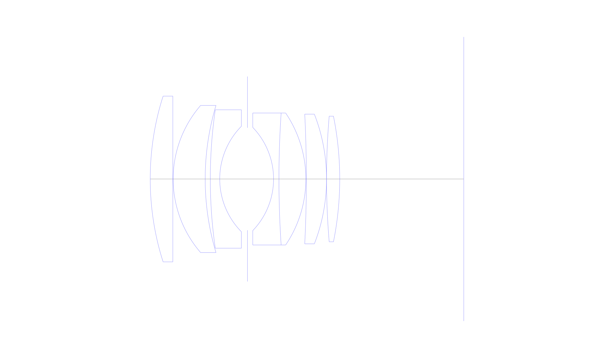
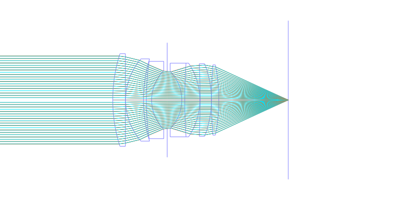
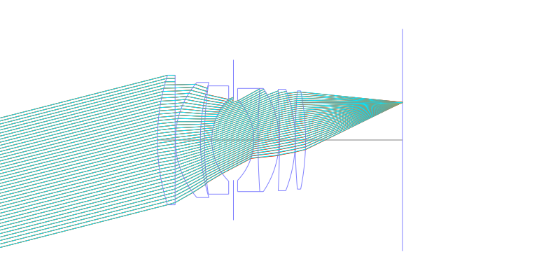
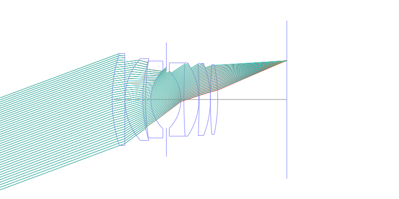
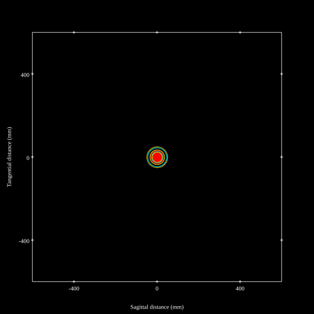
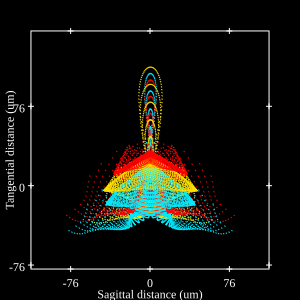
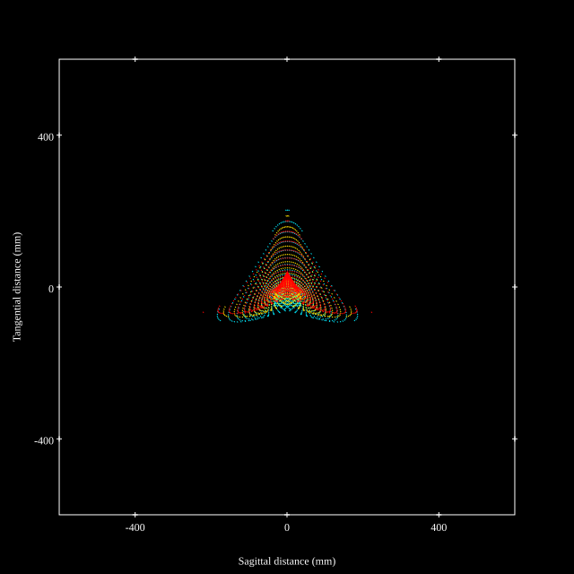
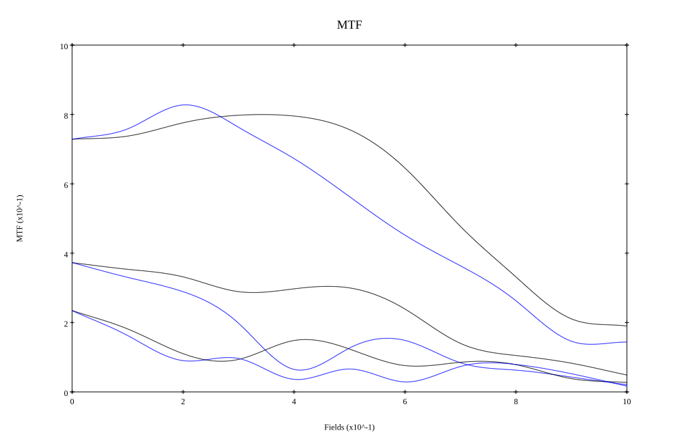
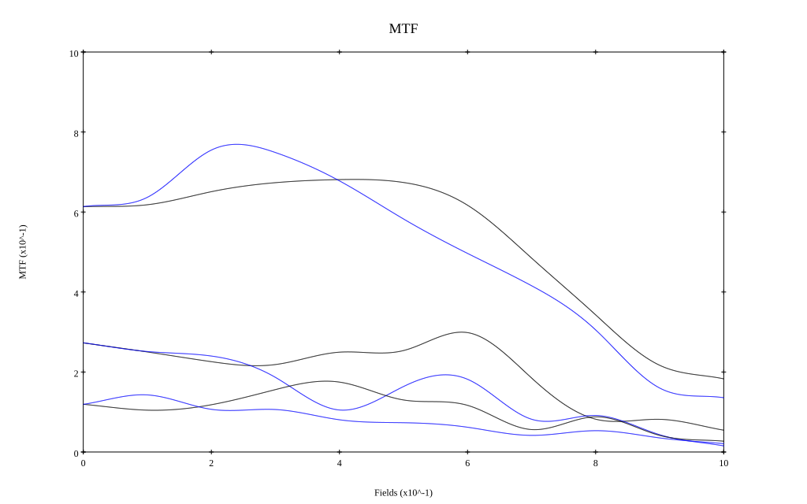

# AI Noct Nikkor 58mm f1.2 Reverse Engineered
## Surface Data
Note that where glass types are shown the refractive index and abbe number is as per assigned glass type

| ID  | Radius | Thickness | Diameter | nd  | vd  | Glass Make | Glass |
| --- | ---    | ---       | ---      | --- | --- | ---        | ---   |
| 1 | 84.12 | 6.885 | 50.4875 | 1.795 | 45.31 | Hikari | J-LASF017 |
| 2 | 0.0 | 0.1 | 50.4875 |  |  |  |
| 3 | 34.2214 | 9.75 | 44.832 | 1.8485 | 43.79 | Hikari | J-LASFH22 |
| 4 | 78.0494 | 1.56 | 44.832 |  |  |  |
| 5 | 147.7 | 2.87 | 42.169 | 1.74 | 28.3 | Ohara | S-TIH3 |
| 6 | 22.877 | 8.44 | 32.12841 |  |  |  |
| 7 | AS | 7.95 | 31.227 |  |  |  |
| 8 | -22.677 | 1.64 | 31.445 | 1.74077 | 27.79 | Ohara | S-TIH13 |
| 9 | 302.631 | 8.196 | 40.2 | 1.788 | 47.49 | Hoya | TAF4 |
| 10 | -35.901 | 0.15 | 40.2 |  |  |  |
| 11 | -396.965 | 6.147 | 39.5 | 1.7725 | 49.62 | Hikari | J-LASF016 |
| 12 | -54.436 | 0.0 | 39.5 |  |  |  |
| 13 | 227.228 | 4.016 | 38.275 | 1.795 | 45.31 | Hikari | J-LASF017 |
| 14 | -96.781 | 37.772 | 38.275 |  |  |  |
## Aspherical Data
| ID  | k   | P1  | P2  | P3  | P3 | P5 | P6 | P7 | P8 | P9 | P10 |
| --- | --- | --- | --- | --- | --- | --- | --- | --- | --- | --- | --- |
| 1 | 3.423989 | 0.0 | -4.9391634E-7 | -1.11125335E-9 | 1.4162813E-12 | -8.428294E-16 | 0.0 | 0.0 | 0.0 | 0.0 | 0.0 |
## Layouts

## Spot Diagrams

## Paraxial Parameters
| parameter | value |
| ---       | ---   |
| effective_focal_length |57.918
| back_focal_length | 38.025
| optical_invariant | 8.999
| object_distance | 1.0E10
| image_distance | 38.025
| power | 0.017
| pp1_H | 51.225
| ppk_H' | -19.893
| ffl_F | -6.693
| fno | 1.2
| enp_dist_P | 35.291
| enp_radius | 24.132
| exp_dist_P' | -41.623
| exp_radius | 33.292
| m | -0
| red | -1.726579592157734E8
| n_obj | 1
| n_img | 1
| img_ht | 21.597
| obj_ang | 20.45
| obj_na | 0
| img_na | -0.385|
## Spot Analysis
| Field | Spot Mean Radius | Spot Max Radius |
| ---   | ---              | ---             |
 | Field(x=0.0, y=0.0) | 18.144 | 50.014|
 | Field(x=0.0, y=0.1) | 18.135 | 66.275|
 | Field(x=0.0, y=0.2) | 15.527 | 61.986|
 | Field(x=0.0, y=0.3) | 15.316 | 57.942|
 | Field(x=0.0, y=0.4) | 16.7 | 68.029|
 | Field(x=0.0, y=0.5) | 19.231 | 60.549|
 | Field(x=0.0, y=0.6) | 23.695 | 81.048|
 | Field(x=0.0, y=0.7) | 29.523 | 89.415|
 | Field(x=0.0, y=0.8) | 38.616 | 138.781|
 | Field(x=0.0, y=0.9) | 50.872 | 167.13|
 | Field(x=0.0, y=1.0) | 70.728 | 231.167|
## Polychromatic Geometric MTF

* 10,30,50 cycles/mm
* Black lines represent sagittal, blue tangential
* To generate above, MTFs for wavelengths 587.5618(d), 486.1327(F), 656.2725(C) were calculated across 10 fields, and then averaged
## Polychromatic Geometric MTF (Weighted)

* 10,30,50 cycles/mm
* Black lines represent sagittal, blue tangential
* To generate above, MTFs for wavelengths 587.5618(d) wt(1.0), 656.2725(C) wt(0.475), 546.074(e) wt(0.98), 486.1327(F) wt(0.49), 435.8343(g) wt(0.15) were calculated across 10 fields, and then combined using weighted average
## Resources
* [OpticalBench Compatible Data File, tab delimited](./Noct-Nikkor-58mmf1.2.txt)
* [Zemax file](./Noct-Nikkor-58mmf1.2.zmx)
