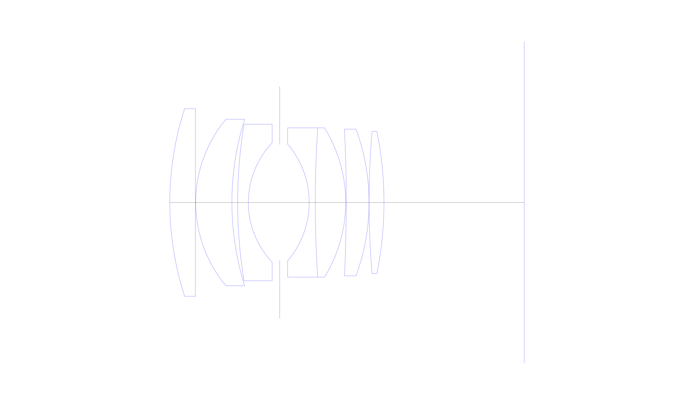
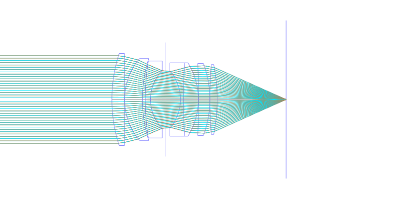
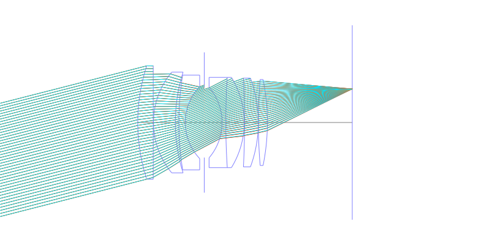
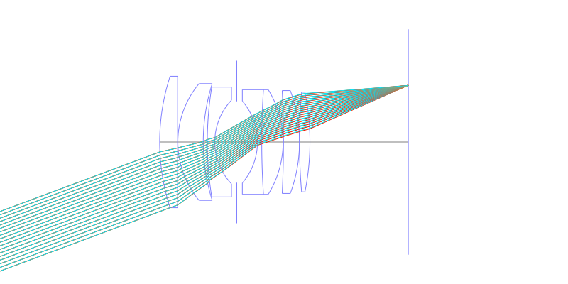
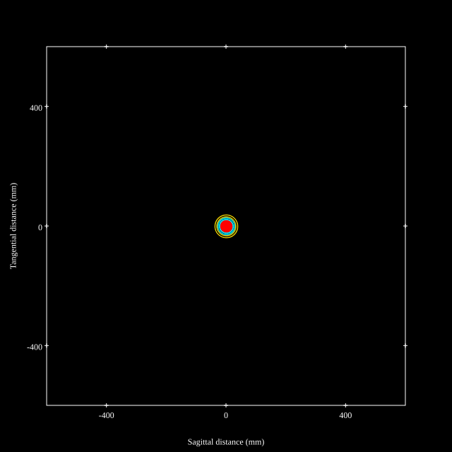
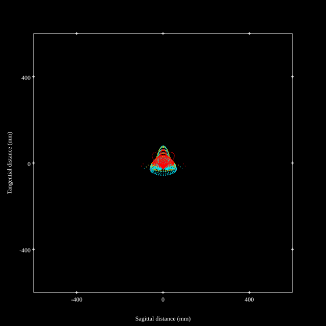
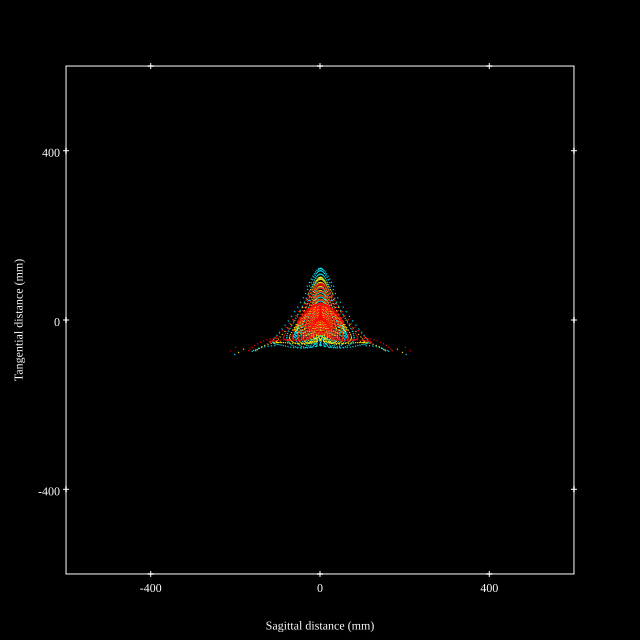
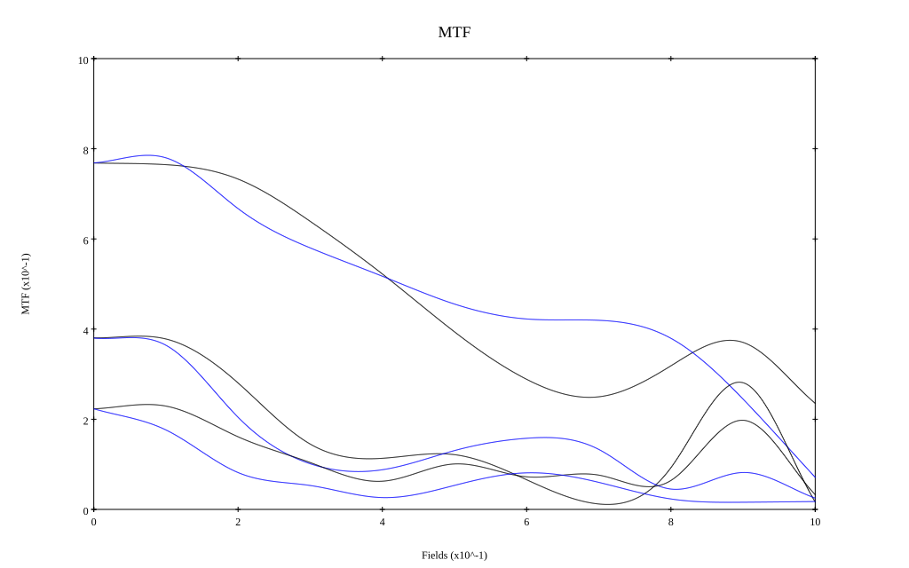
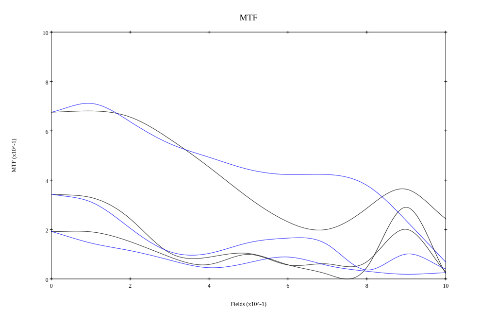

## Surface Data
Note that where glass types are shown the refractive index and abbe number is as per assigned glass type

| ID  | Radius | Thickness | Diameter | nd  | vd  | Glass Make | Glass |
| --- | ---    | ---       | ---      | --- | --- | ---        | ---   |
| 1 | 80.93964187674305 | 6.885 | 50.4875 | 1.795 | 45.31 | Hikari | J-LASF017 |
| 2 | 0.0 | 0.1 | 50.4875 |  |  |  |
| 3 | 34.931861275274095 | 9.75 | 44.832 | 1.8485 | 43.79 | Hikari | J-LASFH22 |
| 4 | 74.79297267908127 | 1.56 | 44.832 |  |  |  |
| 5 | 131.59740020542665 | 2.87 | 42.169 | 1.74 | 28.3 | Ohara | S-TIH3 |
| 6 | 23.338537869659557 | 8.44 | 32.12841 |  |  |  |
| 7 | AS | 7.95 | 31.227 |  |  |  |
| 8 | -24.17316178236456 | 1.64 | 31.445 | 1.74077 | 27.79 | Ohara | S-TIH13 |
| 9 | 306.72834752092393 | 8.196 | 40.2 | 1.788 | 47.49 | Hoya | TAF4 |
| 10 | -38.26157395765511 | 0.15 | 40.2 |  |  |  |
| 11 | -394.85267793871867 | 6.147 | 39.5 | 1.7725 | 49.62 | Hikari | J-LASF016 |
| 12 | -56.999313641580294 | 0.0 | 39.5 |  |  |  |
| 13 | 225.71138180533512 | 4.016 | 38.275 | 1.795 | 45.31 | Hikari | J-LASF017 |
| 14 | -96.41147731912545 | 37.78 | 38.275 |  |  |  |
## Aspherical Data
| ID  | Type | k   | P1 | P2 | P3 | P4 | P5 |
| --- | --- | --- | --- | --- | --- | --- | --- |
| 1| EVEN | 0.41593910954498625 | 0.0 | -3.3445274668144975E-7 | 1.1031377665972286E-11 | 6.757773996018557E-13 | -5.761573342842751E-16 |
## Layouts

## Spot Diagrams

## Paraxial Parameters
| parameter | value |
| ---       | ---   |
| effective_focal_length |58.901
| back_focal_length | 37.626
| optical_invariant | 8.958
| object_distance | 1.0E10
| image_distance | 37.626
| power | 0.017
| pp1_H | 49.768
| ppk_H' | -21.275
| ffl_F | -9.133
| fno | 1.226
| enp_dist_P | 35.394
| enp_radius | 24.024
| exp_dist_P' | -40.442
| exp_radius | 31.779
| m | -0
| red | -1.69776879988408E8
| n_obj | 1
| n_img | 1
| img_ht | 21.964
| obj_ang | 20.45
| obj_na | 0
| img_na | -0.378|
## Spot Analysis
| Field | Spot Mean Radius | Spot Max Radius |
| ---   | ---              | ---             |
 | Field(x=0.0, y=0.0) | 15.704 | 38.046|
 | Field(x=0.0, y=0.1) | 15.128 | 42.926|
 | Field(x=0.0, y=0.2) | 18.774 | 68.399|
 | Field(x=0.0, y=0.3) | 25.115 | 111.841|
 | Field(x=0.0, y=0.4) | 26.328 | 128.182|
 | Field(x=0.0, y=0.5) | 28.225 | 110.596|
 | Field(x=0.0, y=0.6) | 30.946 | 77.593|
 | Field(x=0.0, y=0.7) | 34.055 | 102.471|
 | Field(x=0.0, y=0.8) | 37.763 | 136.011|
 | Field(x=0.0, y=0.9) | 42.937 | 177.135|
 | Field(x=0.0, y=1.0) | 53.555 | 223.952|
## Polychromatic Geometric MTF

* 10,30,50 cycles/mm
* Black lines represent sagittal, blue tangential
* To generate above, MTFs for wavelengths 587.5618(d), 486.1327(F), 656.2725(C) were calculated across 10 fields, and then averaged
## Polychromatic Geometric MTF (Weighted)

* 10,30,50 cycles/mm
* Black lines represent sagittal, blue tangential
* To generate above, MTFs for wavelengths 587.5618(d) wt(1.0), 656.2725(C) wt(0.475), 546.074(e) wt(0.98), 486.1327(F) wt(0.49), 435.8343(g) wt(0.15) were calculated across 10 fields, and then combined using weighted average
## Resources
* [OpticalBench Compatible Data File, tab delimited](./prescription.txt)
* [Zemax file](./Noct-Nikkor-58mmf1.2.zmx)

Report / Zemax file generated using [Beam42](https://github.com/BeamFour/Beam42) on 2026-07-06
