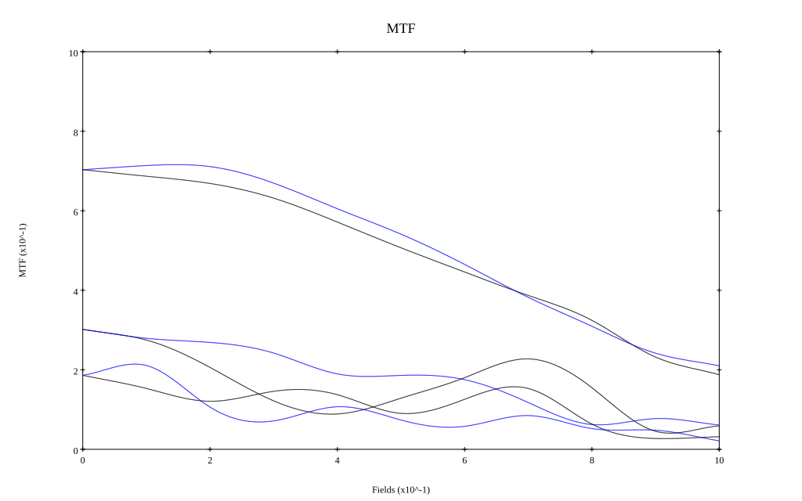

## Surface Data
Note that where glass types are shown the refractive index and abbe number is as per assigned glass type

| ID  | Radius | Thickness | Diameter | nd  | vd  | Glass Make | Glass |
| --- | ---    | ---       | ---      | --- | --- | ---        | ---   |
| 1 | 81.78806958237104 | 6.885 | 50.4875 | 1.795 | 45.31 | Hikari | J-LASF017 |
| 2 | 0.0 | 0.1 | 50.4875 |  |  |  |
| 3 | 34.61119620278737 | 9.75 | 44.832 | 1.8485 | 43.79 | Hikari | J-LASFH22 |
| 4 | 73.71901665222416 | 1.56 | 44.832 |  |  |  |
| 5 | 132.412938893216 | 2.87 | 42.169 | 1.74 | 28.3 | Ohara | S-TIH3 |
| 6 | 23.096319530396965 | 8.44 | 32.12841 |  |  |  |
| 7 | AS | 7.95 | 31.227 |  |  |  |
| 8 | -22.924335210546094 | 1.64 | 31.445 | 1.74077 | 27.79 | Ohara | S-TIH13 |
| 9 | 306.809610965077 | 8.196 | 40.2 | 1.788 | 47.49 | Hoya | TAF4 |
| 10 | -35.459139177715244 | 0.15 | 40.2 |  |  |  |
| 11 | -394.26508987025437 | 6.147 | 39.5 | 1.7725 | 49.62 | Hikari | J-LASF016 |
| 12 | -56.94340780253313 | 0.0 | 39.5 |  |  |  |
| 13 | 226.43187654820784 | 4.016 | 38.275 | 1.795 | 45.31 | Hikari | J-LASF017 |
| 14 | -96.07135282405889 | 37.78 | 38.275 |  |  |  |
## Aspherical Data
| ID  | k   | P1  | P2  | P3  | P3 | P5 | P6 | P7 | P8 | P9 | P10 |
| --- | --- | --- | --- | --- | --- | --- | --- | --- | --- | --- | --- |
| 1 | 0.3700325489429075 | 0.0 | -2.438639185079319E-7 | 1.1204779531463593E-10 | 3.844441243010319E-13 | -4.515196460153482E-16 | 0.0 | 0.0 | 0.0 | 0.0 | 0.0 |
## Layouts

## Spot Diagrams

## Paraxial Parameters
| parameter | value |
| ---       | ---   |
| effective_focal_length |58.039
| back_focal_length | 37.749
| optical_invariant | 9.018
| object_distance | 1.0E10
| image_distance | 37.749
| power | 0.017
| pp1_H | 50.836
| ppk_H' | -20.289
| ffl_F | -7.203
| fno | 1.2
| enp_dist_P | 35.345
| enp_radius | 24.183
| exp_dist_P' | -41.45
| exp_radius | 32.987
| m | -0
| red | -1.7229840741555038E8
| n_obj | 1
| n_img | 1
| img_ht | 21.642
| obj_ang | 20.45
| obj_na | 0
| img_na | -0.385|
## Spot Analysis
| Field | Spot Mean Radius | Spot Max Radius |
| ---   | ---              | ---             |
 | Field(x=0.0, y=0.0) | 19.435 | 82.693|
 | Field(x=0.0, y=0.1) | 25.608 | 151.558|
 | Field(x=0.0, y=0.2) | 39.198 | 184.745|
 | Field(x=0.0, y=0.3) | 33.963 | 194.1|
 | Field(x=0.0, y=0.4) | 35.745 | 202.51|
 | Field(x=0.0, y=0.5) | 40.049 | 219.043|
 | Field(x=0.0, y=0.6) | 43.251 | 256.521|
 | Field(x=0.0, y=0.7) | 44.899 | 248.605|
 | Field(x=0.0, y=0.8) | 52.784 | 284.004|
 | Field(x=0.0, y=0.9) | 65.052 | 326.721|
 | Field(x=0.0, y=1.0) | 82.164 | 373.594|
## Geometric MTF

* 10,30,50 cycles/mm
* Black lines represent sagittal, blue tangential
* Wavelengths 587.5618(d), 486.1327(F), 656.2725(C) equal weight
## Geometric MTF (Weighted)

* 10,30,50 cycles/mm
* Black lines represent sagittal, blue tangential
* Wavelengths 587.5618(d), 656.2725(C), 546.074(e), 486.1327(F), 435.8343(g) weighted 1.0,0.475,0.98,0.49,0.15
## Resources
* [OpticalBench Compatible Data File, tab delimited](./specs2.txt)
* [Zemax file](./specs2.zmx)
