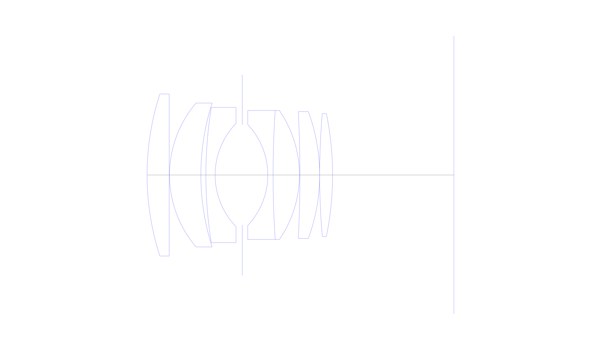
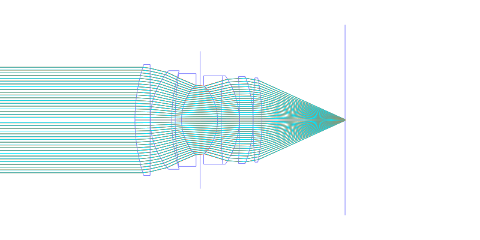
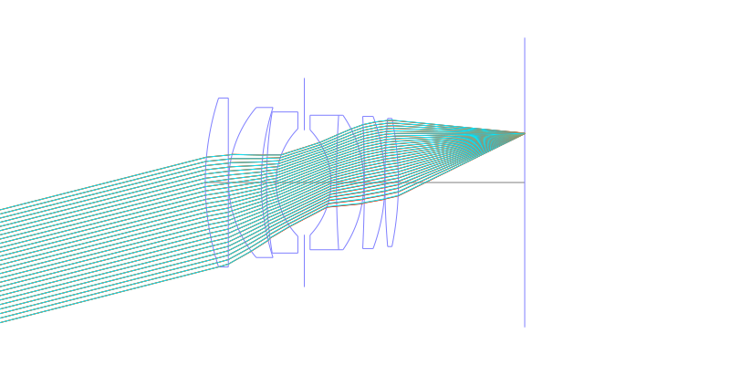
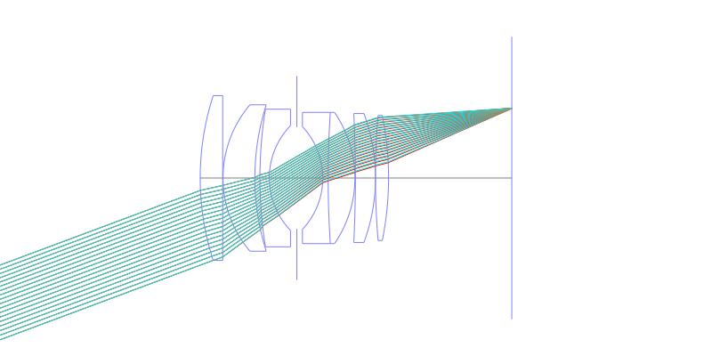
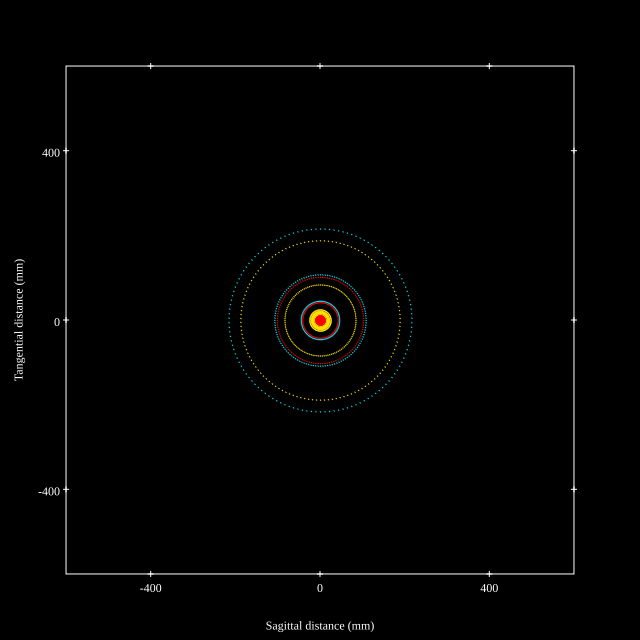
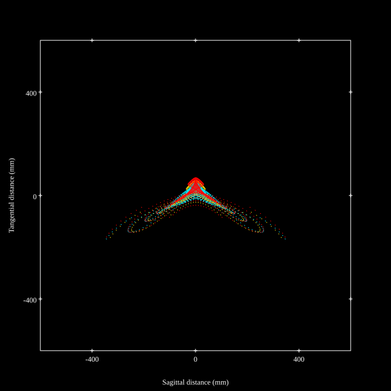
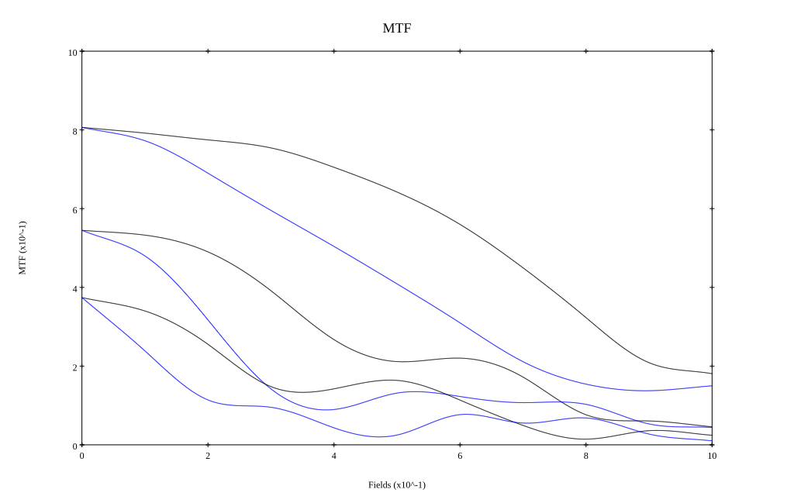

## Surface Data
Note that where glass types are shown the refractive index and abbe number is as per assigned glass type

| ID  | Radius | Thickness | Diameter | nd  | vd  | Glass Make | Glass |
| --- | ---    | ---       | ---      | --- | --- | ---        | ---   |
| 1 | 82.02049439630181 | 6.885 | 50.4875 | 1.795 | 45.31 | Hikari | J-LASF017 |
| 2 | 0.0 | 0.1 | 50.4875 |  |  |  |
| 3 | 34.48689433977534 | 9.75 | 44.832 | 1.8485 | 43.79 | Hikari | J-LASFH22 |
| 4 | 76.29174433707873 | 1.56 | 44.832 |  |  |  |
| 5 | 138.7740949607374 | 2.87 | 42.169 | 1.74 | 28.3 | Ohara | S-TIH3 |
| 6 | 22.843104683571728 | 8.44 | 32.12841 |  |  |  |
| 7 | AS | 7.95 | 31.227 |  |  |  |
| 8 | -22.750556888095886 | 1.64 | 31.445 | 1.74077 | 27.79 | Ohara | S-TIH13 |
| 9 | 305.9195711925611 | 8.196 | 40.2 | 1.788 | 47.49 | Hoya | TAF4 |
| 10 | -35.12425857302133 | 0.15 | 40.2 |  |  |  |
| 11 | -390.7213132906103 | 6.147 | 39.5 | 1.7725 | 49.62 | Hikari | J-LASF016 |
| 12 | -56.30503149966711 | 0.0 | 39.5 |  |  |  |
| 13 | 225.36169993668858 | 4.016 | 38.275 | 1.795 | 45.31 | Hikari | J-LASF017 |
| 14 | -97.90727063633547 | 37.78 | 38.275 |  |  |  |
## Aspherical Data
| ID  | k   | P1  | P2  | P3  | P3 | P5 | P6 | P7 | P8 | P9 | P10 |
| --- | --- | --- | --- | --- | --- | --- | --- | --- | --- | --- | --- |
| 1 | 0.7292152467564155 | 0.0 | -2.489084275746426E-7 | -3.436839903148345E-11 | 6.260073736345668E-13 | -7.234021013979926E-16 | 0.0 | 0.0 | 0.0 | 0.0 | 0.0 |
## Layouts

## Spot Diagrams

## Paraxial Parameters
| parameter | value |
| ---       | ---   |
| effective_focal_length |58.05
| back_focal_length | 37.789
| optical_invariant | 9.019
| object_distance | 1.0E10
| image_distance | 37.789
| power | 0.017
| pp1_H | 50.969
| ppk_H' | -20.261
| ffl_F | -7.081
| fno | 1.2
| enp_dist_P | 35.405
| enp_radius | 24.187
| exp_dist_P' | -41.517
| exp_radius | 33.048
| m | -0
| red | -1.722653668950038E8
| n_obj | 1
| n_img | 1
| img_ht | 21.646
| obj_ang | 20.45
| obj_na | 0
| img_na | -0.385|
## Spot Analysis
| Field | Spot Mean Radius | Spot Max Radius |
| ---   | ---              | ---             |
 | Field(x=0.0, y=0.0) | 60.133 | 216.038|
 | Field(x=0.0, y=0.1) | 63.962 | 341.016|
 | Field(x=0.0, y=0.2) | 76.977 | 365.826|
 | Field(x=0.0, y=0.3) | 66.129 | 379.272|
 | Field(x=0.0, y=0.4) | 66.674 | 389.596|
 | Field(x=0.0, y=0.5) | 72.742 | 428.564|
 | Field(x=0.0, y=0.6) | 77.998 | 443.943|
 | Field(x=0.0, y=0.7) | 77.204 | 489.903|
 | Field(x=0.0, y=0.8) | 81.532 | 453.496|
 | Field(x=0.0, y=0.9) | 93.865 | 485.601|
 | Field(x=0.0, y=1.0) | 112.866 | 540.46|
## Geometric MTF

* 10,30,50 cycles/mm
* Black lines represent sagittal, blue tangential
## Resources
* [OpticalBench Compatible Data File, tab delimited](./specs.txt)
* [Zemax file](./specs.zmx)
