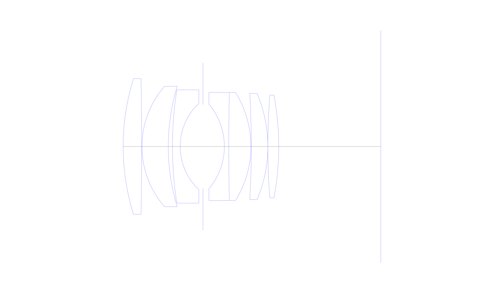
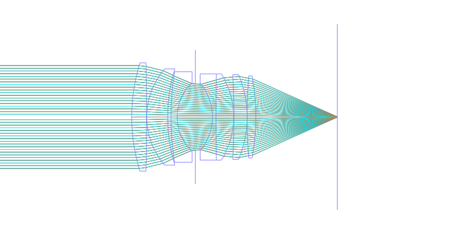
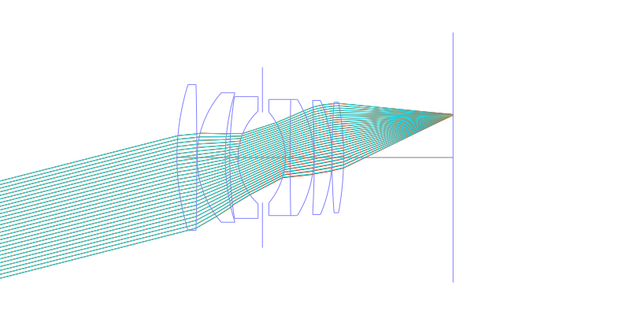
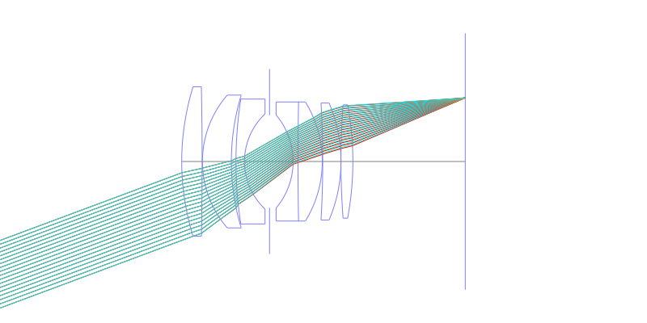
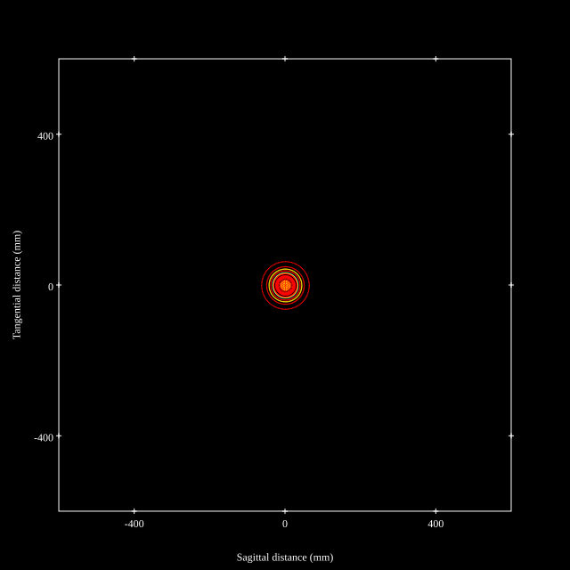
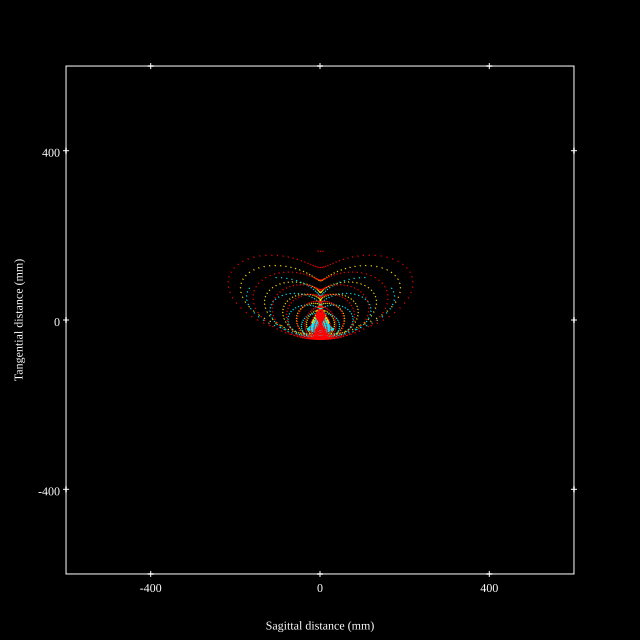
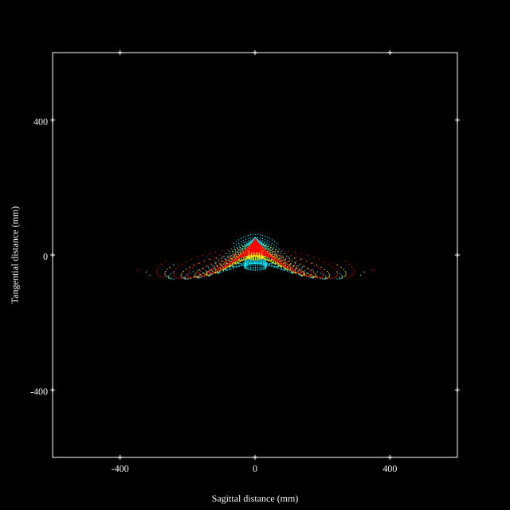
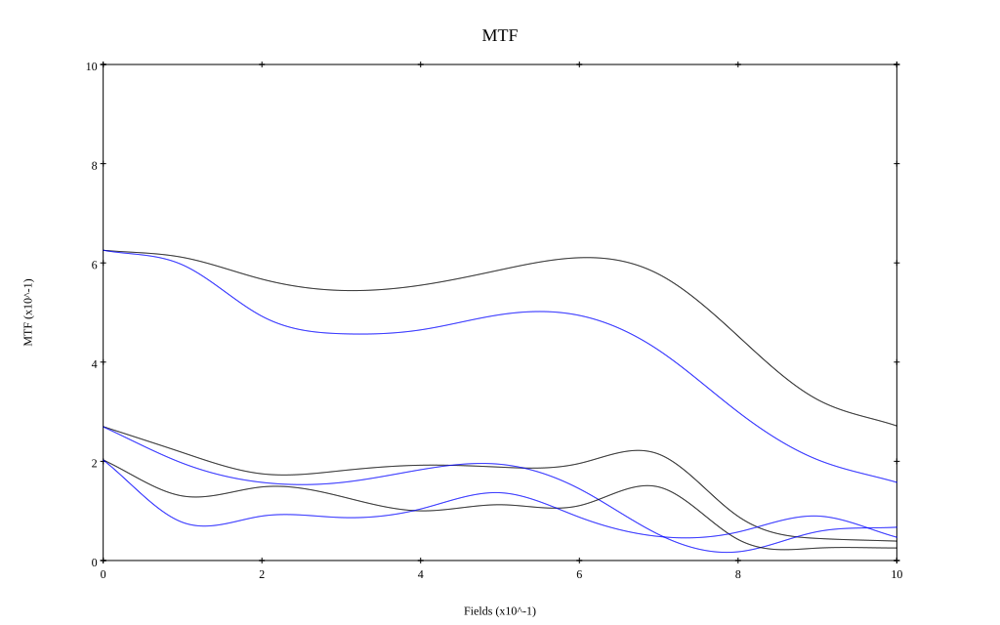

# AI Noct Nikkor 58mm f1.2 Reverse Engineered by Zhongfu
## Surface Data
Note that where glass types are shown the refractive index and abbe number is as per assigned glass type

| ID  | Radius | Thickness | Diameter | nd  | vd  | Glass Make | Glass |
| --- | ---    | ---       | ---      | --- | --- | ---        | ---   |
| 1 | 84.0 | 6.885 | 50.4875 | 1.795 | 45.31 | Hikari | J-LASF017 |
| 2 | -1214.212 | 0.1 | 50.4875 |  |  |  |
| 3 | 34.212 | 9.75 | 44.832 | 1.788 | 47.35 | Hikari | J-LASF014 |
| 4 | 77.273 | 1.56 | 44.832 |  |  |  |
| 5 | 138.0 | 2.87 | 42.169 | 1.68893 | 31.08 | Ohara | S-TIM28 |
| 6 | 22.098 | 8.44 | 32.12841 |  |  |  |
| 7 | AS | 7.95 | 31.227 |  |  |  |
| 8 | -24.412 | 1.64 | 31.445 | 1.80518 | 25.45 | Hikari | J-SF6 |
| 9 | 1052.149 | 8.196 | 40.2 | 1.788 | 47.35 | Hikari | J-LASF014 |
| 10 | -38.266 | 0.15 | 40.2 |  |  |  |
| 11 | -344.855 | 6.147 | 39.5 | 1.83481 | 42.71 | Ohara | S-LAH55 |
| 12 | -50.687 | 0.0 | 39.5 |  |  |  |
| 13 | 257.449 | 4.016 | 38.275 | 1.83481 | 42.71 | Ohara | S-LAH55 |
| 14 | -104.705 | 37.9 | 38.275 |  |  |  |
## Aspherical Data
| ID  | k   | P1  | P2  | P3  | P3 | P5 | P6 | P7 | P8 | P9 | P10 |
| --- | --- | --- | --- | --- | --- | --- | --- | --- | --- | --- | --- |
| 1 | -0.4241063580815909 | 0.0 | -8.835648761185352E-8 | 9.364876873749082E-11 | -2.190511263942341E-13 | 2.042319176402258E-16 | 0.0 | 0.0 | 0.0 | 0.0 | 0.0 |
## Layouts

## Spot Diagrams

## Paraxial Parameters
| parameter | value |
| ---       | ---   |
| effective_focal_length |58.061
| back_focal_length | 38.02
| optical_invariant | 9.021
| object_distance | 1.0E10
| image_distance | 38.02
| power | 0.017
| pp1_H | 51.467
| ppk_H' | -20.04
| ffl_F | -6.594
| fno | 1.2
| enp_dist_P | 35.693
| enp_radius | 24.192
| exp_dist_P' | -41.577
| exp_radius | 33.216
| m | -0
| red | -1.722337500403782E8
| n_obj | 1
| n_img | 1
| img_ht | 21.65
| obj_ang | 20.45
| obj_na | 0
| img_na | -0.385|
## Spot Analysis
| Field | Spot Mean Radius | Spot Max Radius |
| ---   | ---              | ---             |
 | Field(x=0.0, y=0.0) | 23.052 | 63.06|
 | Field(x=0.0, y=0.1) | 39.756 | 187.607|
 | Field(x=0.0, y=0.2) | 54.015 | 262.997|
 | Field(x=0.0, y=0.3) | 58.804 | 296.271|
 | Field(x=0.0, y=0.4) | 56.782 | 226.21|
 | Field(x=0.0, y=0.5) | 59.57 | 269.855|
 | Field(x=0.0, y=0.6) | 58.468 | 242.545|
 | Field(x=0.0, y=0.7) | 55.094 | 240.178|
 | Field(x=0.0, y=0.8) | 54.069 | 270.183|
 | Field(x=0.0, y=0.9) | 62.041 | 308.376|
 | Field(x=0.0, y=1.0) | 79.326 | 351.611|
## Geometric MTF

* 10,30,50 cycles/mm
* Black lines represent sagittal, blue tangential
## Resources
* [OpticalBench Compatible Data File, tab delimited](./specs.txt)
* [Zemax file](./specs.zmx)
