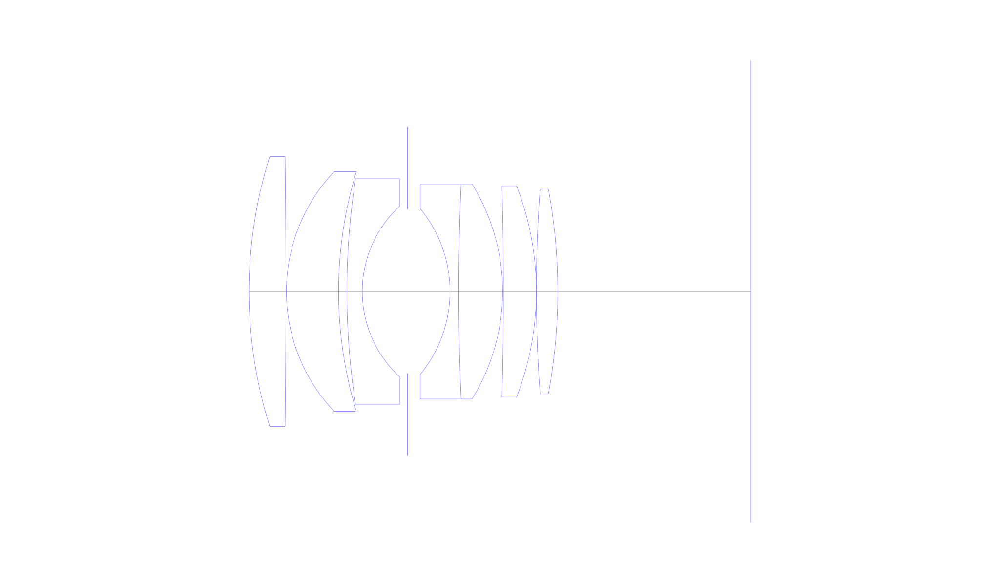
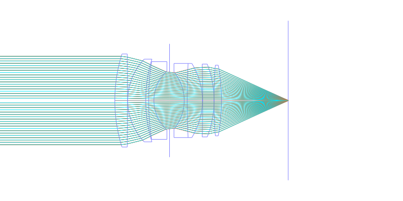
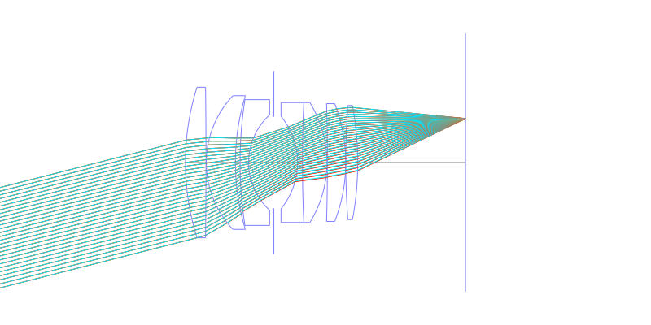
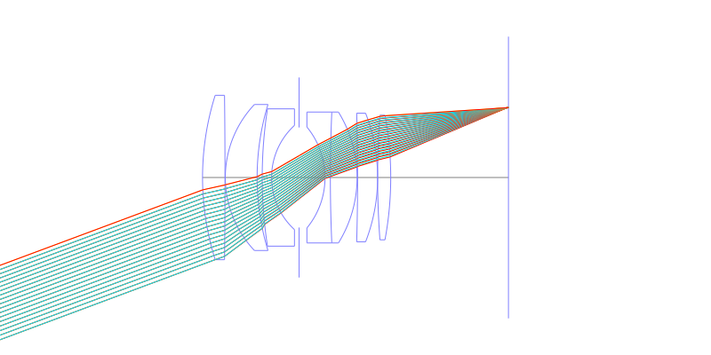
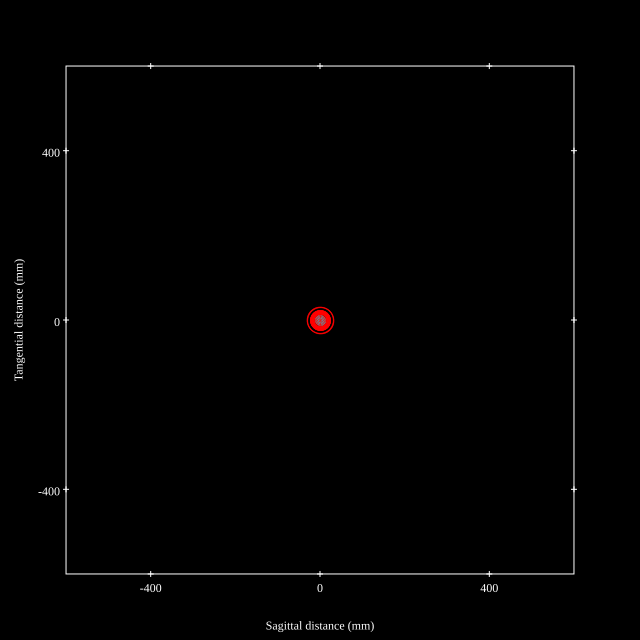
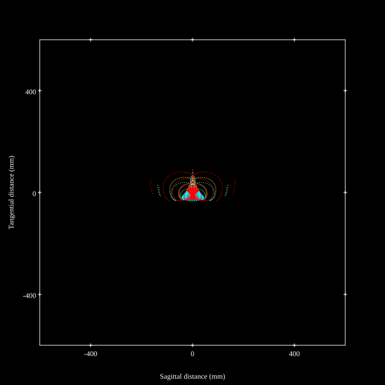
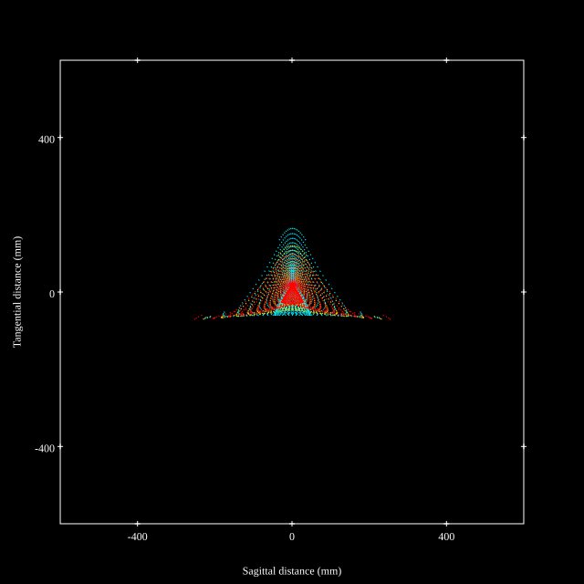
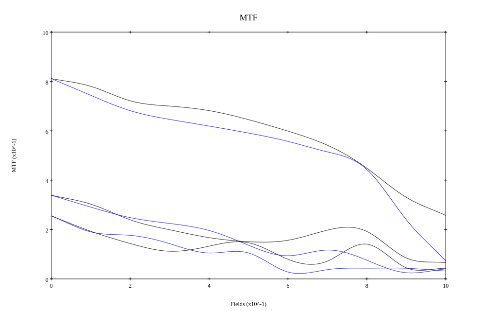
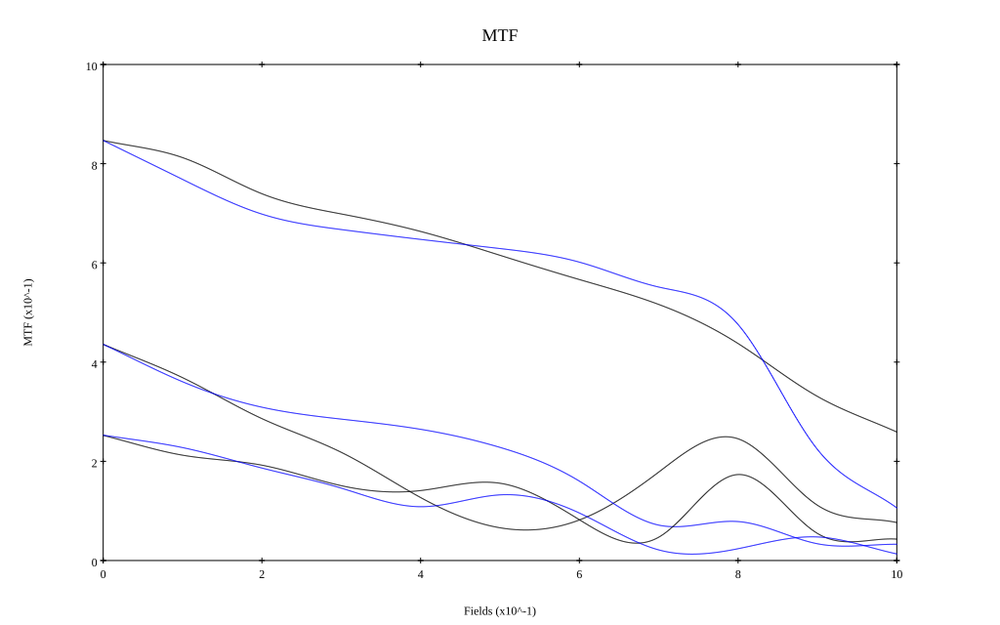

# AI Noct Nikkor 58mm f1.2 Reverse Engineered by Zhongfu
## Surface Data
Note that where glass types are shown the refractive index and abbe number is as per assigned glass type

| ID  | Radius | Thickness | Diameter | nd  | vd  | Glass Make | Glass |
| --- | ---    | ---       | ---      | --- | --- | ---        | ---   |
| 1 | 84.0 | 6.885 | 50.4875 | 1.795 | 45.31 | Hikari | J-LASF017 |
| 2 | -2214.794 | 0.1 | 50.4875 |  |  |  |
| 3 | 32.62 | 9.75 | 44.832 | 1.788 | 47.35 | Hikari | J-LASF014 |
| 4 | 77.273 | 1.56 | 44.832 |  |  |  |
| 5 | 138.0 | 2.87 | 42.169 | 1.68893 | 31.08 | Ohara | S-TIM28 |
| 6 | 21.736 | 8.44 | 32.0 |  |  |  |
| 7 | AS | 7.95 | 30.715 |  |  |  |
| 8 | -24.411 | 1.64 | 31.0 | 1.80518 | 25.45 | Hikari | J-SF6 |
| 9 | 457.567 | 8.196 | 40.2 | 1.788 | 47.35 | Hikari | J-LASF014 |
| 10 | -38.158 | 0.15 | 40.2 |  |  |  |
| 11 | -709.609 | 6.147 | 39.5 | 1.83481 | 42.71 | Ohara | S-LAH55 |
| 12 | -54.72 | 0.0 | 39.5 |  |  |  |
| 13 | 257.449 | 4.016 | 38.275 | 1.83481 | 42.71 | Ohara | S-LAH55 |
| 14 | -104.705 | 36.104 | 38.2 |  |  |  |
## Aspherical Data
| ID  | k   | P1  | P2  | P3  | P3 | P5 | P6 | P7 | P8 | P9 | P10 |
| --- | --- | --- | --- | --- | --- | --- | --- | --- | --- | --- | --- |
| 1 | -0.4241063580815909 | 0.0 | -1.303433731005394E-8 | 1.391429101773478E-10 | 1.372026597024273E-14 | -1.383111356225818E-17 | 0.0 | 0.0 | 0.0 | 0.0 | 0.0 |
## Layouts

## Spot Diagrams

## Paraxial Parameters
| parameter | value |
| ---       | ---   |
| effective_focal_length |58.031
| back_focal_length | 36.194
| optical_invariant | 9.016
| object_distance | 1.0E10
| image_distance | 36.194
| power | 0.017
| pp1_H | 50.896
| ppk_H' | -21.837
| ffl_F | -7.135
| fno | 1.2
| enp_dist_P | 36.385
| enp_radius | 24.18
| exp_dist_P' | -41.097
| exp_radius | 32.242
| m | -0
| red | -1.7232174184674188E8
| n_obj | 1
| n_img | 1
| img_ht | 21.639
| obj_ang | 20.45
| obj_na | 0
| img_na | -0.385|
## Spot Analysis
| Field | Spot Mean Radius | Spot Max Radius |
| ---   | ---              | ---             |
 | Field(x=0.0, y=0.0) | 13.444 | 30.959|
 | Field(x=0.0, y=0.1) | 17.237 | 66.371|
 | Field(x=0.0, y=0.2) | 31.501 | 170.671|
 | Field(x=0.0, y=0.3) | 38.441 | 198.524|
 | Field(x=0.0, y=0.4) | 38.327 | 198.955|
 | Field(x=0.0, y=0.5) | 35.712 | 181.28|
 | Field(x=0.0, y=0.6) | 33.401 | 163.803|
 | Field(x=0.0, y=0.7) | 33.65 | 172.741|
 | Field(x=0.0, y=0.8) | 38.061 | 191.087|
 | Field(x=0.0, y=0.9) | 49.13 | 224.382|
 | Field(x=0.0, y=1.0) | 68.073 | 262.162|
## Polychromatic Geometric MTF

* 10,30,50 cycles/mm
* Black lines represent sagittal, blue tangential
* To generate above, MTFs for wavelengths 587.5618(d), 486.1327(F), 656.2725(C) were calculated across 10 fields, and then averaged
## Polychromatic Geometric MTF (Weighted)

* 10,30,50 cycles/mm
* Black lines represent sagittal, blue tangential
* To generate above, MTFs for wavelengths 587.5618(d) wt(1.0), 656.2725(C) wt(0.475), 546.074(e) wt(0.98), 486.1327(F) wt(0.49), 435.8343(g) wt(0.15) were calculated across 10 fields, and then combined using weighted average
## Resources
* [OpticalBench Compatible Data File, tab delimited](./specs.txt)
* [Zemax file](./specs.zmx)
