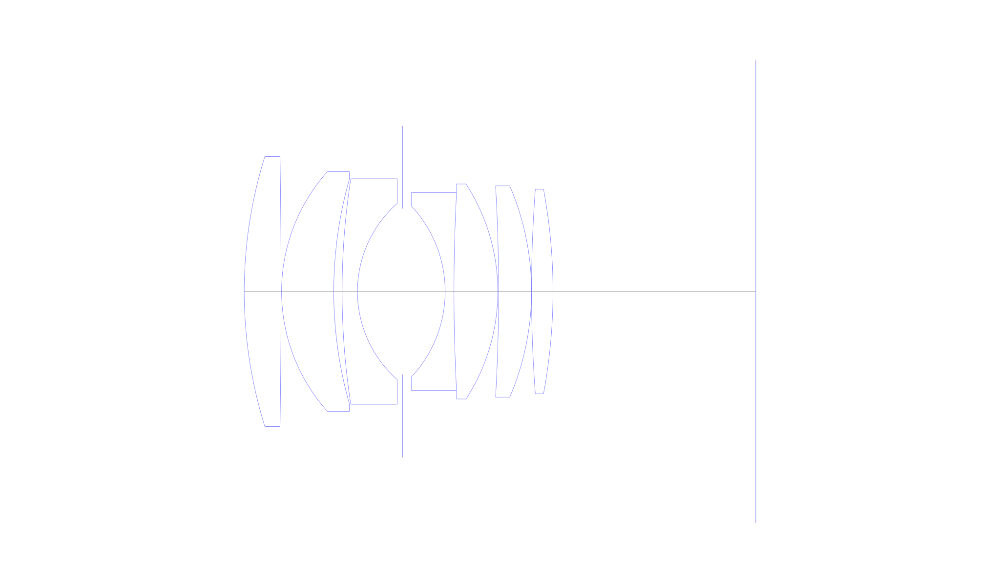
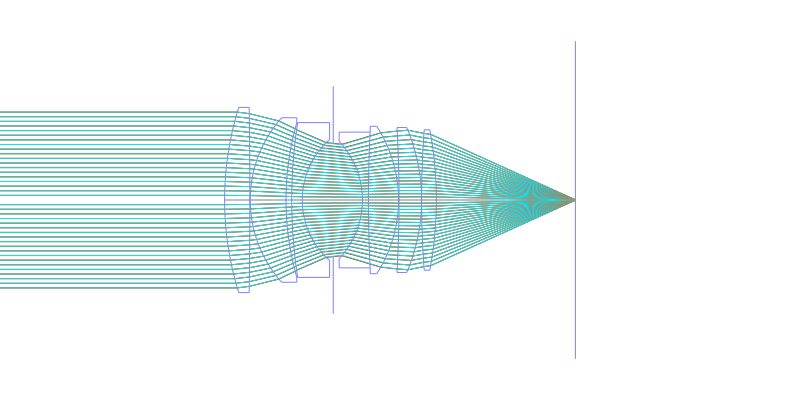
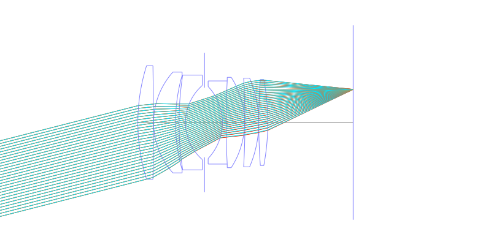
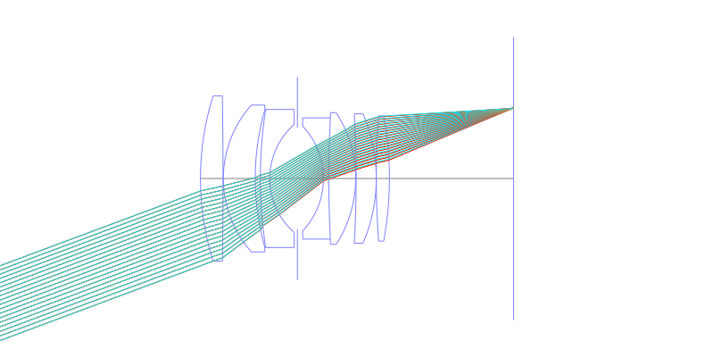
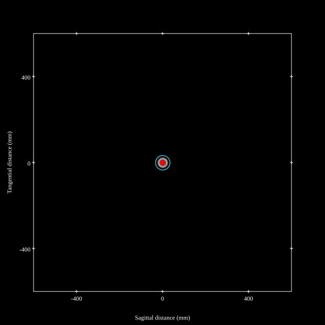
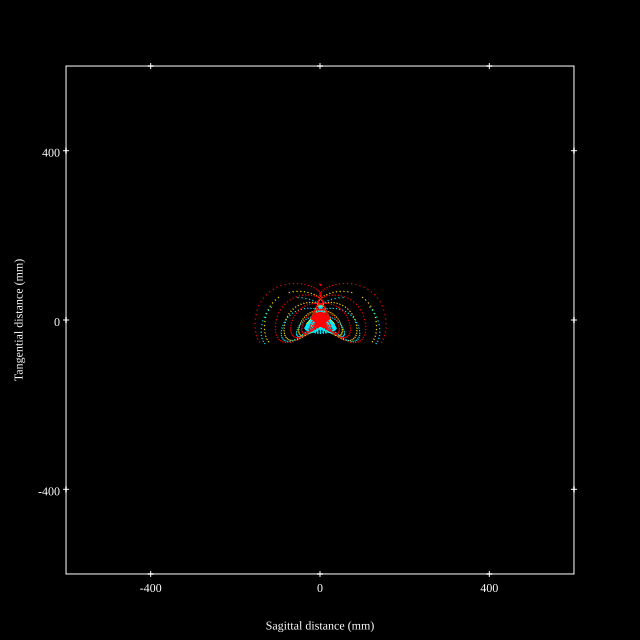
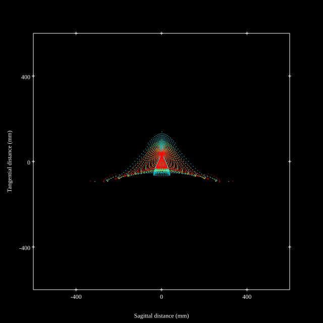
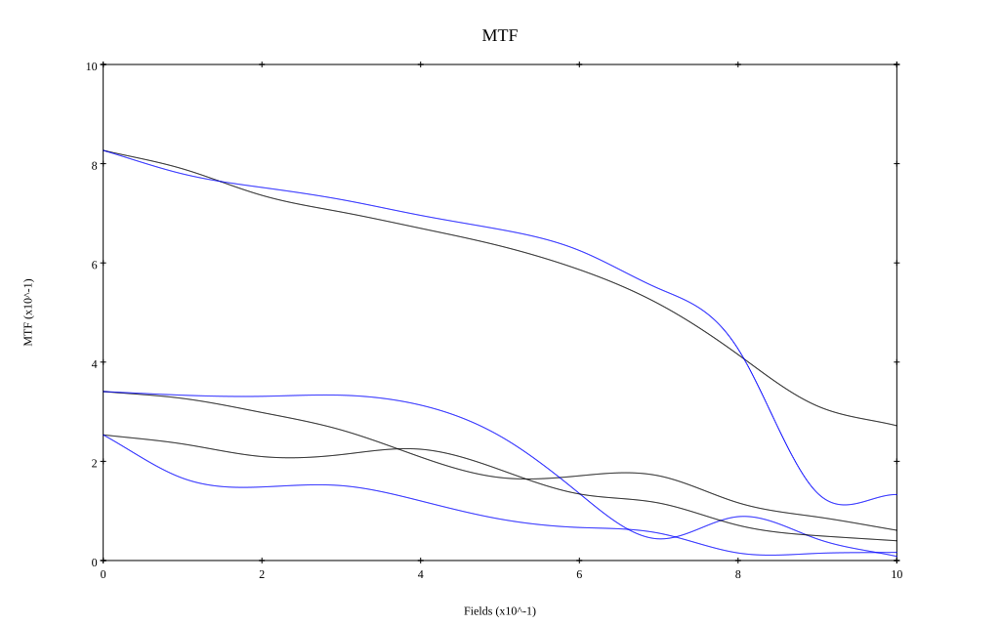
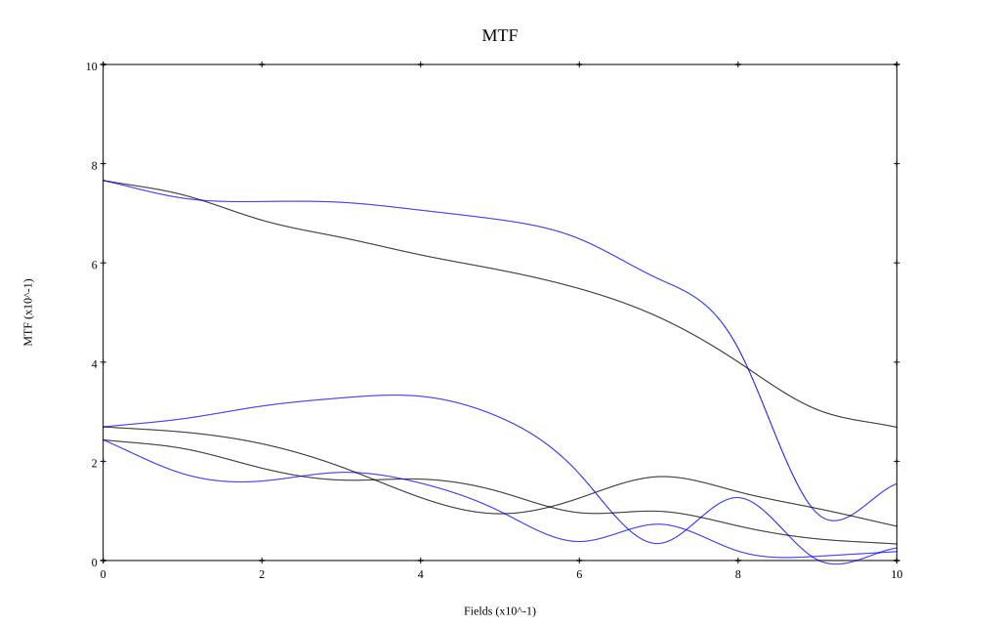

# AI Noct Nikkor 58mm f1.2 Reverse Engineered by Zhongfu
## Surface Data
Note that where glass types are shown the refractive index and abbe number is as per assigned glass type

| ID  | Radius | Thickness | Diameter | nd  | vd  | Glass Make | Glass |
| --- | ---    | ---       | ---      | --- | --- | ---        | ---   |
| 1 | 84.0 | 6.885 | 50.4875 | 1.795 | 45.31 | Hikari | J-LASF017 |
| 2 | -1668.168 | 0.1 | 50.4875 |  |  |  |
| 3 | 33.615 | 9.75 | 44.832 | 1.788 | 47.35 | Hikari | J-LASF014 |
| 4 | 77.0 | 1.56 | 42.0 |  |  |  |
| 5 | 138.0 | 2.87 | 42.169 | 1.68894 | 31.31 | Schott | N-SF8 |
| 6 | 22.0 | 8.44 | 33.0 |  |  |  |
| 7 | AS | 7.95 | 31.003 |  |  |  |
| 8 | -23.359 | 1.64 | 32.0 | 1.80518 | 25.45 | Hikari | J-SF6 |
| 9 | 352.531 | 8.196 | 37.0 | 1.788 | 47.35 | Hikari | J-LASF014 |
| 10 | -37.003 | 0.15 | 40.2 |  |  |  |
| 11 | -344.0 | 6.147 | 39.5 | 1.83481 | 42.73 | Hikari | J-LASF05 |
| 12 | -50.026 | 0.0 | 39.5 |  |  |  |
| 13 | 257.049 | 4.016 | 38.275 | 1.83481 | 42.73 | Hikari | J-LASF05 |
| 14 | -104.0 | 37.9 | 38.275 |  |  |  |
## Aspherical Data
| ID  | k   | P1  | P2  | P3  | P3 | P5 | P6 | P7 | P8 | P9 | P10 |
| --- | --- | --- | --- | --- | --- | --- | --- | --- | --- | --- | --- |
| 1 | -0.4241 | 0.0 | -6.5013E-8 | 2.54383E-10 | -2.498595E-13 | 1.303678E-16 | 0.0 | 0.0 | 0.0 | 0.0 | 0.0 |
## Layouts

## Spot Diagrams

## Paraxial Parameters
| parameter | value |
| ---       | ---   |
| effective_focal_length |58.001
| back_focal_length | 37.945
| optical_invariant | 8.993
| object_distance | 1.0E10
| image_distance | 37.945
| power | 0.017
| pp1_H | 51.999
| ppk_H' | -20.056
| ffl_F | -6.003
| fno | 1.202
| enp_dist_P | 35.87
| enp_radius | 24.118
| exp_dist_P' | -42.352
| exp_radius | 33.408
| m | -0
| red | -1.7240940690128213E8
| n_obj | 1
| n_img | 1
| img_ht | 21.628
| obj_ang | 20.45
| obj_na | 0
| img_na | -0.384|
## Spot Analysis
| Field | Spot Mean Radius | Spot Max Radius |
| ---   | ---              | ---             |
 | Field(x=0.0, y=0.0) | 13.347 | 33.491|
 | Field(x=0.0, y=0.1) | 18.375 | 87.992|
 | Field(x=0.0, y=0.2) | 26.234 | 134.559|
 | Field(x=0.0, y=0.3) | 26.325 | 166.309|
 | Field(x=0.0, y=0.4) | 29.812 | 175.93|
 | Field(x=0.0, y=0.5) | 33.088 | 163.45|
 | Field(x=0.0, y=0.6) | 34.803 | 134.445|
 | Field(x=0.0, y=0.7) | 36.874 | 155.806|
 | Field(x=0.0, y=0.8) | 43.554 | 196.835|
 | Field(x=0.0, y=0.9) | 57.601 | 303.395|
 | Field(x=0.0, y=1.0) | 77.921 | 345.274|
## Polychromatic Geometric MTF

* 10,30,50 cycles/mm
* Black lines represent sagittal, blue tangential
* To generate above, MTFs for wavelengths 587.5618(d), 486.1327(F), 656.2725(C) were calculated across 10 fields, and then averaged
## Polychromatic Geometric MTF (Weighted)

* 10,30,50 cycles/mm
* Black lines represent sagittal, blue tangential
* To generate above, MTFs for wavelengths 587.5618(d) wt(1.0), 656.2725(C) wt(0.475), 546.074(e) wt(0.98), 486.1327(F) wt(0.49), 435.8343(g) wt(0.15) were calculated across 10 fields, and then combined using weighted average
## Resources
* [OpticalBench Compatible Data File, tab delimited](./specs.txt)
* [Zemax file](./specs.zmx)
