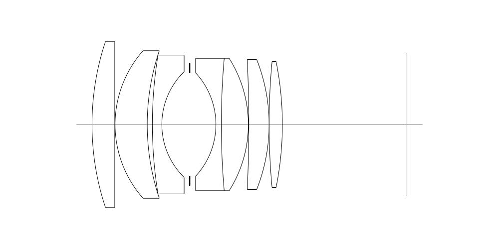
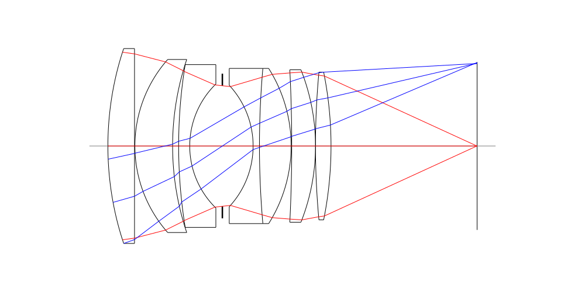
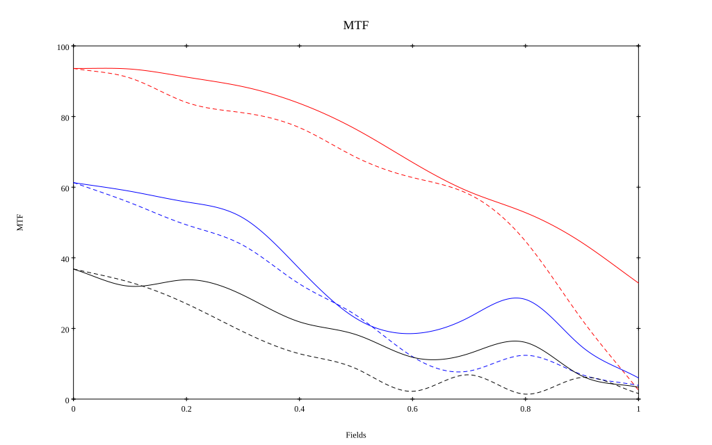
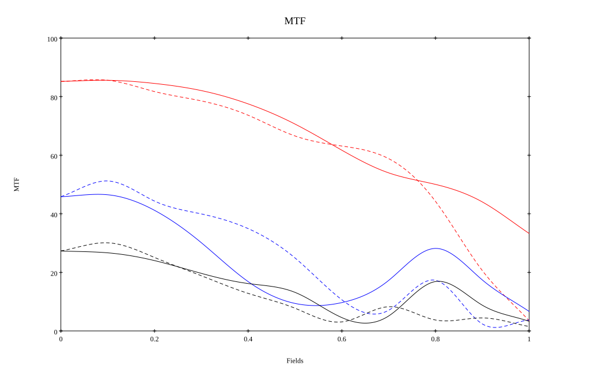

## Surface Data
Note that where glass types are shown the refractive index and abbe number is as per assigned glass type

| ID  | Radius | Thickness | Diameter | nd  | vd  | Glass Make | Glass |
| --- | ---    | ---       | ---      | --- | --- | ---        | ---   |
| 1 | 80.46779092934966 | 6.885 | 50.4875 | 1.795 | 45.31 | Hikari | J-LASF017 |
| 2 | 0.0 | 0.1 | 50.4875 |  |  |  |
| 3 | 33.85844844249596 | 9.75 | 44.832 | 1.8485 | 43.79 | Hikari | J-LASFH22 |
| 4 | 70.63846582765068 | 1.56 | 44.832 |  |  |  |
| 5 | 131.60865999685078 | 2.87 | 42.169 | 1.74 | 28.3 | Ohara | S-TIH3 |
| 6 | 22.477684030899837 | 8.44 | 32.12841 |  |  |  |
| 7 | AS | 7.95 | 31.227 |  |  |  |
| 8 | -23.114367842408804 | 1.64 | 31.445 | 1.74077 | 27.79 | Ohara | S-TIH13 |
| 9 | 230.5471933546528 | 8.196 | 40.2 | 1.788 | 47.49 | Hoya | TAF4 |
| 10 | -37.66326796414516 | 0.15 | 40.2 |  |  |  |
| 11 | -394.8726916143058 | 6.147 | 39.5 | 1.7725 | 49.62 | Hikari | J-LASF016 |
| 12 | -53.66533655480783 | 0.0 | 39.5 |  |  |  |
| 13 | 205.7229672601085 | 4.016 | 38.275 | 1.795 | 45.31 | Hikari | J-LASF017 |
| 14 | -97.08855828601907 | 37.78 | 38.275 |  |  |  |
## Aspherical Data
| ID  | Type | k   | P1 | P2 | P3 | P4 | P5 |
| --- | --- | --- | --- | --- | --- | --- | --- |
| 1| EVEN | -0.03970960713563907 | 0.0 | -1.3286718136582757E-8 | 1.0222642416001347E-10 | 2.388667328109854E-14 | 4.593260454450952E-17 |
## Layouts

## Spot Diagrams

## Paraxial Parameters
| parameter | value |
| ---       | ---   |
| effective_focal_length |58.299
| back_focal_length | 37.852
| optical_invariant | 9.062
| object_distance | 1.0E10
| image_distance | 37.852
| power | 0.017
| pp1_H | 51.378
| ppk_H' | -20.447
| ffl_F | -6.921
| fno | 1.2
| enp_dist_P | 35.72
| enp_radius | 24.301
| exp_dist_P' | -41.783
| exp_radius | 33.225
| m | -0
| red | -1.7152919279992032E8
| n_obj | 1
| n_img | 1
| img_ht | 21.739
| obj_ang | 20.45
| obj_na | 0
| img_na | -0.417|
## Spot Analysis
| Field | Spot Mean Radius | Spot Max Radius |
| ---   | ---              | ---             |
 | Field(x=0.0, y=0.0) | 8.241 | 26.332|
 | Field(x=0.0, y=0.1) | 9.211 | 32.932|
 | Field(x=0.0, y=0.2) | 13.462 | 78.613|
 | Field(x=0.0, y=0.3) | 16.633 | 106.159|
 | Field(x=0.0, y=0.4) | 19.053 | 110.751|
 | Field(x=0.0, y=0.5) | 21.019 | 95.591|
 | Field(x=0.0, y=0.6) | 24.982 | 96.919|
 | Field(x=0.0, y=0.7) | 31.851 | 133.783|
 | Field(x=0.0, y=0.8) | 40.991 | 165.826|
 | Field(x=0.0, y=0.9) | 53 | 193.508|
 | Field(x=0.0, y=1.0) | 69.984 | 231.782|
## Polychromatic Geometric MTF

* 10=red,30=blue,50=black cycles/mm
* Solid lines represent sagittal, dashed lines tangential
* To generate above, MTFs for wavelengths 587.5618(d), 486.1327(F), 656.2725(C) were calculated across 10 fields, and then averaged
## Polychromatic Geometric MTF (Weighted)

* 10=red,30=blue,50=black cycles/mm
* Solid lines represent sagittal, dashed lines tangential
* To generate above, MTFs for wavelengths 587.5618(d) wt(1.0), 656.2725(C) wt(0.475), 546.074(e) wt(0.98), 486.1327(F) wt(0.49), 435.8343(g) wt(0.15) were calculated across 10 fields, and then combined using weighted average
## Resources
* [OpticalBench Compatible Data File, tab delimited](./prescription.txt)
* [Zemax file](./specs1.zmx)

Report / Zemax file generated using [Beam42](https://github.com/BeamFour/Beam42) on 2026-08-20
