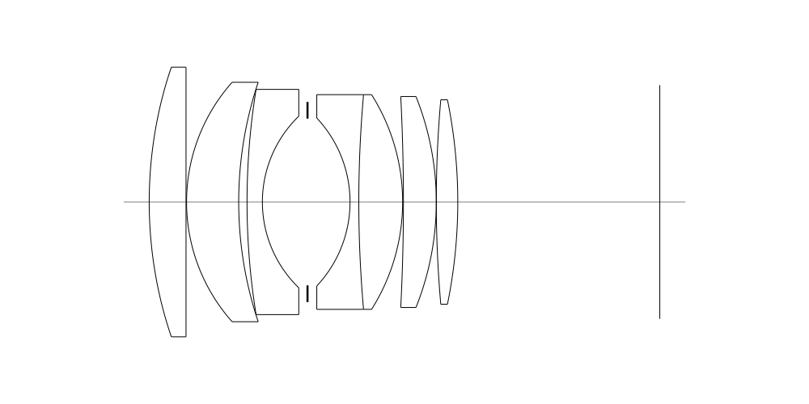
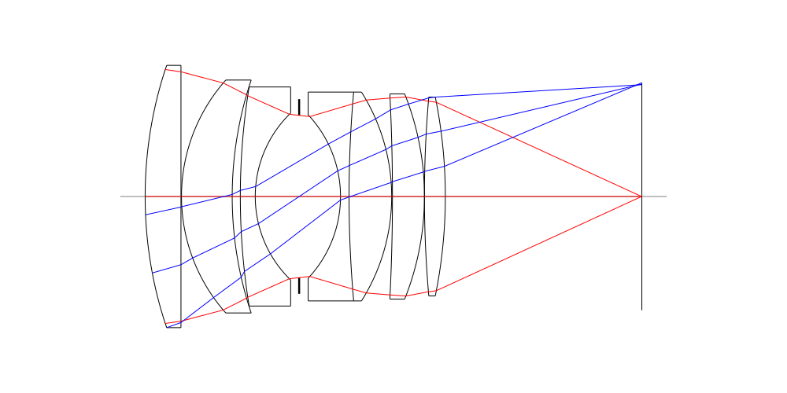
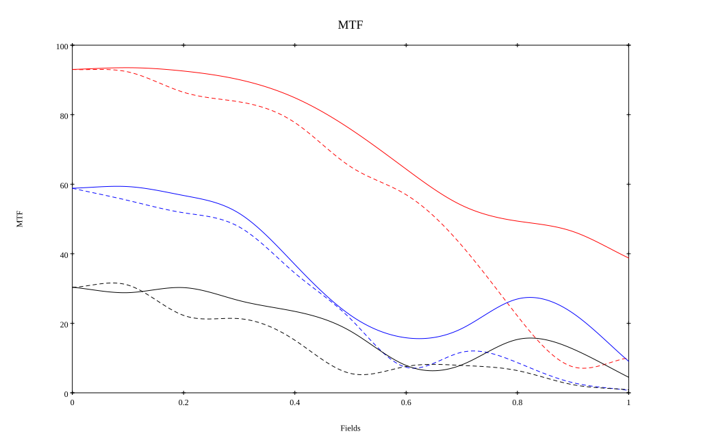
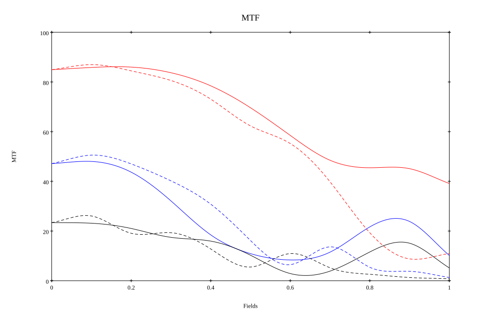

## Surface Data
Note that where glass types are shown the refractive index and abbe number is as per assigned glass type

| ID  | Radius | Thickness | Diameter | nd  | vd  | Glass Make | Glass |
| --- | ---    | ---       | ---      | --- | --- | ---        | ---   |
| 1 | 79.71604071667944 | 6.885 | 50.4875 | 1.795 | 45.31 | Hikari | J-LASF017 |
| 2 | 0.0 | 0.1 | 50.4875 |  |  |  |
| 3 | 33.75397288655532 | 9.75 | 44.832 | 1.8485 | 43.79 | Hikari | J-LASFH22 |
| 4 | 70.75150434810872 | 1.56 | 44.832 |  |  |  |
| 5 | 132.19570203642743 | 2.87 | 42.169 | 1.74 | 28.3 | Ohara | S-TIH3 |
| 6 | 22.36913830469971 | 8.44 | 32.12841 |  |  |  |
| 7 | AS | 7.95 | 31.227 |  |  |  |
| 8 | -22.987234149628286 | 1.64 | 31.445 | 1.74077 | 27.79 | Ohara | S-TIH13 |
| 9 | 227.7368757567956 | 8.196 | 40.2 | 1.788 | 47.49 | Hoya | TAF4 |
| 10 | -37.70544043413285 | 0.15 | 40.2 |  |  |  |
| 11 | -389.0808567338073 | 6.147 | 39.5 | 1.7725 | 49.62 | Hikari | J-LASF016 |
| 12 | -53.190904971642425 | 0.0 | 39.5 |  |  |  |
| 13 | 219.03397935589663 | 4.016 | 38.275 | 1.795 | 45.31 | Hikari | J-LASF017 |
| 14 | -95.83484203427513 | 37.78 | 38.275 |  |  |  |
## Aspherical Data
| ID  | Type | k   | P1 | P2 | P3 | P4 | P5 |
| --- | --- | --- | --- | --- | --- | --- | --- |
| 1| EVEN | 0.0365308208040021 | 0.0 | 7.267754440547391E-9 | 6.16087537618317E-11 | 7.288871494795696E-14 | 3.406469291605716E-17 |
## Layouts

## Spot Diagrams

## Paraxial Parameters
| parameter | value |
| ---       | ---   |
| effective_focal_length |58.67
| back_focal_length | 37.867
| optical_invariant | 9.112
| object_distance | 1.0E10
| image_distance | 37.867
| power | 0.017
| pp1_H | 51.337
| ppk_H' | -20.803
| ffl_F | -7.333
| fno | 1.201
| enp_dist_P | 35.884
| enp_radius | 24.435
| exp_dist_P' | -41.694
| exp_radius | 33.172
| m | -0
| red | -1.7044506857567242E8
| n_obj | 1
| n_img | 1
| img_ht | 21.877
| obj_ang | 20.45
| obj_na | 0
| img_na | -0.416|
## Spot Analysis
| Field | Spot Mean Radius | Spot Max Radius |
| ---   | ---              | ---             |
 | Field(x=0.0, y=0.0) | 8.675 | 29.925|
 | Field(x=0.0, y=0.1) | 8.689 | 32.015|
 | Field(x=0.0, y=0.2) | 11.767 | 68.321|
 | Field(x=0.0, y=0.3) | 14.411 | 94.126|
 | Field(x=0.0, y=0.4) | 16.903 | 96.365|
 | Field(x=0.0, y=0.5) | 21.059 | 79.249|
 | Field(x=0.0, y=0.6) | 28.738 | 121.21|
 | Field(x=0.0, y=0.7) | 39.575 | 170.853|
 | Field(x=0.0, y=0.8) | 52.154 | 216.211|
 | Field(x=0.0, y=0.9) | 66.771 | 255.513|
 | Field(x=0.0, y=1.0) | 85.29 | 296.011|
## Polychromatic Geometric MTF

* 10=red,30=blue,50=black cycles/mm
* Solid lines represent sagittal, dashed lines tangential
* To generate above, MTFs for wavelengths 587.5618(d), 486.1327(F), 656.2725(C) were calculated across 10 fields, and then averaged
## Polychromatic Geometric MTF (Weighted)

* 10=red,30=blue,50=black cycles/mm
* Solid lines represent sagittal, dashed lines tangential
* To generate above, MTFs for wavelengths 587.5618(d) wt(1.0), 656.2725(C) wt(0.475), 546.074(e) wt(0.98), 486.1327(F) wt(0.49), 435.8343(g) wt(0.15) were calculated across 10 fields, and then combined using weighted average
## Resources
* [OpticalBench Compatible Data File, tab delimited](./prescription.txt)
* [Zemax file](./specs.zmx)

Report / Zemax file generated using [Beam42](https://github.com/BeamFour/Beam42) on 2026-08-20
