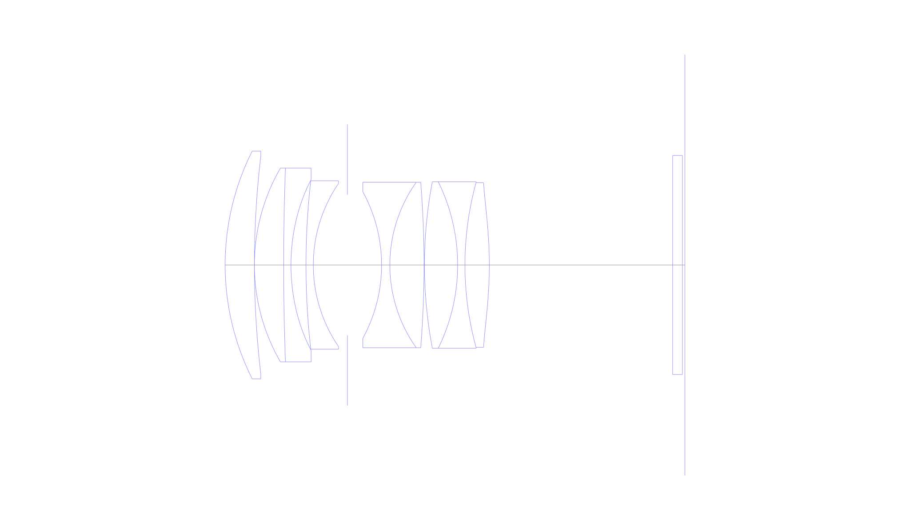
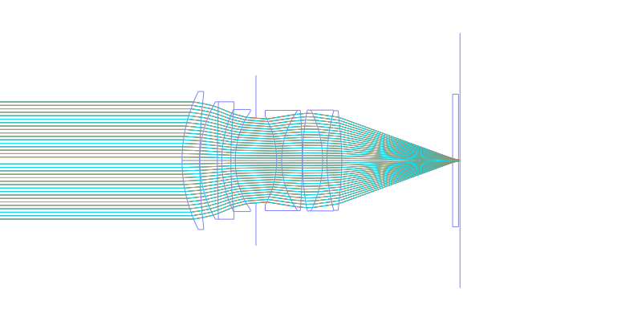
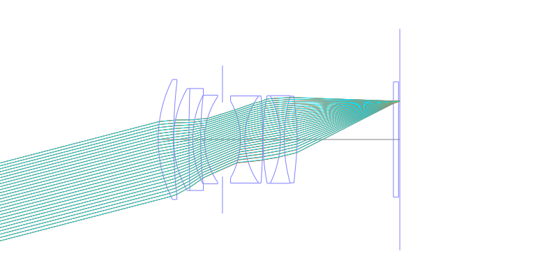
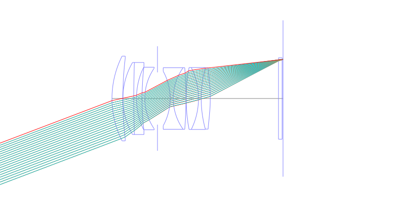
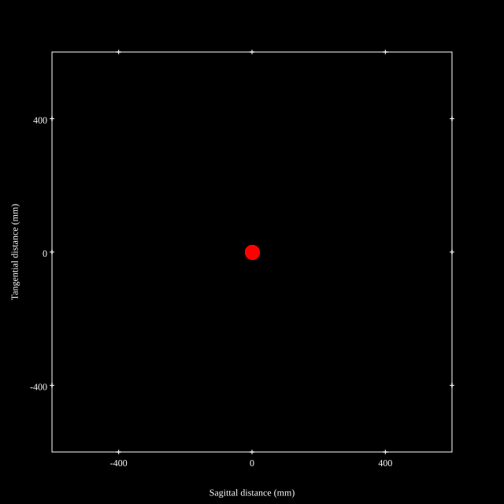
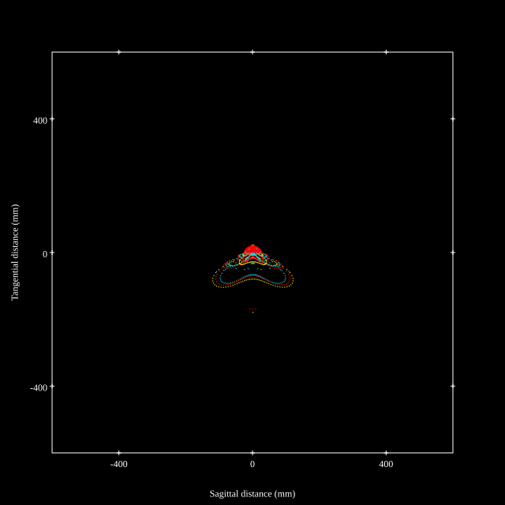
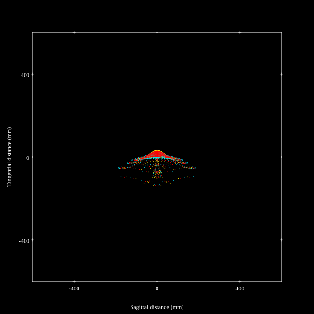
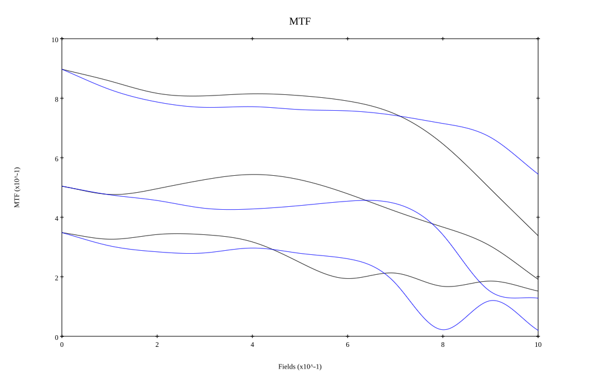
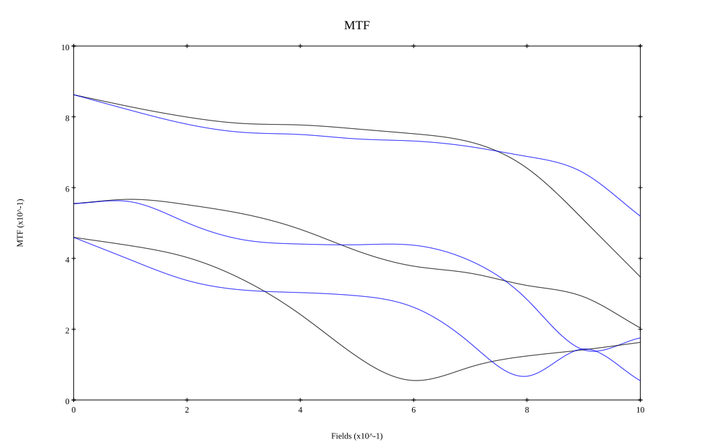

# AF-S NIKKOR 58mm f/1.4G ED (EX 1 Reoptimized in Beam42)
## Patent Information
| Country | Patent Number | Example | Year of Application | Inventors | Organisation | Link |
| ---     | ---           | ---     | ---                 | ---       | ---          | ---  |
|JP | JP2013-019993A | EX 1 | 2011 | Haruo Sato | Nikon Corp | [link](https://patents.google.com/patent/JP2013019993A) |
## Surface Data
Note that where glass types are shown the refractive index and abbe number is as per assigned glass type

| ID  | Radius | Thickness | Diameter | nd  | vd  | Glass Make | Glass |
| --- | ---    | ---       | ---      | --- | --- | ---        | ---   |
| 1 | 52.09647375361937 | 6.0 | 46.8 | 1.74429 | 50.77 | Schott | N-LAK28 |
| 2 | 191.6045786345182 | 0.0 | 44.7 |  |  |  |
| 3 | 39.79242722907513 | 6.0 | 39.8 | 1.755 | 52.34 | Hikari | J-LASKH2 |
| 4 | 546.950664181174 | 1.5 | 39.8 | 1.48749 | 70.32 | Hikari | J-FK5 |
| 5 | 41.09601397332901 | 3.0776 | 35.0 |  |  |  |
| 6 | 153.0985213209506 | 1.5 | 34.6 | 1.68893 | 31.16 | Hikari | J-SF8 |
| 7 | 29.70579915574022 | 7.0 | 33.5 |  |  |  |
| 8 | AS | 7.0 | 28.883 |  |  |  |
| 9 | -31.369849776154776 | 1.7 | 30.1 | 1.72825 | 28.41 | Schott | SF10 |
| 10 | 29.416043348023383 | 7.0 | 34.0 | 1.883 | 40.69 | Hikari | J-LASF08A |
| 11 | -215.61925738743741 | 0.1 | 34.0 |  |  |  |
| 12 | 91.20150592229409 | 6.8 | 34.0 | 1.883 | 40.69 | Hikari | J-LASF08A |
| 13 | -38.741752551838694 | 1.5 | 34.2 | 1.53172 | 48.78 | Hikari | J-LLF6 |
| 14 | 63.93409679891184 | 5.0 | 33.8 | 1.74429 | 50.77 | Schott | N-LAK28 |
| 15 | -83.64730634322443 | 37.6 | 33.8 |  |  |  |
| 16 | 0.0 | 2.0 | 45.0 | 1.5168 | 64.13 | Hikari | J-BK7A |
| 17 | 0.0 | 0.496 | 45.0 |  |  |  |
## Aspherical Data
| ID  | Type | k   | P1 | P2 | P3 | P4 | P5 | P6 | P7 |
| --- | --- | --- | --- | --- | --- | --- | --- | --- | --- |
| 5| EVEN | 0.20442695317246995 | 0.0 | 1.4071557982130364E-6 | -3.991069378846381E-9 | 3.2865377407921236E-11 | -3.910661708839268E-14 | -3.3074005306060934E-16 | 9.5281E-19 |
| 15| EVEN | 16.104813328668346 | 0.0 | 9.2224002378996E-6 | 5.476509864245342E-9 | 1.4212668394859673E-11 | 1.9995334129212448E-14 | -5.385605504993855E-17 | 2.0086E-19 |
## Layouts

## Spot Diagrams

## Paraxial Parameters
| parameter | value |
| ---       | ---   |
| effective_focal_length |58.277
| back_focal_length | 0.493
| optical_invariant | 7.6
| object_distance | 1.0E10
| image_distance | 0.493
| power | 0.017
| pp1_H | 39.585
| ppk_H' | -57.784
| ffl_F | -18.692
| fno | 1.458
| enp_dist_P | 28.728
| enp_radius | 19.985
| exp_dist_P' | -71.129
| exp_radius | 24.56
| m | -0
| red | -1.7159442386580184E8
| n_obj | 1
| n_img | 1
| img_ht | 22.161
| obj_ang | 20.82
| obj_na | 0
| img_na | -0.324|
## Spot Analysis
| Field | Spot Mean Radius | Spot Max Radius |
| ---   | ---              | ---             |
 | Field(x=0.0, y=0.0) | 10.001 | 20.979|
 | Field(x=0.0, y=0.1) | 16.567 | 99.512|
 | Field(x=0.0, y=0.2) | 27.353 | 155.237|
 | Field(x=0.0, y=0.3) | 35.09 | 164.445|
 | Field(x=0.0, y=0.4) | 27.958 | 182.723|
 | Field(x=0.0, y=0.5) | 24.667 | 215.707|
 | Field(x=0.0, y=0.6) | 25.674 | 198.107|
 | Field(x=0.0, y=0.7) | 29.566 | 178.211|
 | Field(x=0.0, y=0.8) | 34.583 | 166.661|
 | Field(x=0.0, y=0.9) | 40.447 | 184.128|
 | Field(x=0.0, y=1.0) | 55.717 | 197.376|
## Polychromatic Geometric MTF

* 10,30,50 cycles/mm
* Black lines represent sagittal, blue tangential
* To generate above, MTFs for wavelengths 587.5618(d), 486.1327(F), 656.2725(C) were calculated across 10 fields, and then averaged
## Polychromatic Geometric MTF (Weighted)

* 10,30,50 cycles/mm
* Black lines represent sagittal, blue tangential
* To generate above, MTFs for wavelengths 587.5618(d) wt(1.0), 656.2725(C) wt(0.475), 546.074(e) wt(0.98), 486.1327(F) wt(0.49), 435.8343(g) wt(0.15) were calculated across 10 fields, and then combined using weighted average
## Resources
* [OpticalBench Compatible Data File, tab delimited](./prescription.txt)
* [Zemax file](./JP2013-019993_Example01a.zmx)

Report / Zemax file generated using [Beam42](https://github.com/BeamFour/Beam42) on 2026-07-03
