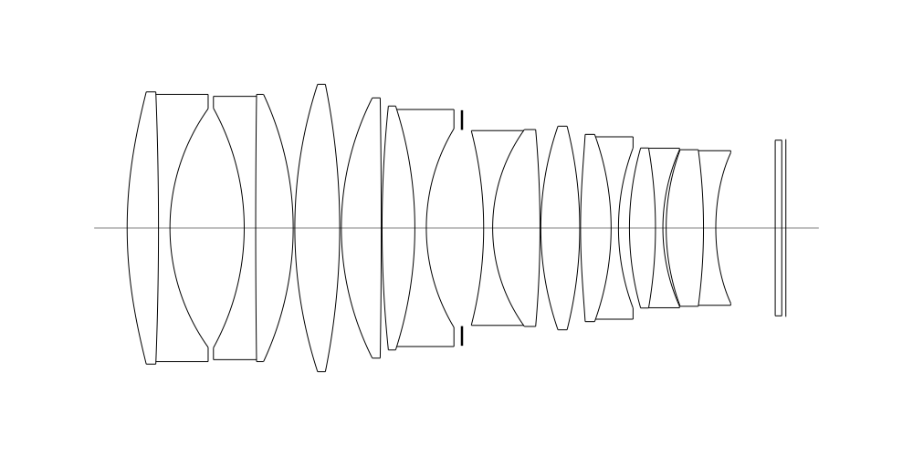
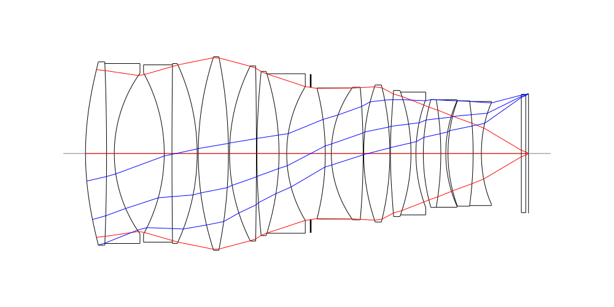
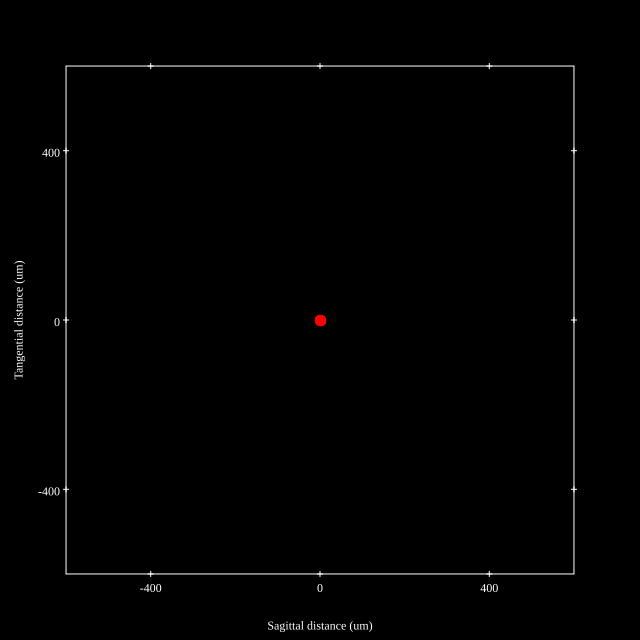
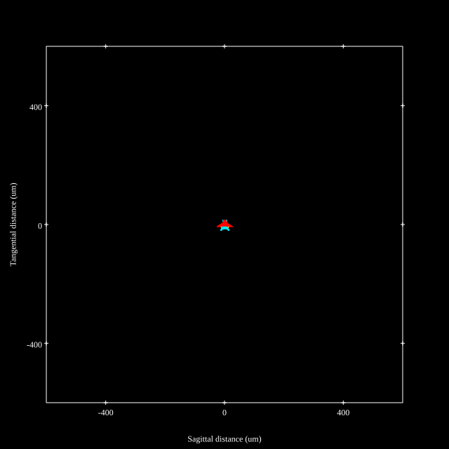
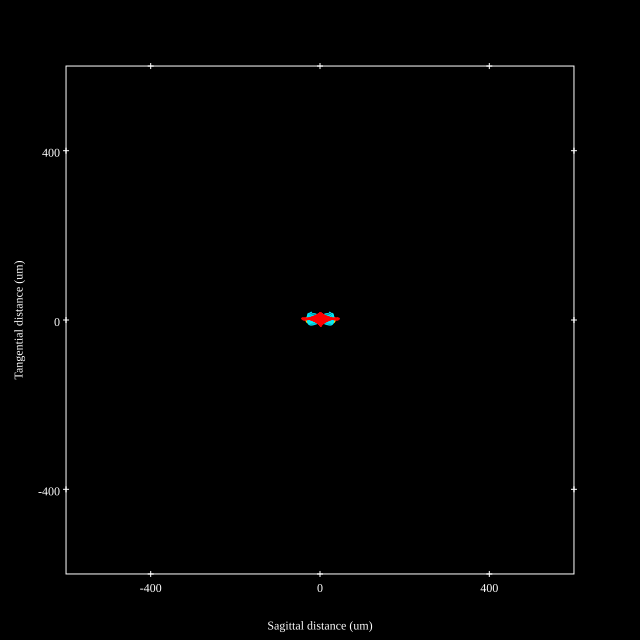
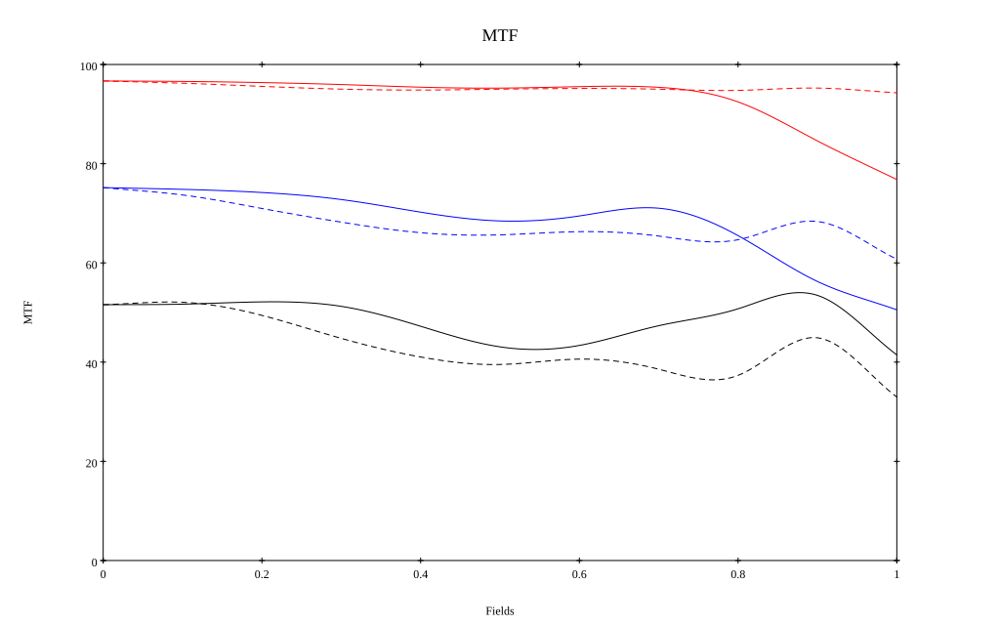
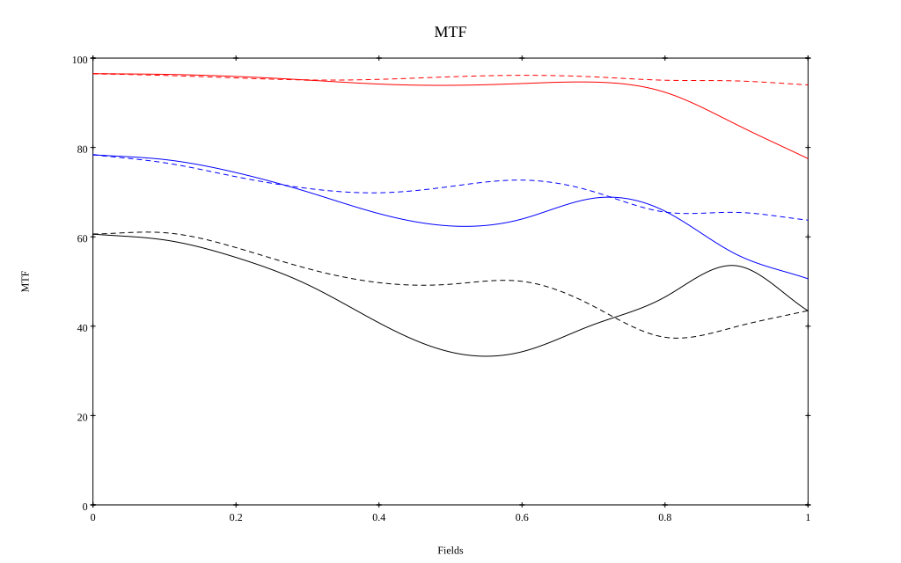

# Nikkor Z 58mm f/0.95 Noct
## Patent Information
| Country | Patent Number | Example | Year of Application | Inventors | Organisation | Link |
| ---     | ---           | ---     | ---                 | ---       | ---          | ---  |
|US | US12025779B2 | EX 1 | 2018 | Keisuke TSUBONOYA, Hiroki Harada, Toshinori Take | Nikon Corp | [link](https://patents.google.com/patent/US12025779B2/en) |
## Surface Data
Note that where glass types are shown the refractive index and abbe number is as per assigned glass type

| ID  | Radius | Thickness | Diameter | nd  | vd  | Glass Make | Glass |
| --- | ---    | ---       | ---      | --- | --- | ---        | ---   |
| 1 | 108.488 | 7.65 | 66.5 | 1.90265 | 35.77 | Hikari | J-LASFH9A |
| 2 | -848.55 | 2.8 | 65.3 | 1.55298 | 55.07 | Hikari | J-KZFH4 |
| 3 | 50.252 | 18.12 | 58.3 |  |  |  |
| 4 | -60.72 | 2.8 | 58.5 | 1.61266 | 44.46 | Hikari | J-KZFH1 |
| 5 | 2497.5 | 9.15 | 64.3279 | 1.59319 | 67.9 | Hikari | J-PSKH1 |
| 6 | -77.239 | 0.4 | 65.3 |  |  |  |
| 7 | 113.763 | 10.95 | 70.227 | 1.8485 | 43.79 | Hikari | J-LASFH22 |
| 8 | -178.06 | 0.4 | 70.0271 |  |  |  |
| 9 | 70.659 | 9.74 | 63.5684 | 1.59319 | 67.9 | Hikari | J-PSKH1 |
| 10 | -1968.5 | 0.2 | 62.1848 |  |  |  |
| 11 | 289.687 | 8.0 | 59.5985 | 1.59319 | 67.9 | Hikari | J-PSKH1 |
| 12 | -97.087 | 2.8 | 57.9031 | 1.738 | 32.26 | Hikari | J-KZFH9 |
| 13 | 47.074 | 8.7 | 48.5437 |  |  |  |
| 14 | AS | 5.29 | 47.9497 |  |  |  |
| 15 | -95.23 | 2.2 | 47.2573 | 1.61266 | 44.46 | Hikari | J-KZFH1 |
| 16 | 41.204 | 11.55 | 47.5859 | 1.49782 | 82.57 | Hikari | J-FKH1 |
| 17 | -273.092 | 0.2 | 48.1 |  |  |  |
| 18 | 76.173 | 9.5 | 49.7528 | 1.883 | 40.69 | Hikari | J-LASF08A |
| 19 | -101.575 | 0.2 | 49.4 |  |  |  |
| 20 | 176.128 | 7.45 | 45.7486 | 1.95375 | 32.33 | Hikari | J-LASFH21 |
| 21 | -67.221 | 1.8 | 44.5602 | 1.738 | 32.26 | Hikari | J-KZFH9 |
| 22 | 55.51 | 2.68 | 39.1 |  |  |  |
| 23 | 71.413 | 6.35 | 39.1 | 1.883 | 40.69 | Hikari | J-LASF08A |
| 24 | -115.025 | 1.81 | 38.9784 | 1.69895 | 30.13 | Hikari | J-SF15 |
| 25 | 46.943 | 0.8 | 38.177 |  |  |  |
| 26 | 55.281 | 9.11 | 38.2522 | 1.883 | 40.69 | Hikari | J-LASF08A |
| 27 | -144.041 | 3.0 | 37.7655 | 1.76684 | 46.78 | Hikari | J-LASFH2 |
| 28 | 52.858 | 14.5 | 36.7074 |  |  |  |
| 29 | CG | 1.6 | 42.3774 | 1.5168 | 64.13 | Hikari | J-BK7A |
| 30 | CG | 1.0 | 42.918 |  |  |  |
## Aspherical Data
| ID  | Type | k   | P1 | P2 | P3 | P4 | P5 | P6 | P7 |
| --- | --- | --- | --- | --- | --- | --- | --- | --- | --- |
| 1| EVEN | 0.0 | 0.0 | -3.82177E-7 | -6.06486E-11 | -3.80172E-15 | -1.32266E-18 | 0.0 | 0  |
| 20| EVEN | 0.0 | 0.0 | -1.15028E-6 | -4.51771E-10 | 2.7267E-13 | -7.66812E-17 | 0.0 | 0  |
| 28| EVEN | 0.0 | 0.0 | 3.18645E-6 | -1.14718E-8 | 7.74567E-11 | -2.24225E-13 | 3.3479E-16 | -1.7047E-19 |
## Layouts

## Spot Diagrams

## Paraxial Parameters
| parameter | value |
| ---       | ---   |
| effective_focal_length |59.656
| back_focal_length | 1.004
| optical_invariant | 11.066
| object_distance | 1.0E10
| image_distance | 1.004
| power | 0.017
| pp1_H | 61.194
| ppk_H' | -58.652
| ffl_F | 1.537
| fno | 0.98
| enp_dist_P | 69.285
| enp_radius | 30.437
| exp_dist_P' | -51.523
| exp_radius | 26.802
| m | -0
| red | -1.6762660714810935E8
| n_obj | 1
| n_img | 1
| img_ht | 21.69
| obj_ang | 19.98
| obj_na | 0
| img_na | -0.51|
## Spot Analysis
| Field | Spot Mean Radius (µm) | Spot Max Radius (µm) |
| ---   | ---              | ---             |
 | Field(x=0.0, y=0.0) | 5.801 | 11.929|
 | Field(x=0.0, y=0.1) | 6.091 | 19.523|
 | Field(x=0.0, y=0.2) | 6.48 | 22.857|
 | Field(x=0.0, y=0.3) | 6.898 | 26.293|
 | Field(x=0.0, y=0.4) | 7.159 | 28.151|
 | Field(x=0.0, y=0.5) | 7.141 | 27.7|
 | Field(x=0.0, y=0.6) | 6.977 | 25.573|
 | Field(x=0.0, y=0.7) | 7.119 | 26.784|
 | Field(x=0.0, y=0.8) | 8.395 | 32.821|
 | Field(x=0.0, y=0.9) | 10.967 | 40.277|
 | Field(x=0.0, y=1.0) | 13.531 | 44.668|
## Polychromatic Geometric MTF

* 10=red,30=blue,50=black cycles/mm
* Solid lines represent sagittal, dashed lines tangential
* To generate above, MTFs for wavelengths 587.5618(d), 486.1327(F), 656.2725(C) were calculated across 10 fields, and then averaged
## Polychromatic Geometric MTF (Weighted)

* 10=red,30=blue,50=black cycles/mm
* Solid lines represent sagittal, dashed lines tangential
* To generate above, MTFs for wavelengths 587.5618(d) wt(1.0), 656.2725(C) wt(0.475), 546.074(e) wt(0.98), 486.1327(F) wt(0.49), 435.8343(g) wt(0.15) were calculated across 10 fields, and then combined using weighted average
## Resources
* [OpticalBench Compatible Data File, tab delimited](./prescription.txt)
* [Zemax file](./nikkor-z-58mmf0.95_ex1.zmx)

Generated from `nikkor-z-58mmf0.95_ex1.txt`, status **Accepted**

Report / Zemax file generated using [Beam42](https://github.com/BeamFour/Beam42) on 2026-10-02
