# AF-S Zoom-Nikkor 70-200mm f/2.8G IF-ED VR
## Patent Information
| Country | Patent Number | Example | Year of Application | Inventors | Organisation | Link |
| ---     | ---           | ---     | ---                 | ---       | ---          | ---  |
|US | US6693750 | 1 | 2002 | Susumu Sato | Nikon Corp | [link](https://patents.google.com/patent/US6693750B2/en) |
## Surface Data
Note that where glass types are shown the refractive index and abbe number is as per assigned glass type

| ID  | Radius | Thickness | Diameter | nd  | vd  | Glass Make | Glass |
| --- | ---    | ---       | ---      | --- | --- | ---        | ---   |
| 1 | 136.2696 | 2.2 | 74.16 | 1.804 | 46.6 | Hikari | J-LASF015 |
| 2 | 65.921 | 9.0 | 71.36 | 1.49782 | 82.57 | Hikari | J-FKH1 |
| 3 | 184.6175 | 0.1 | 71.36 |  |  |  |
| 4 | 73.1041 | 8.9 | 71.2 | 1.49782 | 82.57 | Hikari | J-FKH1 |
| 5 | 435.0246 | d5 | 71.2 |  |  |  |
| 6 | 65.0851 | 1.8 | 62.84 | 1.84666 | 23.8 | Hikari | J-SF03 |
| 7 | 51.8175 | 1.92 | 59.74 |  |  |  |
| 8 | 63.216 | 8.7 | 59.74 | 1.64 | 60.19 | Hikari | J-LAK01 |
| 9 | 1772.4929 | d9 | 59.74 |  |  |  |
| 10 | -1067.204 | 1.9 | 37.62 | 1.741 | 52.77 | Hikari | J-LAK011 |
| 11 | 34.3923 | 6.835 | 33.73 |  |  |  |
| 12 | -61.8566 | 1.8 | 33.73 | 1.48749 | 70.32 | Hikari | J-FK5 |
| 13 | 39.434 | 7.0 | 37.62 | 1.80518 | 25.45 | Hikari | J-SF6 |
| 14 | -223.2401 | 1.803 | 35.32 |  |  |  |
| 15 | -64.5266 | 1.9 | 35.32 | 1.8044 | 39.61 | Hikari | J-LASF013 |
| 16 | 872.3457 | d16 | 37.62 |  |  |  |
| 17 | -599.1428 | 3.9 | 38.56 | 1.49782 | 82.57 | Hikari | J-FKH1 |
| 18 | -73.5485 | 0.2 | 38.56 |  |  |  |
| 19 | 93.8405 | 8.0 | 38.4 | 1.49782 | 82.57 | Hikari | J-FKH1 |
| 20 | -48.567 | 2.0 | 38.4 | 1.741 | 52.77 | Hikari | J-LAK011 |
| 21 | -149.5043 | d21 | 38.4 |  |  |  |
| 22 | AS | 1.0 | a22 |  |  |  |
| 23 | 117.0055 | 2.0 | 37.4 | 1.80518 | 25.45 | Hikari | J-SF6 |
| 24 | 44.695 | 7.0 | 37.4 | 1.6968 | 55.52 | Hikari | J-LAK14 |
| 25 | -325.3499 | 0.1 | 37.4 |  |  |  |
| 26 | 76.1777 | 3.5 | 37.4 | 1.603 | 65.44 | Hikari | J-PSK03 |
| 27 | 152.3247 | 19.0 | 37.4 |  |  |  |
| 28 | FS | 1.6216 | 30.4 |  |  |  |
| 29 | 376.5966 | 3.8 | 30.4 | 1.84666 | 23.8 | Hikari | J-SF03 |
| 30 | -57.886 | 1.5 | 30.4 | 1.741 | 52.77 | Hikari | J-LAK011 |
| 31 | 50.043 | 3.9 | 30.4 |  |  |  |
| 32 | -246.5579 | 1.5 | 30.4 | 1.741 | 52.77 | Hikari | J-LAK011 |
| 33 | 102.2448 | 2.6784 | 30.4 |  |  |  |
| 34 | FS | 4.0 | 30.4 |  |  |  |
| 35 | -427.7771 | 4.0 | 36.66 | 1.49782 | 82.57 | Hikari | J-FKH1 |
| 36 | -58.2736 | 0.1 | 36.66 |  |  |  |
| 37 | 68.1118 | 7.5 | 36.66 | 1.741 | 52.77 | Hikari | J-LAK011 |
| 38 | -60.14 | 2.0 | 36.66 | 1.84666 | 23.8 | Hikari | J-SF03 |
| 39 | -641.0882 | d39 | 36.66 |  |  |  |
## Variables
| Variable | 70mm f2.8 | 200mm f2.8 |
| --- | --- | --- |
| Focal length |71.4 |196.0 |
| F-Number |2.9 |2.9 |
| Angle of View |34.92 |12.2 |
| d5 | 14.1595 | 14.1595 |
| d9 | 2.52314 | 31.15139 |
| d16 | 34.06279 | 1.96176 |
| d21 | 7.92945 | 11.40223 |
| a22 | 37.158 | 36.764 |
| d39 | 66.14 | 66.21049 |
# 70mm f2.8
## Layouts
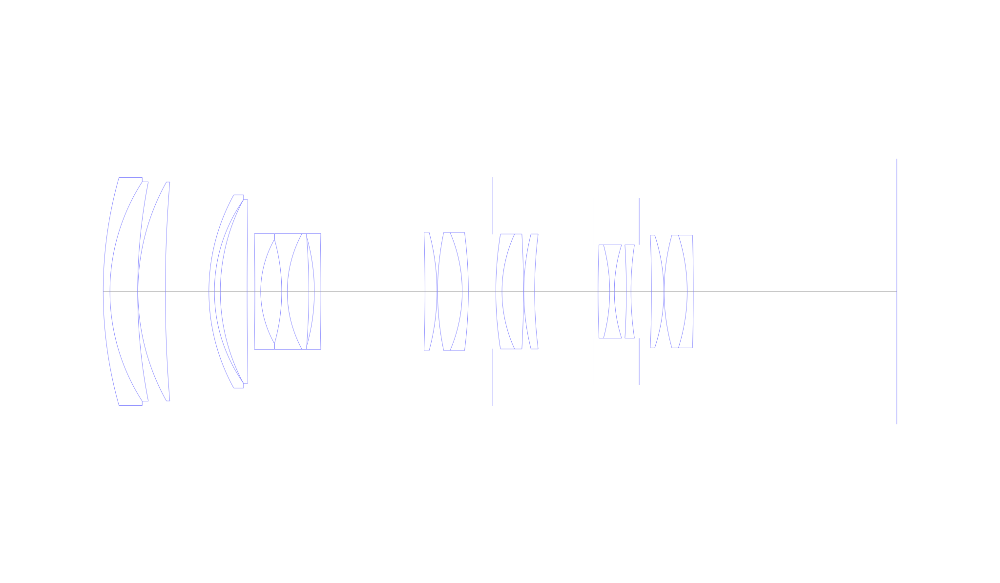
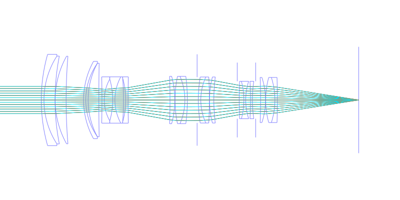
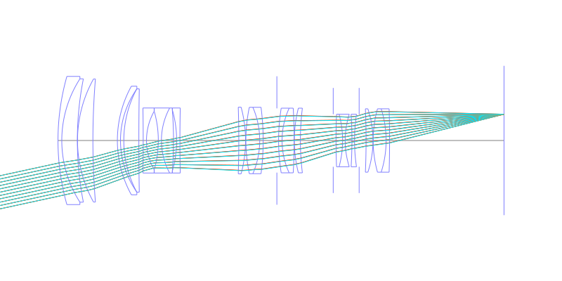
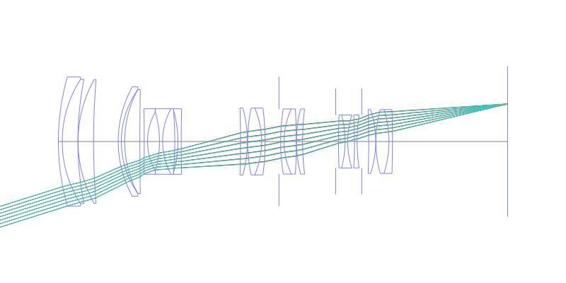
## Spot Diagrams
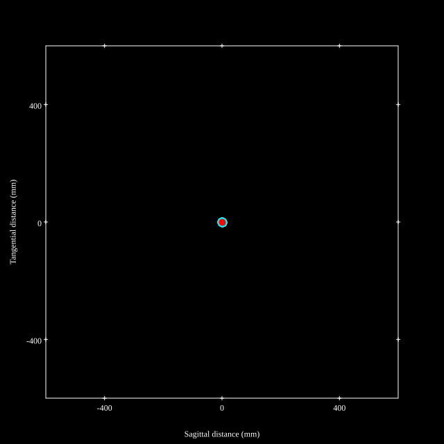
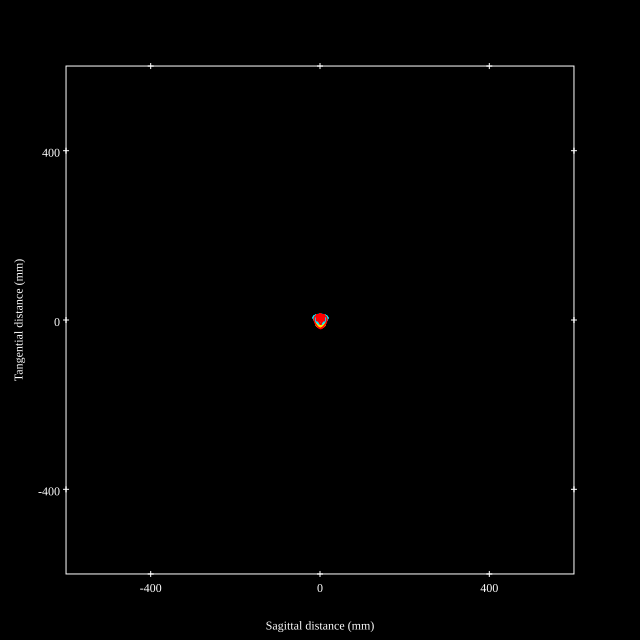
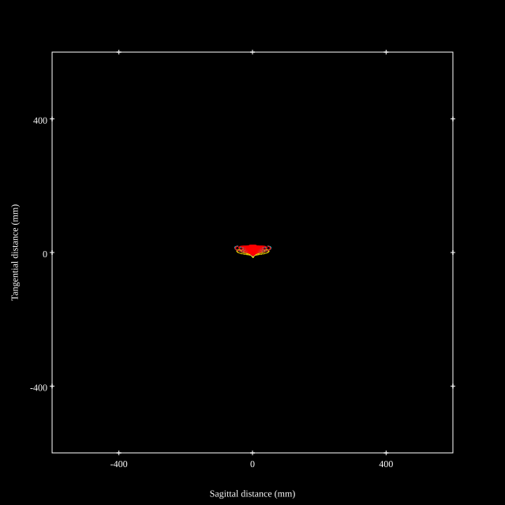
## Paraxial Parameters
| parameter | value |
| ---       | ---   |
| effective_focal_length |71.4
| back_focal_length | 66.21
| optical_invariant | 3.872
| object_distance | 1.0E10
| image_distance | 66.21
| power | 0.014
| pp1_H | 138.419
| ppk_H' | -5.189
| ffl_F | 67.019
| fno | 2.9
| enp_dist_P | 102.327
| enp_radius | 12.31
| exp_dist_P' | -78.106
| exp_radius | 24.894
| m | -0
| red | -1.4005624083645344E8
| n_obj | 1
| n_img | 1
| img_ht | 22.458
| obj_ang | 17.46
| obj_na | 0
| img_na | -0.17|
## Spot Analysis
| Field | Spot Mean Radius | Spot Max Radius |
| ---   | ---              | ---             |
 | Field(x=0.0, y=0.0) | 5.087 | 16.278|
 | Field(x=0.0, y=0.1) | 5.358 | 19.344|
 | Field(x=0.0, y=0.2) | 5.945 | 22.859|
 | Field(x=0.0, y=0.3) | 6.833 | 26.362|
 | Field(x=0.0, y=0.4) | 7.67 | 26.785|
 | Field(x=0.0, y=0.5) | 8.353 | 27.562|
 | Field(x=0.0, y=0.6) | 9.071 | 28.156|
 | Field(x=0.0, y=0.7) | 10.049 | 30.13|
 | Field(x=0.0, y=0.8) | 10.195 | 32.092|
 | Field(x=0.0, y=0.9) | 12.491 | 41.151|
 | Field(x=0.0, y=1.0) | 17.231 | 56.178|
## Polychromatic Geometric MTF
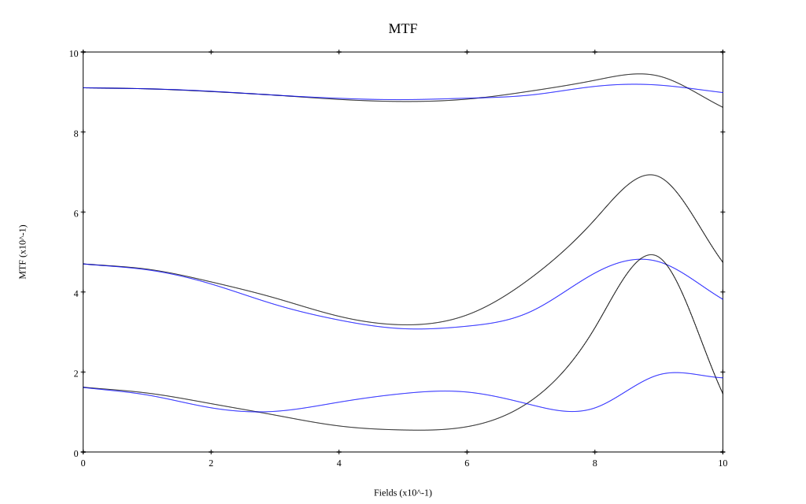
* 10=red,30=blue,50=black cycles/mm
* Solid lines represent sagittal, dashed lines tangential
* To generate above, MTFs for wavelengths 587.5618(d), 486.1327(F), 656.2725(C) were calculated across 10 fields, and then averaged
## Polychromatic Geometric MTF (Weighted)
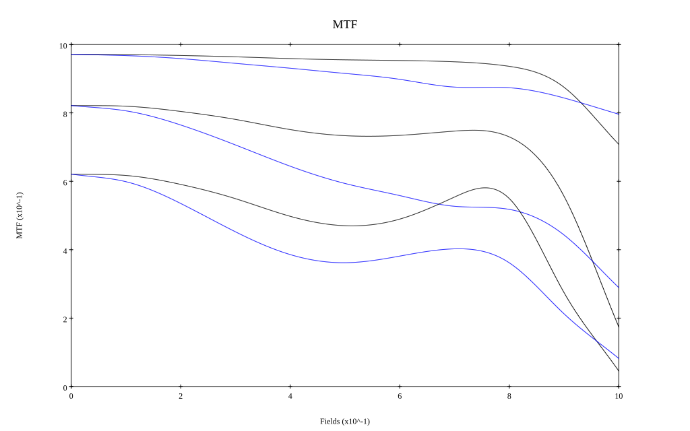
* 10=red,30=blue,50=black cycles/mm
* Solid lines represent sagittal, dashed lines tangential
* To generate above, MTFs for wavelengths 587.5618(d) wt(1.0), 656.2725(C) wt(0.475), 546.074(e) wt(0.98), 486.1327(F) wt(0.49), 435.8343(g) wt(0.15) were calculated across 10 fields, and then combined using weighted average
# 200mm f2.8
## Layouts
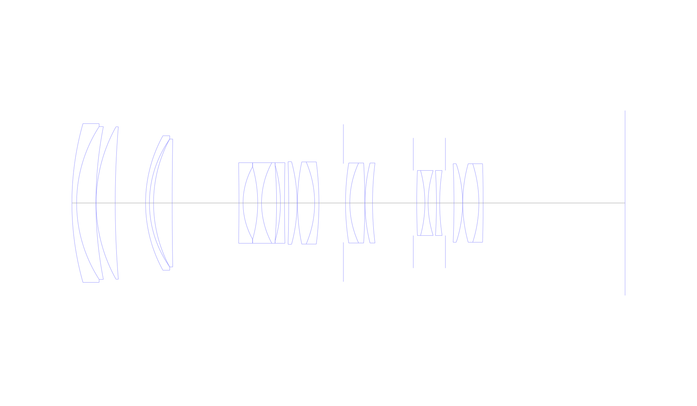
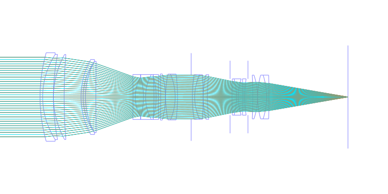
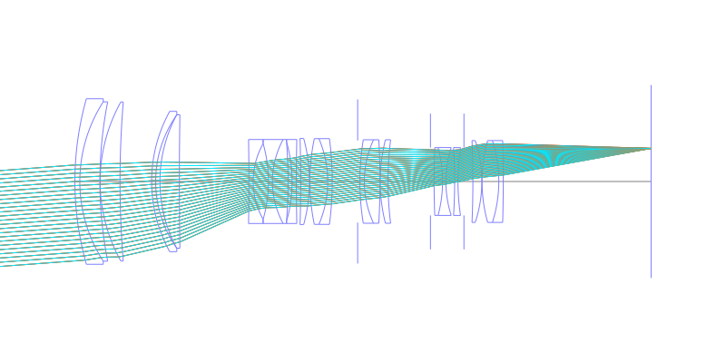
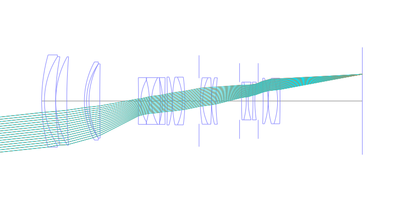
## Spot Diagrams
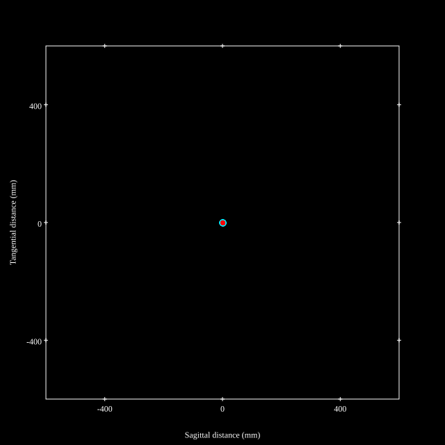
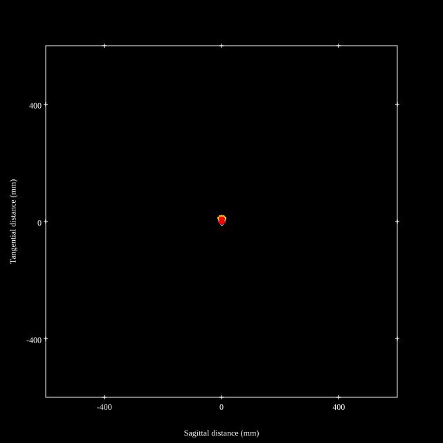
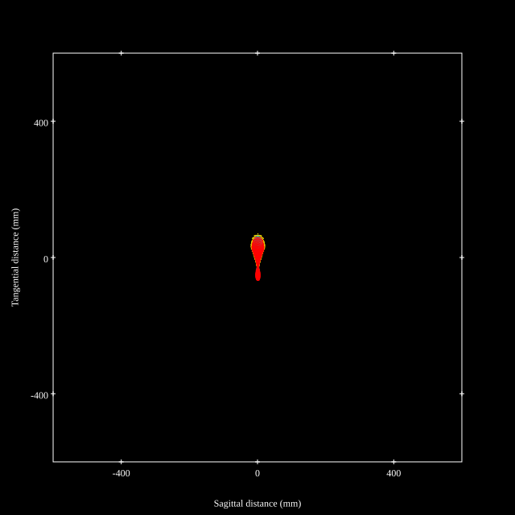
## Paraxial Parameters
| parameter | value |
| ---       | ---   |
| effective_focal_length |196
| back_focal_length | 66.211
| optical_invariant | 3.575
| object_distance | 1.0E10
| image_distance | 66.211
| power | 0.005
| pp1_H | 187.636
| ppk_H' | -129.789
| ffl_F | -8.364
| fno | 2.93
| enp_dist_P | 257.698
| enp_radius | 33.45
| exp_dist_P' | -78.177
| exp_radius | 24.642
| m | -0
| red | -5.10204127779022E7
| n_obj | 1
| n_img | 1
| img_ht | 20.946
| obj_ang | 6.1
| obj_na | 0
| img_na | -0.168|
## Spot Analysis
| Field | Spot Mean Radius | Spot Max Radius |
| ---   | ---              | ---             |
 | Field(x=0.0, y=0.0) | 4.325 | 10.406|
 | Field(x=0.0, y=0.1) | 4.356 | 12.506|
 | Field(x=0.0, y=0.2) | 4.394 | 12.806|
 | Field(x=0.0, y=0.3) | 4.733 | 13.387|
 | Field(x=0.0, y=0.4) | 5.394 | 16.703|
 | Field(x=0.0, y=0.5) | 5.247 | 15.612|
 | Field(x=0.0, y=0.6) | 5.031 | 13.899|
 | Field(x=0.0, y=0.7) | 6.947 | 22.959|
 | Field(x=0.0, y=0.8) | 12.811 | 36.825|
 | Field(x=0.0, y=0.9) | 22.249 | 53.899|
 | Field(x=0.0, y=1.0) | 34.173 | 70.406|
## Polychromatic Geometric MTF
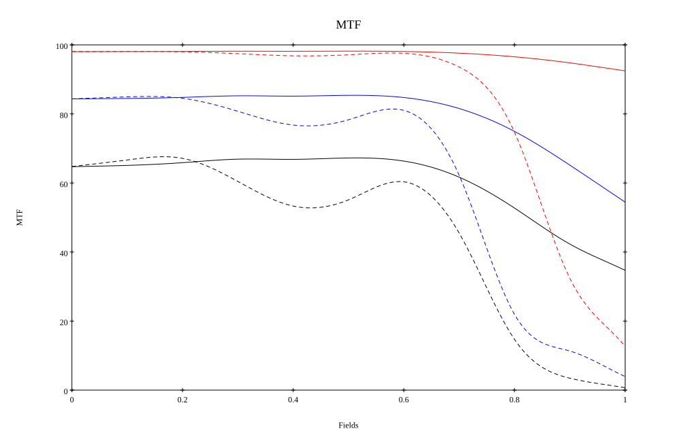
* 10=red,30=blue,50=black cycles/mm
* Solid lines represent sagittal, dashed lines tangential
* To generate above, MTFs for wavelengths 587.5618(d), 486.1327(F), 656.2725(C) were calculated across 10 fields, and then averaged
## Polychromatic Geometric MTF (Weighted)
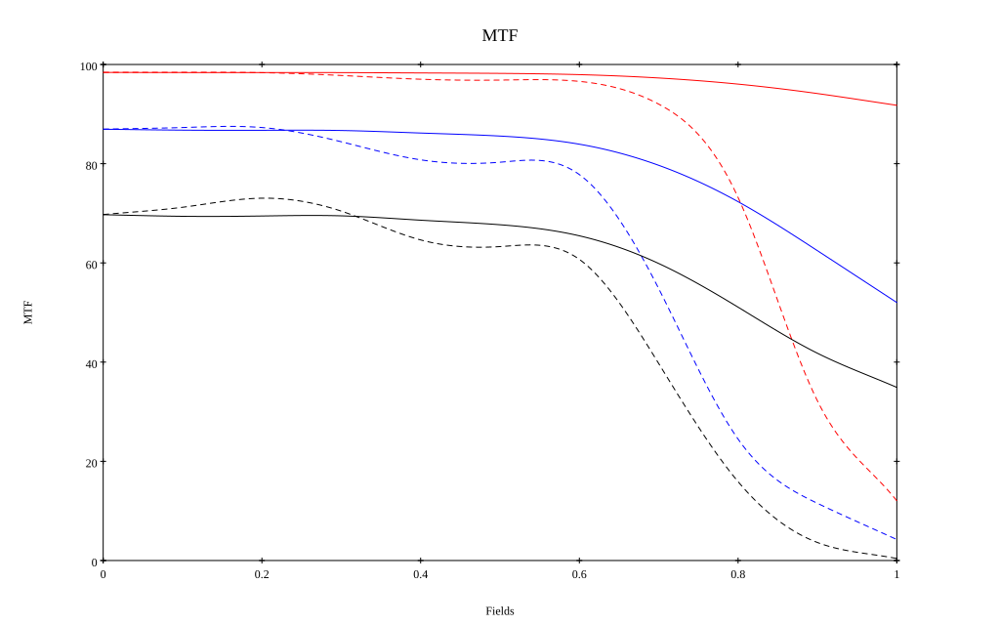
* 10=red,30=blue,50=black cycles/mm
* Solid lines represent sagittal, dashed lines tangential
* To generate above, MTFs for wavelengths 587.5618(d) wt(1.0), 656.2725(C) wt(0.475), 546.074(e) wt(0.98), 486.1327(F) wt(0.49), 435.8343(g) wt(0.15) were calculated across 10 fields, and then combined using weighted average
## Resources
* [OpticalBench Compatible Data File, tab delimited](./prescription.txt)
* [Zemax file](./US006693750_Example01P.zmx)

Report / Zemax file generated using [Beam42](https://github.com/BeamFour/Beam42) on 2026-07-07
