# AF-S Nikkor 70-200mm f/2.8G ED VR II
## Patent Information
| Country | Patent Number | Example | Year of Application | Inventors | Organisation | Link |
| ---     | ---           | ---     | ---                 | ---       | ---          | ---  |
|US | US8416506 | 6 | 2010 | Tomoki Ito | Nikon Corp | [link](https://patents.google.com/patent/US8416506B2/en) |
## Surface Data
Note that where glass types are shown the refractive index and abbe number is as per assigned glass type

| ID  | Radius | Thickness | Diameter | nd  | vd  | Glass Make | Glass |
| --- | ---    | ---       | ---      | --- | --- | ---        | ---   |
| 1 | 381.302 | 2.5 | 72.46 | 1.79504 | 28.69 | Hikari | E-LAFH3 |
| 2 | 106.425 | 8.8 | 71.54 | 1.49782 | 82.52 | Hikari | E-FKH1 |
| 3 | -1149.1256 | 0.1 | 71.54 |  |  |  |
| 4 | 98.2127 | 8.5 | 70.02 | 1.49782 | 82.52 | Hikari | E-FKH1 |
| 5 | -1919.418 | 0.1 | 70.02 |  |  |  |
| 6 | 66.6347 | 8.5 | 65.12 | 1.49782 | 82.52 | Hikari | E-FKH1 |
| 7 | 293.0617 | d7 | 65.12 |  |  |  |
| 8 | 228.7827 | 2.1 | 40.34 | 1.816 | 46.62 | Hikari | E-LASF09 |
| 9 | 33.2041 | 10.0 | 37.66 |  |  |  |
| 10 | -117.4258 | 2.1 | 37.66 | 1.48749 | 70.41 | Hikari | E-FK5 |
| 11 | 37.996 | 6.2 | 39.3 | 1.84666 | 23.78 | Hikari | E-SF03 |
| 12 | 287.5696 | 4.2 | 38.44 |  |  |  |
| 13 | -53.8038 | 3.3 | 38.44 | 1.80518 | 25.43 | Hikari | E-SF6 |
| 14 | -38.973 | 2.1 | 39.22 | 1.816 | 46.62 | Hikari | E-LASF09 |
| 15 | -2687.3318 | d15 | 41.44 |  |  |  |
| 16 | -1365.0388 | 3.8 | 42.86 | 1.744 | 44.79 | Hikari | E-LAF2 |
| 17 | -93.5331 | 0.1 | 42.86 |  |  |  |
| 18 | 77.7004 | 2.4 | 44.0 | 1.84666 | 23.78 | Hikari | E-SF03 |
| 19 | 47.761 | 8.8 | 43.18 | 1.603 | 65.46 | Hikari | E-PSK03 |
| 20 | -130.8829 | d20 | 43.18 |  |  |  |
| 21 | -90.0052 | 2.5 | 40.4 | 1.84666 | 23.78 | Hikari | E-SF03 |
| 22 | -222.5672 | d22 | 40.4 |  |  |  |
| 23 | 156.581 | 3.8 | 40.34 | 1.49782 | 82.52 | Hikari | E-FKH1 |
| 24 | -223.4996 | 0.1 | 40.34 |  |  |  |
| 25 | 48.3764 | 4.0 | 39.02 | 1.49782 | 82.52 | Hikari | E-FKH1 |
| 26 | 104.4479 | 6.6 | 39.02 |  |  |  |
| 27 | AS | 15.4 | a27 |  |  |  |
| 28 | 629.9782 | 3.8 | 34.3 | 1.72825 | 28.46 | Hikari | E-SF10 |
| 29 | -55.448 | 1.6 | 34.02 | 1.57957 | 53.71 | Hikari | E-BALF4 |
| 30 | 55.4345 | 4.0 | 34.02 |  |  |  |
| 31 | 482.0258 | 1.6 | 33.34 | 1.8044 | 39.58 | Hikari | E-LASF013 |
| 32 | 58.8315 | 4.0 | 33.34 |  |  |  |
| 33 | 182.5454 | 5.0 | 36.06 | 1.49782 | 82.52 | Hikari | E-FKH1 |
| 34 | -61.2108 | 0.1 | 36.06 |  |  |  |
| 35 | 40.0944 | 6.5 | 36.76 | 1.49782 | 82.52 | Hikari | E-FKH1 |
| 36 | -880.4337 | 4.75 | 36.76 |  |  |  |
| 37 | -53.2131 | 2.0 | 36.58 | 1.85026 | 32.35 | Hikari | E-LASF021 |
| 38 | -148.8412 | d38 | 36.58 |  |  |  |
## Variables
| Variable | 70mm f2.8 | 200mm f2.8 |
| --- | --- | --- |
| Focal length |71.4 |196.0 |
| F-Number |2.89 |2.89 |
| Angle of View |33.92 |12.24 |
| d7 | 2.054 | 30.776 |
| d15 | 25.896 | 2.011 |
| d20 | 5.289 | 16.871 |
| d22 | 19.899 | 3.48 |
| a27 | 34.728 | 34.714 |
| d38 | 53.74 | 53.85 |
# 70mm f2.8
## Layouts
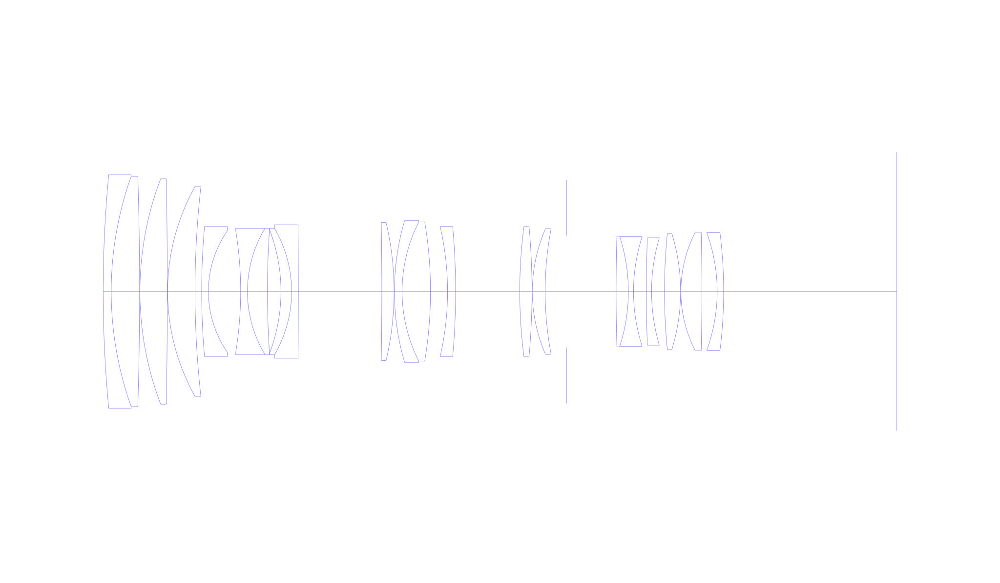
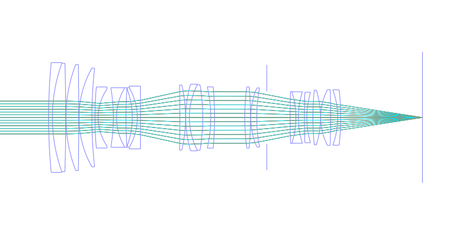
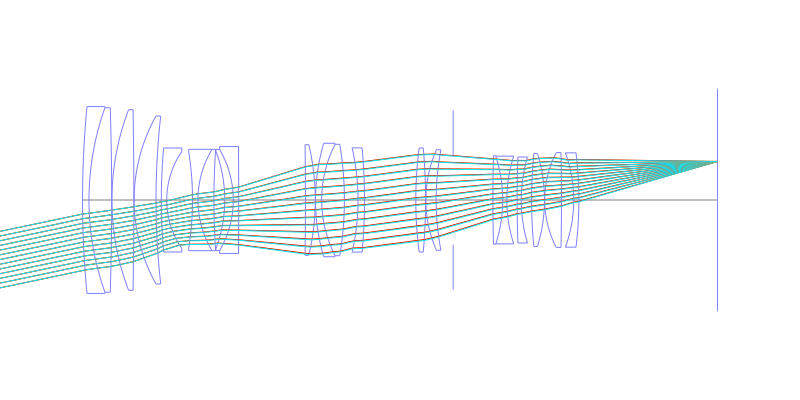
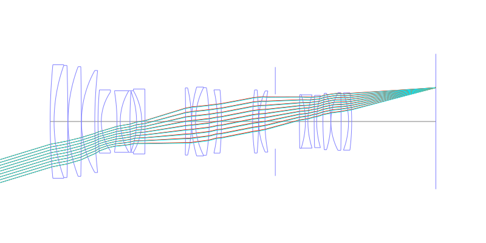
## Spot Diagrams
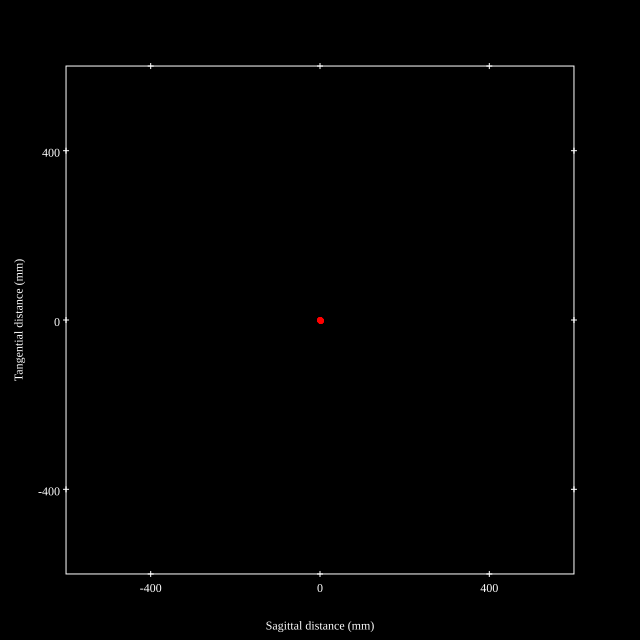
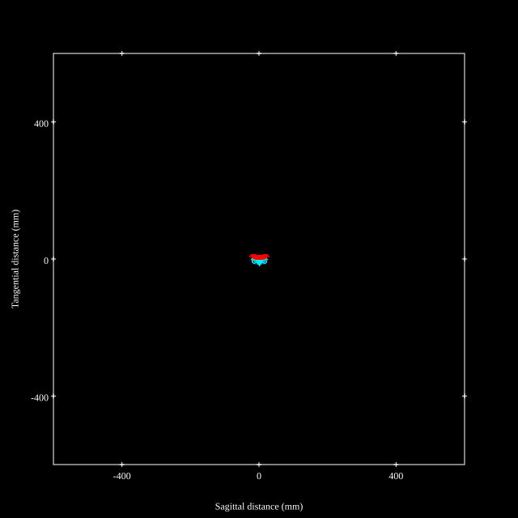
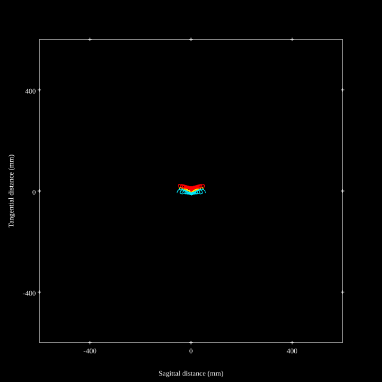
## Paraxial Parameters
| parameter | value |
| ---       | ---   |
| effective_focal_length |71.399
| back_focal_length | 53.786
| optical_invariant | 3.768
| object_distance | 1.0E10
| image_distance | 53.786
| power | 0.014
| pp1_H | 102.723
| ppk_H' | -17.613
| ffl_F | 31.324
| fno | 2.889
| enp_dist_P | 85.325
| enp_radius | 12.355
| exp_dist_P' | -40.569
| exp_radius | 16.335
| m | -0
| red | -1.4005757849558195E8
| n_obj | 1
| n_img | 1
| img_ht | 21.774
| obj_ang | 16.96
| obj_na | 0
| img_na | -0.171|
## Spot Analysis
| Field | Spot Mean Radius | Spot Max Radius |
| ---   | ---              | ---             |
 | Field(x=0.0, y=0.0) | 3.56 | 5.908|
 | Field(x=0.0, y=0.1) | 3.658 | 6.995|
 | Field(x=0.0, y=0.2) | 3.823 | 8.063|
 | Field(x=0.0, y=0.3) | 4.134 | 9.362|
 | Field(x=0.0, y=0.4) | 4.584 | 12.07|
 | Field(x=0.0, y=0.5) | 5.266 | 15.908|
 | Field(x=0.0, y=0.6) | 6.323 | 21.207|
 | Field(x=0.0, y=0.7) | 7.929 | 28.439|
 | Field(x=0.0, y=0.8) | 10.4 | 38.293|
 | Field(x=0.0, y=0.9) | 14.299 | 51.134|
 | Field(x=0.0, y=1.0) | 19.585 | 64.451|
## Polychromatic Geometric MTF
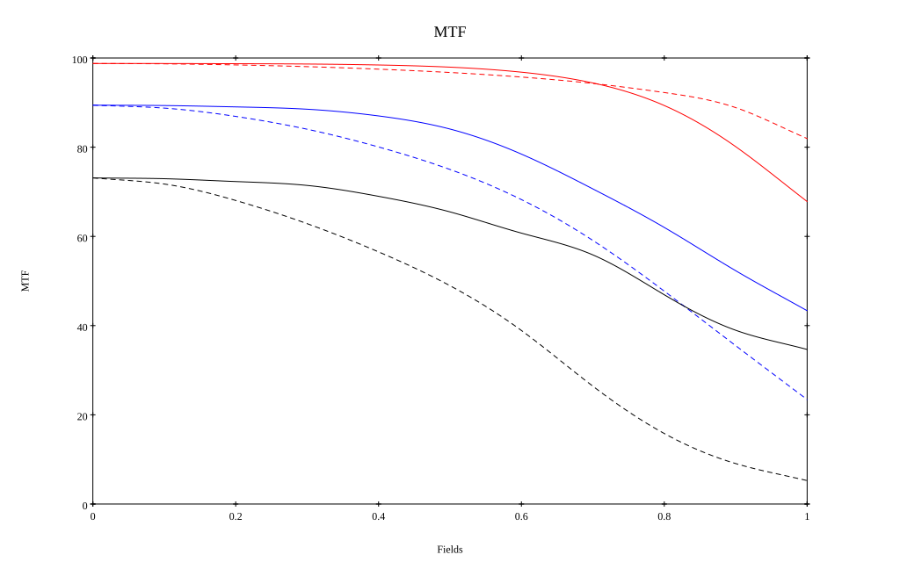
* 10=red,30=blue,50=black cycles/mm
* Solid lines represent sagittal, dashed lines tangential
* To generate above, MTFs for wavelengths 587.5618(d), 486.1327(F), 656.2725(C) were calculated across 10 fields, and then averaged
## Polychromatic Geometric MTF (Weighted)
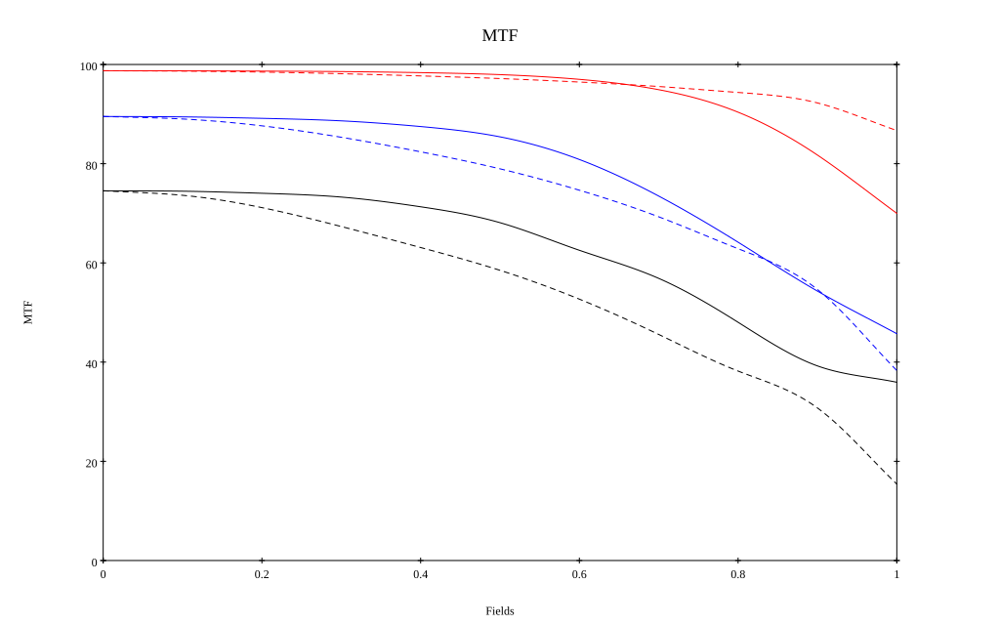
* 10=red,30=blue,50=black cycles/mm
* Solid lines represent sagittal, dashed lines tangential
* To generate above, MTFs for wavelengths 587.5618(d) wt(1.0), 656.2725(C) wt(0.475), 546.074(e) wt(0.98), 486.1327(F) wt(0.49), 435.8343(g) wt(0.15) were calculated across 10 fields, and then combined using weighted average
# 200mm f2.8
## Layouts
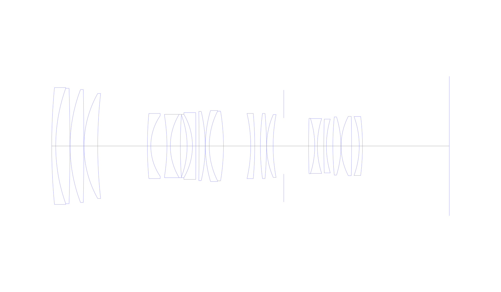
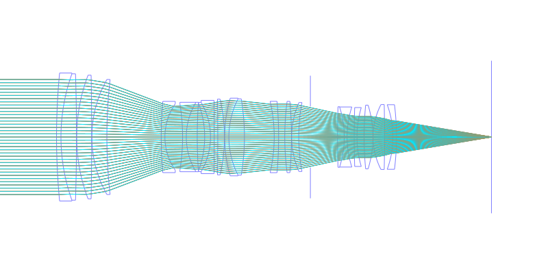
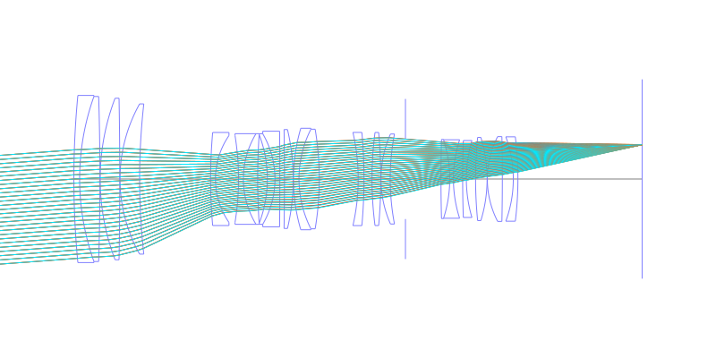
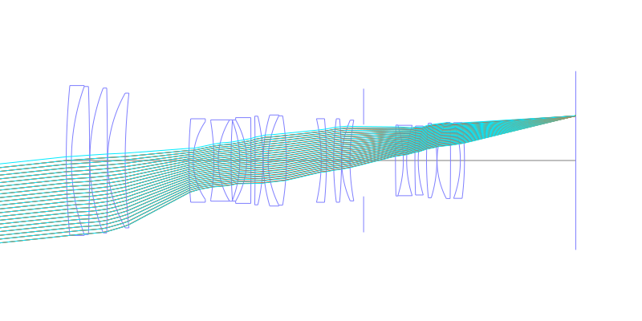
## Spot Diagrams
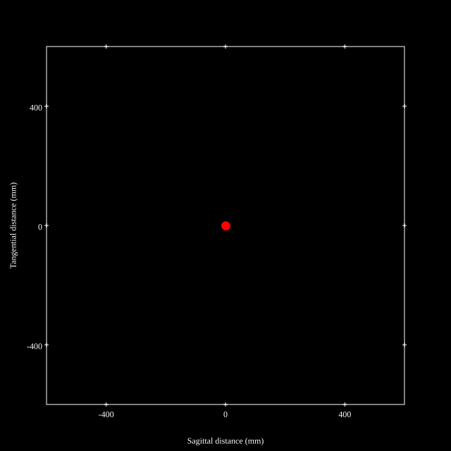
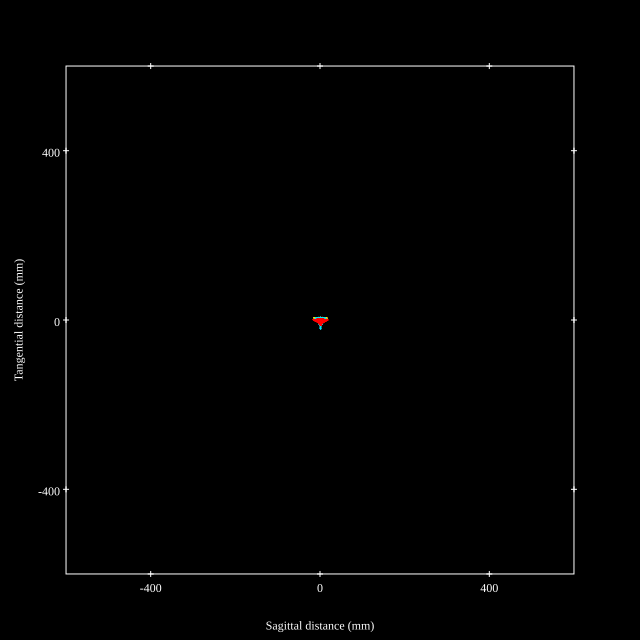
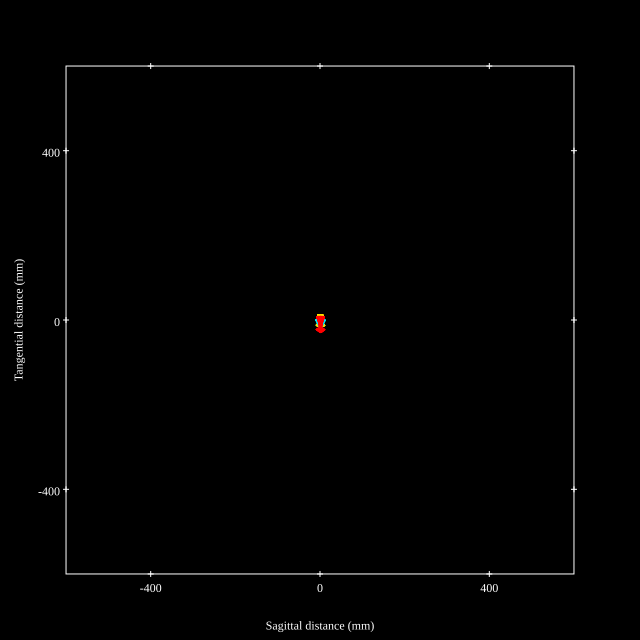
## Paraxial Parameters
| parameter | value |
| ---       | ---   |
| effective_focal_length |195.997
| back_focal_length | 53.787
| optical_invariant | 3.636
| object_distance | 1.0E10
| image_distance | 53.787
| power | 0.005
| pp1_H | 79.686
| ppk_H' | -142.21
| ffl_F | -116.311
| fno | 2.89
| enp_dist_P | 290.618
| enp_radius | 33.91
| exp_dist_P' | -40.678
| exp_radius | 16.333
| m | -0
| red | -5.102111243995739E7
| n_obj | 1
| n_img | 1
| img_ht | 21.015
| obj_ang | 6.12
| obj_na | 0
| img_na | -0.17|
## Spot Analysis
| Field | Spot Mean Radius | Spot Max Radius |
| ---   | ---              | ---             |
 | Field(x=0.0, y=0.0) | 3.251 | 12.369|
 | Field(x=0.0, y=0.1) | 3.228 | 12.31|
 | Field(x=0.0, y=0.2) | 3.567 | 12.428|
 | Field(x=0.0, y=0.3) | 4.263 | 18.532|
 | Field(x=0.0, y=0.4) | 4.626 | 20.822|
 | Field(x=0.0, y=0.5) | 5.175 | 23.253|
 | Field(x=0.0, y=0.6) | 6.052 | 26.008|
 | Field(x=0.0, y=0.7) | 7.273 | 28.778|
 | Field(x=0.0, y=0.8) | 8.799 | 30.887|
 | Field(x=0.0, y=0.9) | 10.917 | 31.457|
 | Field(x=0.0, y=1.0) | 13.542 | 33.298|
## Polychromatic Geometric MTF
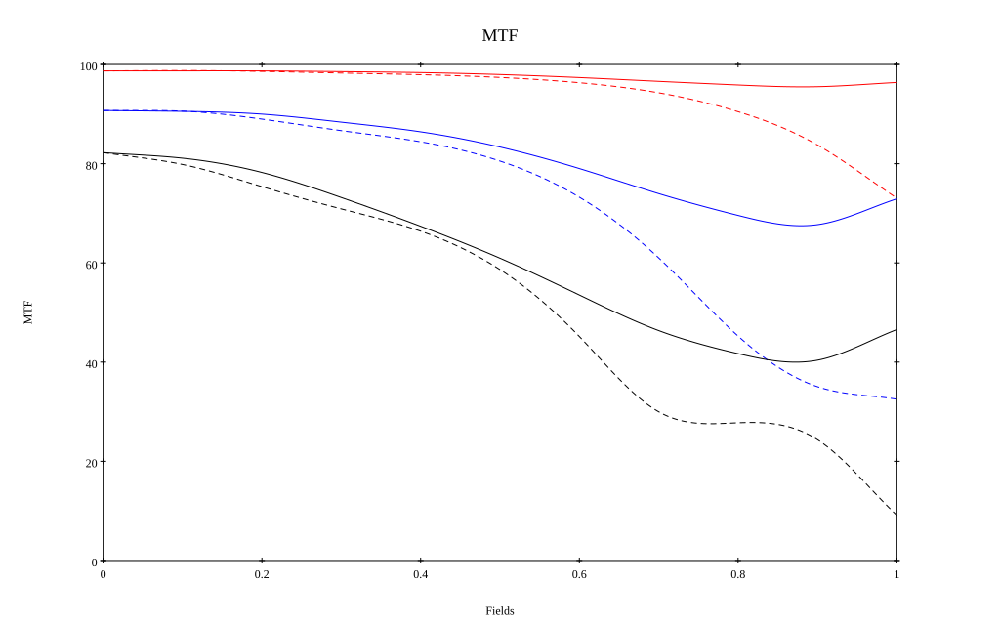
* 10=red,30=blue,50=black cycles/mm
* Solid lines represent sagittal, dashed lines tangential
* To generate above, MTFs for wavelengths 587.5618(d), 486.1327(F), 656.2725(C) were calculated across 10 fields, and then averaged
## Polychromatic Geometric MTF (Weighted)
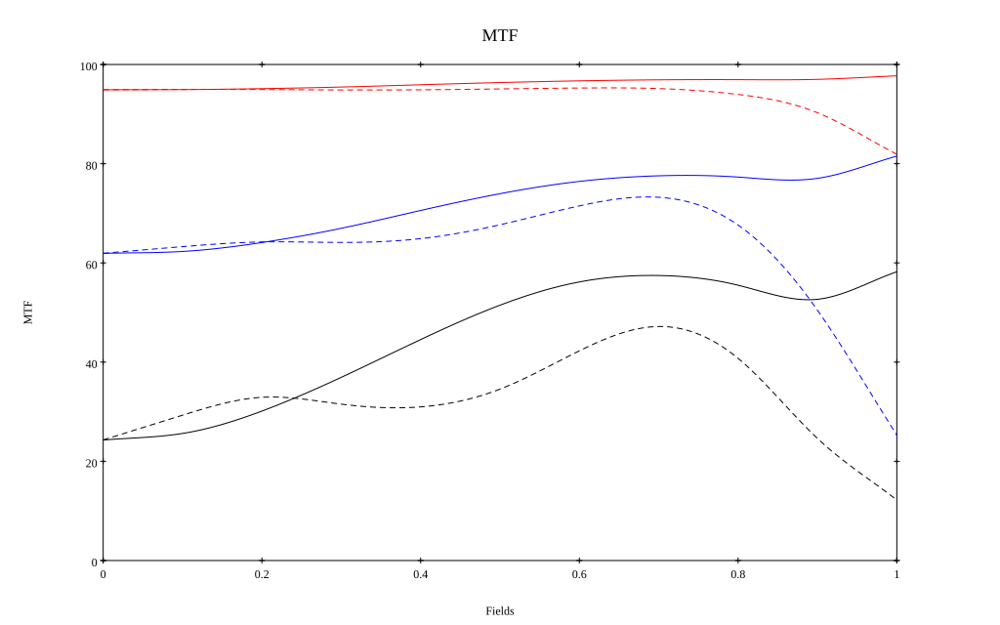
* 10=red,30=blue,50=black cycles/mm
* Solid lines represent sagittal, dashed lines tangential
* To generate above, MTFs for wavelengths 587.5618(d) wt(1.0), 656.2725(C) wt(0.475), 546.074(e) wt(0.98), 486.1327(F) wt(0.49), 435.8343(g) wt(0.15) were calculated across 10 fields, and then combined using weighted average
## Resources
* [OpticalBench Compatible Data File, tab delimited](./prescription.txt)
* [Zemax file](./US008416506_Example06P.zmx)

Report / Zemax file generated using [Beam42](https://github.com/BeamFour/Beam42) on 2026-07-26
