# AF-S Nikkor 70-200mm f/2.8 E FL ED VR
## Surface Data
Note that where glass types are shown the refractive index and abbe number is as per assigned glass type

| ID  | Radius | Thickness | Diameter | nd  | vd  | Glass Make | Glass |
| --- | ---    | ---       | ---      | --- | --- | ---        | ---   |
| 1 | 127.304 | 2.8 | 72.98 | 1.95 | 29.37 | Hikari | J-LASFH15 |
| 2 | 89.338 | 9.9 | 70.86 | 1.49782 | 82.57 | Hikari | J-FKH1 |
| 3 | -998.249 | 0.1 | 70.86 |  |  |  |
| 4 | 92.013 | 7.7 | 68.06 | 1.43384 | 95.26 | Hikari | NICF-A |
| 5 | 696.987 | d5 | 68.06 |  |  |  |
| 6 | 67.306 | 2.4 | 44.32 | 1.71999 | 50.27 | Hikari | J-LAK10 |
| 7 | 33.224 | 10.25 | 39.56 |  |  |  |
| 8 | -131.888 | 2.0 | 38.24 | 1.618 | 63.34 | Hikari | J-PSK02 |
| 9 | 100.859 | 2.0 | 38.24 |  |  |  |
| 10 | 53.85 | 4.4 | 39.72 | 1.84666 | 23.8 | Hikari | J-SF03 |
| 11 | 193.868 | 3.55 | 38.42 |  |  |  |
| 12 | -73.371 | 2.2 | 38.42 | 1.603 | 65.44 | Hikari | J-PSK03 |
| 13 | 288.683 | d13 | 40.06 |  |  |  |
| 14 | AS | 2.5 | a14 |  |  |  |
| 15 | 581.555 | 3.7 | 41.6 | 1.83481 | 42.73 | Hikari | J-LASF05 |
| 16 | -130.482 | 0.2 | 41.6 |  |  |  |
| 17 | 90.329 | 3.85 | 41.6 | 1.59319 | 67.9 | Hikari | J-PSKH1 |
| 18 | 0.0 | 0.2 | 41.6 |  |  |  |
| 19 | 52.765 | 4.9 | 39.96 | 1.49782 | 82.57 | Hikari | J-FKH1 |
| 20 | 448.658 | 2.043 | 39.96 |  |  |  |
| 21 | -118.745 | 2.2 | 38.8 | 2.001 | 29.12 | Hikari | J-LASFH16 |
| 22 | 173.228 | 4.55 | 39.48 |  |  |  |
| 23 | 114.635 | 5.75 | 38.5 | 1.90265 | 35.77 | Hikari | J-LASFH9A |
| 24 | -66.799 | 2.2 | 38.5 | 1.58144 | 40.98 | Hikari | J-LF5 |
| 25 | 41.996 | d25 | 38.5 |  |  |  |
| 26 | 57.835 | 4.8 | 34.72 | 1.49782 | 82.57 | Hikari | J-FKH1 |
| 27 | -190.076 | 0.1 | 34.72 |  |  |  |
| 28 | 44.19 | 2.0 | 32.6 | 1.95 | 29.37 | Hikari | J-LASFH15 |
| 29 | 28.478 | 5.55 | 32.6 | 1.59319 | 67.9 | Hikari | J-PSKH1 |
| 30 | 166.406 | d30 | 32.6 |  |  |  |
| 31 | 52.698 | 1.8 | 31.62 | 1.804 | 46.6 | Hikari | J-LASF015 |
| 32 | 31.187 | 5.15 | 29.48 |  |  |  |
| 33 | 102.833 | 3.35 | 28.82 | 1.84666 | 23.8 | Hikari | J-SF03 |
| 34 | -102.758 | 1.6 | 28.82 | 1.71999 | 50.27 | Hikari | J-LAK10 |
| 35 | 42.059 | 2.583 | 28.82 |  |  |  |
| 36 | 0.0 | 1.6 | 31.78 | 1.95375 | 32.33 | Hikari | J-LASFH21 |
| 37 | 68.581 | 3.75 | 31.78 |  |  |  |
| 38 | 101.229 | 3.85 | 34.4 | 1.59319 | 67.9 | Hikari | J-PSKH1 |
| 39 | -172.177 | 0.15 | 34.4 |  |  |  |
| 40 | 47.985 | 3.9 | 36.52 | 1.71999 | 50.27 | Hikari | J-LAK10 |
| 41 | 137.994 | d41 | 36.52 |  |  |  |
## Variables
| Variable | 70mm f2.8 | 200mm f2.8 |
| --- | --- | --- |
| Focal length |71.5 |196.0 |
| F-Number |2.85 |2.88 |
| Angle of View |33.64 |12.2 |
| d5 | 3.014 | 50.952 |
| d13 | 50.598 | 2.66 |
| a14 | 38.97 | 38.523 |
| d25 | 16.922 | 16.921 |
| d30 | 1.903 | 1.903 |
| d41 | 53.89 | 53.91 |
# 70mm f2.8
## Layouts
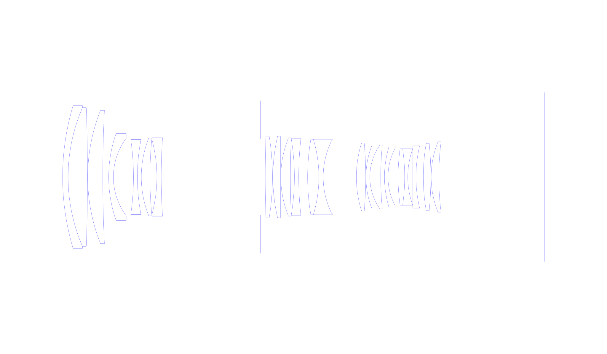
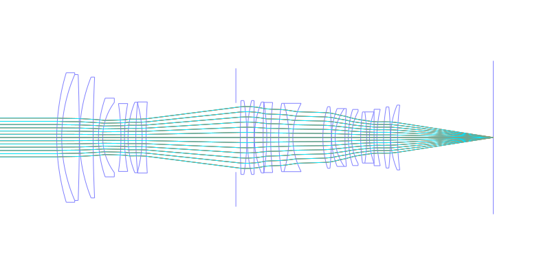
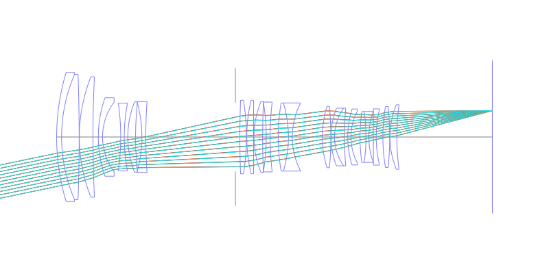
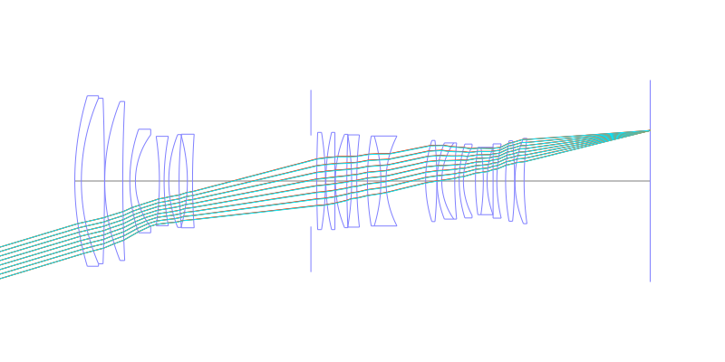
## Spot Diagrams
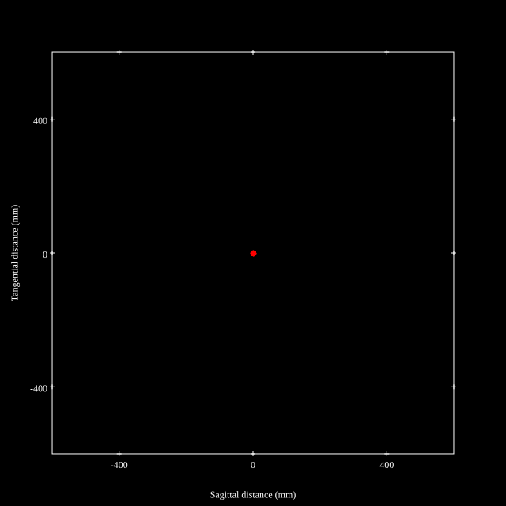
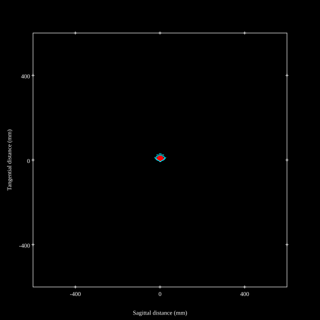
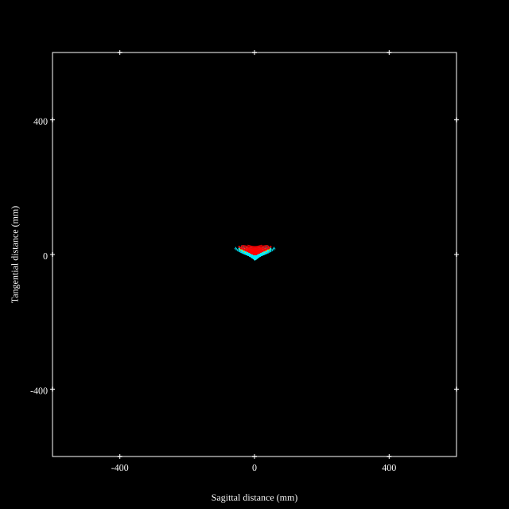
## Paraxial Parameters
| parameter | value |
| ---       | ---   |
| effective_focal_length |71.498
| back_focal_length | 53.993
| optical_invariant | 3.792
| object_distance | 1.0E10
| image_distance | 53.993
| power | 0.014
| pp1_H | 112.764
| ppk_H' | -17.505
| ffl_F | 41.266
| fno | 2.85
| enp_dist_P | 78.271
| enp_radius | 12.545
| exp_dist_P' | -84.045
| exp_radius | 24.238
| m | -0
| red | -1.398649608118662E8
| n_obj | 1
| n_img | 1
| img_ht | 21.614
| obj_ang | 16.82
| obj_na | 0
| img_na | -0.173|
## Spot Analysis
| Field | Spot Mean Radius | Spot Max Radius |
| ---   | ---              | ---             |
 | Field(x=0.0, y=0.0) | 3.385 | 7.292|
 | Field(x=0.0, y=0.1) | 3.319 | 7.825|
 | Field(x=0.0, y=0.2) | 3.452 | 10.7|
 | Field(x=0.0, y=0.3) | 3.681 | 14.76|
 | Field(x=0.0, y=0.4) | 3.814 | 18.71|
 | Field(x=0.0, y=0.5) | 4.4 | 22.721|
 | Field(x=0.0, y=0.6) | 5.604 | 26.475|
 | Field(x=0.0, y=0.7) | 7.147 | 30.527|
 | Field(x=0.0, y=0.8) | 9.528 | 37.764|
 | Field(x=0.0, y=0.9) | 12.682 | 48.779|
 | Field(x=0.0, y=1.0) | 16.839 | 62.117|
## Polychromatic Geometric MTF
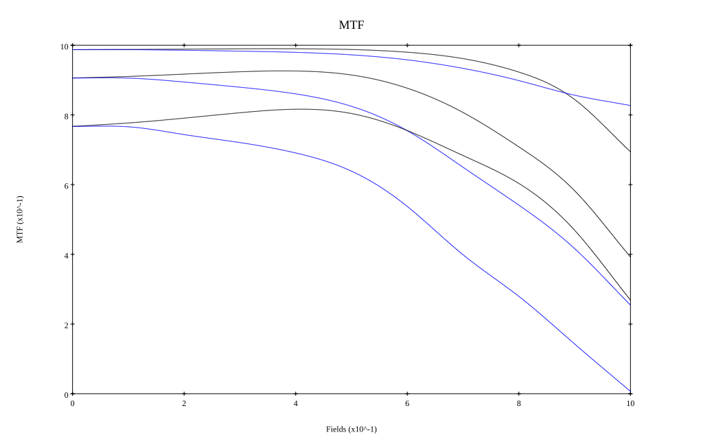
* 10,30,50 cycles/mm
* Black lines represent sagittal, blue tangential
* To generate above, MTFs for wavelengths 587.5618(d), 486.1327(F), 656.2725(C) were calculated across 10 fields, and then averaged
## Polychromatic Geometric MTF (Weighted)
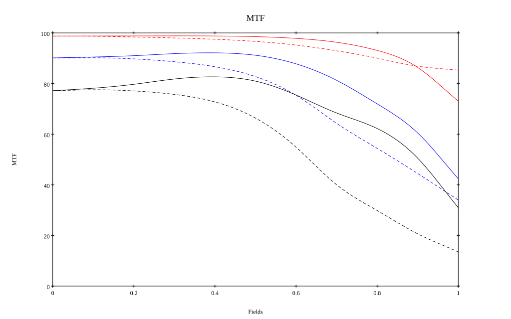
* 10,30,50 cycles/mm
* Black lines represent sagittal, blue tangential
* To generate above, MTFs for wavelengths 587.5618(d) wt(1.0), 656.2725(C) wt(0.475), 546.074(e) wt(0.98), 486.1327(F) wt(0.49), 435.8343(g) wt(0.15) were calculated across 10 fields, and then combined using weighted average
# 200mm f2.8
## Layouts
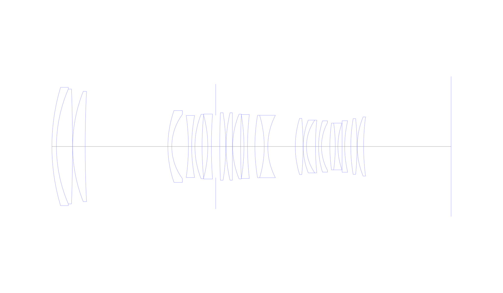
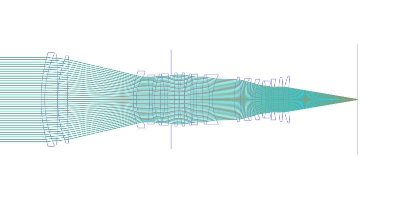
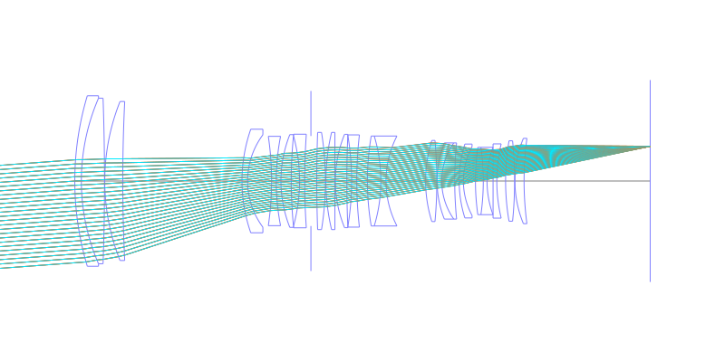
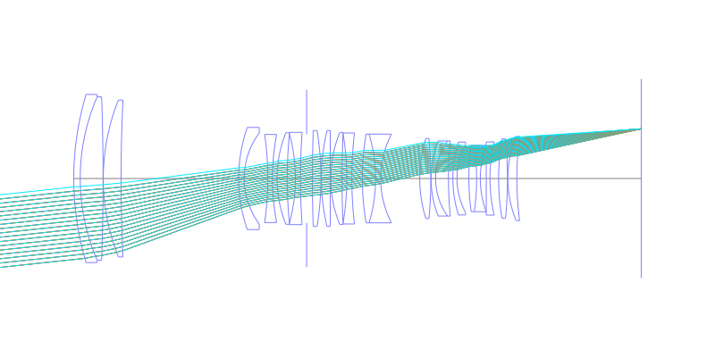
## Spot Diagrams
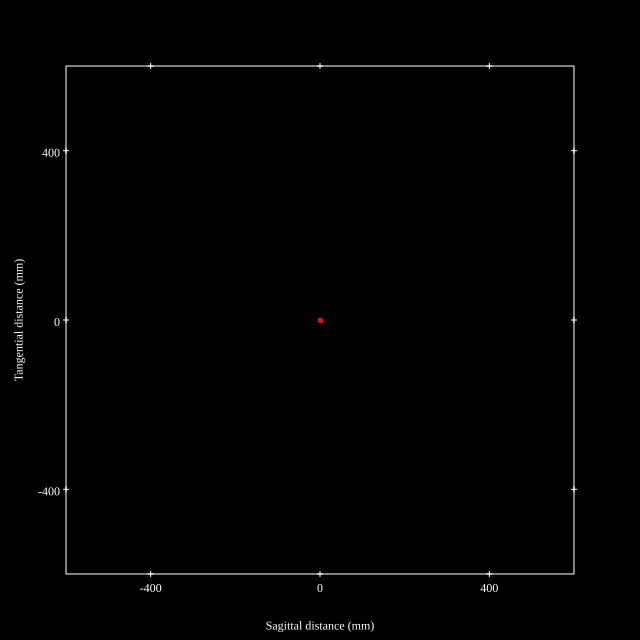
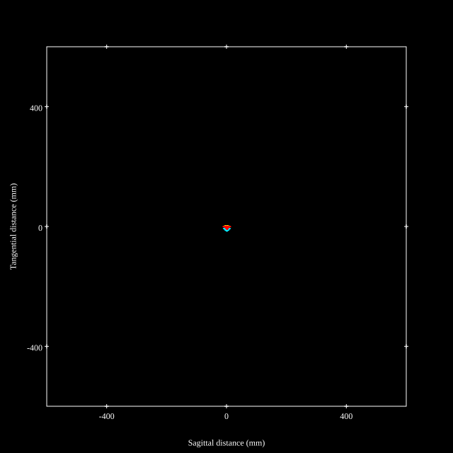
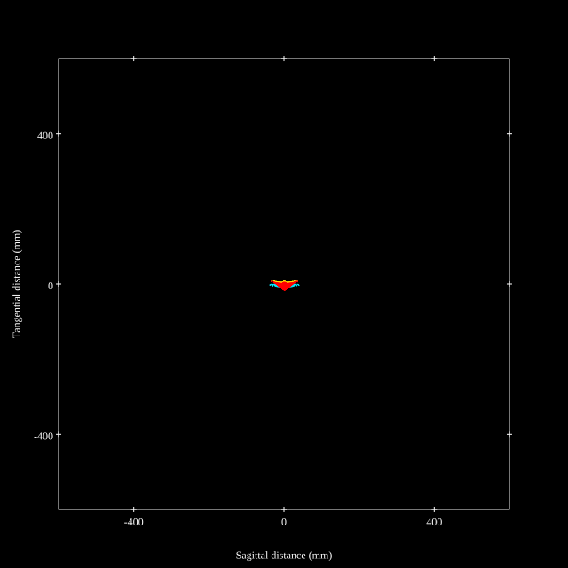
## Paraxial Parameters
| parameter | value |
| ---       | ---   |
| effective_focal_length |196.002
| back_focal_length | 53.958
| optical_invariant | 3.637
| object_distance | 1.0E10
| image_distance | 53.958
| power | 0.005
| pp1_H | 107.315
| ppk_H' | -142.044
| ffl_F | -88.687
| fno | 2.88
| enp_dist_P | 189.485
| enp_radius | 34.029
| exp_dist_P' | -84.099
| exp_radius | 23.977
| m | -0
| red | -5.1019968133118585E7
| n_obj | 1
| n_img | 1
| img_ht | 20.947
| obj_ang | 6.1
| obj_na | 0
| img_na | -0.171|
## Spot Analysis
| Field | Spot Mean Radius | Spot Max Radius |
| ---   | ---              | ---             |
 | Field(x=0.0, y=0.0) | 2.398 | 4.664|
 | Field(x=0.0, y=0.1) | 2.731 | 10.69|
 | Field(x=0.0, y=0.2) | 3.863 | 20.134|
 | Field(x=0.0, y=0.3) | 4.602 | 23.718|
 | Field(x=0.0, y=0.4) | 4.825 | 24.762|
 | Field(x=0.0, y=0.5) | 5.007 | 23.221|
 | Field(x=0.0, y=0.6) | 4.996 | 19.683|
 | Field(x=0.0, y=0.7) | 4.877 | 14.719|
 | Field(x=0.0, y=0.8) | 5.161 | 18.323|
 | Field(x=0.0, y=0.9) | 6.708 | 26.985|
 | Field(x=0.0, y=1.0) | 10.577 | 38.573|
## Polychromatic Geometric MTF
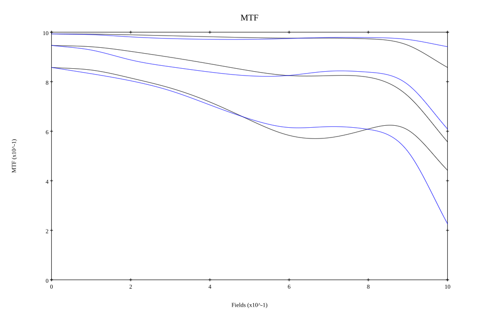
* 10,30,50 cycles/mm
* Black lines represent sagittal, blue tangential
* To generate above, MTFs for wavelengths 587.5618(d), 486.1327(F), 656.2725(C) were calculated across 10 fields, and then averaged
## Polychromatic Geometric MTF (Weighted)
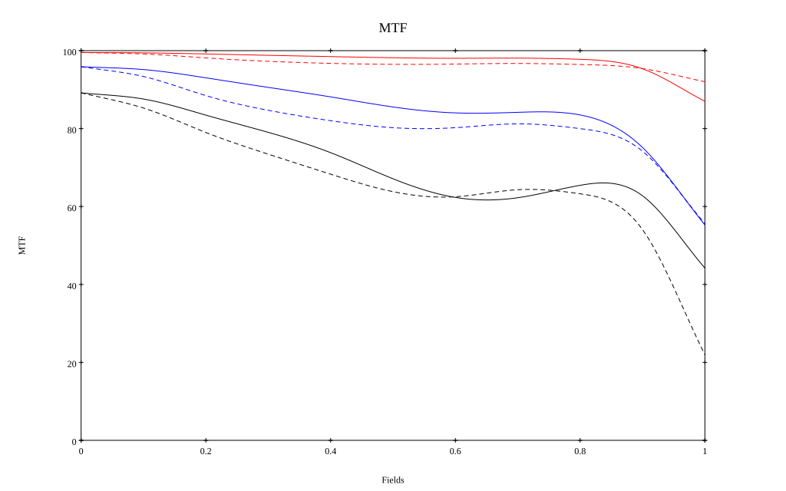
* 10,30,50 cycles/mm
* Black lines represent sagittal, blue tangential
* To generate above, MTFs for wavelengths 587.5618(d) wt(1.0), 656.2725(C) wt(0.475), 546.074(e) wt(0.98), 486.1327(F) wt(0.49), 435.8343(g) wt(0.15) were calculated across 10 fields, and then combined using weighted average
## Resources
* [OpticalBench Compatible Data File, tab delimited](./prescription.txt)
* [Zemax file](./WO2019-097669_Example01P.zmx)

Report / Zemax file generated using [Beam42](https://github.com/BeamFour/Beam42) on 2026-05-26
