# Nikkor Z 70-200mm f/2.8 VR S
## Patent Information
| Country | Patent Number | Example | Year of Application | Inventors | Organisation | Link |
| ---     | ---           | ---     | ---                 | ---       | ---          | ---  |
|US | US20210349293 | 1 | 2018 | Takeru Uehara | Nikon Corp | [link](https://patents.google.com/patent/US20210349293A1/en) |
## Surface Data
Note that where glass types are shown the refractive index and abbe number is as per assigned glass type

| ID  | Radius | Thickness | Diameter | nd  | vd  | Glass Make | Glass |
| --- | ---    | ---       | ---      | --- | --- | ---        | ---   |
| 1 | 116.34563 | 2.8 | 72.58 | 2.001 | 29.13 | Hoya | TAFD55 |
| 2 | 85.133 | 9.7 | 72.58 | 1.49782 | 82.57 | Hikari | J-FKH1 |
| 3 | 0.0 | 0.1 | 72.58 |  |  |  |
| 4 | 92.01324 | 7.7 | 69.52 | 1.43384 | 95.26 | Hikari | NICF-A |
| 5 | 696.98757 | d5 | 69.52 |  |  |  |
| 6 | 58.77 | 1.9 | 47.5 | 1.603 | 65.44 | Ohara | S-PHM53 |
| 7 | 31.87745 | 10.3 | 41.9 |  |  |  |
| 8 | -186.53352 | 1.6 | 42.04 | 1.49782 | 82.57 | Hikari | J-FKH1 |
| 9 | 105.34866 | 0.8 | 42.04 |  |  |  |
| 10 | 41.08366 | 3.7 | 40.93 | 1.66382 | 27.35 | Hikari | J-SFH4 |
| 11 | 64.00891 | 5.5 | 38.04 |  |  |  |
| 12 | -71.62319 | 1.9 | 38.04 | 1.49782 | 82.57 | Hikari | J-FKH1 |
| 13 | 88.67881 | d13 | 40.93 |  |  |  |
| 14 | 69.46271 | 3.2 | 40.84 | 1.94594 | 17.98 | Hoya | FDS18 |
| 15 | 201.8299 | d15 | 40.84 |  |  |  |
| 16 | 126.26563 | 4.7 | 40.84 | 1.49782 | 82.57 | Hikari | J-FKH1 |
| 17 | -126.26563 | 0.1 | 40.84 |  |  |  |
| 18 | 47.66354 | 3.85 | 38.8 | 1.49782 | 82.57 | Hikari | J-FKH1 |
| 19 | 122.86616 | d19 | 38.8 |  |  |  |
| 20 | AS | 3.5 | 32.336 |  |  |  |
| 21 | -84.82141 | 1.8 | 35.04 | 1.92286 | 20.88 | Hoya | E-FDS1 |
| 22 | 52.171 | 5.0 | 35.04 | 1.49782 | 82.57 | Hikari | J-FKH1 |
| 23 | -170.93248 | d23 | 35.04 |  |  |  |
| 24 | 111.64091 | 1.7 | 34.52 | 1.85026 | 32.29 | Ohara | LAH71 |
| 25 | 60.55636 | 2.0 | 34.52 |  |  |  |
| 26 | 58.68256 | 7.7 | 35.34 | 1.59306 | 66.97 |  |
| 27 | -55.839 | 1.7 | 35.34 | 1.62004 | 36.37 | Schott | F2 |
| 28 | -95.85894 | 1.3 | 35.34 |  |  |  |
| 29 | 58.0393 | 2.7 | 34.24 | 1.801 | 34.97 | Ohara | LAM66 |
| 30 | 135.30037 | d30 | 34.24 |  |  |  |
| 31 | -369.28597 | 2.0 | 29.46 | 1.94594 | 17.98 | Hoya | FDS18 |
| 32 | -98.65201 | 0.8 | 29.46 |  |  |  |
| 33 | 1344.92022 | 1.25 | 28.76 | 1.713 | 53.94 | Hoya | LAC8 |
| 34 | 37.13115 | d34 | 26.74 |  |  |  |
| 35 | 119.39985 | 3.85 | 35.74 | 1.90265 | 35.77 | Hikari | J-LASFH9A |
| 36 | -119.39985 | d36 | 35.74 |  |  |  |
| 37 | -83.23047 | 1.9 | 36.22 | 1.51696 | 64.14 |  |
| 38 | -335.27926 | 4.1 | 37.79 |  |  |  |
| 39 | -54.71091 | 1.9 | 36.16 | 1.56384 | 60.7 | Ohara | BAL41 |
| 40 | -276.64763 | d40 | 37.48 |  |  |  |
## Aspherical Data
| ID  | Type | k   | P1 | P2 | P3 | P4 | P5 | P6 |
| --- | --- | --- | --- | --- | --- | --- | --- | --- |
| 26| EVEN | 0.0 | 0.0 | -2.0E-6 | 8.31E-10 | -6.83E-12 | 2.63E-14 | -3.55E-17 |
| 37| EVEN | 0.0 | 0.0 | 1.18E-6 | 1.63E-9 | -7.32E-12 | 2.41E-14 | -2.65E-17 |
## Variables
| Variable | 70mm f2.8 | 200mm f2.8 |
| --- | --- | --- |
| Focal length |71.50119 |196.0 |
| F-Number |2.88277 |2.87906 |
| Angle of View |33.79332 |12.27158 |
| d5 | 1.59716 | 49.53103 |
| d13 | 37.80333 | 1.60516 |
| d15 | 14.09965 | 2.36395 |
| d19 | 4.24982 | 8.12305 |
| d23 | 5.35666 | 1.48342 |
| d30 | 3.81632 | 4.10722 |
| d34 | 28.12371 | 27.70989 |
| d36 | 3.7896 | 3.91252 |
| d40 | 32.52959 | 32.55029 |
# 70mm f2.8
## Layouts
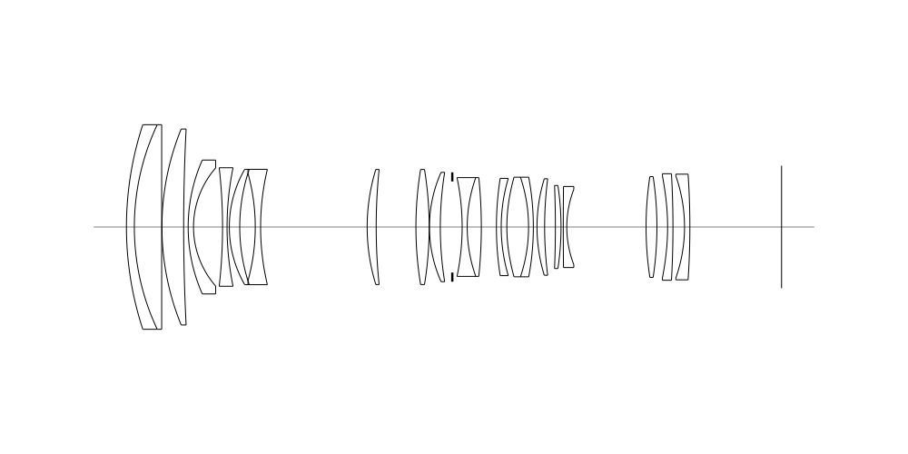
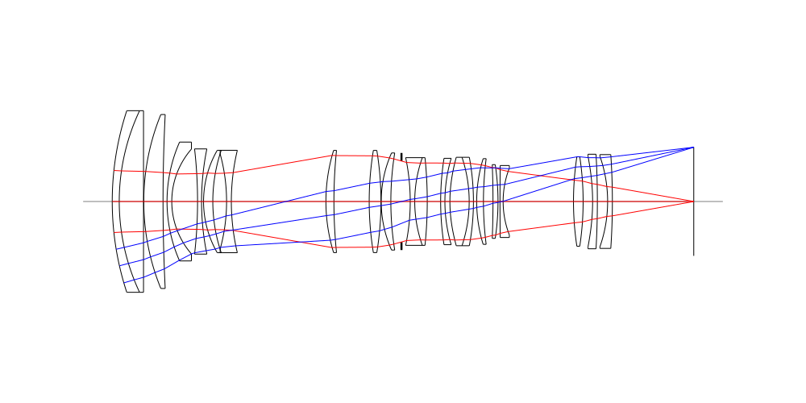
## Spot Diagrams
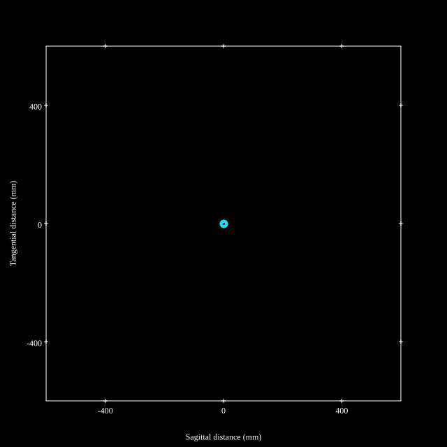
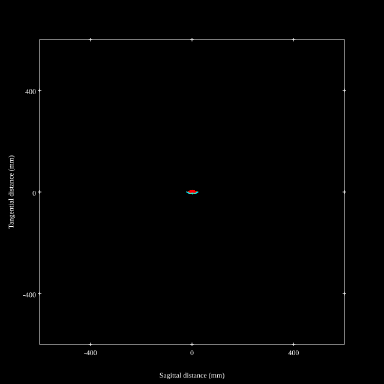
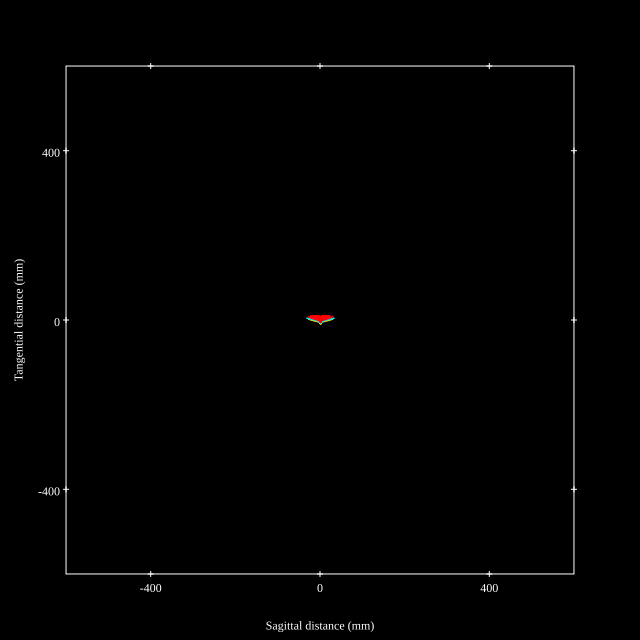
## Paraxial Parameters
| parameter | value |
| ---       | ---   |
| effective_focal_length |71.502
| back_focal_length | 32.549
| optical_invariant | 3.767
| object_distance | 1.0E10
| image_distance | 32.549
| power | 0.014
| pp1_H | 105.476
| ppk_H' | -38.953
| ffl_F | 33.974
| fno | 2.883
| enp_dist_P | 84.598
| enp_radius | 12.4
| exp_dist_P' | -68.421
| exp_radius | 17.513
| m | -0
| red | -1.3985636175064108E8
| n_obj | 1
| n_img | 1
| img_ht | 21.719
| obj_ang | 16.897
| obj_na | 0
| img_na | -0.173|
## Spot Analysis
| Field | Spot Mean Radius | Spot Max Radius |
| ---   | ---              | ---             |
 | Field(x=0.0, y=0.0) | 2.983 | 12.019|
 | Field(x=0.0, y=0.1) | 3.029 | 12.136|
 | Field(x=0.0, y=0.2) | 3.197 | 12.479|
 | Field(x=0.0, y=0.3) | 3.31 | 13.091|
 | Field(x=0.0, y=0.4) | 3.518 | 14.125|
 | Field(x=0.0, y=0.5) | 3.778 | 15.752|
 | Field(x=0.0, y=0.6) | 4.252 | 18.212|
 | Field(x=0.0, y=0.7) | 4.891 | 21.764|
 | Field(x=0.0, y=0.8) | 5.577 | 26.61|
 | Field(x=0.0, y=0.9) | 6.453 | 30.946|
 | Field(x=0.0, y=1.0) | 7.774 | 32.641|
## Polychromatic Geometric MTF
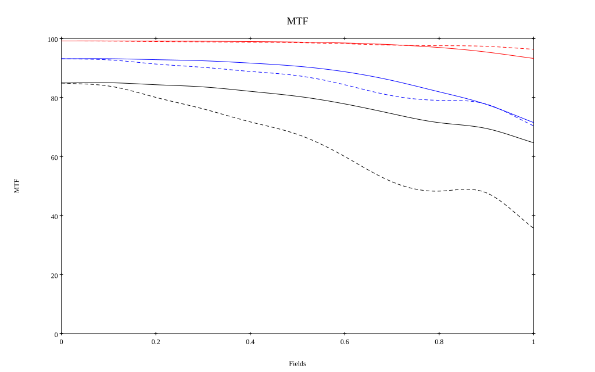
* 10=red,30=blue,50=black cycles/mm
* Solid lines represent sagittal, dashed lines tangential
* To generate above, MTFs for wavelengths 587.5618(d), 486.1327(F), 656.2725(C) were calculated across 10 fields, and then averaged
## Polychromatic Geometric MTF (Weighted)
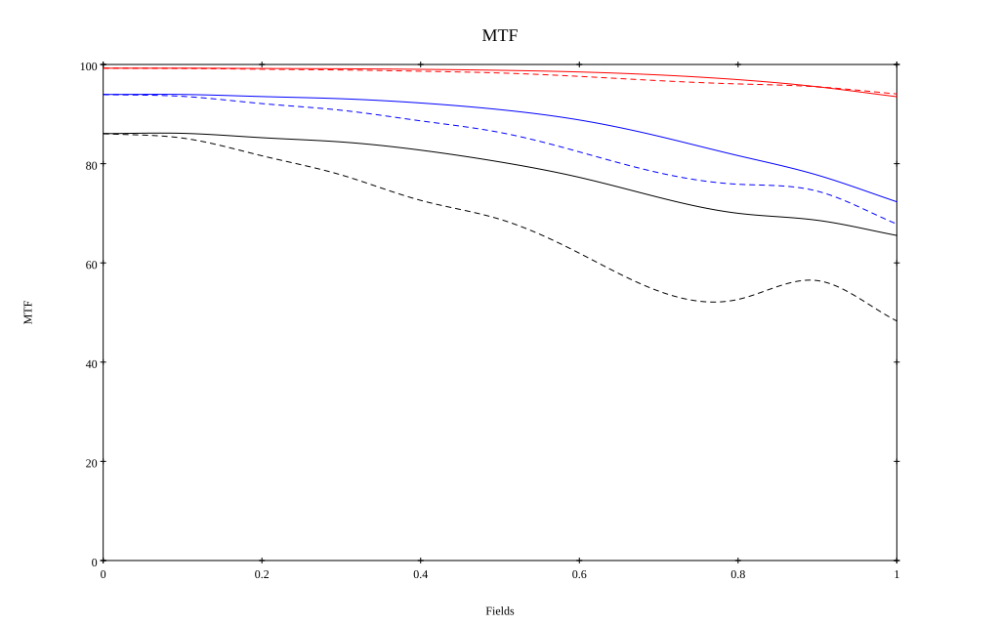
* 10=red,30=blue,50=black cycles/mm
* Solid lines represent sagittal, dashed lines tangential
* To generate above, MTFs for wavelengths 587.5618(d) wt(1.0), 656.2725(C) wt(0.475), 546.074(e) wt(0.98), 486.1327(F) wt(0.49), 435.8343(g) wt(0.15) were calculated across 10 fields, and then combined using weighted average
# 200mm f2.8
## Layouts
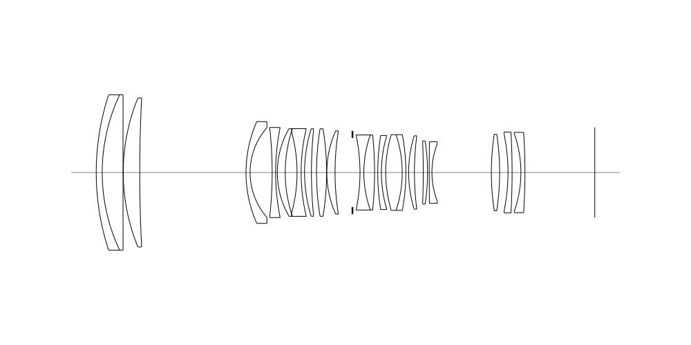
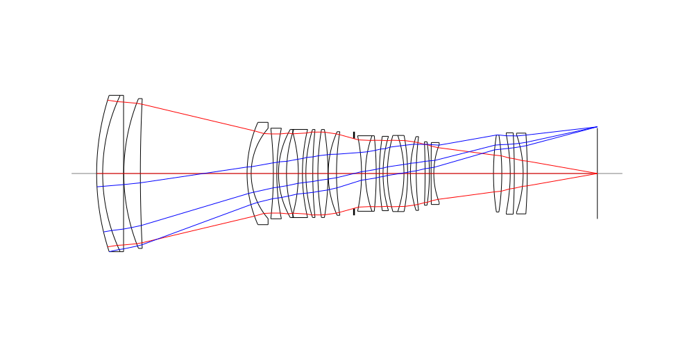
## Spot Diagrams
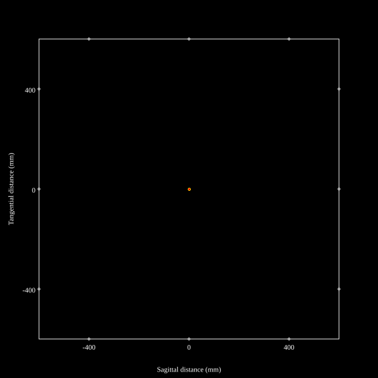

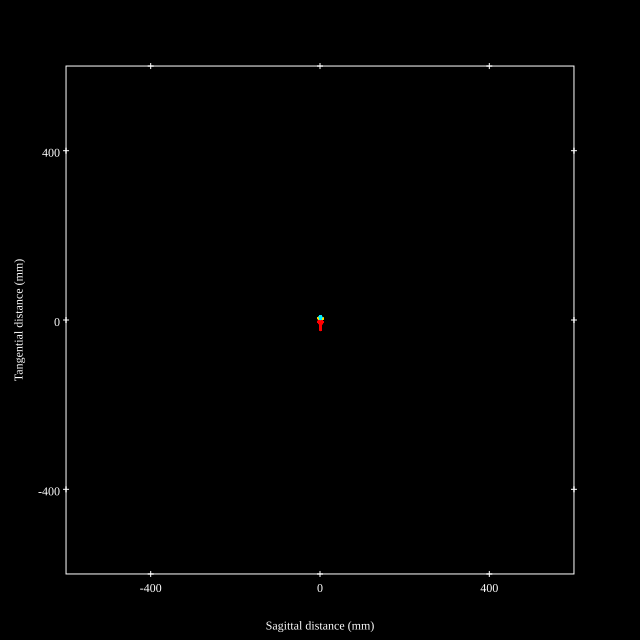
## Paraxial Parameters
| parameter | value |
| ---       | ---   |
| effective_focal_length |196.006
| back_focal_length | 32.552
| optical_invariant | 3.659
| object_distance | 1.0E10
| image_distance | 32.552
| power | 0.005
| pp1_H | 40.919
| ppk_H' | -163.454
| ffl_F | -155.088
| fno | 2.88
| enp_dist_P | 246.469
| enp_radius | 34.034
| exp_dist_P' | -63.119
| exp_radius | 16.613
| m | -0
| red | -5.101874611162555E7
| n_obj | 1
| n_img | 1
| img_ht | 21.071
| obj_ang | 6.136
| obj_na | 0
| img_na | -0.174|
## Spot Analysis
| Field | Spot Mean Radius | Spot Max Radius |
| ---   | ---              | ---             |
 | Field(x=0.0, y=0.0) | 1.272 | 3.491|
 | Field(x=0.0, y=0.1) | 1.82 | 7.102|
 | Field(x=0.0, y=0.2) | 2.807 | 13.574|
 | Field(x=0.0, y=0.3) | 3.763 | 18.604|
 | Field(x=0.0, y=0.4) | 4.399 | 20.029|
 | Field(x=0.0, y=0.5) | 4.752 | 18.66|
 | Field(x=0.0, y=0.6) | 4.967 | 16.118|
 | Field(x=0.0, y=0.7) | 5.256 | 13.928|
 | Field(x=0.0, y=0.8) | 5.791 | 14.57|
 | Field(x=0.0, y=0.9) | 6.801 | 19.341|
 | Field(x=0.0, y=1.0) | 8.276 | 23.445|
## Polychromatic Geometric MTF
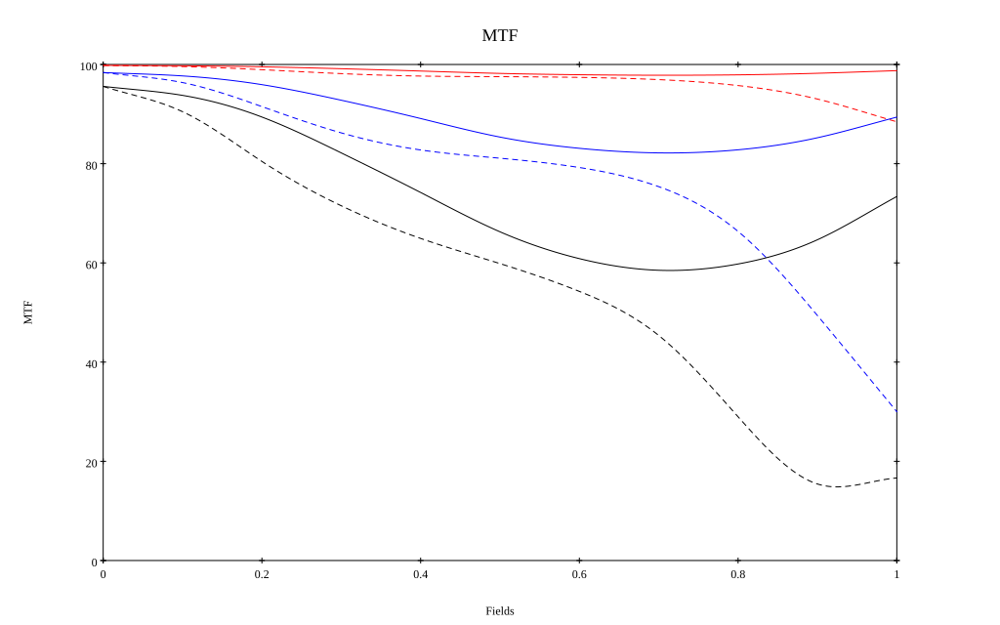
* 10=red,30=blue,50=black cycles/mm
* Solid lines represent sagittal, dashed lines tangential
* To generate above, MTFs for wavelengths 587.5618(d), 486.1327(F), 656.2725(C) were calculated across 10 fields, and then averaged
## Polychromatic Geometric MTF (Weighted)
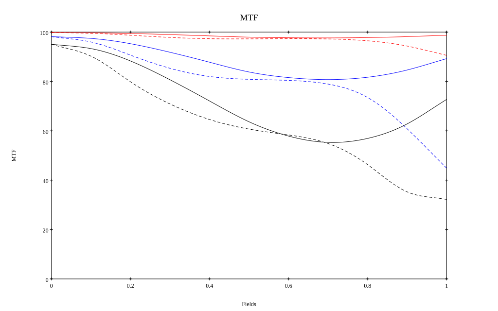
* 10=red,30=blue,50=black cycles/mm
* Solid lines represent sagittal, dashed lines tangential
* To generate above, MTFs for wavelengths 587.5618(d) wt(1.0), 656.2725(C) wt(0.475), 546.074(e) wt(0.98), 486.1327(F) wt(0.49), 435.8343(g) wt(0.15) were calculated across 10 fields, and then combined using weighted average
## Resources
* [OpticalBench Compatible Data File, tab delimited](./prescription.txt)
* [Zemax file](./WO2020-105104_Example01P.zmx)

Report / Zemax file generated using [Beam42](https://github.com/BeamFour/Beam42) on 2026-08-20
