# Nikkor Z 70-200mm f/2.8 VR S II
## Patent Information
| Country | Patent Number | Example | Year of Application | Inventors | Organisation | Link |
| ---     | ---           | ---     | ---                 | ---       | ---          | ---  |
|EU | WO 2026/172598 | 1 | 2025 | TAKAHASHI Akino | Nikon Corp | [link](https://patentscope.wipo.int/search/en/detail.jsf?docId=WO2026172598) |
## Surface Data
Note that where glass types are shown the refractive index and abbe number is as per assigned glass type

| ID  | Radius | Thickness | Diameter | nd  | vd  | Glass Make | Glass |
| --- | ---    | ---       | ---      | --- | --- | ---        | ---   |
| 1 | 148.0643 | 5.2 | 71.66 | 1.48749 | 70.35 | Ohara | S-FSL5Y |
| 2 | 1994.3176 | 0.2 | 71.66 |  |  |  |
| 3 | 80.0925 | 1.75 | 68.6 | 1.77047 | 29.74 | Hoya | NBFD29 |
| 4 | 58.6156 | 0.15 | 66.2 |  |  |  |
| 5 | 58.8499 | 12.3 | 66.2 | 1.43384 | 95.26 | Hikari | NICF-A |
| 6 | 0.0 | d6 | 66.2 |  |  |  |
| 7 | 175.6186 | 1.2 | 46.58 | 1.55298 | 55.07 | Hikari | J-KZFH4 |
| 8 | 36.2521 | d8 | 42.66 |  |  |  |
| 9 | -87.8742 | 1.2 | 39.06 | 1.5186 | 69.89 | Hikari | J-PKH1 |
| 10 | 85.9441 | 0.92 | 39.06 |  |  |  |
| 11 | 61.6974 | 3.35 | 40.78 | 2.00069 | 25.46 | Hoya | TAFD40 |
| 12 | 199.9422 | 3.78 | 38.16 |  |  |  |
| 13 | -65.6269 | 1.3 | 38.16 | 1.437 | 95.1 | Hoya | FCD100 |
| 14 | 343.5775 | d14 | 40.78 |  |  |  |
| 15 | 44.899 | 5.2 | 43.68 | 1.622 | 30.66 | Hikari | J-SFH8 |
| 16 | 143.2662 | 1.14 | 41.28 |  |  |  |
| 17 | 51.0231 | 7.3 | 41.62 | 1.4971 | 81.56 | Hoya | FCD1B |
| 18 | -515.3446 | 3.46 | 41.62 |  |  |  |
| 19 | AS | 6.57 | 35.922 |  |  |  |
| 20 | 510.7413 | 1.25 | 34.88 | 1.85451 | 25.15 | Hoya | NBFD25 |
| 21 | 28.375 | 4.9 | 33.52 | 1.49782 | 82.57 | Hikari | J-FKH1 |
| 22 | 61.8272 | 2.35 | 33.52 |  |  |  |
| 23 | 52.6942 | 8.15 | 33.86 | 1.59306 | 66.97 |  |
| 24 | -62.24 | 1.15 | 33.86 | 1.80809 | 22.76 | Hoya | FD225 |
| 25 | -102.3307 | 1.45 | 33.86 |  |  |  |
| 26 | 53.2315 | 3.1 | 33.36 | 1.8061 | 33.27 | Hoya | NBFD15 |
| 27 | 182.6567 | d27 | 33.36 |  |  |  |
| 28 | 286.532 | 2.6 | 28.06 | 1.80809 | 22.76 | Hoya | FD225 |
| 29 | -166.6633 | 1.1 | 28.06 |  |  |  |
| 30 | -303.2044 | 1.2 | 26.02 | 1.788 | 47.37 | Ohara | S-LAH64 |
| 31 | 33.0069 | d31 | 24.48 |  |  |  |
| 32 | 133.0887 | 5.4 | 37.44 | 1.68376 | 37.64 | Hikari | J-KZFH6 |
| 33 | -65.3298 | d33 | 37.44 |  |  |  |
| 34 | -34.6941 | 1.4 | 36.76 | 1.58335 | 59.55 |  |
| 35 | -123.343 | 29.75 | 38.48 |  |  |  |
| 36 | 0.0 | 1.6 | 45.82 | 1.5168 | 64.13 | Hikari | J-BK7A |
| 37 | 0.0 | 0.174 | 45.82 |  |  |  |
## Aspherical Data
| ID  | Type | k   | P1 | P2 | P3 | P4 | P5 |
| --- | --- | --- | --- | --- | --- | --- | --- |
| 17| EVEN | 0.0 | 0.0 | -1.14012E-6 | -3.66784E-11 | 0.0 | 0  |
| 18| EVEN | 0.0 | 0.0 | 1.30042E-6 | 1.61832E-10 | -1.7047E-13 | 0  |
| 23| EVEN | 0.0 | 0.0 | -1.60023E-6 | 8.51352E-11 | -5.5987E-13 | 0  |
| 34| EVEN | 0.0 | 0.0 | 5.46682E-6 | 2.52568E-10 | 4.7014E-12 | -4.3092E-15 |
## Variables
| Variable | 70mm f2.8 | 200mm f2.8 |
| --- | --- | --- |
| Focal length |71.402 |195.996 |
| F-Number |2.891 |2.905 |
| Angle of View |34.73 |12.476 |
| d6 | 2.309 | 51.249 |
| d8 | 16.234 | 10.303 |
| d14 | 44.546 | 1.537 |
| d27 | 3.004 | 3.287 |
| d31 | 29.459 | 29.79 |
| d33 | 5.625 | 5.011 |
# 70mm f2.8
## Layouts
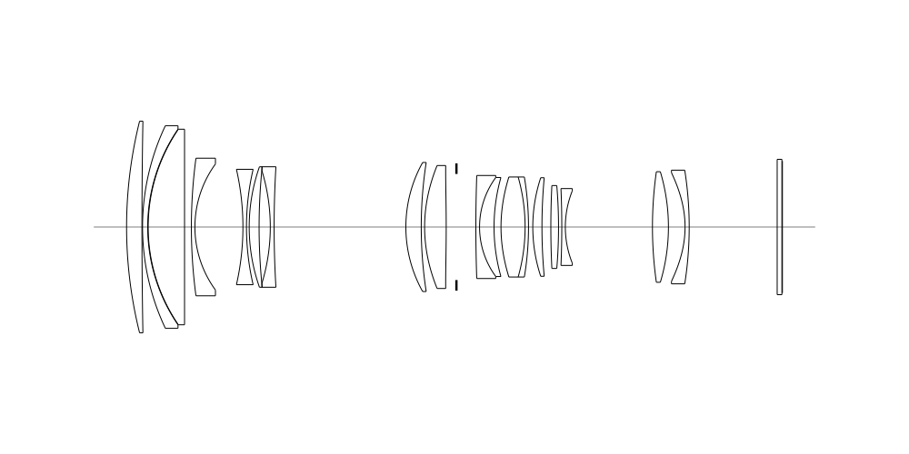
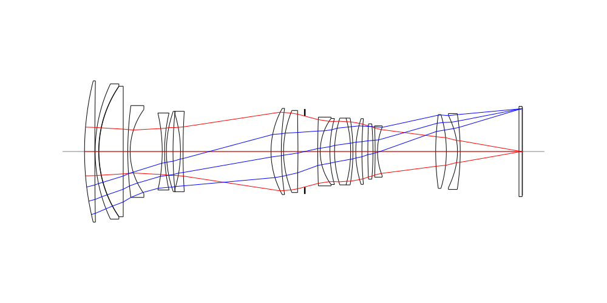
## Spot Diagrams

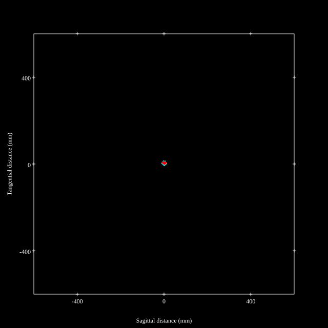
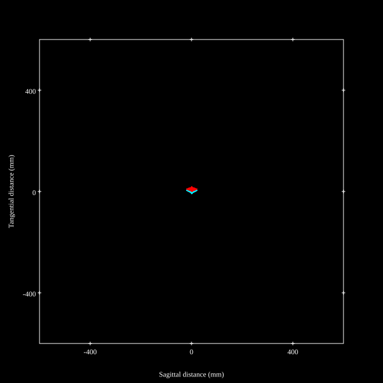
## Paraxial Parameters
| parameter | value |
| ---       | ---   |
| effective_focal_length |71.404
| back_focal_length | 0.177
| optical_invariant | 3.862
| object_distance | 1.0E10
| image_distance | 0.177
| power | 0.014
| pp1_H | 99.397
| ppk_H' | -71.227
| ffl_F | 27.993
| fno | 2.891
| enp_dist_P | 80.351
| enp_radius | 12.35
| exp_dist_P' | -97.199
| exp_radius | 16.842
| m | -0
| red | -1.400479649982913E8
| n_obj | 1
| n_img | 1
| img_ht | 22.329
| obj_ang | 17.365
| obj_na | 0
| img_na | -0.173|
## Spot Analysis
| Field | Spot Mean Radius | Spot Max Radius |
| ---   | ---              | ---             |
 | Field(x=0.0, y=0.0) | 1.653 | 4.232|
 | Field(x=0.0, y=0.1) | 1.71 | 4.794|
 | Field(x=0.0, y=0.2) | 1.952 | 5.42|
 | Field(x=0.0, y=0.3) | 2.333 | 7.797|
 | Field(x=0.0, y=0.4) | 2.828 | 9.451|
 | Field(x=0.0, y=0.5) | 3.458 | 11.387|
 | Field(x=0.0, y=0.6) | 4.207 | 14.78|
 | Field(x=0.0, y=0.7) | 4.806 | 16.124|
 | Field(x=0.0, y=0.8) | 5.27 | 15.989|
 | Field(x=0.0, y=0.9) | 5.868 | 19.213|
 | Field(x=0.0, y=1.0) | 7.178 | 23.897|
## Polychromatic Geometric MTF
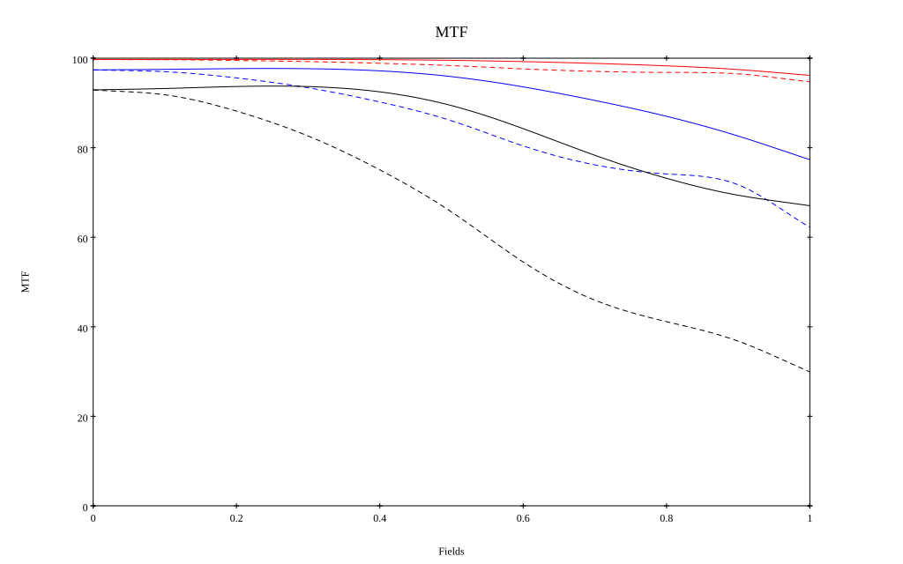
* 10=red,30=blue,50=black cycles/mm
* Solid lines represent sagittal, dashed lines tangential
* To generate above, MTFs for wavelengths 587.5618(d), 486.1327(F), 656.2725(C) were calculated across 10 fields, and then averaged
## Polychromatic Geometric MTF (Weighted)
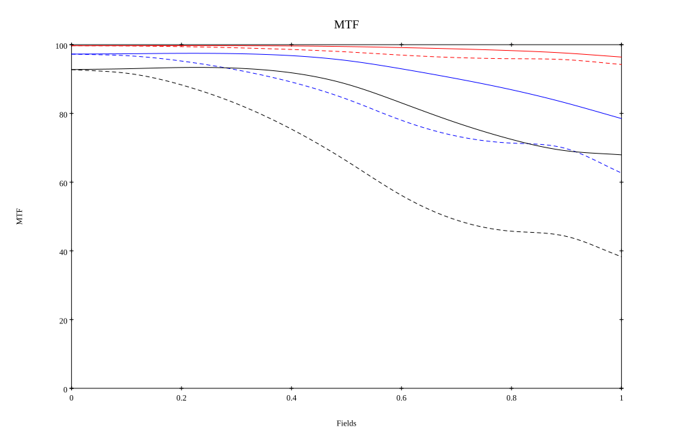
* 10=red,30=blue,50=black cycles/mm
* Solid lines represent sagittal, dashed lines tangential
* To generate above, MTFs for wavelengths 587.5618(d) wt(1.0), 656.2725(C) wt(0.475), 546.074(e) wt(0.98), 486.1327(F) wt(0.49), 435.8343(g) wt(0.15) were calculated across 10 fields, and then combined using weighted average
# 200mm f2.8
## Layouts
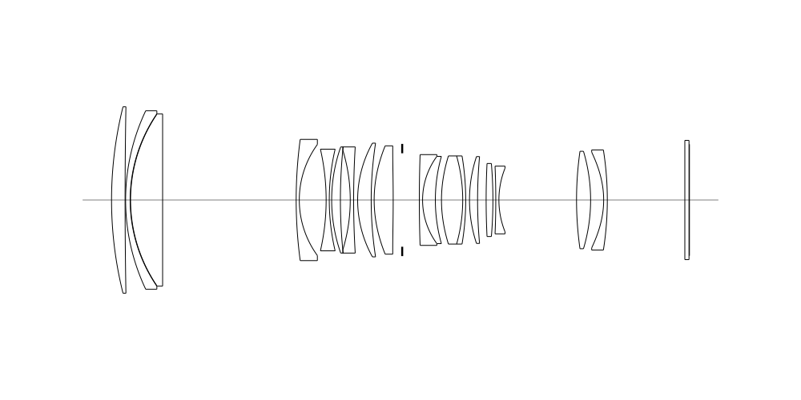
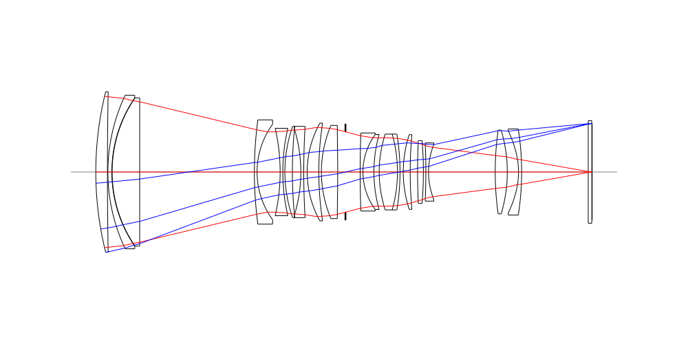
## Spot Diagrams
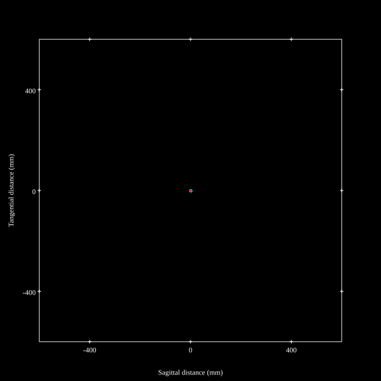

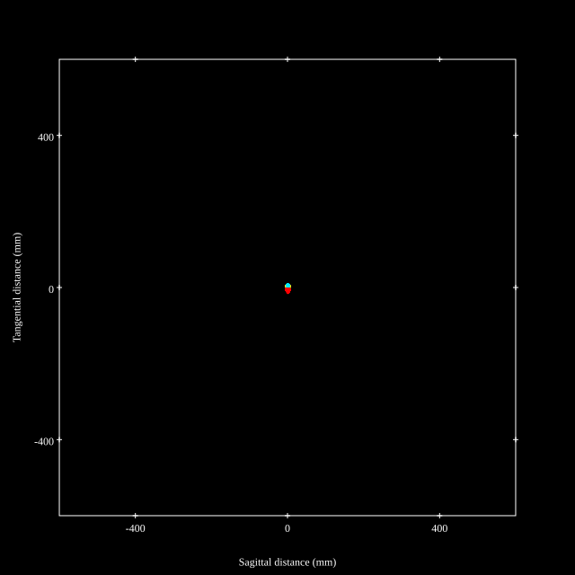
## Paraxial Parameters
| parameter | value |
| ---       | ---   |
| effective_focal_length |196.005
| back_focal_length | 0.18
| optical_invariant | 3.688
| object_distance | 1.0E10
| image_distance | 0.18
| power | 0.005
| pp1_H | 28.99
| ppk_H' | -195.825
| ffl_F | -167.015
| fno | 2.905
| enp_dist_P | 225.104
| enp_radius | 33.741
| exp_dist_P' | -97.79
| exp_radius | 16.866
| m | -0
| red | -5.1019159067068644E7
| n_obj | 1
| n_img | 1
| img_ht | 21.424
| obj_ang | 6.238
| obj_na | 0
| img_na | -0.172|
## Spot Analysis
| Field | Spot Mean Radius | Spot Max Radius |
| ---   | ---              | ---             |
 | Field(x=0.0, y=0.0) | 1.202 | 4.303|
 | Field(x=0.0, y=0.1) | 1.84 | 11.702|
 | Field(x=0.0, y=0.2) | 2.32 | 13.465|
 | Field(x=0.0, y=0.3) | 2.613 | 12.629|
 | Field(x=0.0, y=0.4) | 2.865 | 11.424|
 | Field(x=0.0, y=0.5) | 3.301 | 10.058|
 | Field(x=0.0, y=0.6) | 3.835 | 8.965|
 | Field(x=0.0, y=0.7) | 4.325 | 8.936|
 | Field(x=0.0, y=0.8) | 4.851 | 9.371|
 | Field(x=0.0, y=0.9) | 5.776 | 10.5|
 | Field(x=0.0, y=1.0) | 6.863 | 13.721|
## Polychromatic Geometric MTF
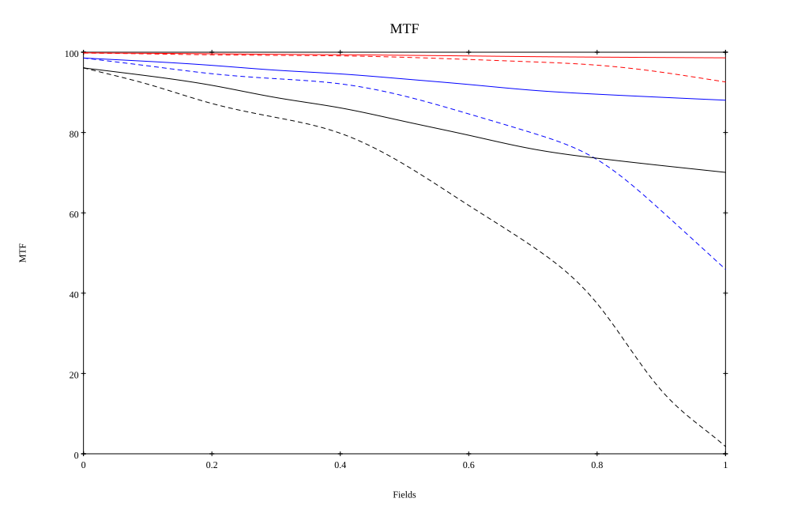
* 10=red,30=blue,50=black cycles/mm
* Solid lines represent sagittal, dashed lines tangential
* To generate above, MTFs for wavelengths 587.5618(d), 486.1327(F), 656.2725(C) were calculated across 10 fields, and then averaged
## Polychromatic Geometric MTF (Weighted)
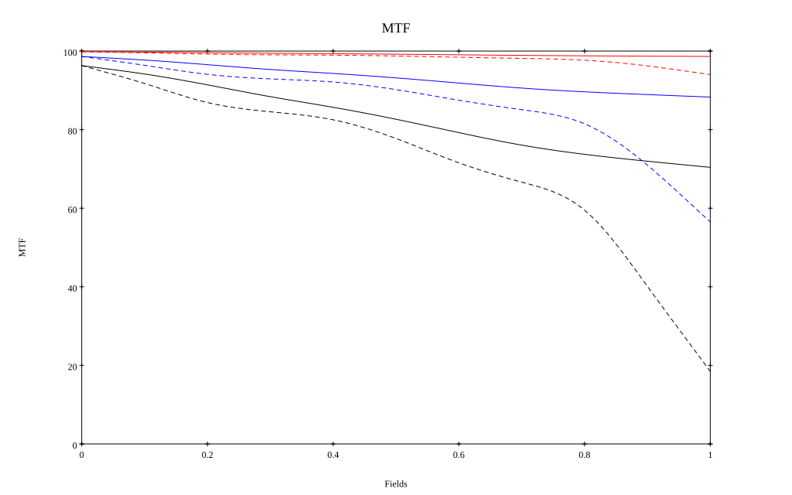
* 10=red,30=blue,50=black cycles/mm
* Solid lines represent sagittal, dashed lines tangential
* To generate above, MTFs for wavelengths 587.5618(d) wt(1.0), 656.2725(C) wt(0.475), 546.074(e) wt(0.98), 486.1327(F) wt(0.49), 435.8343(g) wt(0.15) were calculated across 10 fields, and then combined using weighted average
## Resources
* [OpticalBench Compatible Data File, tab delimited](./prescription.txt)
* [Zemax file](./WO2026-172598_Example01P.zmx)

Report / Zemax file generated using [Beam42](https://github.com/BeamFour/Beam42) on 2026-08-20
