# Nikkor 80-200mm f/2.8ED
## Surface Data
Note that where glass types are shown the refractive index and abbe number is as per assigned glass type

| ID  | Radius | Thickness | Diameter | nd  | vd  | Glass Make | Glass |
| --- | ---    | ---       | ---      | --- | --- | ---        | ---   |
| 1 | 106.671 | 3.0 | 72.89 | 1.80518 | 25.45 | Hikari | J-SF6 |
| 2 | 74.124 | 10.3 | 69.72 | 1.49782 | 82.57 | Hikari | J-FKH1 |
| 3 | -2623.0 | 0.2 | 69.72 |  |  |  |
| 4 | 103.02 | 7.2 | 67.03 | 1.49782 | 82.57 | Hikari | J-FKH1 |
| 5 | 2355.419 | d5 | 67.03 |  |  |  |
| 6 | -661.36 | 3.9 | 43.6 | 1.62588 | 35.74 | Hoya | E-F1 |
| 7 | -73.993 | 1.6 | 44.12 | 1.56384 | 60.8 | Schott | N-SK11 |
| 8 | 48.003 | 7.1 | 38.98 |  |  |  |
| 9 | -65.921 | 1.5 | 38.98 | 1.5168 | 64.13 | Hikari | J-BK7A |
| 10 | 52.925 | 4.7 | 40.24 | 1.80518 | 25.45 | Hikari | J-SF6 |
| 11 | 557.45 | 2.5 | 38.98 |  |  |  |
| 12 | -90.1 | 1.6 | 38.98 | 1.713 | 53.96 | Hikari | J-LAK8 |
| 13 | 221.989 | d13 | 41.89 |  |  |  |
| 14 | 861.84 | 4.5 | 41.04 | 1.51835 | 60.4 | Hoya | BACL3 |
| 15 | -67.73 | 0.2 | 41.04 |  |  |  |
| 16 | 104.039 | 7.5 | 40.52 | 1.56384 | 60.8 | Schott | N-SK11 |
| 17 | -52.847 | 1.8 | 40.52 | 1.75692 | 31.59 | Hikari | E-LAF11 |
| 18 | -546.069 | d18 | 40.52 |  |  |  |
| 19 | 50.319 | 5.8 | 40.96 | 1.49782 | 82.57 | Hikari | J-FKH1 |
| 20 | 885.62 | 0.2 | 40.96 |  |  |  |
| 21 | 43.598 | 6.4 | 38.92 | 1.48749 | 70.32 | Hikari | J-FK5 |
| 22 | -29900.0 | 1.8 | 38.92 | 1.80518 | 25.45 | Hikari | J-SF6 |
| 23 | 292.52 | 9.2 | 38.92 |  |  |  |
| 24 | AS | 2.2 | 28.662 |  |  |  |
| 25 | 567.53 | 1.5 | 28.5 | 1.744 | 44.8 | Hikari | J-LAF2 |
| 26 | 28.808 | 16.7 | 27.48 |  |  |  |
| 27 | 86.073 | 3.3 | 30.72 | 1.66755 | 41.87 | Hikari | J-BASF6 |
| 28 | -192.609 | d28 | 30.72 |  |  |  |
## Variables
| Variable | 80mm f2.8 | 200mm f2.8 |
| --- | --- | --- |
| Focal length |80.0 |196.0 |
| F-Number |2.88 |2.88 |
| Angle of View |30.78 |12.19 |
| d5 | 1.834 | 42.435 |
| d13 | 26.536 | 1.891 |
| d18 | 18.005 | 2.049 |
| d28 | 66.0 | 66.16 |
# 80mm f2.8
## Layouts
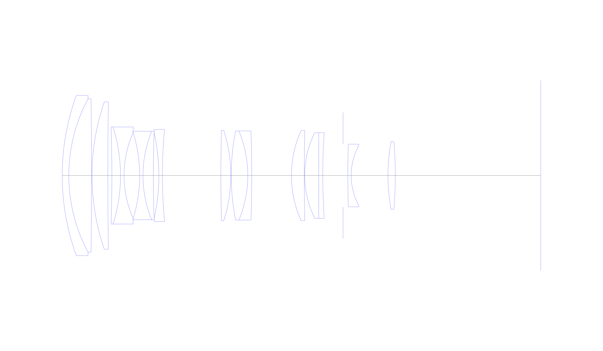

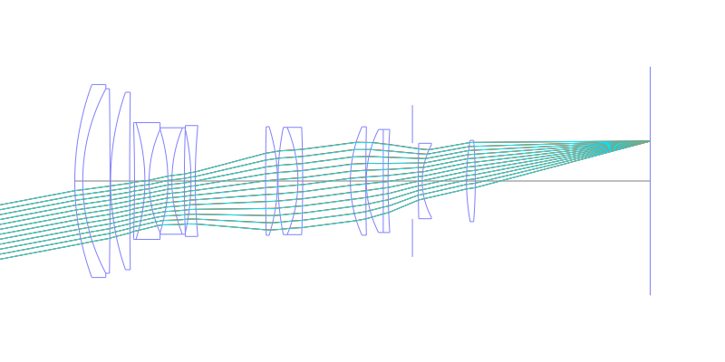

## Spot Diagrams

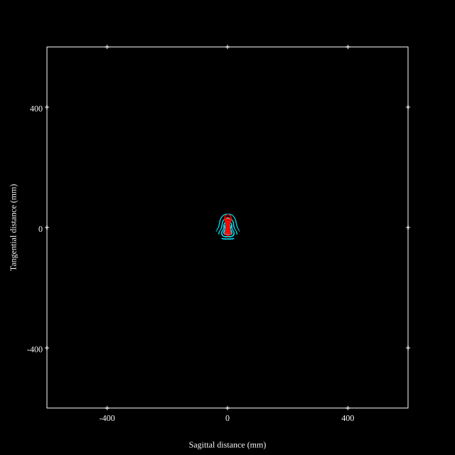
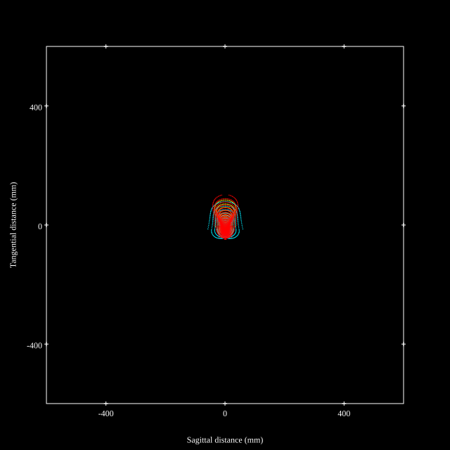
## Paraxial Parameters
| parameter | value |
| ---       | ---   |
| effective_focal_length |79.997
| back_focal_length | 66.139
| optical_invariant | 3.824
| object_distance | 1.0E10
| image_distance | 66.139
| power | 0.013
| pp1_H | 96.81
| ppk_H' | -13.858
| ffl_F | 16.814
| fno | 2.879
| enp_dist_P | 85.24
| enp_radius | 13.893
| exp_dist_P' | -27.246
| exp_radius | 16.243
| m | -0
| red | -1.2500534623373938E8
| n_obj | 1
| n_img | 1
| img_ht | 22.02
| obj_ang | 15.39
| obj_na | 0
| img_na | -0.171|
## Spot Analysis
| Field | Spot Mean Radius | Spot Max Radius |
| ---   | ---              | ---             |
 | Field(x=0.0, y=0.0) | 10.031 | 36.012|
 | Field(x=0.0, y=0.1) | 9.953 | 40.156|
 | Field(x=0.0, y=0.2) | 8.864 | 39.823|
 | Field(x=0.0, y=0.3) | 8.713 | 38.66|
 | Field(x=0.0, y=0.4) | 8.78 | 37.29|
 | Field(x=0.0, y=0.5) | 9.058 | 37.483|
 | Field(x=0.0, y=0.6) | 10.165 | 41.403|
 | Field(x=0.0, y=0.7) | 12.581 | 46.104|
 | Field(x=0.0, y=0.8) | 17.16 | 61.313|
 | Field(x=0.0, y=0.9) | 24.273 | 82.002|
 | Field(x=0.0, y=1.0) | 32.194 | 102.315|
## Polychromatic Geometric MTF
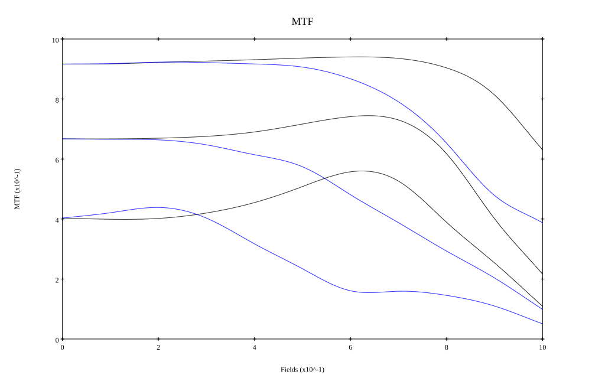
* 10,30,50 cycles/mm
* Black lines represent sagittal, blue tangential
* To generate above, MTFs for wavelengths 587.5618(d), 486.1327(F), 656.2725(C) were calculated across 10 fields, and then averaged
## Polychromatic Geometric MTF (Weighted)

* 10,30,50 cycles/mm
* Black lines represent sagittal, blue tangential
* To generate above, MTFs for wavelengths 587.5618(d) wt(1.0), 656.2725(C) wt(0.475), 546.074(e) wt(0.98), 486.1327(F) wt(0.49), 435.8343(g) wt(0.15) were calculated across 10 fields, and then combined using weighted average
# 200mm f2.8
## Layouts

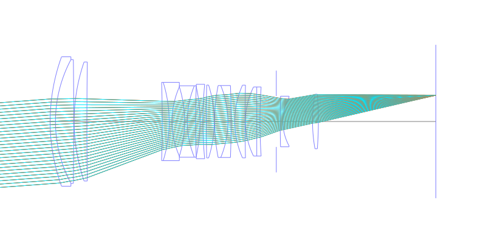
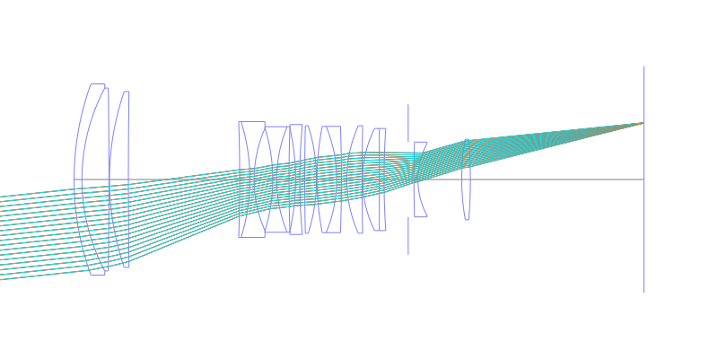
## Spot Diagrams
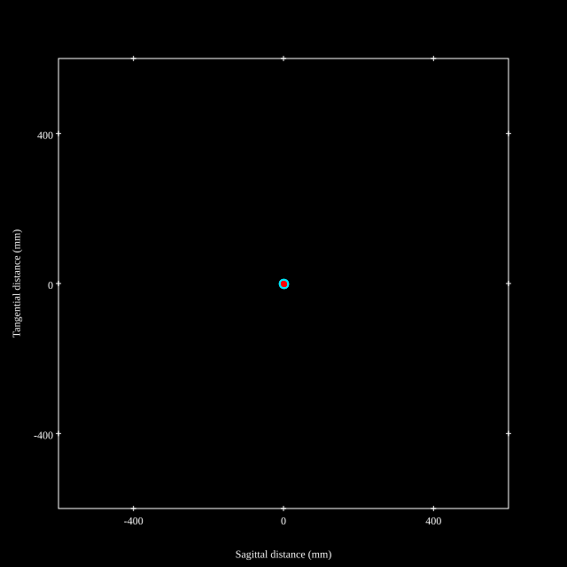
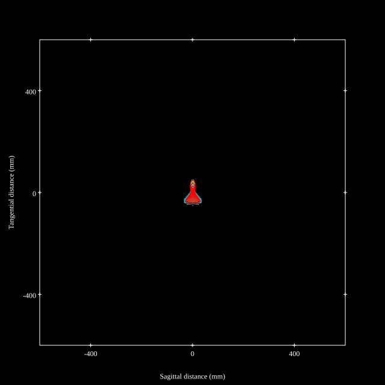
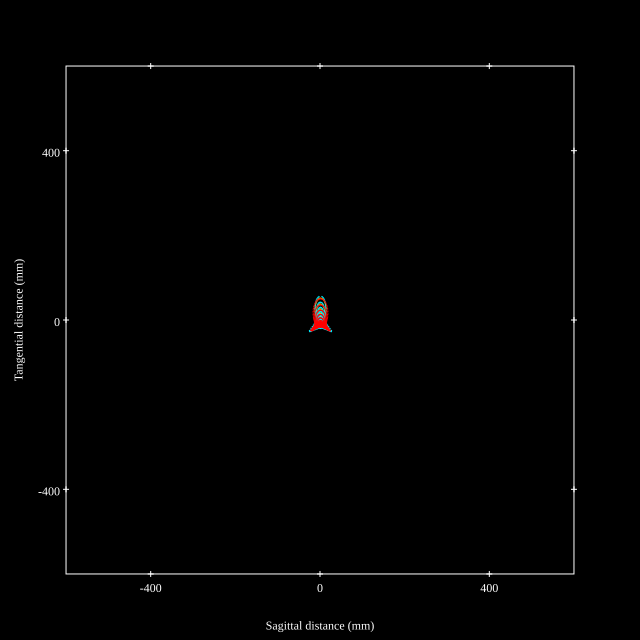
## Paraxial Parameters
| parameter | value |
| ---       | ---   |
| effective_focal_length |195.925
| back_focal_length | 66.15
| optical_invariant | 3.626
| object_distance | 1.0E10
| image_distance | 66.15
| power | 0.005
| pp1_H | 55.762
| ppk_H' | -129.775
| ffl_F | -140.162
| fno | 2.885
| enp_dist_P | 270.235
| enp_radius | 33.954
| exp_dist_P' | -27.395
| exp_radius | 16.21
| m | -0
| red | -5.1040020997932576E7
| n_obj | 1
| n_img | 1
| img_ht | 20.921
| obj_ang | 6.095
| obj_na | 0
| img_na | -0.171|
## Spot Analysis
| Field | Spot Mean Radius | Spot Max Radius |
| ---   | ---              | ---             |
 | Field(x=0.0, y=0.0) | 4.373 | 11.841|
 | Field(x=0.0, y=0.1) | 6.938 | 28.189|
 | Field(x=0.0, y=0.2) | 9.976 | 41.191|
 | Field(x=0.0, y=0.3) | 13.01 | 51.287|
 | Field(x=0.0, y=0.4) | 14.649 | 57.678|
 | Field(x=0.0, y=0.5) | 15.815 | 59.616|
 | Field(x=0.0, y=0.6) | 17.039 | 57.268|
 | Field(x=0.0, y=0.7) | 17.793 | 51.038|
 | Field(x=0.0, y=0.8) | 17.295 | 57.427|
 | Field(x=0.0, y=0.9) | 16.099 | 59.734|
 | Field(x=0.0, y=1.0) | 13.993 | 56.524|
## Polychromatic Geometric MTF
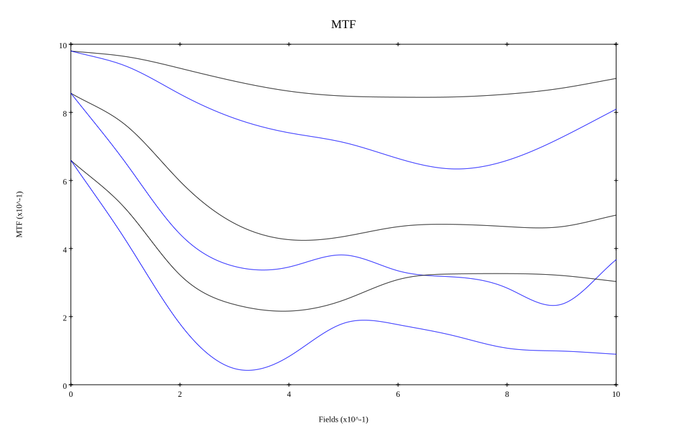
* 10,30,50 cycles/mm
* Black lines represent sagittal, blue tangential
* To generate above, MTFs for wavelengths 587.5618(d), 486.1327(F), 656.2725(C) were calculated across 10 fields, and then averaged
## Polychromatic Geometric MTF (Weighted)
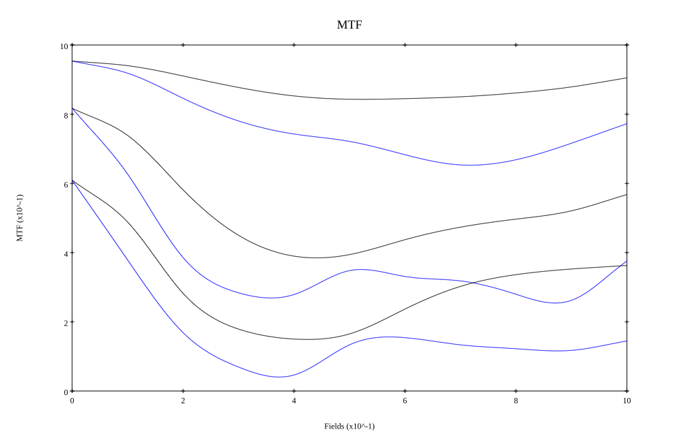
* 10,30,50 cycles/mm
* Black lines represent sagittal, blue tangential
* To generate above, MTFs for wavelengths 587.5618(d) wt(1.0), 656.2725(C) wt(0.475), 546.074(e) wt(0.98), 486.1327(F) wt(0.49), 435.8343(g) wt(0.15) were calculated across 10 fields, and then combined using weighted average
## Resources
* [OpticalBench Compatible Data File, tab delimited](./prescription.txt)
* [Zemax file](./JP1987-108218_Example03P.zmx)

Report / Zemax file generated using [Beam42](https://github.com/BeamFour/Beam42) on 2026-05-26
