# Nikkor 80-200mm f/2.8 ED
## Surface Data
Note that where glass types are shown the refractive index and abbe number is as per assigned glass type

| ID  | Radius | Thickness | Diameter | nd  | vd  | Glass Make | Glass |
| --- | ---    | ---       | ---      | --- | --- | ---        | ---   |
| 1 | 97.0939 | 3.8 | 71.5 | 1.805182 | 25.41 |  |
| 2 | 72.6165 | 10.4 | 71.2 | 1.49782 | 82.52 |  |
| 3 | 268.0849 | 0.1 | 71.2 |  |  |  |
| 4 | 157.7721 | 5.3 | 69.92 | 1.49782 | 82.52 |  |
| 5 | 894.9563 | d5 | 69.92 |  |  |  |
| 6 | 50.7516 | 2.2 | 56.0 | 1.84666 | 23.82 |  |
| 7 | 44.4939 | 1.81 | 54.55 |  |  |  |
| 8 | 53.1452 | 9.0 | 54.55 | 1.48749 | 70.41 |  |
| 9 | 17654.599 | d9 | 54.55 |  |  |  |
| 10 | 365.8054 | 1.5 | 34.8 | 1.796681 | 45.37 |  |
| 11 | 33.8586 | 7.52 | 34.08 |  |  |  |
| 12 | -51.2952 | 1.8 | 34.08 | 1.48749 | 70.41 |  |
| 13 | 45.0578 | 6.0 | 35.62 | 1.84666 | 23.82 |  |
| 14 | -287.2535 | 2.11 | 34.17 |  |  |  |
| 15 | -60.5102 | 1.8 | 34.17 | 1.796681 | 45.37 |  |
| 16 | 8969.214 | d16 | 37.14 |  |  |  |
| 17 | 165.9894 | 4.5 | 36.8 | 1.49782 | 82.52 |  |
| 18 | -106.8038 | 0.2 | 38.68 |  |  |  |
| 19 | 772.1751 | 7.1 | 38.68 | 1.49782 | 82.52 |  |
| 20 | -40.2253 | 2.0 | 39.7 | 1.744 | 45.0 |  |
| 21 | -100.1483 | d21 | 39.7 |  |  |  |
| 22 | AS | 1.0 | a22 |  |  |  |
| 23 | 78.6671 | 3.5 | 40.48 | 1.787971 | 47.47 |  |
| 24 | 216.2251 | 0.2 | 40.48 |  |  |  |
| 25 | 39.9627 | 6.0 | 39.2 | 1.49782 | 82.52 |  |
| 26 | 168.823 | 4.4 | 38.18 | 1.62004 | 36.27 |  |
| 27 | 38.2994 | 30.5 | 34.58 |  |  |  |
| 28 | 272.261 | 5.0 | 34.34 | 1.531721 | 48.97 |  |
| 29 | -62.3609 | 14.8 | 34.34 |  |  |  |
| 30 | -36.5028 | 1.9 | 34.08 | 1.80384 | 33.89 |  |
| 31 | -160.6086 | 0.2 | 36.12 |  |  |  |
| 32 | 137.3427 | 4.6 | 37.92 | 1.772789 | 49.45 |  |
| 33 | -111.8713 | d33 | 37.92 |  |  |  |
## Variables
| Variable | 80mm f2.8 | 200mm f2.8 |
| --- | --- | --- |
| Focal length |81.55 |194.0 |
| F-Number |2.88 |2.88 |
| Angle of View |30.81 |12.41 |
| d5 | 17.08501 | 17.08501 |
| d9 | 1.99906 | 22.87155 |
| d16 | 32.0553 | 1.61457 |
| d21 | 3.43076 | 12.99901 |
| a22 | 38.414 | 38.032 |
| d33 | 57.01947 | 57.01947 |
# 80mm f2.8
## Layouts
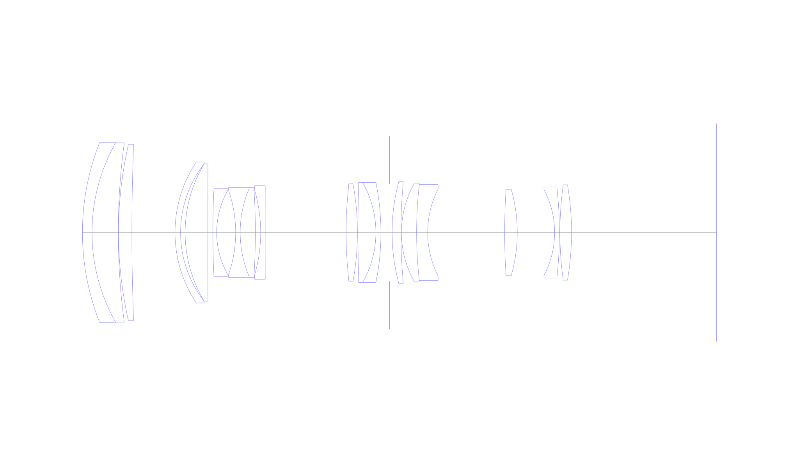
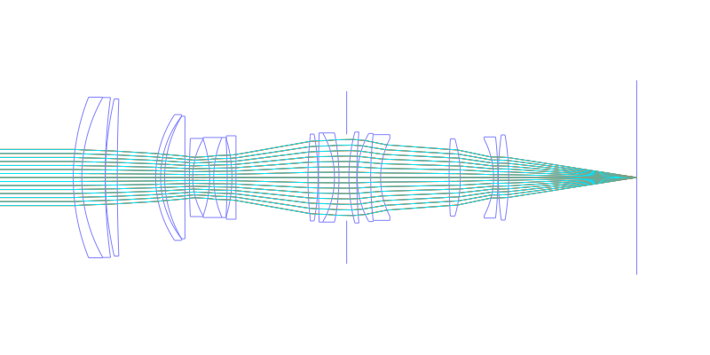
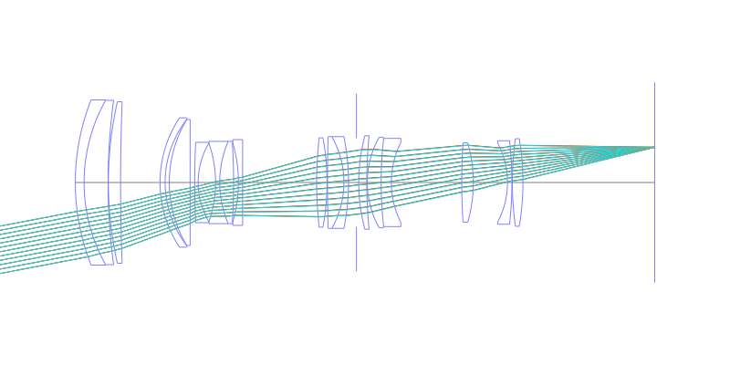
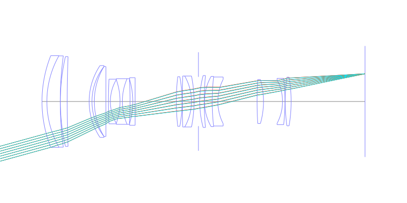
## Spot Diagrams

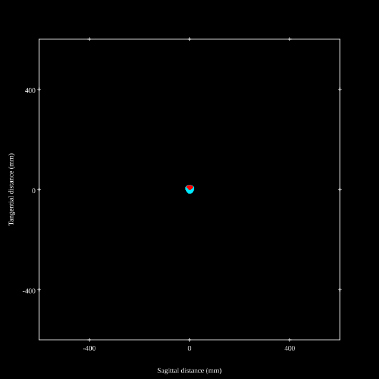
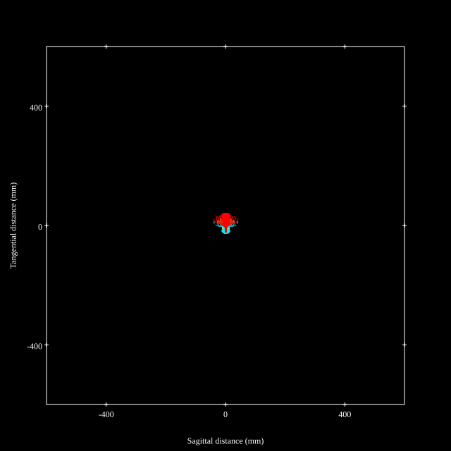
## Paraxial Parameters
| parameter | value |
| ---       | ---   |
| effective_focal_length |81.55
| back_focal_length | 57.02
| optical_invariant | 3.902
| object_distance | 1.0E10
| image_distance | 57.02
| power | 0.012
| pp1_H | 149.964
| ppk_H' | -24.53
| ffl_F | 68.414
| fno | 2.88
| enp_dist_P | 118.663
| enp_radius | 14.16
| exp_dist_P' | -75.328
| exp_radius | 22.98
| m | -0
| red | -1.2262427685248473E8
| n_obj | 1
| n_img | 1
| img_ht | 22.47
| obj_ang | 15.405
| obj_na | 0
| img_na | -0.171|
## Spot Analysis
| Field | Spot Mean Radius | Spot Max Radius |
| ---   | ---              | ---             |
 | Field(x=0.0, y=0.0) | 9.485 | 19.488|
 | Field(x=0.0, y=0.1) | 9.432 | 21.234|
 | Field(x=0.0, y=0.2) | 9.823 | 21.611|
 | Field(x=0.0, y=0.3) | 10.606 | 21.419|
 | Field(x=0.0, y=0.4) | 11.409 | 22.126|
 | Field(x=0.0, y=0.5) | 11.919 | 22.814|
 | Field(x=0.0, y=0.6) | 12.064 | 23.015|
 | Field(x=0.0, y=0.7) | 11.802 | 22.611|
 | Field(x=0.0, y=0.8) | 11.675 | 23.536|
 | Field(x=0.0, y=0.9) | 13.395 | 34.87|
 | Field(x=0.0, y=1.0) | 16.741 | 47.06|
## Polychromatic Geometric MTF
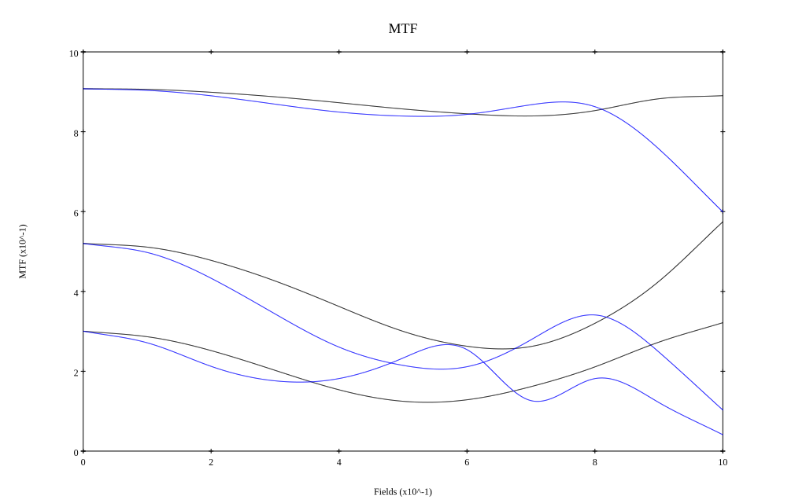
* 10,30,50 cycles/mm
* Black lines represent sagittal, blue tangential
* To generate above, MTFs for wavelengths 587.5618(d), 486.1327(F), 656.2725(C) were calculated across 10 fields, and then averaged
## Polychromatic Geometric MTF (Weighted)
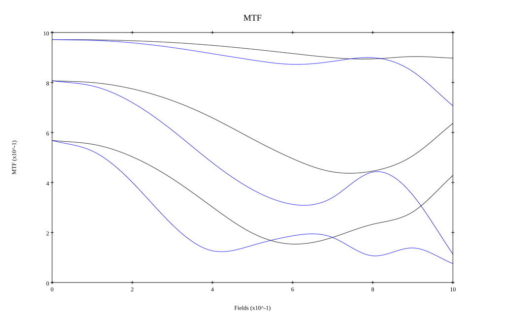
* 10,30,50 cycles/mm
* Black lines represent sagittal, blue tangential
* To generate above, MTFs for wavelengths 587.5618(d) wt(1.0), 656.2725(C) wt(0.475), 546.074(e) wt(0.98), 486.1327(F) wt(0.49), 435.8343(g) wt(0.15) were calculated across 10 fields, and then combined using weighted average
# 200mm f2.8
## Layouts
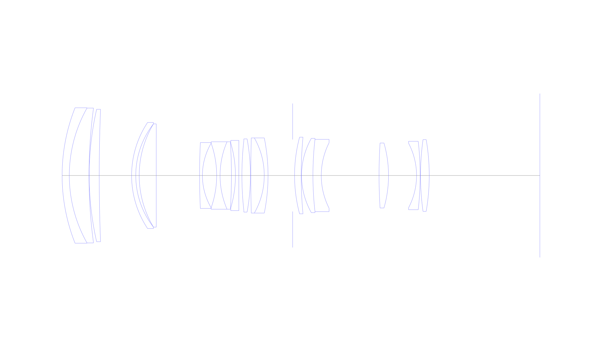
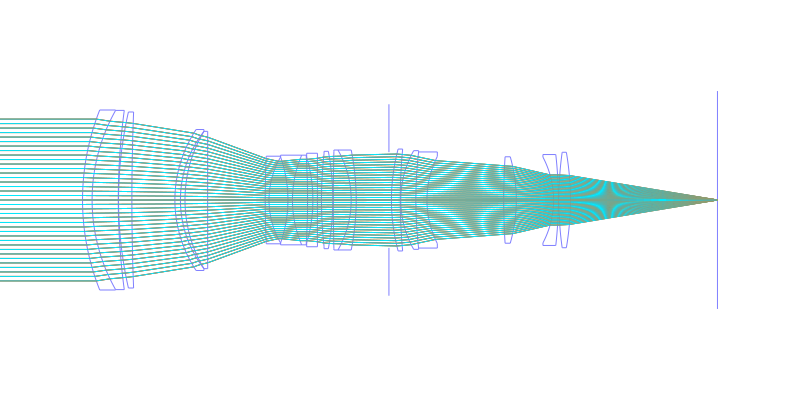
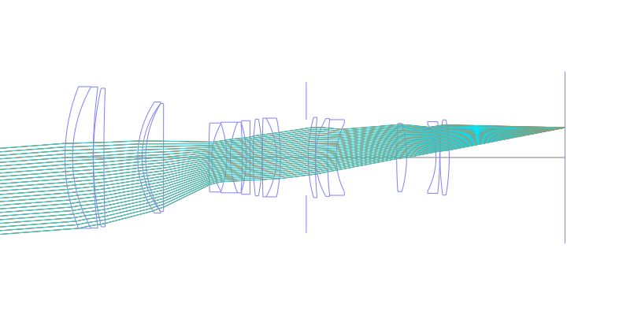
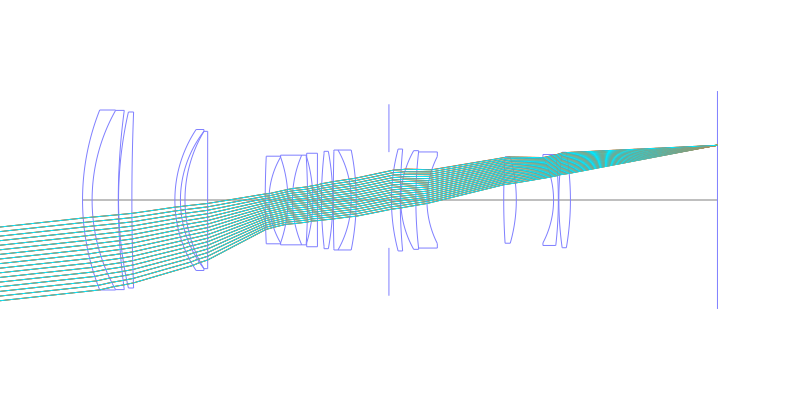
## Spot Diagrams
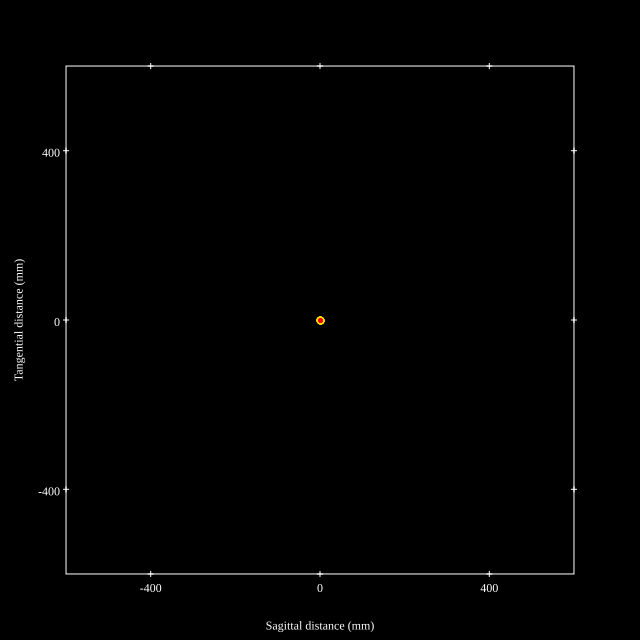
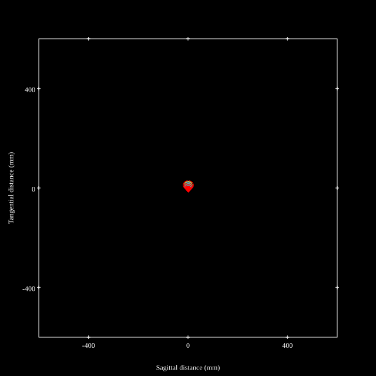
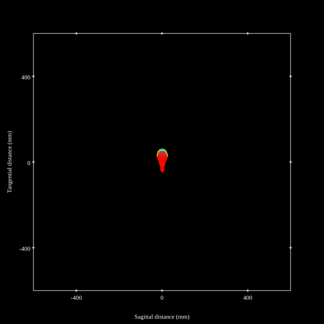
## Paraxial Parameters
| parameter | value |
| ---       | ---   |
| effective_focal_length |196
| back_focal_length | 57.02
| optical_invariant | 3.662
| object_distance | 1.0E10
| image_distance | 57.02
| power | 0.005
| pp1_H | 158.455
| ppk_H' | -138.98
| ffl_F | -37.545
| fno | 2.91
| enp_dist_P | 252.719
| enp_radius | 33.68
| exp_dist_P' | -75.328
| exp_radius | 22.742
| m | -0
| red | -5.102041950812158E7
| n_obj | 1
| n_img | 1
| img_ht | 21.31
| obj_ang | 6.205
| obj_na | 0
| img_na | -0.169|
## Spot Analysis
| Field | Spot Mean Radius | Spot Max Radius |
| ---   | ---              | ---             |
 | Field(x=0.0, y=0.0) | 10.954 | 19.968|
 | Field(x=0.0, y=0.1) | 11.434 | 22.262|
 | Field(x=0.0, y=0.2) | 12.437 | 25.639|
 | Field(x=0.0, y=0.3) | 14.167 | 33.67|
 | Field(x=0.0, y=0.4) | 15.741 | 44.467|
 | Field(x=0.0, y=0.5) | 15.965 | 47.133|
 | Field(x=0.0, y=0.6) | 14.889 | 44.976|
 | Field(x=0.0, y=0.7) | 12.701 | 37.158|
 | Field(x=0.0, y=0.8) | 11.216 | 28.637|
 | Field(x=0.0, y=0.9) | 15.306 | 42.773|
 | Field(x=0.0, y=1.0) | 25.888 | 58.491|
## Polychromatic Geometric MTF
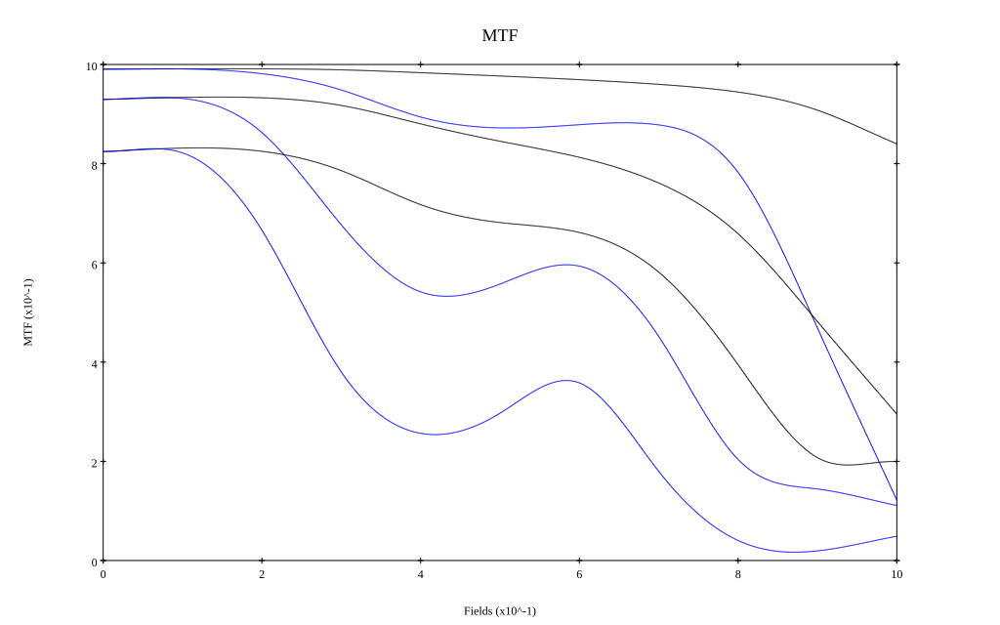
* 10,30,50 cycles/mm
* Black lines represent sagittal, blue tangential
* To generate above, MTFs for wavelengths 587.5618(d), 486.1327(F), 656.2725(C) were calculated across 10 fields, and then averaged
## Polychromatic Geometric MTF (Weighted)
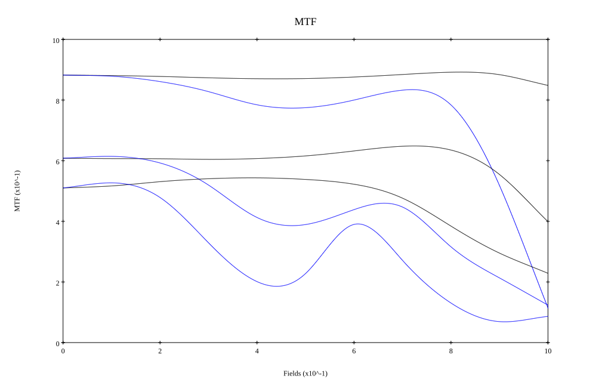
* 10,30,50 cycles/mm
* Black lines represent sagittal, blue tangential
* To generate above, MTFs for wavelengths 587.5618(d) wt(1.0), 656.2725(C) wt(0.475), 546.074(e) wt(0.98), 486.1327(F) wt(0.49), 435.8343(g) wt(0.15) were calculated across 10 fields, and then combined using weighted average
## Resources
* [OpticalBench Compatible Data File, tab delimited](./prescription.txt)
* [Zemax file](./JP2000-019398_Example01_Tale67.zmx)

Report / Zemax file generated using [Beam42](https://github.com/BeamFour/Beam42) on 2026-06-02
