# Nikkor 80-200mm f/2.8ED
## Surface Data
Note that where glass types are shown the refractive index and abbe number is as per assigned glass type

| ID  | Radius | Thickness | Diameter | nd  | vd  | Glass Make | Glass |
| --- | ---    | ---       | ---      | --- | --- | ---        | ---   |
| 1 | 164.0 | 2.7 | 71.71 | 1.7552 | 27.58 | Schott | SF4 |
| 2 | 105.11 | 10.5 | 71.71 | 1.50032 | 81.9 | Hikari | PC102 |
| 3 | -425.427 | 0.2 | 71.71 |  |  |  |
| 4 | 160.0 | 5.0 | 69.09 | 1.50032 | 81.9 | Hikari | PC102 |
| 5 | 405.897 | d5 | 69.09 |  |  |  |
| 6 | -300.0 | 1.6 | 47.6 | 1.788 | 47.49 | Schott | N-LAF21 |
| 7 | 80.9 | 9.0 | 44.92 | 1.7552 | 27.58 | Schott | SF4 |
| 8 | -66.99 | 1.45 | 44.92 | 1.58144 | 40.85 | Schott | LF5 |
| 9 | 90.0 | 6.6 | 40.6 |  |  |  |
| 10 | -80.0 | 1.8 | 40.2 | 1.58913 | 61.22 | Hikari | J-SK5 |
| 11 | 346.871 | d11 | 40.2 |  |  |  |
| 12 | 200.0 | 7.0 | 41.6 | 1.67 | 57.35 | Hikari | J-LAK02 |
| 13 | -65.0 | 1.45 | 41.6 | 1.80518 | 25.45 | Hikari | J-SF6 |
| 14 | -149.342 | d14 | 41.6 |  |  |  |
| 15 | AS | 2.39 | a15 |  |  |  |
| 16 | 41.2 | 6.0 | 41.6 | 1.788 | 47.49 | Schott | N-LAF21 |
| 17 | 158.55 | 6.0 | 41.6 |  |  |  |
| 18 | -206.77 | 4.5 | 37.8 | 1.788 | 47.49 | Schott | N-LAF21 |
| 19 | -80.9 | 1.5 | 37.8 |  |  |  |
| 20 | -78.547 | 2.0 | 35.2 | 1.7552 | 27.58 | Schott | SF4 |
| 21 | 147.06 | 19.0 | 35.2 |  |  |  |
| 22 | 260.0 | 3.5 | 27.92 | 1.63854 | 55.48 | Hikari | SK18 |
| 23 | -299.3 | 22.7 | 27.92 |  |  |  |
| 24 | -24.38 | 3.0 | 29.26 | 1.713 | 53.96 | Hikari | J-LAK8 |
| 25 | -48.971 | 0.2 | 33.6 |  |  |  |
| 26 | 77.0 | 4.5 | 34.92 | 1.61293 | 37.04 | Schott | F3 |
| 27 | -295.287 | d27 | 34.92 |  |  |  |
## Variables
| Variable | 80mm f2.8 | 200mm f2.8 |
| --- | --- | --- |
| Focal length |80.0 |200.0 |
| F-Number |2.8 |2.8 |
| Angle of View |31.24 |12.14 |
| d5 | 4.2245 | 69.772 |
| d11 | 50.425 | 0.8618 |
| d14 | 22.928 | 6.944 |
| a15 | 41.181 | 41.146 |
| d27 | 40.54 | 40.54 |
# 80mm f2.8
## Layouts
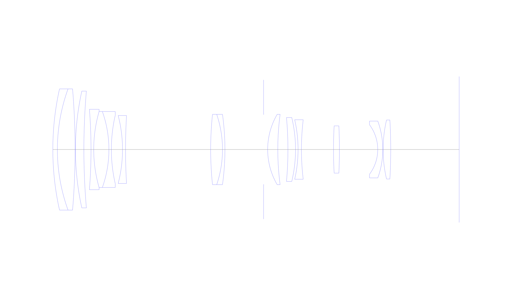
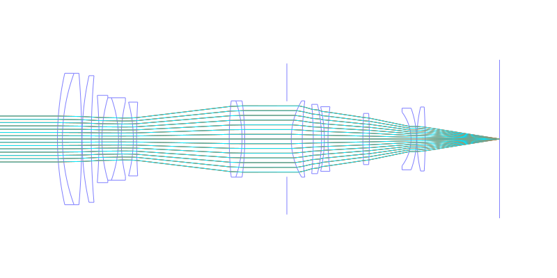
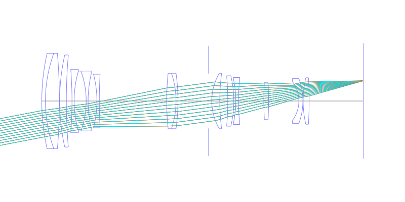
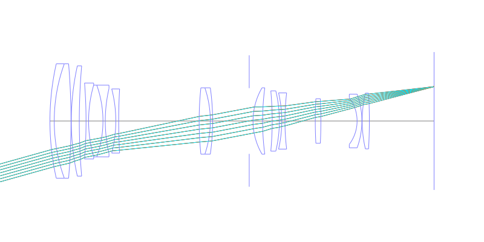
## Spot Diagrams
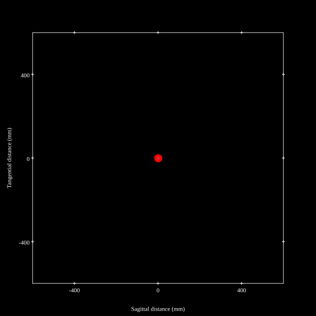
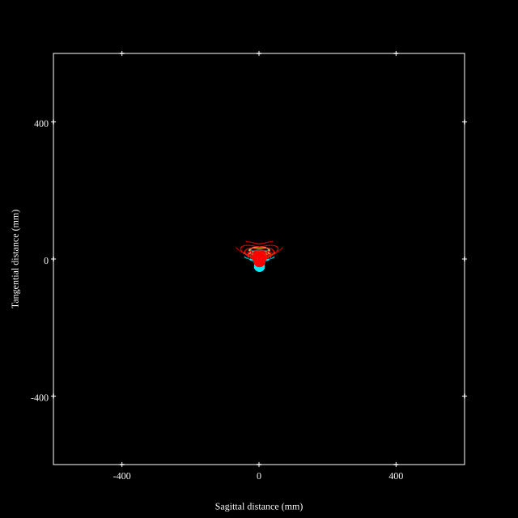
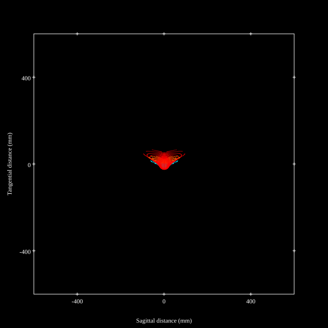
## Paraxial Parameters
| parameter | value |
| ---       | ---   |
| effective_focal_length |80.033
| back_focal_length | 40.698
| optical_invariant | 3.993
| object_distance | 1.0E10
| image_distance | 40.698
| power | 0.012
| pp1_H | 105.264
| ppk_H' | -39.335
| ffl_F | 25.231
| fno | 2.802
| enp_dist_P | 86.562
| enp_radius | 14.282
| exp_dist_P' | -63.582
| exp_radius | 18.637
| m | -0
| red | -1.2494827258334088E8
| n_obj | 1
| n_img | 1
| img_ht | 22.376
| obj_ang | 15.62
| obj_na | 0
| img_na | -0.176|
## Spot Analysis
| Field | Spot Mean Radius | Spot Max Radius |
| ---   | ---              | ---             |
 | Field(x=0.0, y=0.0) | 9.607 | 17.164|
 | Field(x=0.0, y=0.1) | 10.866 | 38.92|
 | Field(x=0.0, y=0.2) | 11.847 | 39.52|
 | Field(x=0.0, y=0.3) | 13.243 | 45.857|
 | Field(x=0.0, y=0.4) | 14.842 | 53.847|
 | Field(x=0.0, y=0.5) | 16.695 | 63.746|
 | Field(x=0.0, y=0.6) | 17.646 | 67.37|
 | Field(x=0.0, y=0.7) | 19.074 | 75.007|
 | Field(x=0.0, y=0.8) | 20.144 | 83.598|
 | Field(x=0.0, y=0.9) | 23.122 | 92.171|
 | Field(x=0.0, y=1.0) | 27.579 | 106.449|
## Polychromatic Geometric MTF
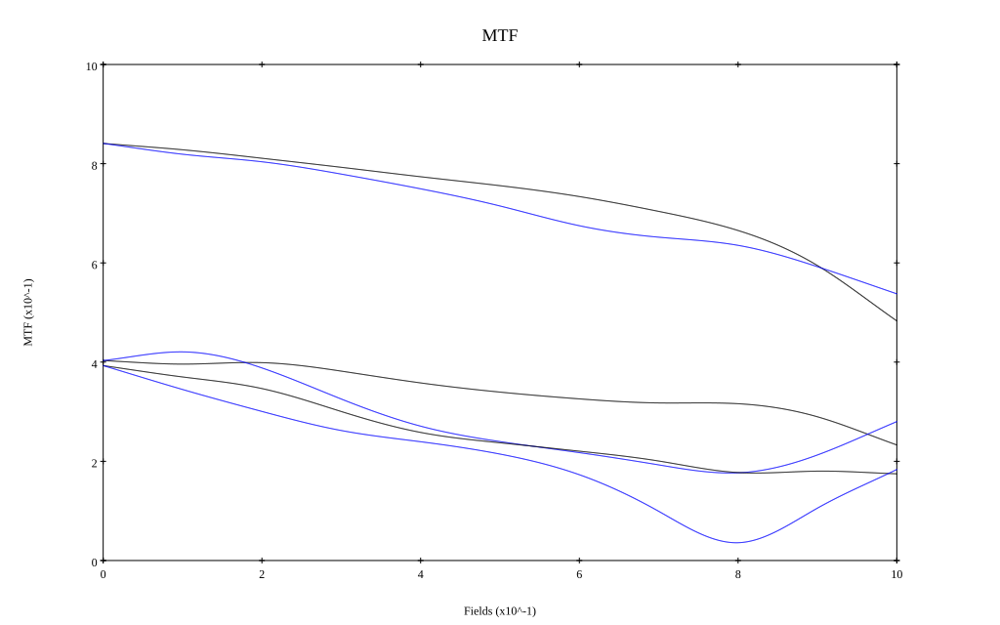
* 10,30,50 cycles/mm
* Black lines represent sagittal, blue tangential
* To generate above, MTFs for wavelengths 587.5618(d), 486.1327(F), 656.2725(C) were calculated across 10 fields, and then averaged
## Polychromatic Geometric MTF (Weighted)
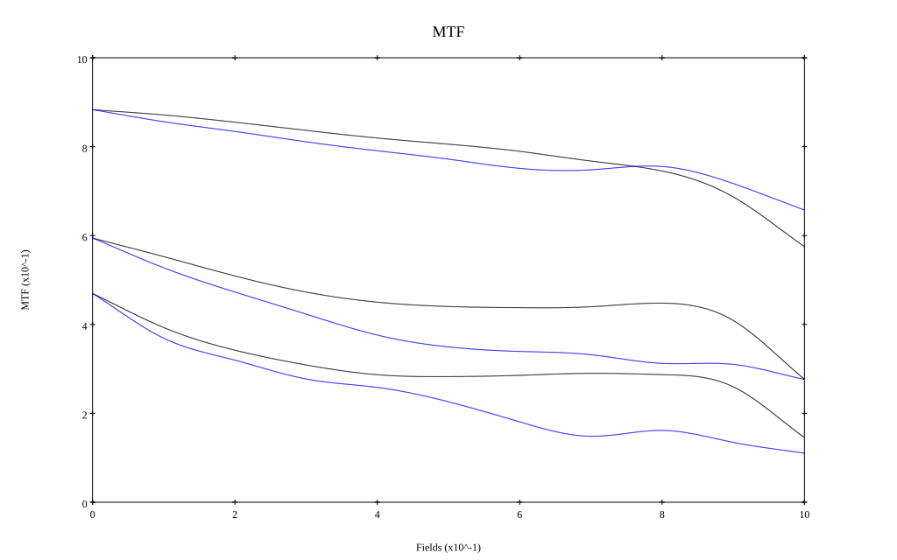
* 10,30,50 cycles/mm
* Black lines represent sagittal, blue tangential
* To generate above, MTFs for wavelengths 587.5618(d) wt(1.0), 656.2725(C) wt(0.475), 546.074(e) wt(0.98), 486.1327(F) wt(0.49), 435.8343(g) wt(0.15) were calculated across 10 fields, and then combined using weighted average
# 200mm f2.8
## Layouts
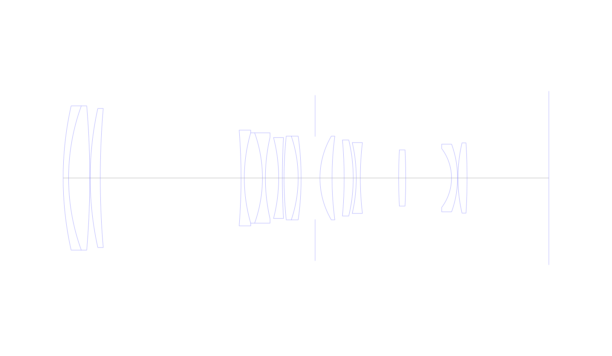
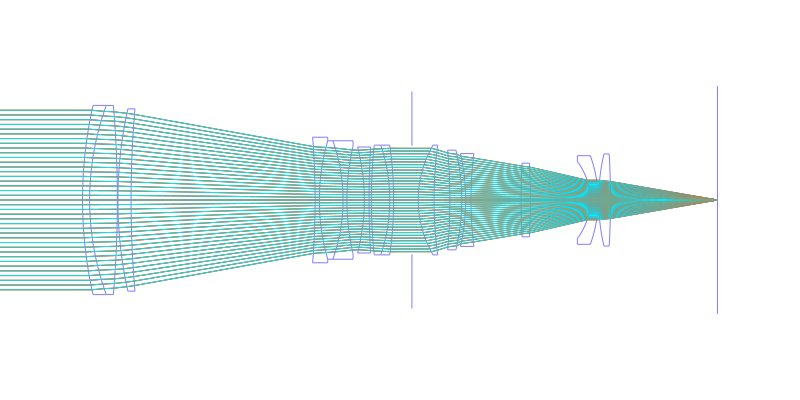
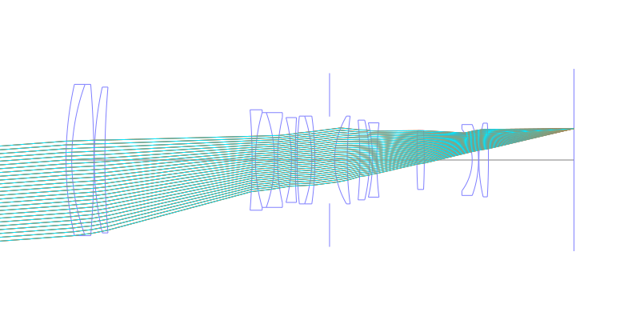
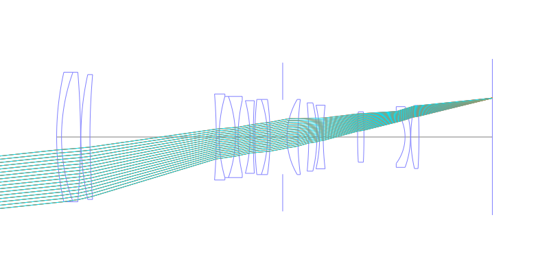
## Spot Diagrams
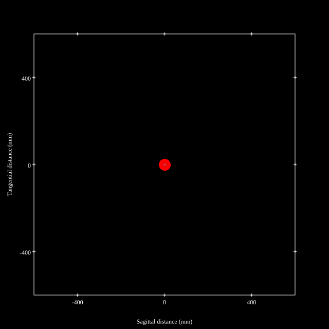
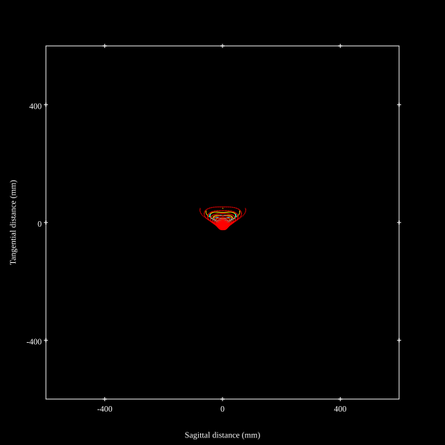

## Paraxial Parameters
| parameter | value |
| ---       | ---   |
| effective_focal_length |200.109
| back_focal_length | 40.702
| optical_invariant | 3.797
| object_distance | 1.0E10
| image_distance | 40.702
| power | 0.005
| pp1_H | 37.274
| ppk_H' | -159.407
| ffl_F | -162.835
| fno | 2.802
| enp_dist_P | 220.567
| enp_radius | 35.711
| exp_dist_P' | -63.578
| exp_radius | 18.638
| m | -0
| red | -4.997278040022623E7
| n_obj | 1
| n_img | 1
| img_ht | 21.28
| obj_ang | 6.07
| obj_na | 0
| img_na | -0.176|
## Spot Analysis
| Field | Spot Mean Radius | Spot Max Radius |
| ---   | ---              | ---             |
 | Field(x=0.0, y=0.0) | 12.152 | 25.174|
 | Field(x=0.0, y=0.1) | 13.897 | 46.254|
 | Field(x=0.0, y=0.2) | 15.782 | 55.721|
 | Field(x=0.0, y=0.3) | 16.929 | 61.69|
 | Field(x=0.0, y=0.4) | 17.849 | 66.424|
 | Field(x=0.0, y=0.5) | 18.632 | 77.927|
 | Field(x=0.0, y=0.6) | 19.22 | 86.117|
 | Field(x=0.0, y=0.7) | 19.835 | 91.053|
 | Field(x=0.0, y=0.8) | 20.528 | 89.572|
 | Field(x=0.0, y=0.9) | 21.42 | 84.449|
 | Field(x=0.0, y=1.0) | 18.98 | 70.805|
## Polychromatic Geometric MTF
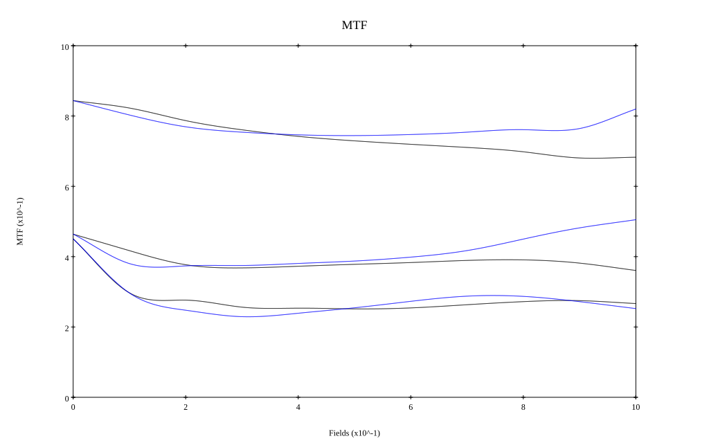
* 10,30,50 cycles/mm
* Black lines represent sagittal, blue tangential
* To generate above, MTFs for wavelengths 587.5618(d), 486.1327(F), 656.2725(C) were calculated across 10 fields, and then averaged
## Polychromatic Geometric MTF (Weighted)
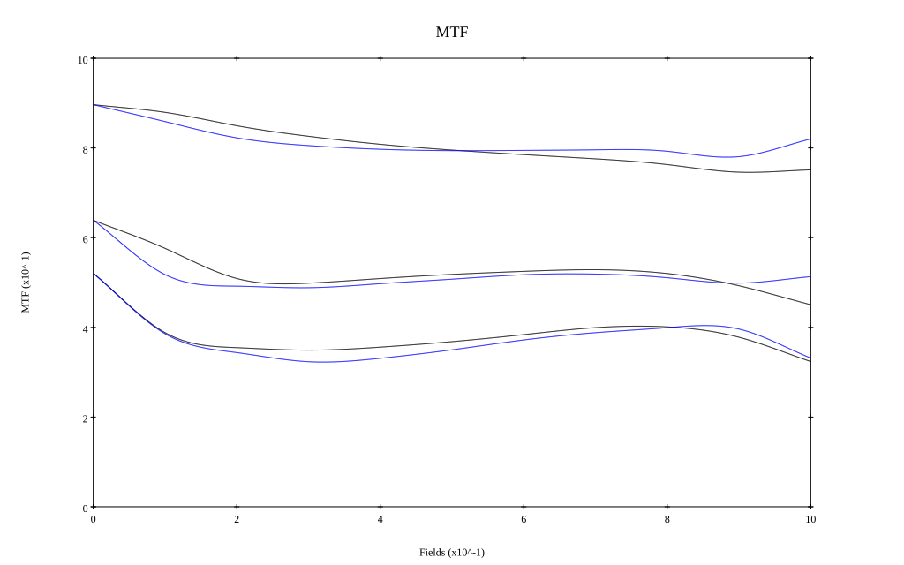
* 10,30,50 cycles/mm
* Black lines represent sagittal, blue tangential
* To generate above, MTFs for wavelengths 587.5618(d) wt(1.0), 656.2725(C) wt(0.475), 546.074(e) wt(0.98), 486.1327(F) wt(0.49), 435.8343(g) wt(0.15) were calculated across 10 fields, and then combined using weighted average
## Resources
* [OpticalBench Compatible Data File, tab delimited](./prescription.txt)
* [Zemax file](./US004468097_Example02.zmx)

Report / Zemax file generated using [Beam42](https://github.com/BeamFour/Beam42) on 2026-05-26
