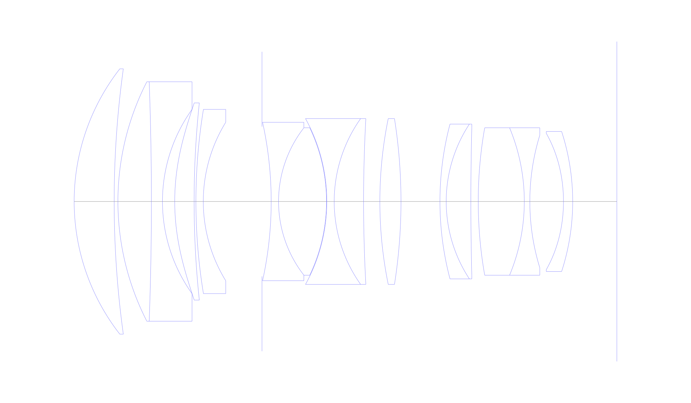
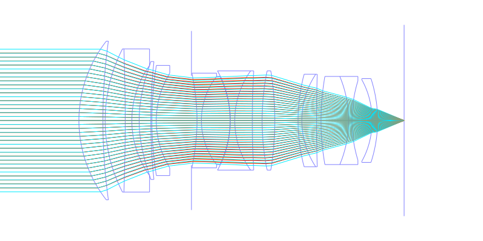
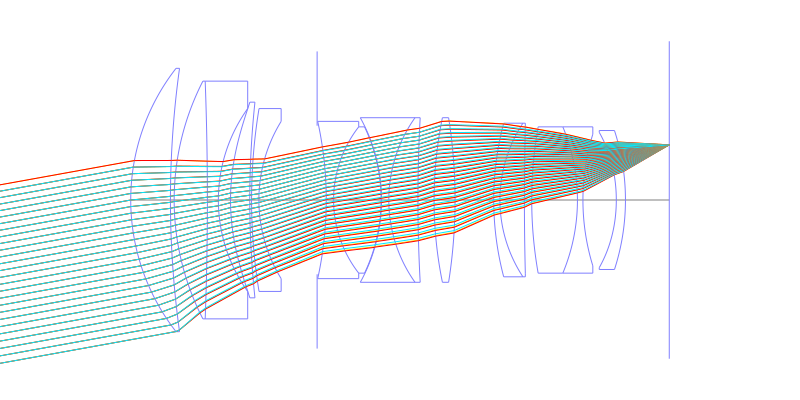
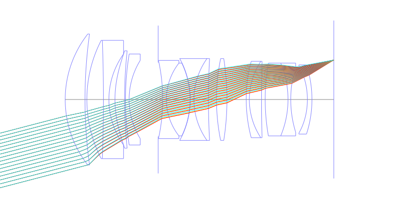
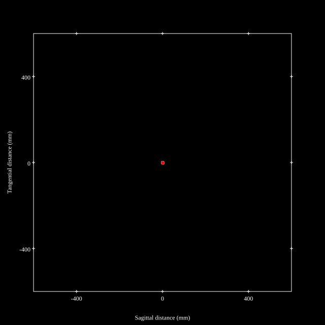
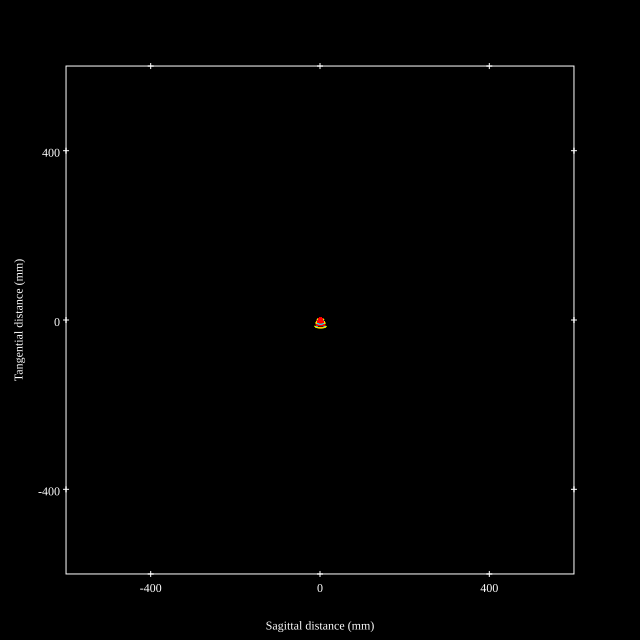
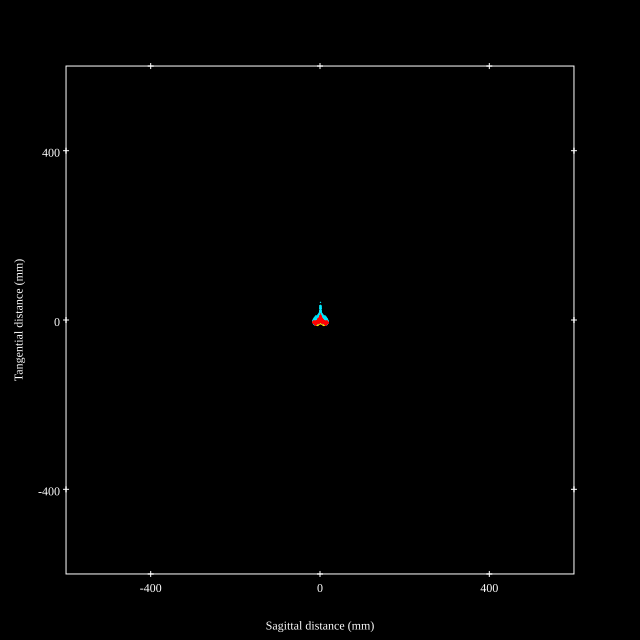
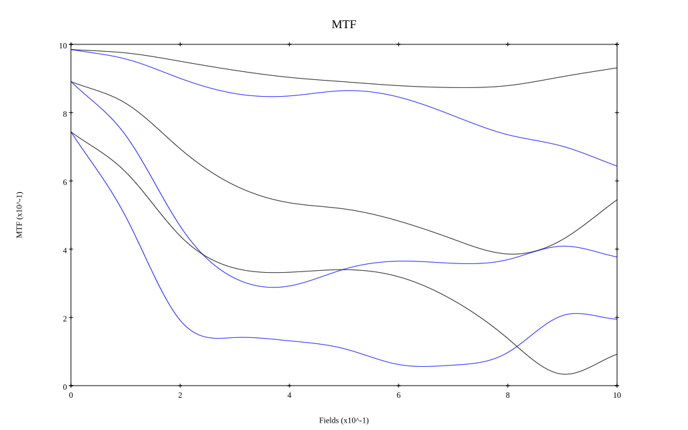
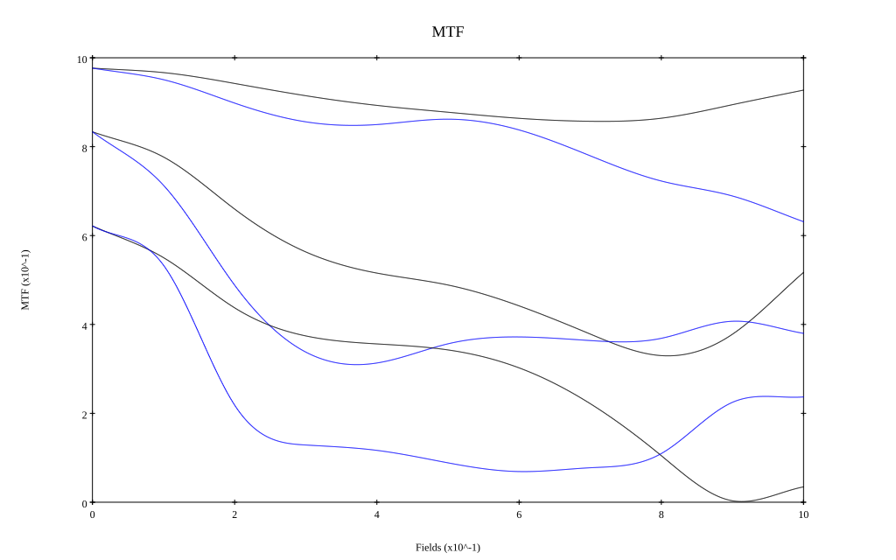

## Surface Data
Note that where glass types are shown the refractive index and abbe number is as per assigned glass type

| ID  | Radius | Thickness | Diameter | nd  | vd  | Glass Make | Glass |
| --- | ---    | ---       | ---      | --- | --- | ---        | ---   |
| 1 | 58.5212 | 10.855 | 72.0 | 1.92286 | 20.88 | Hoya | E-FDS1 |
| 2 | 261.9967 | 1.02 | 72.0 |  |  |  |
| 3 | 71.1971 | 9.084 | 65.0 | 1.59319 | 67.9 | Hikari | J-PSKH1 |
| 4 | -878.2122 | 3.0 | 65.0 | 1.84666 | 23.8 | Hikari | J-SF03 |
| 5 | 42.9748 | 3.325 | 50.0 |  |  |  |
| 6 | 60.5565 | 5.263 | 53.5 | 1.6993 | 51.11 | Ohara | S-LAL20 |
| 7 | 253.7786 | 0.49 | 53.5 |  |  |  |
| 8 | 154.1691 | 2.0 | 50.0 | 1.59319 | 67.9 | Hikari | J-PSKH1 |
| 9 | 40.9973 | 15.925 | 43.0 |  |  |  |
| 10 | AS | 2.498 | 40.6266 |  |  |  |
| 11 | -99.9831 | 2.0 | 43.0 | 1.84666 | 23.8 | Hikari | J-SF03 |
| 12 | 32.5394 | 13.0 | 40.0 | 1.7729 | 44.96 |  |
| 13 | -46.3569 | 0.097 | 40.0 |  |  |  |
| 14 | -46.6097 | 2.0 | 45.0 | 1.69895 | 30.13 | Hikari | J-SF15 |
| 15 | 38.8903 | 7.973 | 45.0 | 1.83174 | 42.57 |  |
| 16 | 414.7047 | 4.415 | 45.0 |  |  |  |
| 17 | 112.5005 | 5.73 | 45.0 | 1.99138 | 30.25 |  |
| 18 | -144.1842 | 10.573 | 45.0 |  |  |  |
| 19 | 82.2459 | 1.7 | 42.0 | 1.90366 | 31.27 | Hikari | J-LASFH13 |
| 20 | 38.2538 | 6.69 | 42.0 | 1.755 | 52.34 | Hikari | J-LASKH2 |
| 21 | 796.7196 | 2.0 | 40.0 |  |  |  |
| 22 | 114.7753 | 12.5 | 40.0 | 1.94594 | 17.98 | Hoya | FDS18 |
| 23 | -52.0466 | 1.5 | 40.0 | 1.762 | 40.11 | Hikari | J-LAF05 |
| 24 | 61.2649 | 9.127 | 36.0 |  |  |  |
| 25 | -41.4348 | 2.5 | 37.0 | 1.80835 | 40.55 | Ohara | L-LAH84 |
| 26 | -61.6111 | 11.98 | 38.0 |  |  |  |
## Aspherical Data
| ID  | Type | k   | P1 | P2 | P3 | P4 | P5 |
| --- | --- | --- | --- | --- | --- | --- | --- |
| 6| EVEN | -0.3584 | 0.0 | -1.10237E-6 | -5.09259E-10 | -3.91082E-13 | 1.89705E-16 |
| 25| EVEN | -1.8812 | 0.0 | -6.55273E-6 | 5.98995E-9 | -1.98934E-11 | 2.05569E-14 |
## Layouts

## Spot Diagrams

## Paraxial Parameters
| parameter | value |
| ---       | ---   |
| effective_focal_length |83.352
| back_focal_length | 11.987
| optical_invariant | 8.703
| object_distance | 1.0E10
| image_distance | 11.987
| power | 0.012
| pp1_H | 54.894
| ppk_H' | -71.365
| ffl_F | -28.458
| fno | 1.25
| enp_dist_P | 73.959
| enp_radius | 33.341
| exp_dist_P' | -55.841
| exp_radius | 27.134
| m | -0
| red | -1.199732258936541E8
| n_obj | 1
| n_img | 1
| img_ht | 21.758
| obj_ang | 14.63
| obj_na | 0
| img_na | -0.371|
## Spot Analysis
| Field | Spot Mean Radius | Spot Max Radius |
| ---   | ---              | ---             |
 | Field(x=0.0, y=0.0) | 3.723 | 9.474|
 | Field(x=0.0, y=0.1) | 5.608 | 19.19|
 | Field(x=0.0, y=0.2) | 8.492 | 27.029|
 | Field(x=0.0, y=0.3) | 10.374 | 31.527|
 | Field(x=0.0, y=0.4) | 11.259 | 33.563|
 | Field(x=0.0, y=0.5) | 10.865 | 36.584|
 | Field(x=0.0, y=0.6) | 11.353 | 35.04|
 | Field(x=0.0, y=0.7) | 12.765 | 39.114|
 | Field(x=0.0, y=0.8) | 14.322 | 45.412|
 | Field(x=0.0, y=0.9) | 14.955 | 55.037|
 | Field(x=0.0, y=1.0) | 16.676 | 68.734|
## Polychromatic Geometric MTF

* 10,30,50 cycles/mm
* Black lines represent sagittal, blue tangential
* To generate above, MTFs for wavelengths 587.5618(d), 486.1327(F), 656.2725(C) were calculated across 10 fields, and then averaged
## Polychromatic Geometric MTF (Weighted)

* 10,30,50 cycles/mm
* Black lines represent sagittal, blue tangential
* To generate above, MTFs for wavelengths 587.5618(d) wt(1.0), 656.2725(C) wt(0.475), 546.074(e) wt(0.98), 486.1327(F) wt(0.49), 435.8343(g) wt(0.15) were calculated across 10 fields, and then combined using weighted average
## Resources
* [OpticalBench Compatible Data File, tab delimited](./prescription.txt)
* [Zemax file](./US20260086320_Example05.zmx)

Report / Zemax file generated using [Beam42](https://github.com/BeamFour/Beam42) on 2026-07-01
