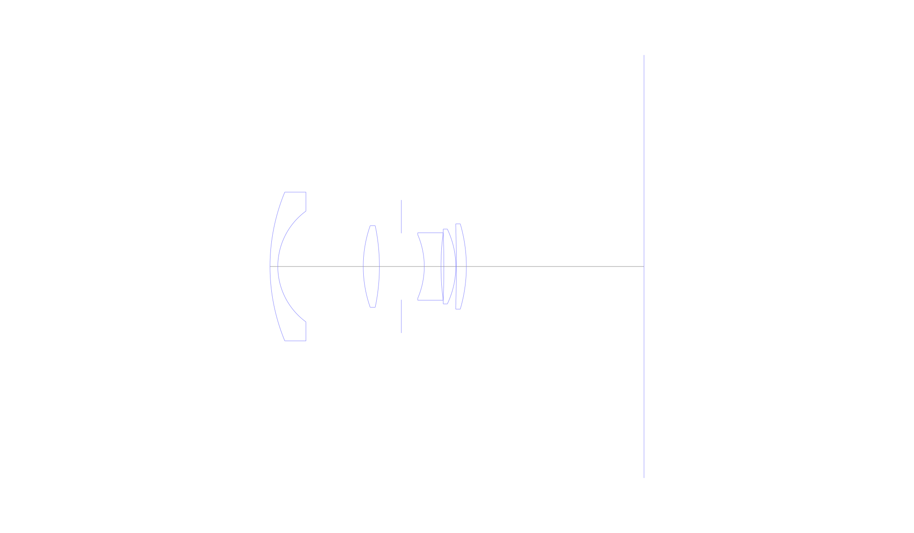
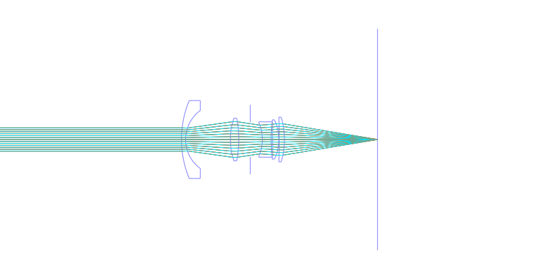
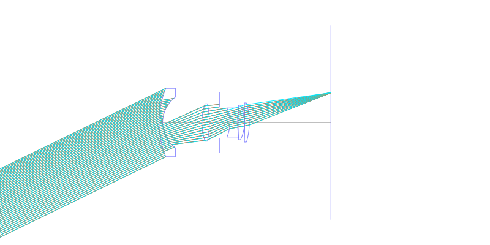
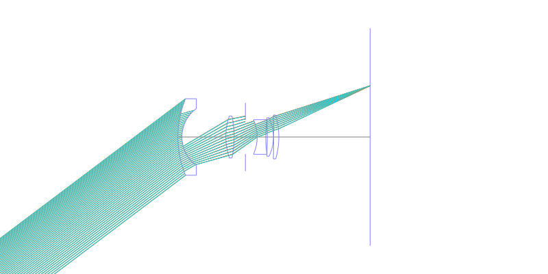
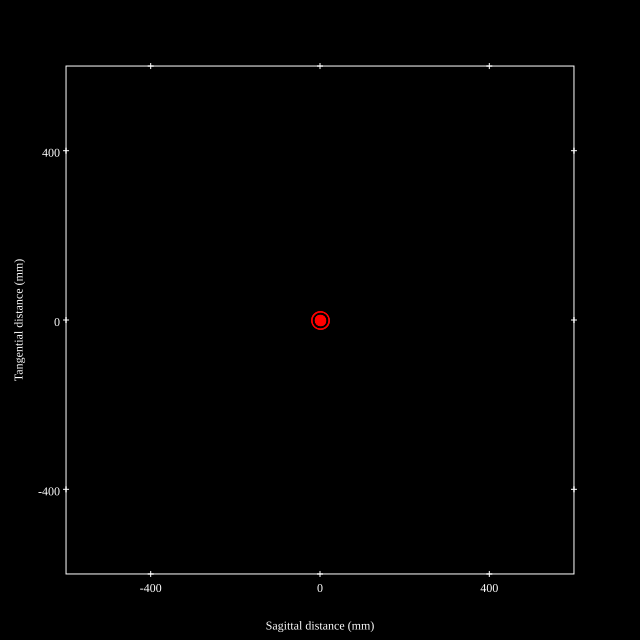
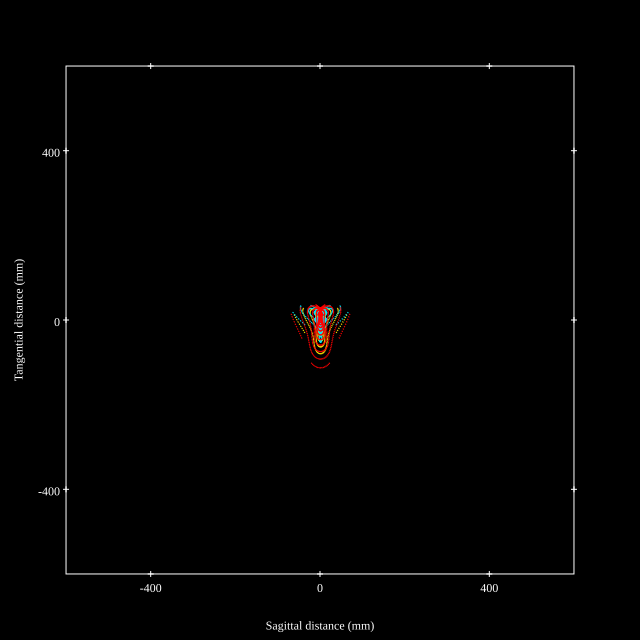
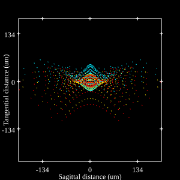

# Nikon 28mm f/2.8 Series-E
## Patent Information
| Country | Patent Number | Example | Year of Application | Inventors | Organisation | Link |
| ---     | ---           | ---     | ---                 | ---       | ---          | ---  |
|US | US 4203653 | EX 2 | 1977 | Ikuo Mori | Nikon Corp | [link](https://patents.google.com/patent/US4203653A) |
## Surface Data
Note that where glass types are shown the refractive index and abbe number is as per assigned glass type

| ID  | Radius | Thickness | Diameter | nd  | vd  | Glass Make | Glass |
| --- | ---    | ---       | ---      | --- | --- | ---        | ---   |
| 1 | 39.732 | 1.596 | 30.4 | 1.6228 | 57.1 | Hikari | J-SK10 |
| 2 | 14.028 | 17.444 | 22.64 |  |  |  |
| 3 | 25.228 | 3.304 | 16.66 | 1.62374 | 47.01 | Hikari | J-BAF8 |
| 4 | -40.852 | 4.467 | 16.66 |  |  |  |
| 5 | AS | 4.689 | 13.578 |  |  |  |
| 6 | -16.464 | 3.416 | 13.0 | 1.7552 | 27.57 | Hikari | J-SF4 |
| 7 | 53.172 | 0.588 | 13.77 |  |  |  |
| 8 | -175.308 | 2.436 | 13.77 | 1.713 | 53.96 | Hikari | J-LAK8 |
| 9 | -17.724 | 0.112 | 15.3 |  |  |  |
| 10 | -277.564 | 2.044 | 17.4 | 1.7725 | 49.62 | Hikari | J-LASF016 |
| 11 | -31.08 | 36.27 | 17.4 |  |  |  |
## Layouts

## Spot Diagrams

## Paraxial Parameters
| parameter | value |
| ---       | ---   |
| effective_focal_length |27.933
| back_focal_length | 36.472
| optical_invariant | 3.759
| object_distance | 1.0E10
| image_distance | 36.27
| power | 0.036
| pp1_H | 29.207
| ppk_H' | -8.539
| ffl_F | 1.274
| fno | 2.8
| enp_dist_P | 16.293
| enp_radius | 4.988
| exp_dist_P' | -15.478
| exp_radius | 9.277
| m | 0.007
| red | -3.5800396809607583E8
| n_obj | 1
| n_img | 1
| img_ht | 21.049
| obj_ang | 37
| obj_na | 0
| img_na | -0.176|
## Spot Analysis
| Field | Spot Mean Radius | Spot Max Radius |
| ---   | ---              | ---             |
 | 0.0 | 6.836 | 12.768|
 | 0.7 | 24.603 | 105.781|
 | 1.0 | 59.659 | 200.768|
## Resources
* [OpticalBench Compatible Data File, tab delimited](./US004203653_Example02.txt)
* [Zemax file](./US004203653_Example02.zmx)
