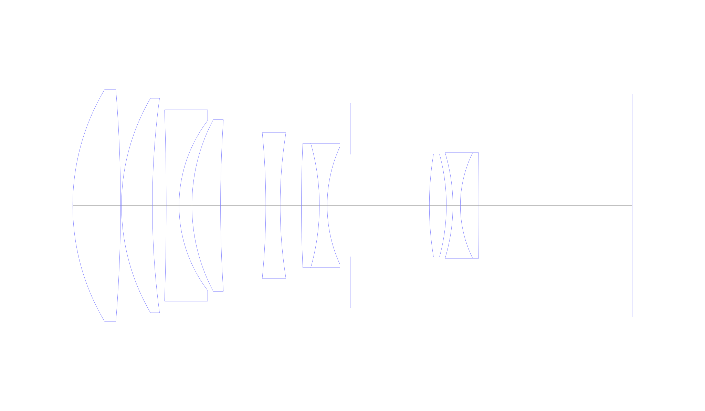
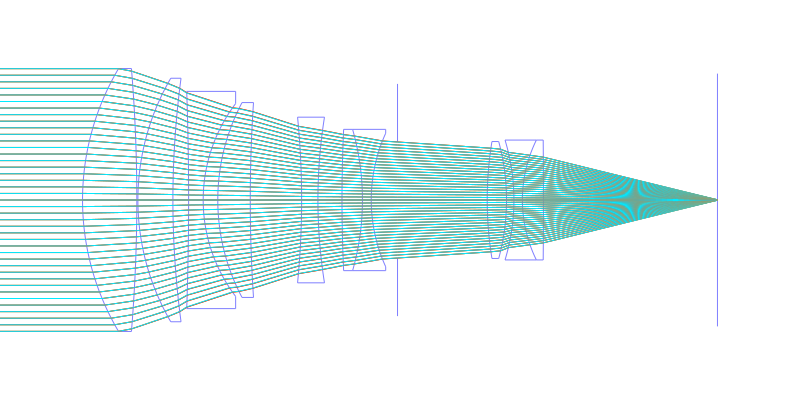
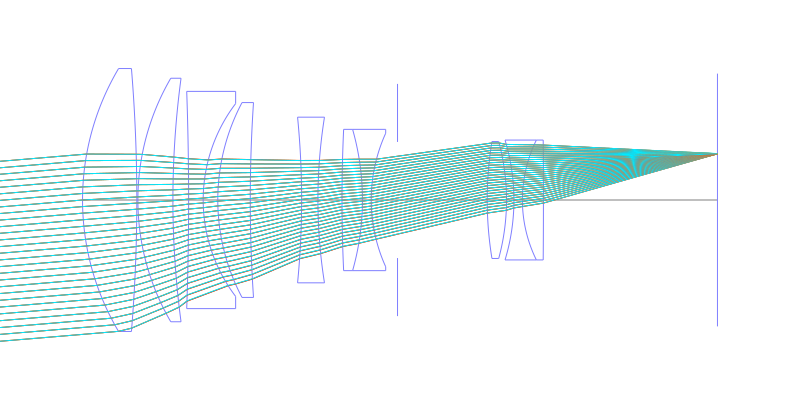
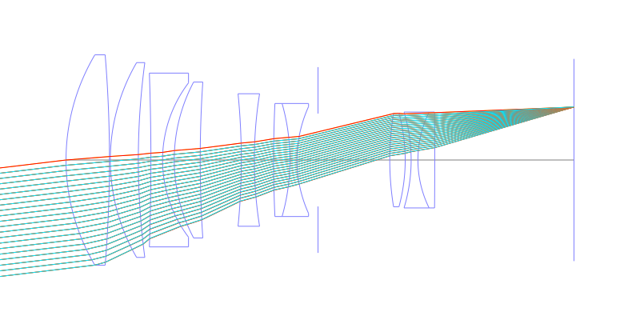
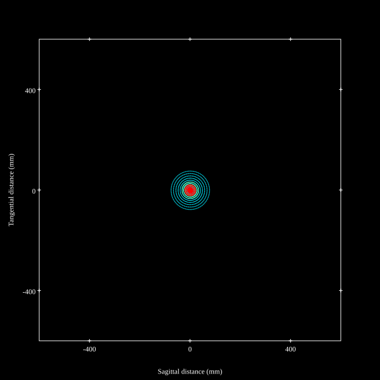
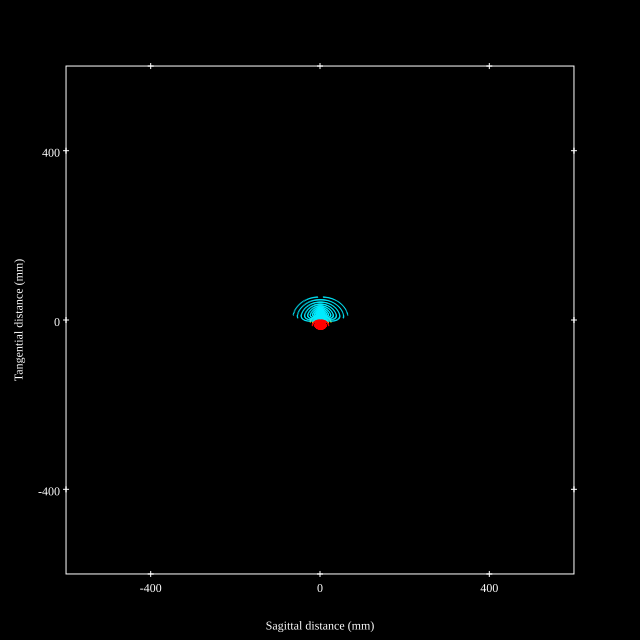
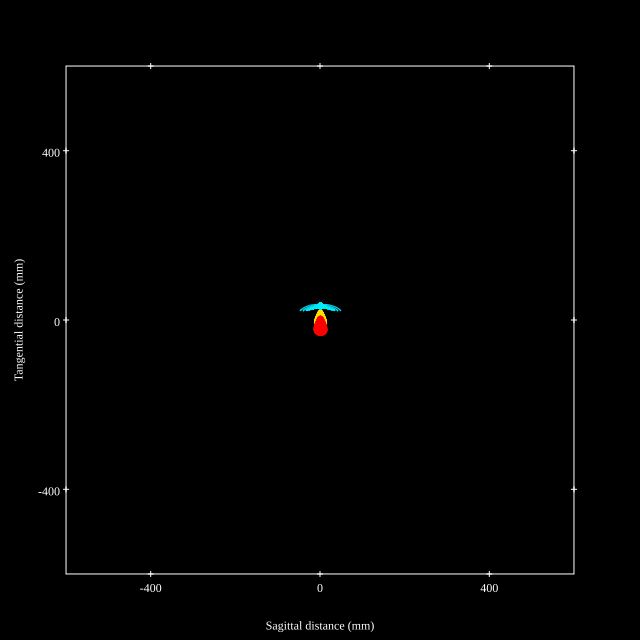
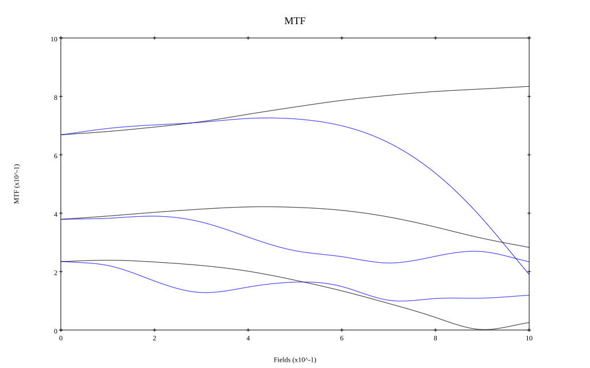
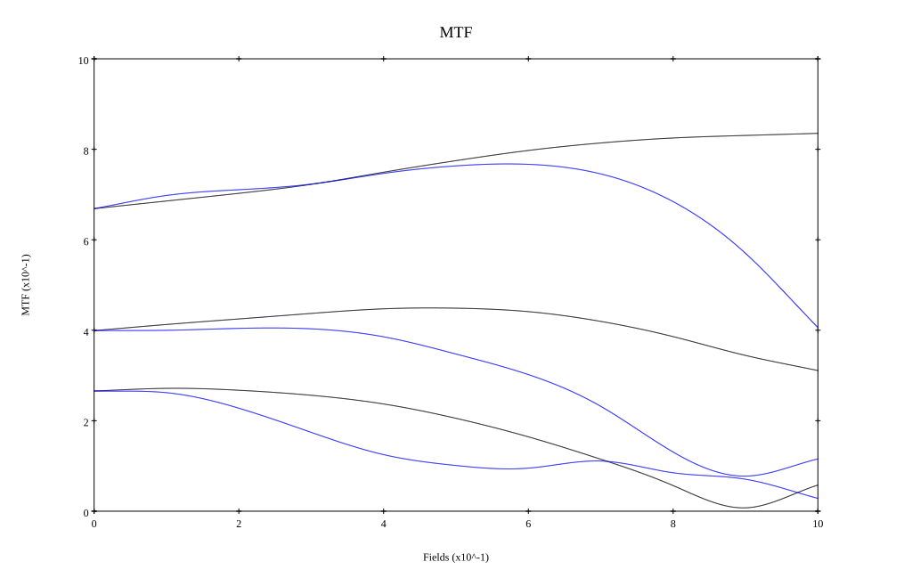

## Surface Data
Note that where glass types are shown the refractive index and abbe number is as per assigned glass type

| ID  | Radius | Thickness | Diameter | nd  | vd  | Glass Make | Glass |
| --- | ---    | ---       | ---      | --- | --- | ---        | ---   |
| 1 | 88.299 | 18.59 | 90.03 | 1.497 | 81.61 | Hoya | FCD1 |
| 2 | -549.108 | 0.36 | 90.03 |  |  |  |
| 3 | 82.825 | 11.99 | 83.38 | 1.617 | 62.8 | Ohara | S-PHM51 |
| 4 | 313.58 | 5.38 | 83.38 |  |  |  |
| 5 | -1059.646 | 4.99 | 74.38 | 1.65412 | 39.7 | Schott | N-KZFS5 |
| 6 | 54.621 | 5.0 | 66.04 |  |  |  |
| 7 | 71.24 | 11.12 | 66.72 | 1.497 | 81.61 | Hoya | FCD1 |
| 8 | 503.651 | 17.586 | 66.72 |  |  |  |
| 9 | -289.939 | 5.58 | 56.72 | 1.50378 | 66.81 | Ohara | BSL21 |
| 10 | 180.621 | 8.244 | 56.72 |  |  |  |
| 11 | 522.949 | 7.0 | 48.38 | 1.68893 | 31.08 | Ohara | S-TIM28 |
| 12 | -88.452 | 3.01 | 48.38 | 1.5263 | 51.05 | Hoya | CF2 |
| 13 | 55.249 | 9.0 | 45.72 |  |  |  |
| 14 | AS | 30.708 | 39.753 |  |  |  |
| 15 | 124.349 | 6.61 | 40.04 | 1.788 | 47.41 | CORNING | D88-47 |
| 16 | -76.223 | 2.54 | 40.04 |  |  |  |
| 17 | -70.63 | 2.9 | 41.04 | 1.62435 | 35.94 | CDGM | F5 |
| 18 | 46.449 | 7.2 | 41.04 | 1.6779 | 55.34 | Ohara | S-LAL12 |
| 19 | -2749.059 | 59.59 | 41.04 |  |  |  |
## Layouts

## Spot Diagrams

## Paraxial Parameters
| parameter | value |
| ---       | ---   |
| effective_focal_length |188.277
| back_focal_length | 59.498
| optical_invariant | 5.407
| object_distance | 1.0E10
| image_distance | 59.498
| power | 0.005
| pp1_H | 110.549
| ppk_H' | -128.778
| ffl_F | -77.728
| fno | 2.092
| enp_dist_P | 231.637
| enp_radius | 45.007
| exp_dist_P' | -55.177
| exp_radius | 27.391
| m | -0
| red | -5.3113294032009035E7
| n_obj | 1
| n_img | 1
| img_ht | 22.617
| obj_ang | 6.85
| obj_na | 0
| img_na | -0.232|
## Spot Analysis
| Field | Spot Mean Radius | Spot Max Radius |
| ---   | ---              | ---             |
 | Field(x=0.0, y=0.0) | 26.205 | 76.465|
 | Field(x=0.0, y=0.1) | 23.905 | 79.132|
 | Field(x=0.0, y=0.2) | 23.659 | 83.631|
 | Field(x=0.0, y=0.3) | 22.974 | 84.689|
 | Field(x=0.0, y=0.4) | 21.462 | 77.576|
 | Field(x=0.0, y=0.5) | 20.107 | 71.927|
 | Field(x=0.0, y=0.6) | 19.226 | 68.942|
 | Field(x=0.0, y=0.7) | 19.052 | 65.549|
 | Field(x=0.0, y=0.8) | 19.8 | 61.663|
 | Field(x=0.0, y=0.9) | 21.637 | 57.306|
 | Field(x=0.0, y=1.0) | 24.717 | 52.975|
## Polychromatic Geometric MTF

* 10,30,50 cycles/mm
* Black lines represent sagittal, blue tangential
* To generate above, MTFs for wavelengths 587.5618(d), 486.1327(F), 656.2725(C) were calculated across 10 fields, and then averaged
## Polychromatic Geometric MTF (Weighted)

* 10,30,50 cycles/mm
* Black lines represent sagittal, blue tangential
* To generate above, MTFs for wavelengths 587.5618(d) wt(1.0), 656.2725(C) wt(0.475), 546.074(e) wt(0.98), 486.1327(F) wt(0.49), 435.8343(g) wt(0.15) were calculated across 10 fields, and then combined using weighted average
## Resources
* [OpticalBench Compatible Data File, tab delimited](./prescription.txt)
* [Zemax file](./JP1984-176717_Example01P.zmx)

Report / Zemax file generated using [Beam42](https://github.com/BeamFour/Beam42) on 2026-04-25
