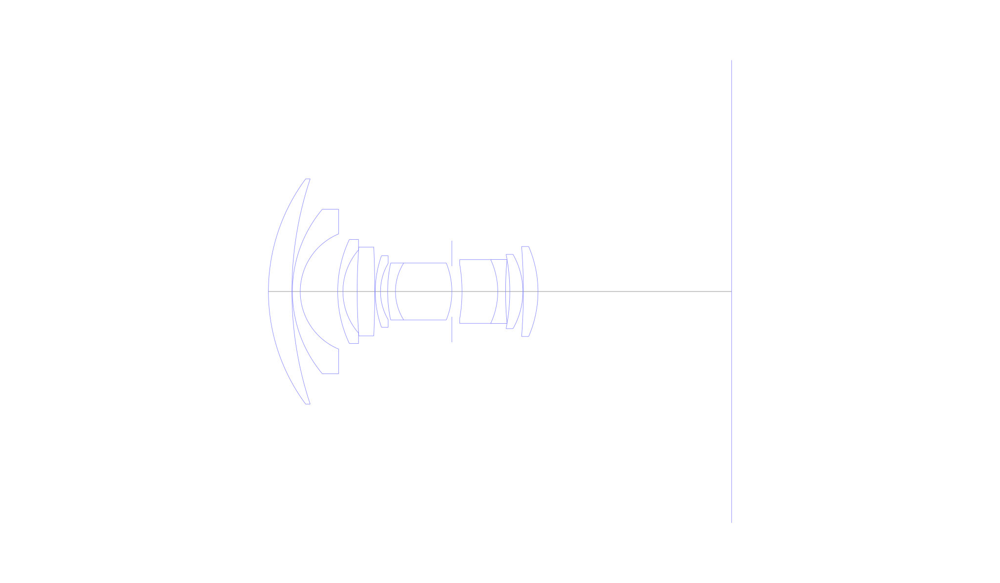
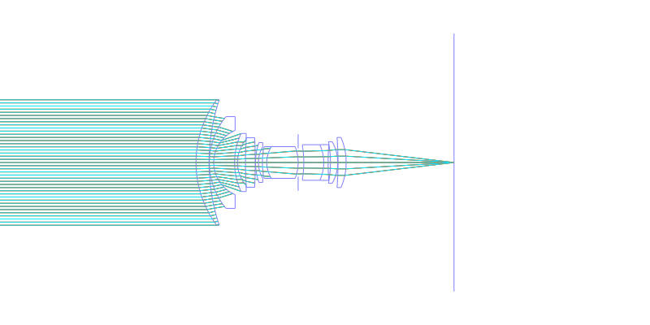
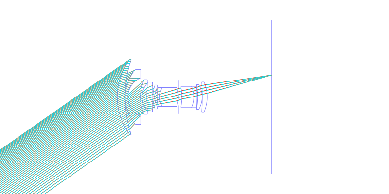
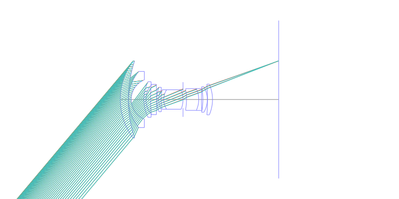
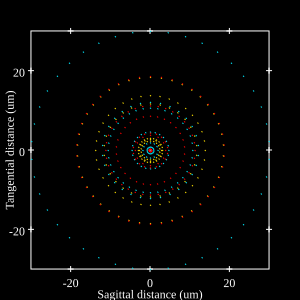
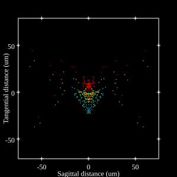
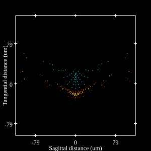

# Olympus Zuiko 18mm f3.5 MC. Auto-W
## Patent Information
| Country | Patent Number | Example | Year of Application | Inventors | Organisation | Link |
| ---     | ---           | ---     | ---                 | ---       | ---          | ---  |
|US | US4061421 | EX 1 | 1975 | Jihei Nakagawa | Olympus Corp  | [link](https://patents.google.com/patent/US4061421A/en) |
## Surface Data
Note that where glass types are shown the refractive index and abbe number is as per assigned glass type

| ID  | Radius | Thickness | Diameter | nd  | vd  | Glass Make | Glass |
| --- | ---    | ---       | ---      | --- | --- | ---        | ---   |
| 1 | 35.2854 | 4.383 | 42.08 | 1.6516 | 58.55 | Ohara | S-LAL7 |
| 2 | 66.5208 | 0.0972 | 42.08 |  |  |  |
| 3 | 23.9166 | 1.4616 | 30.72 | 1.8061 | 40.93 | Ohara | S-LAH53 |
| 4 | 11.6568 | 6.9912 | 21.52 |  |  |  |
| 5 | 22.8132 | 0.9738 | 19.44 | 1.8061 | 40.93 | Ohara | S-LAH53 |
| 6 | 11.7936 | 2.6586 | 15.51 |  |  |  |
| 7 | 111.6882 | 3.2814 | 16.58 | 1.78472 | 25.68 | Ohara | S-TIH11 |
| 8 | -187.605 | 0.0972 | 16.58 |  |  |  |
| 9 | 19.8 | 0.9738 | 13.36 | 1.66755 | 41.87 | Hikari | J-BASF6 |
| 10 | 10.3734 | 1.3338 | 10.52 |  |  |  |
| 11 | 25.4538 | 1.4616 | 10.62 | 1.757 | 47.82 | Ohara | S-LAM54 |
| 12 | 9.9576 | 10.5174 | 10.62 | 1.64769 | 33.79 | Ohara | S-TIM22 |
| 13 | -14.121 | 0.0 | 10.62 |  |  |  |
| 14 | AS | 1.899 | 9.482 |  |  |  |
| 15 | -30.1194 | 6.6708 | 10.3 | 1.7432 | 49.34 | Ohara | S-LAM60 |
| 16 | -14.1048 | 1.4616 | 11.9 | 1.80518 | 25.43 | Ohara | S-TIH6 |
| 17 | 68.0526 | 0.7884 | 11.96 |  |  |  |
| 18 | -34.7904 | 2.4354 | 13.86 | 1.618 | 63.33 | Ohara | S-PHM52 |
| 19 | -13.9842 | 0.0972 | 13.86 |  |  |  |
| 20 | -106.7886 | 2.727 | 16.8 | 1.618 | 63.33 | Ohara | S-PHM52 |
| 21 | -21.114 | 36.13 | 16.8 |  |  |  |
## Layouts

## Spot Diagrams

## Paraxial Parameters
| parameter | value |
| ---       | ---   |
| effective_focal_length |18.002
| back_focal_length | 36.278
| optical_invariant | 3.065
| object_distance | 1.0E10
| image_distance | 36.13
| power | 0.056
| pp1_H | 30.714
| ppk_H' | -18.275
| ffl_F | 12.711
| fno | 3.5
| enp_dist_P | 18.568
| enp_radius | 2.572
| exp_dist_P' | -19.057
| exp_radius | 7.905
| m | 0.008
| red | -5.554819899202396E8
| n_obj | 1
| n_img | 1
| img_ht | 21.454
| obj_ang | 50
| obj_na | 0
| img_na | -0.141|
## Spot Analysis
| Field | Spot Mean Radius | Spot Max Radius |
| ---   | ---              | ---             |
 | 0.0 | 14.188 | 30.635|
 | 0.7 | 19.815 | 75.43|
 | 1.0 | 42.493 | 118.956|
## Resources
* [OpticalBench Compatible Data File, tab delimited](./US004061421_Example01.txt)
* [Zemax file](./US004061421_Example01.zmx)
