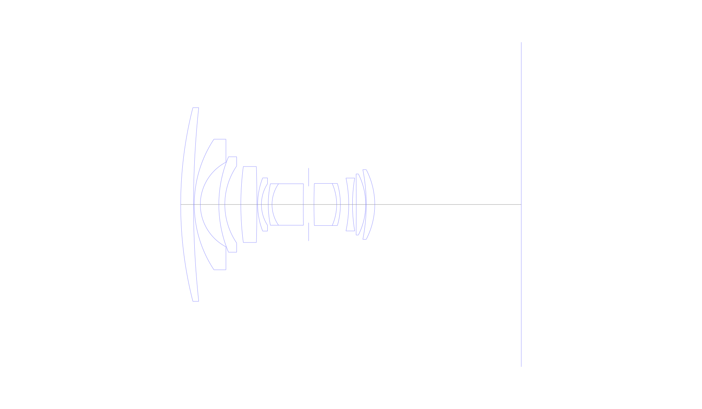
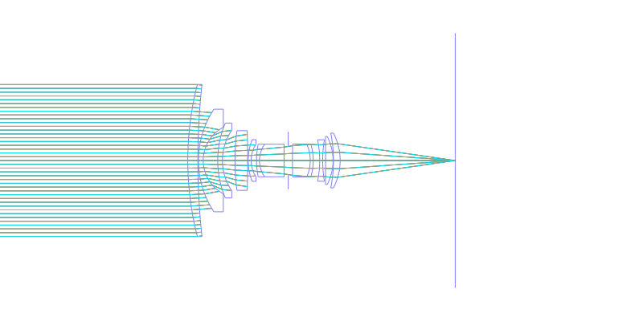
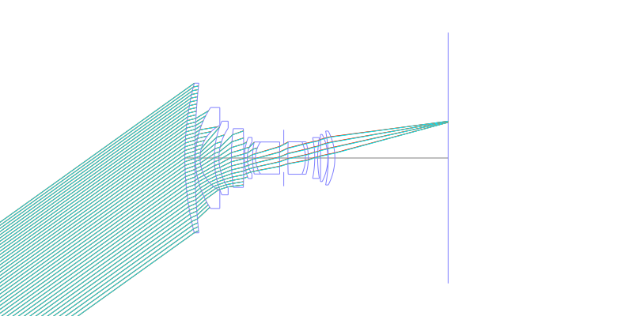
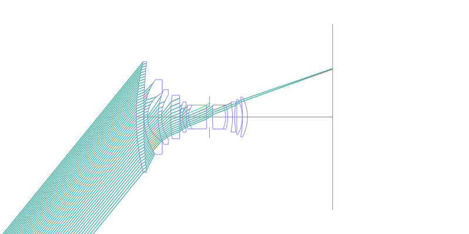
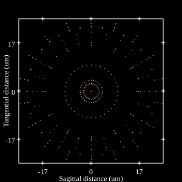
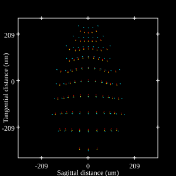
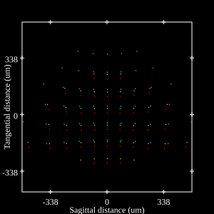

# Olympus Zuiko 18mm f3.5 MC. Auto-W
## Patent Information
| Country | Patent Number | Example | Year of Application | Inventors | Organisation | Link |
| ---     | ---           | ---     | ---                 | ---       | ---          | ---  |
|US | US4029397 | EX 2 | 1974 | Nobuo Yamashita | Olympus Corp  | [link](https://patents.google.com/patent/US4029397A/en) |
## Surface Data
Note that where glass types are shown the refractive index and abbe number is as per assigned glass type

| ID  | Radius | Thickness | Diameter | nd  | vd  | Glass Make | Glass |
| --- | ---    | ---       | ---      | --- | --- | ---        | ---   |
| 1 | 104.25 | 3.41 | 51.56 | 1.834 | 37.16 | Ohara | S-LAH60 |
| 2 | 240.26 | 0.2 | 51.56 |  |  |  |
| 3 | 31.51 | 1.61 | 34.78 | 1.67 | 57.33 | Ohara | LAL52 |
| 4 | 12.72 | 4.92 | 22.52 |  |  |  |
| 5 | 32.67 | 1.59 | 25.39 | 1.67 | 57.33 | Ohara | LAL52 |
| 6 | 18.25 | 4.26 | 20.51 |  |  |  |
| 7 | 78.06 | 4.27 | 20.22 | 1.804 | 46.57 | Ohara | S-LAH65 |
| 8 | -368.49 | 0.2 | 20.22 |  |  |  |
| 9 | 19.46 | 1.0 | 14.16 | 1.6968 | 55.53 | Ohara | S-LAL14 |
| 10 | 10.26 | 1.82 | 11.04 |  |  |  |
| 11 | 27.31 | 1.0 | 11.04 | 1.6968 | 55.53 | Ohara | S-LAL14 |
| 12 | 9.67 | 8.31 | 11.04 | 1.5927 | 35.31 | Ohara | S-FTM16 |
| 13 | 398.15 | 1.42 | 11.04 |  |  |  |
| 14 | AS | 1.42 | 9.709 |  |  |  |
| 15 | 159.94 | 6.03 | 11.18 | 1.64 | 60.19 | Hikari | J-LAK01 |
| 16 | -13.78 | 1.0 | 11.18 | 1.51454 | 54.71 | Ohara | NSL33 |
| 17 | -19.85 | 2.21 | 11.18 |  |  |  |
| 18 | -34.15 | 1.0 | 14.07 | 1.80518 | 25.43 | Ohara | S-TIH6 |
| 19 | 41.99 | 1.0 | 14.07 |  |  |  |
| 20 | -960.13 | 2.51 | 16.25 | 1.618 | 63.33 | Ohara | S-PHM52 |
| 21 | -17.94 | 0.15 | 16.25 |  |  |  |
| 22 | -47.59 | 2.26 | 18.56 | 1.618 | 63.33 | Ohara | S-PHM52 |
| 23 | -20.12 | 38.96 | 18.56 |  |  |  |
## Layouts

## Spot Diagrams

## Paraxial Parameters
| parameter | value |
| ---       | ---   |
| effective_focal_length |18.454
| back_focal_length | 39.605
| optical_invariant | 3.244
| object_distance | 1.0E10
| image_distance | 38.96
| power | 0.054
| pp1_H | 30.364
| ppk_H' | -21.151
| ffl_F | 11.91
| fno | 3.5
| enp_dist_P | 17.321
| enp_radius | 2.636
| exp_dist_P' | -23.335
| exp_radius | 8.991
| m | 0.035
| red | -5.418792215083185E8
| n_obj | 1
| n_img | 1
| img_ht | 22.708
| obj_ang | 50.9
| obj_na | 0
| img_na | -0.141|
## Spot Analysis
| Field | Spot Mean Radius | Spot Max Radius |
| ---   | ---              | ---             |
 | 0.0 | 17.919 | 26.235|
 | 0.7 | 162.161 | 312.911|
 | 1.0 | 275.997 | 507.684|
## Resources
* [OpticalBench Compatible Data File, tab delimited](./US004029397_Example02.txt)
* [Zemax file](./US004029397_Example02.zmx)
