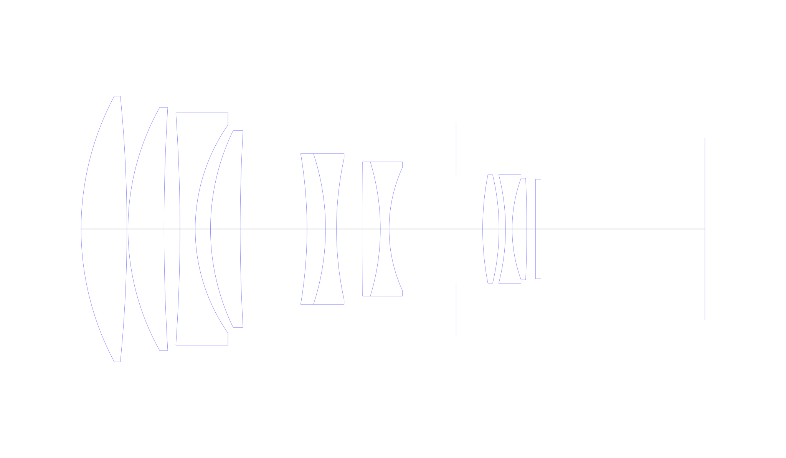
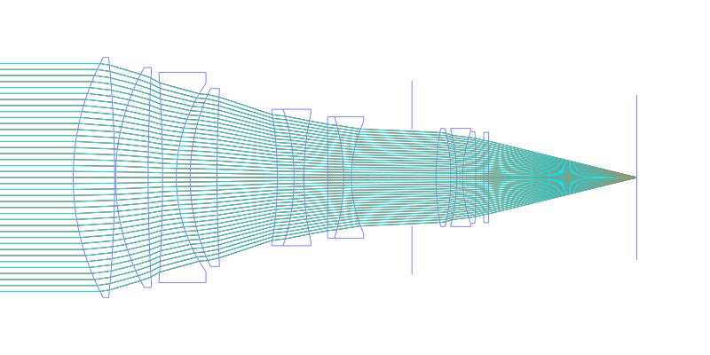
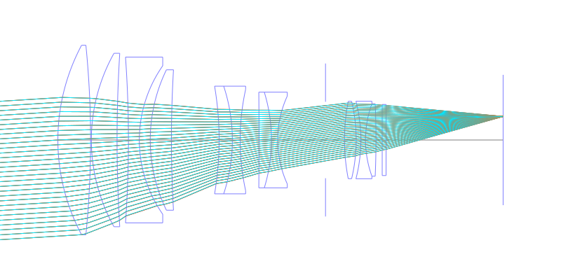
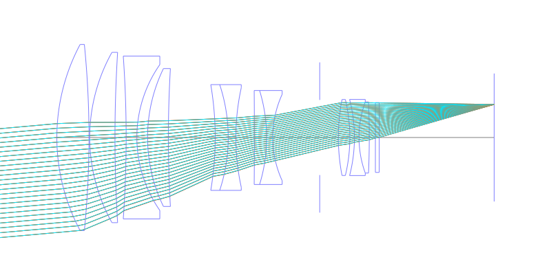
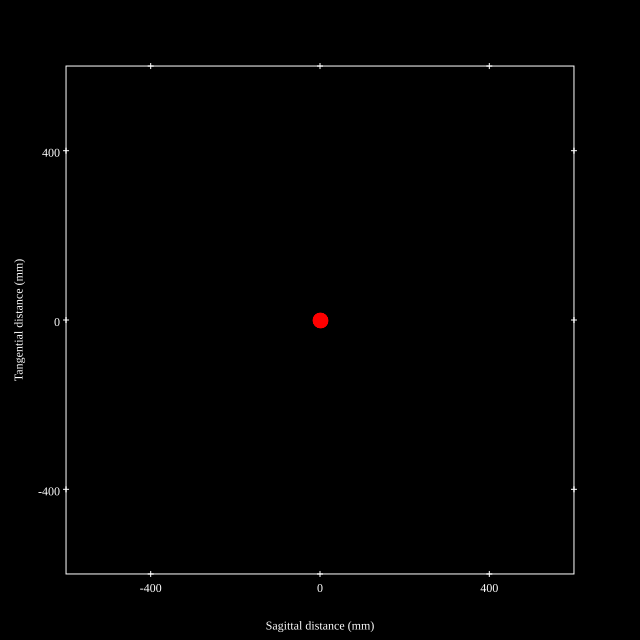
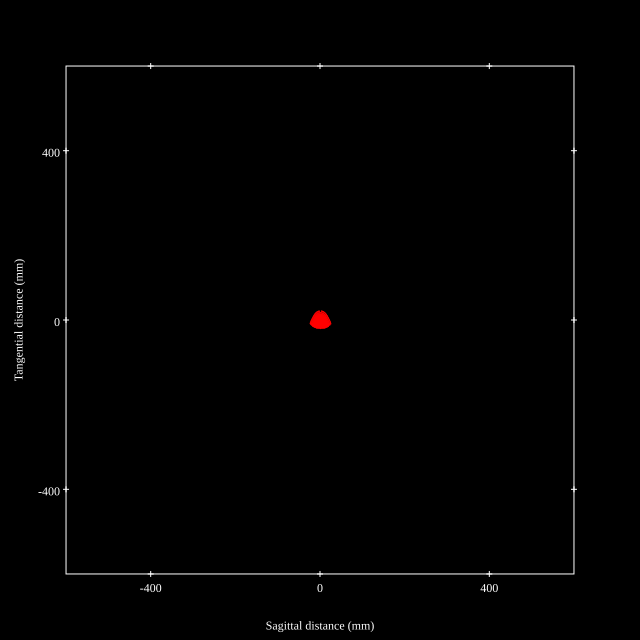
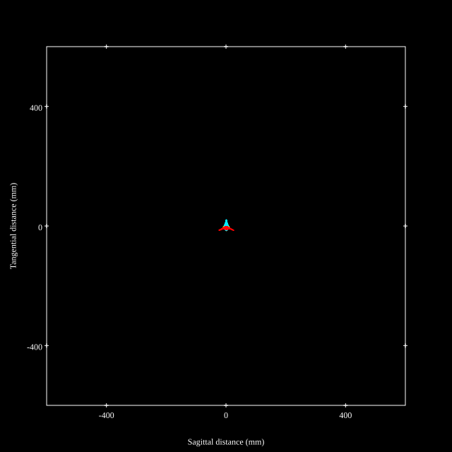
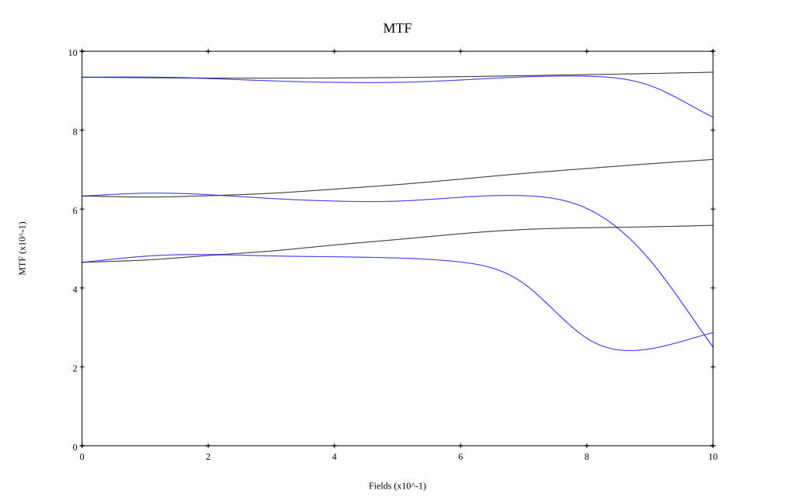
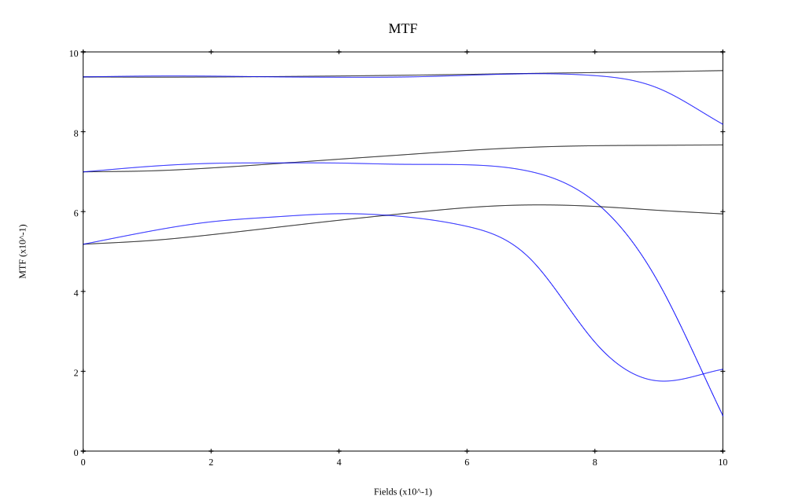

## Surface Data
Note that where glass types are shown the refractive index and abbe number is as per assigned glass type

| ID  | Radius | Thickness | Diameter | nd  | vd  | Glass Make | Glass |
| --- | ---    | ---       | ---      | --- | --- | ---        | ---   |
| 1 | 133.7225 | 21.6495 | 125.62 | 1.497 | 81.61 | Hoya | FCD1 |
| 2 | -634.9425 | 0.50525 | 125.62 |  |  |  |
| 3 | 117.89675 | 17.01025 | 114.98 | 1.497 | 81.61 | Hoya | FCD1 |
| 4 | 931.2835 | 7.52575 | 114.98 |  |  |  |
| 5 | -777.2625 | 7.2165 | 109.88 | 1.65412 | 39.7 | Schott | N-KZFS5 |
| 6 | 85.9845 | 7.2165 | 98.42 |  |  |  |
| 7 | 106.6215 | 14.0205 | 93.08 | 1.618 | 63.39 | Schott | N-PSK53A |
| 8 | 796.87625 | 31.555 | 93.08 |  |  |  |
| 9 | -213.54525 | 8.763 | 71.38 | 1.734 | 51.49 | Ohara | LAL59 |
| 10 | -113.74875 | 5.15475 | 71.38 | 1.4645 | 65.94 | Ohara | FSL3 |
| 11 | 156.915 | 12.478 | 67.1 |  |  |  |
| 12 | -3864.0265 | 8.2475 | 63.44 | 1.68893 | 31.08 | Ohara | S-TIM28 |
| 13 | -108.5025 | 4.12375 | 63.44 | 1.50847 | 60.83 |  |
| 14 | 70.1745 | 31.65 | 58.32 |  |  |  |
| 15 | AS | 12.56 | 50.711 |  |  |  |
| 16 | 134.5215 | 7.732 | 51.28 | 1.734 | 51.49 | Ohara | LAL59 |
| 17 | -110.11825 | 3.09275 | 51.28 |  |  |  |
| 18 | -103.048 | 3.09275 | 51.38 | 1.62004 | 36.26 | Ohara | S-TIM2 |
| 19 | 70.51675 | 6.90725 | 48.0 | 1.6779 | 55.34 | Ohara | S-LAL12 |
| 20 | -557.9915 | 4.12375 | 48.0 |  |  |  |
| 21 | 0.0 | 2.57725 | 47.12 | 1.51633 | 64.14 | Ohara | S-BSL7 |
| 22 | 0.0 | 77.443 | 47.12 |  |  |  |
## Layouts

## Spot Diagrams

## Paraxial Parameters
| parameter | value |
| ---       | ---   |
| effective_focal_length |250.002
| back_focal_length | 77.49
| optical_invariant | 5.578
| object_distance | 1.0E10
| image_distance | 77.49
| power | 0.004
| pp1_H | 172.044
| ppk_H' | -172.513
| ffl_F | -77.959
| fno | 2
| enp_dist_P | 483.869
| enp_radius | 62.5
| exp_dist_P' | -33.71
| exp_radius | 27.811
| m | -0
| red | -3.9999602406552926E7
| n_obj | 1
| n_img | 1
| img_ht | 22.312
| obj_ang | 5.1
| obj_na | 0
| img_na | -0.243|
## Spot Analysis
| Field | Spot Mean Radius | Spot Max Radius |
| ---   | ---              | ---             |
 | Field(x=0.0, y=0.0) | 7.505 | 16.632|
 | Field(x=0.0, y=0.1) | 7.785 | 19.921|
 | Field(x=0.0, y=0.2) | 8.023 | 23.311|
 | Field(x=0.0, y=0.3) | 8.309 | 26.369|
 | Field(x=0.0, y=0.4) | 8.482 | 27.853|
 | Field(x=0.0, y=0.5) | 8.455 | 27.875|
 | Field(x=0.0, y=0.6) | 8.198 | 25.811|
 | Field(x=0.0, y=0.7) | 7.836 | 25.307|
 | Field(x=0.0, y=0.8) | 7.659 | 26.946|
 | Field(x=0.0, y=0.9) | 8.152 | 28.096|
 | Field(x=0.0, y=1.0) | 10.174 | 28.286|
## Polychromatic Geometric MTF

* 10,30,50 cycles/mm
* Black lines represent sagittal, blue tangential
* To generate above, MTFs for wavelengths 587.5618(d), 486.1327(F), 656.2725(C) were calculated across 10 fields, and then averaged
## Polychromatic Geometric MTF (Weighted)

* 10,30,50 cycles/mm
* Black lines represent sagittal, blue tangential
* To generate above, MTFs for wavelengths 587.5618(d) wt(1.0), 656.2725(C) wt(0.475), 546.074(e) wt(0.98), 486.1327(F) wt(0.49), 435.8343(g) wt(0.15) were calculated across 10 fields, and then combined using weighted average
## Resources
* [OpticalBench Compatible Data File, tab delimited](./prescription.txt)
* [Zemax file](./US004534626_Example01.zmx)

Report / Zemax file generated using [Beam42](https://github.com/BeamFour/Beam42) on 2026-05-02
