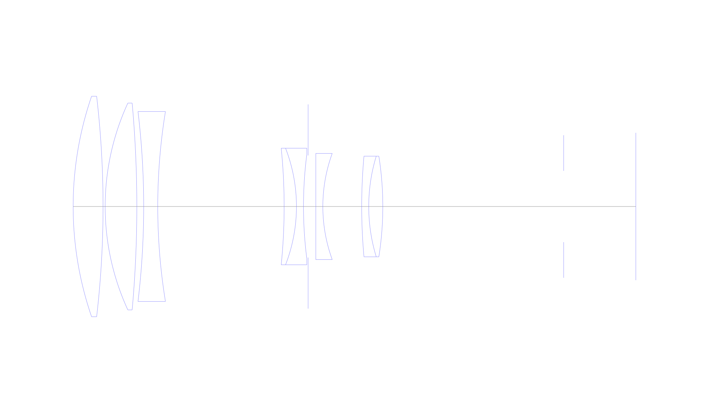
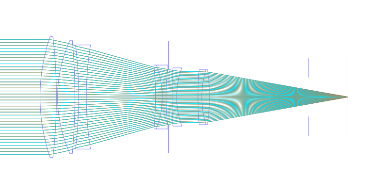
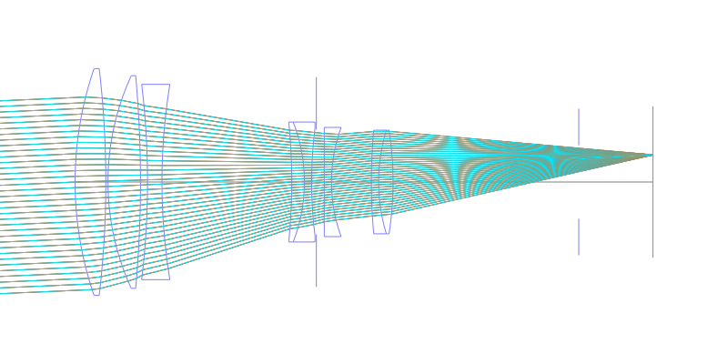
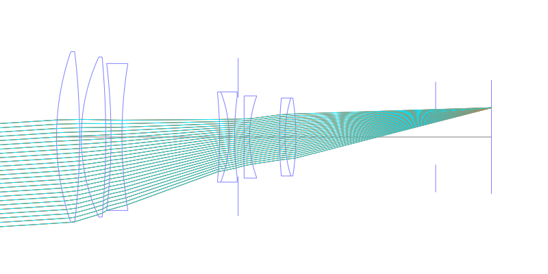
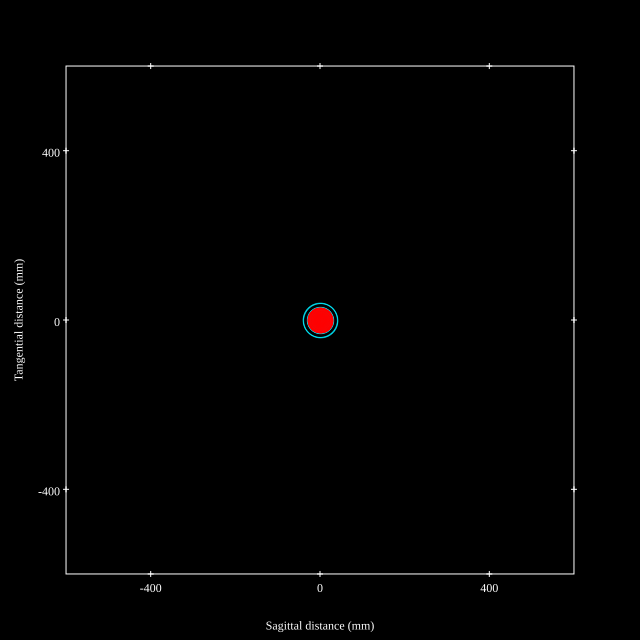
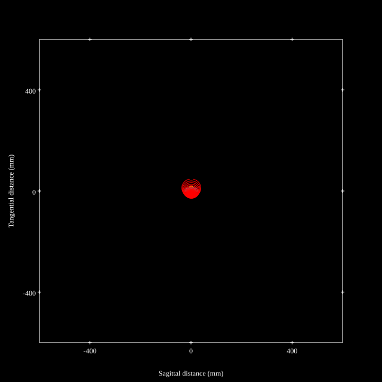
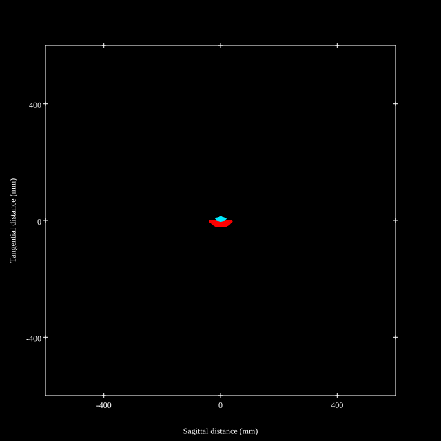
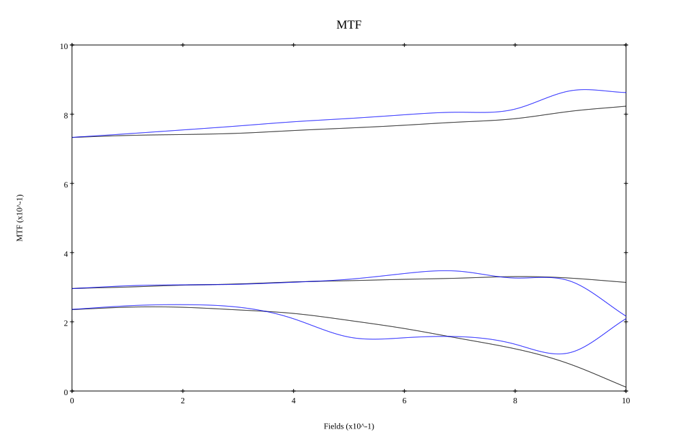
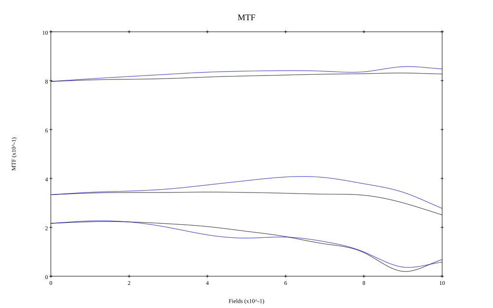

## Surface Data
Note that where glass types are shown the refractive index and abbe number is as per assigned glass type

| ID  | Radius | Thickness | Diameter | nd  | vd  | Glass Make | Glass |
| --- | ---    | ---       | ---      | --- | --- | ---        | ---   |
| 1 | 198.877 | 17.504 | 129.28 | 1.497 | 81.61 | Hoya | FCD1 |
| 2 | -557.694 | 1.236 | 129.28 |  |  |  |
| 3 | 145.058 | 18.533 | 121.24 | 1.497 | 81.61 | Hoya | FCD1 |
| 4 | -672.532 | 4.015 | 121.24 |  |  |  |
| 5 | -467.166 | 8.236 | 111.35 | 1.68893 | 31.08 | Ohara | S-TIM28 |
| 6 | 346.563 | 73.987 | 111.35 |  |  |  |
| 7 | -340.97 | 7.207 | 68.38 | 1.72151 | 29.23 | Ohara | S-TIH18 |
| 8 | -94.707 | 4.12 | 68.38 | 1.55963 | 61.17 | Ohara | S-BAL50 |
| 9 | 241.332 | 2.707 | 61.04 |  |  |  |
| 10 | AS | 4.5 | 59.847 |  |  |  |
| 11 | 0.0 | 4.12 | 62.27 | 1.55963 | 61.17 | Ohara | S-BAL50 |
| 12 | 90.92 | 22.743 | 62.27 |  |  |  |
| 13 | 327.471 | 4.12 | 59.05 | 1.68893 | 31.08 | Ohara | S-TIM28 |
| 14 | 101.105 | 8.236 | 59.05 | 1.691 | 54.82 | Ohara | S-LAL9 |
| 15 | -189.091 | 105.87 | 59.05 |  |  |  |
| 16 | FS | 42.26 | 41.79 |  |  |  |
## Layouts

## Spot Diagrams

## Paraxial Parameters
| parameter | value |
| ---       | ---   |
| effective_focal_length |350.197
| back_focal_length | 42.244
| optical_invariant | 3.932
| object_distance | 1.0E10
| image_distance | 42.244
| power | 0.003
| pp1_H | -21.975
| ppk_H' | -307.953
| ffl_F | -372.171
| fno | 2.802
| enp_dist_P | 261.831
| enp_radius | 62.501
| exp_dist_P' | -151.206
| exp_radius | 34.523
| m | -0
| red | -2.8555380294094592E7
| n_obj | 1
| n_img | 1
| img_ht | 22.033
| obj_ang | 3.6
| obj_na | 0
| img_na | -0.176|
## Spot Analysis
| Field | Spot Mean Radius | Spot Max Radius |
| ---   | ---              | ---             |
 | Field(x=0.0, y=0.0) | 17.117 | 40.445|
 | Field(x=0.0, y=0.1) | 16.552 | 40.958|
 | Field(x=0.0, y=0.2) | 16.203 | 40.323|
 | Field(x=0.0, y=0.3) | 15.929 | 39.255|
 | Field(x=0.0, y=0.4) | 15.696 | 38.435|
 | Field(x=0.0, y=0.5) | 15.597 | 43.618|
 | Field(x=0.0, y=0.6) | 15.353 | 46.482|
 | Field(x=0.0, y=0.7) | 15.173 | 48.393|
 | Field(x=0.0, y=0.8) | 14.81 | 46.295|
 | Field(x=0.0, y=0.9) | 12.938 | 38.578|
 | Field(x=0.0, y=1.0) | 12.658 | 38.121|
## Polychromatic Geometric MTF

* 10,30,50 cycles/mm
* Black lines represent sagittal, blue tangential
* To generate above, MTFs for wavelengths 587.5618(d), 486.1327(F), 656.2725(C) were calculated across 10 fields, and then averaged
## Polychromatic Geometric MTF (Weighted)

* 10,30,50 cycles/mm
* Black lines represent sagittal, blue tangential
* To generate above, MTFs for wavelengths 587.5618(d) wt(1.0), 656.2725(C) wt(0.475), 546.074(e) wt(0.98), 486.1327(F) wt(0.49), 435.8343(g) wt(0.15) were calculated across 10 fields, and then combined using weighted average
## Resources
* [OpticalBench Compatible Data File, tab delimited](./prescription.txt)
* [Zemax file](./JP1983-014810_Example03P.zmx)

Report / Zemax file generated using [Beam42](https://github.com/BeamFour/Beam42) on 2026-04-25
