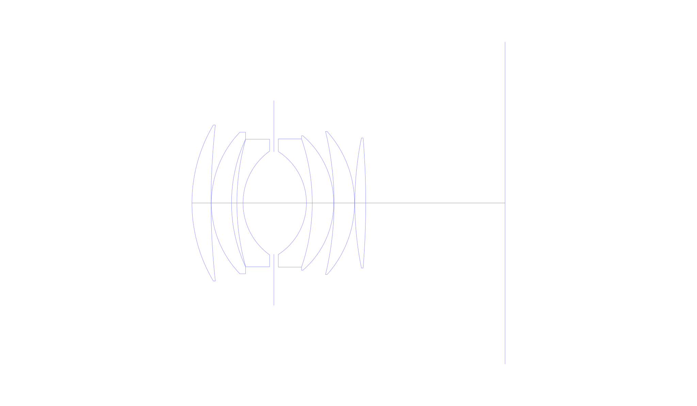
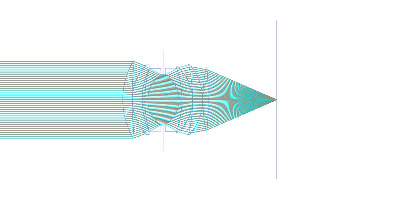
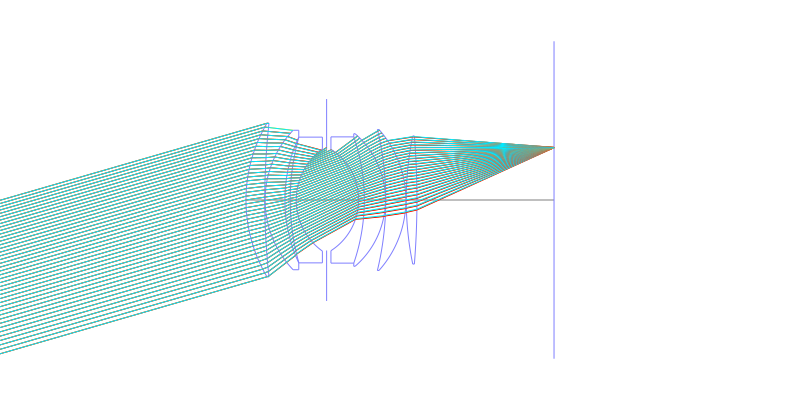
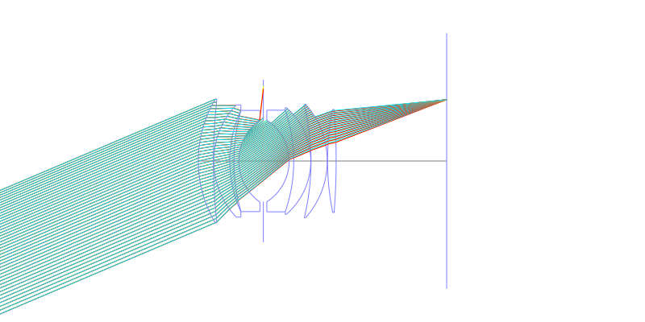
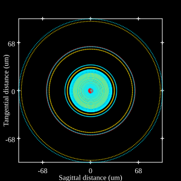
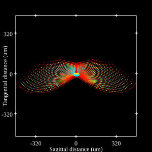
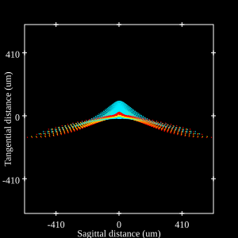

# Olympus Zuiko 50mm F1.2
## Patent Information
| Country | Patent Number | Example | Year of Application | Inventors | Organisation | Link |
| ---     | ---           | ---     | ---                 | ---       | ---          | ---  |
|US | US4099843 | EX 6 | 1976 | Toshihiro Imai | Olympus Corp  | [link](https://patents.google.com/patent/US4099843A/en) |
## Surface Data
Note that where glass types are shown the refractive index and abbe number is as per assigned glass type

| ID  | Radius | Thickness | Diameter | nd  | vd  | Glass Make | Glass |
| --- | ---    | ---       | ---      | --- | --- | ---        | ---   |
| 1 | 41.0855 | 5.11 | 41.82 | 1.83481 | 42.73 | Hikari | J-LASF05 |
| 2 | 189.501 | 0.095 | 41.82 |  |  |  |
| 3 | 27.4415 | 5.39 | 37.96 | 1.834 | 37.2 | Ohara | S-LAH60 |
| 4 | 40.705 | 1.44 | 34.22 |  |  |  |
| 5 | 63.1595 | 1.645 | 34.22 | 1.72825 | 28.5 | Ohara | S-TIH10 |
| 6 | 17.152 | 8.268 | 27.82 |  |  |  |
| 7 | AS | 8.707 | 27.475 |  |  |  |
| 8 | -16.4095 | 1.555 | 27.6 | 1.84666 | 23.8 | Ohara | S-TIH53 |
| 9 | -52.8845 | 5.745 | 34.36 | 1.6779 | 55.3 | Ohara | S-LAL12 |
| 10 | -23.831 | 0.095 | 36.08 |  |  |  |
| 11 | -81.7085 | 5.475 | 38.37 | 1.7725 | 49.63 | Hoya | TAF1 |
| 12 | -28.7585 | 0.095 | 38.37 |  |  |  |
| 13 | 87.025 | 2.91 | 34.87 | 1.79952 | 42.2 | Ohara | S-LAH52Q |
| 14 | -217.749 | 37.31 | 34.87 |  |  |  |
## Layouts

## Spot Diagrams

## Paraxial Parameters
| parameter | value |
| ---       | ---   |
| effective_focal_length |49.988
| back_focal_length | 37.31
| optical_invariant | 8.841
| object_distance | 1.0E10
| image_distance | 37.31
| power | 0.02
| pp1_H | 47.883
| ppk_H' | 12.677
| ffl_F | -2.105
| fno | 1.2
| enp_dist_P | 27.321
| enp_radius | 20.828
| exp_dist_P' | -47.608
| exp_radius | 35.382
| m | 0
| red | -2.0004935149933326E8
| n_obj | 1
| n_img | 1
| img_ht | 21.219
| obj_ang | 23
| obj_na | 0
| img_na | -0.385|
## Spot Analysis
| Field | Spot Mean Radius | Spot Max Radius |
| ---   | ---              | ---             |
 | 0.0 | 26.274 | 102.131|
 | 0.7 | 95.025 | 480.031|
 | 1.0 | 124.736 | 614.321|
## Resources
* [OpticalBench Compatible Data File, tab delimited](./US004099843_Example06.txt)
* [Zemax file](./US004099843_Example06.zmx)
