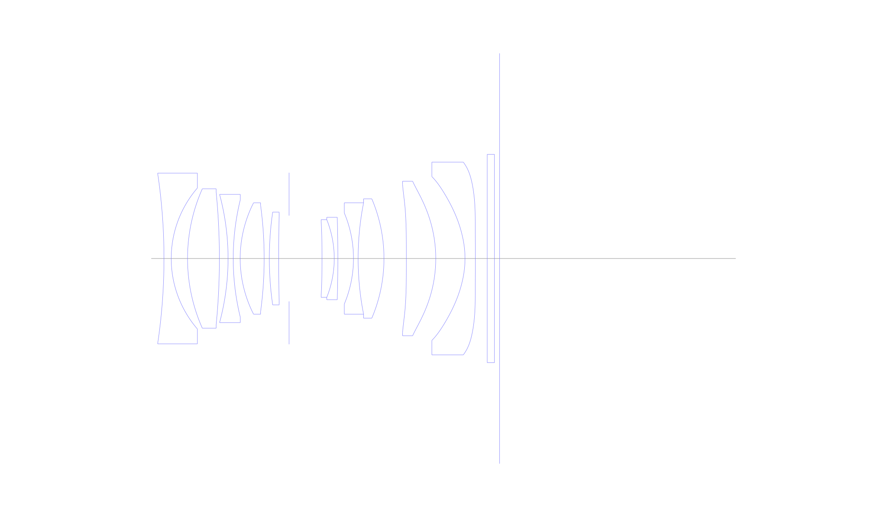
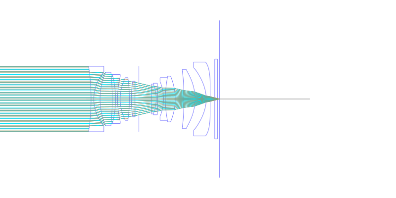
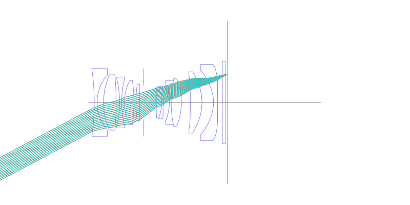
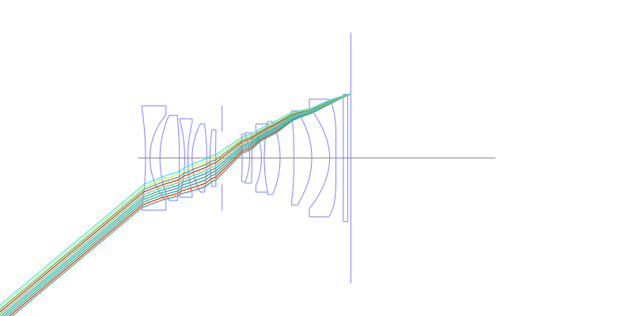
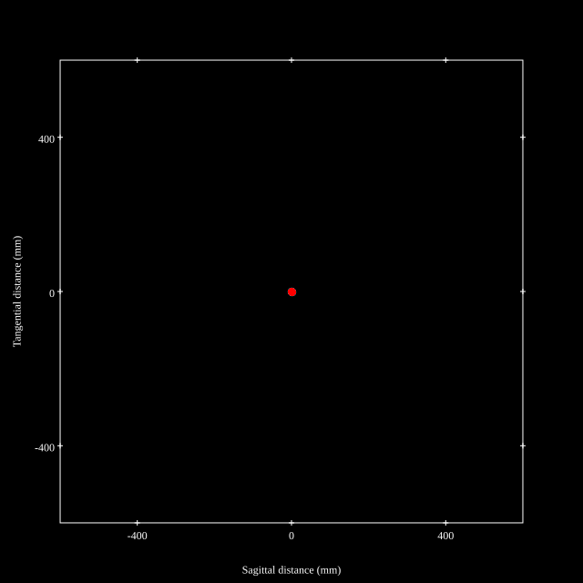
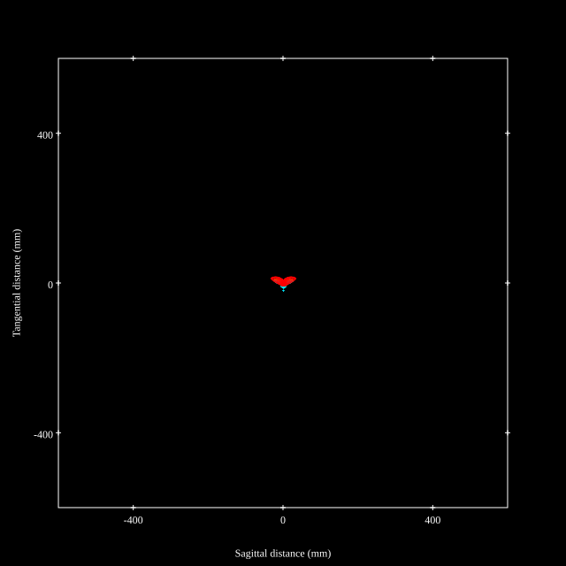
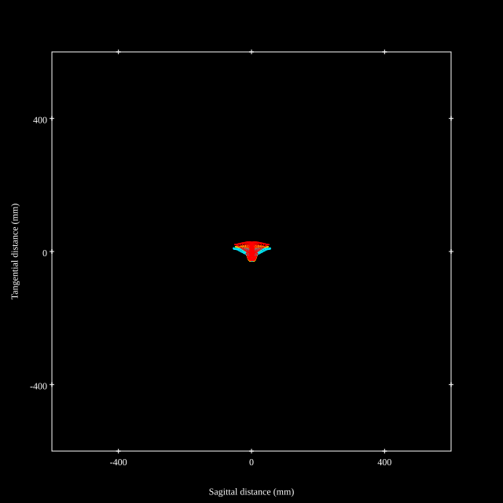
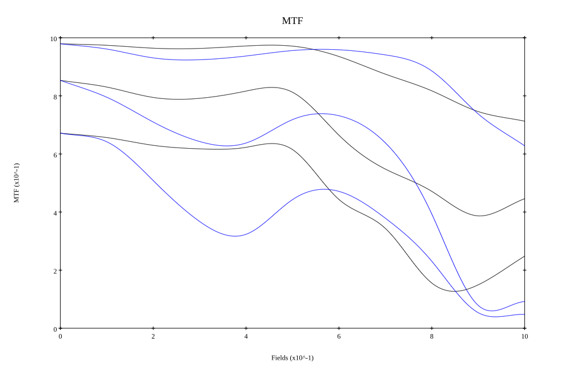
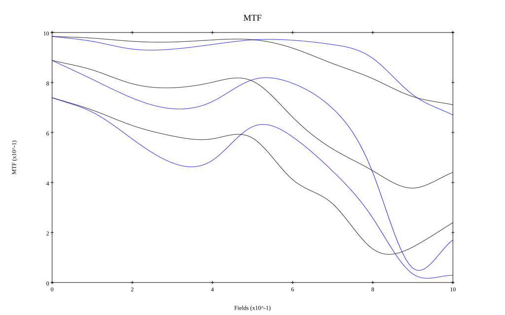

# Pansonic Leica Summilux 28mm f1.7 Asph (Leica Q2)
## Patent Information
| Country | Patent Number | Example | Year of Application | Inventors | Organisation | Link |
| ---     | ---           | ---     | ---                 | ---       | ---          | ---  |
|US | US2016-0266350 | EX 1 | 2015 | Tomoko Iiyama,Masafumi Sueyoshi | Panasonic Intellectual Property Management Co Ltd | [link](https://patents.google.com/patent/US20160266350A1/en) |
## Surface Data
Note that where glass types are shown the refractive index and abbe number is as per assigned glass type

| ID  | Radius | Thickness | Diameter | nd  | vd  | Glass Make | Glass |
| --- | ---    | ---       | ---      | --- | --- | ---        | ---   |
| 1 | -111.983 | 1.4 | 33.07 | 1.56732 | 42.82 | Ohara | S-TIL26 |
| 2 | 20.9441 | 3.1601 | 27.32 |  |  |  |
| 3 | 33.3039 | 6.1681 | 27.01 | 1.881 | 40.14 | Hoya | TAFD33 |
| 4 | -131.595 | 1.6754 | 25.67 |  |  |  |
| 5 | -47.8716 | 1.0 | 24.84 | 1.60342 | 38.03 | Ohara | S-TIM5 |
| 6 | 47.8716 | 1.3489 | 22.77 |  |  |  |
| 7 | 23.7727 | 4.6431 | 21.59 | 1.59282 | 68.62 | Hoya | FCD505 |
| 8 | -76.9617 | 1.0 | 20.58 |  |  |  |
| 9 | 62.5536 | 1.8121 | 17.97 | 1.91082 | 35.25 | Hoya | TAFD35 |
| 10 | 428.7396 | 2.0 | 17.68 |  |  |  |
| 11 | AS | 6.3788 | 16.625 |  |  |  |
| 12 | -305.338 | 2.3735 | 14.48 | 1.87722 | 37.0 |  |
| 13 | -20.3412 | 0.7 | 15.05 | 1.76182 | 26.55 | Hoya | FD14 |
| 14 | -274.05 | 3.0255 | 15.96 |  |  |  |
| 15 | -22.7936 | 0.9 | 17.63 | 1.74077 | 27.76 | Hoya | FD13 |
| 16 | 55.5503 | 5.0027 | 21.59 | 1.881 | 40.14 | Hoya | TAFD33 |
| 17 | -29.5541 | 4.3357 | 23.13 |  |  |  |
| 18 | -1000.0 | 5.69 | 28.74 | 1.77271 | 49.7 |  |
| 19 | -25.6511 | 5.6658 | 29.95 |  |  |  |
| 20 | -17.7688 | 2.0 | 31.75 | 1.6825 | 33.0 |  |
| 21 | -286.769 | 2.3 | 37.36 |  |  |  |
| 22 | 0.0 | 1.4 | 40.37 | 1.5168 | 64.17 | Schott | N-BK7 |
| 23 | 0.0 | 1.0 | 40.37 |  |  |  |
## Aspherical Data
| ID  | k   | P1  | P2  | P3  | P3 | P5 | P6 | P7 | P8 | P9 | P10 |
| --- | --- | --- | --- | --- | --- | --- | --- | --- | --- | --- | --- |
| 12 | 0.0 | 0.0 | -2.2402E-5 | -1.9303E-7 | 1.9069E-9 | 3.4558E-11 | -1.627E-12 | 1.4231E-14 | 0.0 | 0.0 | 0.0 |
| 18 | 0.0 | 0.0 | -2.9558E-5 | 1.5409E-7 | -1.2879E-9 | 5.7935E-12 | -7.1839E-15 | 0.0 | 0.0 | 0.0 | 0.0 |
| 19 | 0.0 | 0.0 | -7.6352E-6 | 1.2123E-7 | -8.4175E-10 | 3.05E-12 | -1.8813E-15 | 0.0 | 0.0 | 0.0 | 0.0 |
| 20 | -1.07027 | 0.0 | 6.7212E-5 | -7.9913E-7 | 4.8994E-9 | -1.355E-11 | 1.212E-14 | 0.0 | 0.0 | 0.0 | 0.0 |
| 21 | 0.0 | 0.0 | 5.7149E-5 | -7.7127E-7 | 3.6821E-9 | -8.2455E-12 | 6.73E-15 | 0.0 | 0.0 | 0.0 | 0.0 |
## Layouts

## Spot Diagrams

## Paraxial Parameters
| parameter | value |
| ---       | ---   |
| effective_focal_length |27.083
| back_focal_length | 1.001
| optical_invariant | 6.452
| object_distance | 1.0E10
| image_distance | 1.001
| power | 0.037
| pp1_H | 15.53
| ppk_H' | -26.082
| ffl_F | -11.553
| fno | 1.757
| enp_dist_P | 14.889
| enp_radius | 7.706
| exp_dist_P' | -26.737
| exp_radius | 7.892
| m | -0
| red | -3.69230066967183E8
| n_obj | 1
| n_img | 1
| img_ht | 22.678
| obj_ang | 39.94
| obj_na | 0
| img_na | -0.274|
## Spot Analysis
| Field | Spot Mean Radius | Spot Max Radius |
| ---   | ---              | ---             |
 | Field(x=0.0, y=0.0) | 4.139 | 9.125|
 | Field(x=0.0, y=0.1) | 5.371 | 25.559|
 | Field(x=0.0, y=0.2) | 7.877 | 44.127|
 | Field(x=0.0, y=0.3) | 7.876 | 39.4|
 | Field(x=0.0, y=0.4) | 6.425 | 32.186|
 | Field(x=0.0, y=0.5) | 5.719 | 24.247|
 | Field(x=0.0, y=0.6) | 6.98 | 25.89|
 | Field(x=0.0, y=0.7) | 9.423 | 35.404|
 | Field(x=0.0, y=0.8) | 12.404 | 42.372|
 | Field(x=0.0, y=0.9) | 17.015 | 50.869|
 | Field(x=0.0, y=1.0) | 20.034 | 56.992|
## Polychromatic Geometric MTF

* 10,30,50 cycles/mm
* Black lines represent sagittal, blue tangential
* To generate above, MTFs for wavelengths 587.5618(d), 486.1327(F), 656.2725(C) were calculated across 10 fields, and then averaged
## Polychromatic Geometric MTF (Weighted)

* 10,30,50 cycles/mm
* Black lines represent sagittal, blue tangential
* To generate above, MTFs for wavelengths 587.5618(d) wt(1.0), 656.2725(C) wt(0.475), 546.074(e) wt(0.98), 486.1327(F) wt(0.49), 435.8343(g) wt(0.15) were calculated across 10 fields, and then combined using weighted average
## Resources
* [OpticalBench Compatible Data File, tab delimited](./US20160266350_Example01P.txt)
* [Zemax file](./US20160266350_Example01P.zmx)
