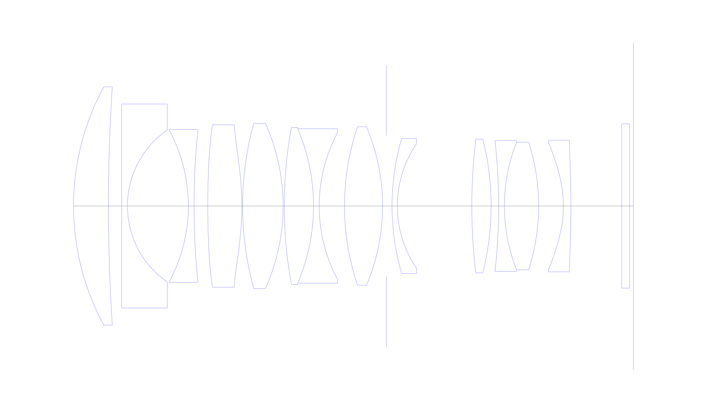
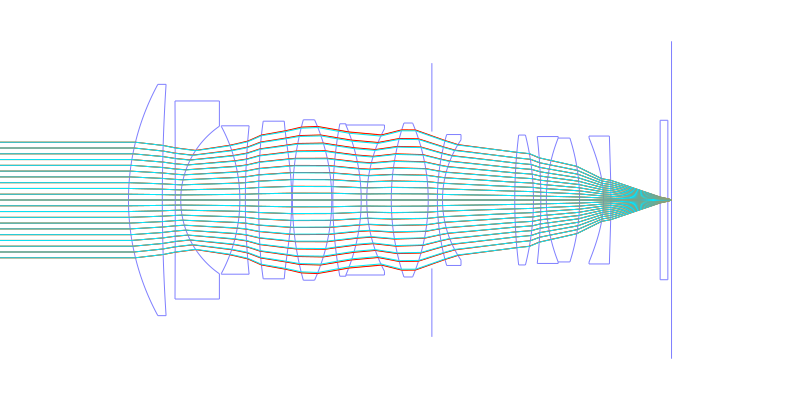
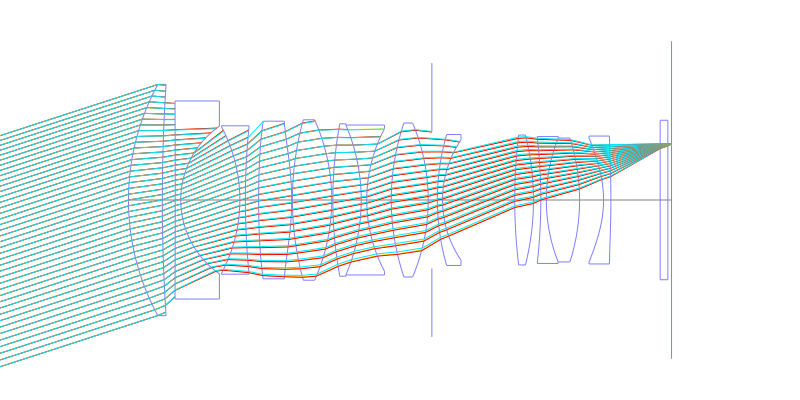
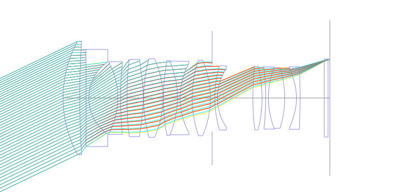
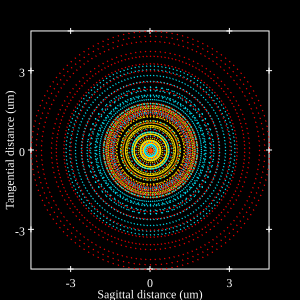
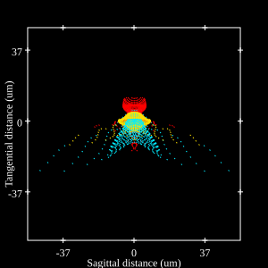
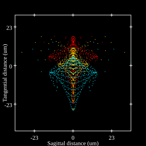
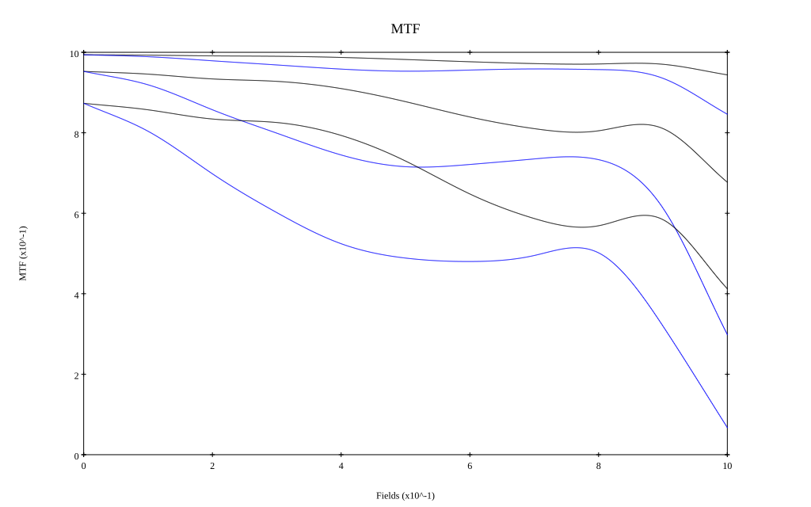
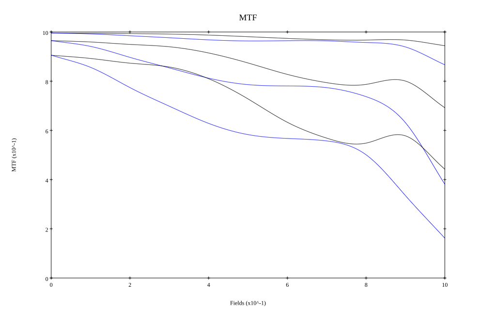

# Panasonic Lumix S Pro 50mm f1.4
## Patent Information
| Country | Patent Number | Example | Year of Application | Inventors | Organisation | Link |
| ---     | ---           | ---     | ---                 | ---       | ---          | ---  |
|US | US12061376 | EX 3 | 2020 | Shunichiro Yoshinaga, Yasuto Suzuki | Panasonic Intellectual Property Management Co Ltd  | [link](https://patents.google.com/patent/US12061376B2/en) |
## Surface Data
Note that where glass types are shown the refractive index and abbe number is as per assigned glass type

| ID  | Radius | Thickness | Diameter | nd  | vd  | Glass Make | Glass |
| --- | ---    | ---       | ---      | --- | --- | ---        | ---   |
| 1 | 66.0605 | 9.2236 | 63.04 | 1.92286 | 20.88 | Hoya | E-FDS1 |
| 2 | 485.5991 | 3.5225 | 63.04 |  |  |  |
| 3 | -5608.8306 | 1.5 | 53.98 | 1.5168 | 64.2 | Hoya | BSC7 |
| 4 | 24.4639 | 16.1084 | 40.22 |  |  |  |
| 5 | -42.3161 | 1.5 | 40.12 | 1.58144 | 40.89 | Hoya | E-FL5 |
| 6 | 200.323 | 3.6265 | 40.44 |  |  |  |
| 7 | 249.4497 | 9.0 | 42.96 | 1.80755 | 40.9 |  |
| 8 | -75.216 | 0.2 | 42.96 |  |  |  |
| 9 | 81.9815 | 10.7154 | 43.72 | 1.59282 | 68.62 | Hoya | FCD515 |
| 10 | -53.4384 | 0.3 | 43.72 |  |  |  |
| 11 | 114.347 | 7.7332 | 41.54 | 1.59282 | 68.62 | Hoya | FCD515 |
| 12 | -52.0541 | 1.51 | 40.88 | 1.85478 | 24.8 | Ohara | S-NBH56 |
| 13 | 41.4126 | 6.6853 | 38.8 |  |  |  |
| 14 | 65.4872 | 10.0635 | 41.96 | 1.8042 | 46.5 | Hoya | TAF3 |
| 15 | -53.8185 | 1.0 | 41.82 |  |  |  |
| 16 | AS | 1.5 | 37.302 |  |  |  |
| 17 | 64.1418 | 1.4 | 35.68 | 1.71736 | 29.5 | Hoya | E-FD1 |
| 18 | 29.2025 | 19.687 | 32.8 |  |  |  |
| 19 | 147.4207 | 5.1 | 35.4 | 1.94594 | 17.98 | Hoya | FDS18 |
| 20 | -72.6539 | 2.0 | 35.4 |  |  |  |
| 21 | -154.2306 | 1.51 | 34.58 | 1.56732 | 42.84 | Hoya | E-FL6 |
| 22 | 45.8027 | 9.0554 | 33.76 | 1.55032 | 75.5 | Hoya | FCD705 |
| 23 | -55.2867 | 6.539 | 33.76 |  |  |  |
| 24 | -30.7259 | 2.0 | 33.9 | 1.68822 | 31.1 |  |
| 25 | -215.5886 | 13.42 | 34.86 |  |  |  |
| 26 | 0.0 | 2.1 | 43.46 | 1.5168 | 64.2 | Hoya | BSC7 |
| 27 | 0.0 | 1.0042 | 43.46 |  |  |  |
## Aspherical Data
| ID  | k   | P1  | P2  | P3  | P3 | P5 | P6 | P7 | P8 | P9 | P10 |
| --- | --- | --- | --- | --- | --- | --- | --- | --- | --- | --- | --- |
| 7 | 0.0 | 0.0 | 4.04714E-7 | 2.58016E-9 | 4.51006E-12 | -1.10997E-14 | 0.0 | 0.0 | 0.0 | 0.0 | 0.0 |
| 8 | 0.0 | 0.0 | 3.8726E-6 | 1.87609E-9 | 7.45815E-12 | -1.12514E-14 | 0.0 | 0.0 | 0.0 | 0.0 | 0.0 |
| 24 | 0.0 | 0.0 | 1.32764E-5 | 9.38299E-9 | -5.0085E-11 | 7.82519E-14 | 0.0 | 0.0 | 0.0 | 0.0 | 0.0 |
| 25 | 0.0 | 0.0 | 3.61044E-6 | 5.93299E-9 | -4.07704E-11 | 5.45033E-14 | 0.0 | 0.0 | 0.0 | 0.0 | 0.0 |
## Layouts

## Spot Diagrams

## Paraxial Parameters
| parameter | value |
| ---       | ---   |
| effective_focal_length |49.001
| back_focal_length | 1.005
| optical_invariant | 8.015
| object_distance | 1.0E10
| image_distance | 1.005
| power | 0.02
| pp1_H | 60.373
| ppk_H' | -47.996
| ffl_F | 11.371
| fno | 1.471
| enp_dist_P | 59.076
| enp_radius | 16.661
| exp_dist_P' | -49.327
| exp_radius | 17.114
| m | -0
| red | -2.040770382573206E8
| n_obj | 1
| n_img | 1
| img_ht | 23.571
| obj_ang | 25.689
| obj_na | 0
| img_na | -0.322|
## Spot Analysis
| Field | Spot Mean Radius | Spot Max Radius |
| ---   | ---              | ---             |
 | Field(x=0.0, y=0.0) | 2.223 | 4.945|
 | Field(x=0.0, y=0.1) | 2.871 | 10.177|
 | Field(x=0.0, y=0.2) | 3.861 | 16.165|
 | Field(x=0.0, y=0.3) | 4.482 | 20.689|
 | Field(x=0.0, y=0.4) | 5.203 | 20.582|
 | Field(x=0.0, y=0.5) | 5.65 | 20.721|
 | Field(x=0.0, y=0.6) | 5.69 | 22.204|
 | Field(x=0.0, y=0.7) | 5.769 | 23.872|
 | Field(x=0.0, y=0.8) | 5.926 | 24.421|
 | Field(x=0.0, y=0.9) | 6.725 | 27.002|
 | Field(x=0.0, y=1.0) | 10.066 | 32.141|
## Polychromatic Geometric MTF

* 10,30,50 cycles/mm
* Black lines represent sagittal, blue tangential
* To generate above, MTFs for wavelengths 587.5618(d), 486.1327(F), 656.2725(C) were calculated across 10 fields, and then averaged
## Polychromatic Geometric MTF (Weighted)

* 10,30,50 cycles/mm
* Black lines represent sagittal, blue tangential
* To generate above, MTFs for wavelengths 587.5618(d) wt(1.0), 656.2725(C) wt(0.475), 546.074(e) wt(0.98), 486.1327(F) wt(0.49), 435.8343(g) wt(0.15) were calculated across 10 fields, and then combined using weighted average
## Resources
* [OpticalBench Compatible Data File, tab delimited](./WO2020-158622_Example03.txt)
* [Zemax file](./WO2020-158622_Example03.zmx)
