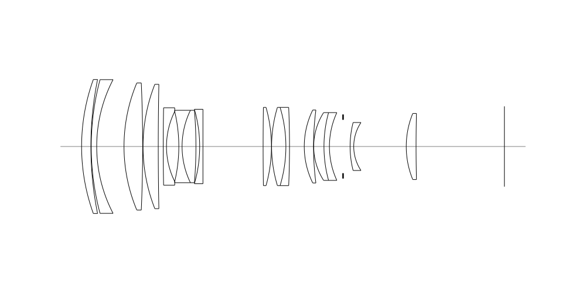
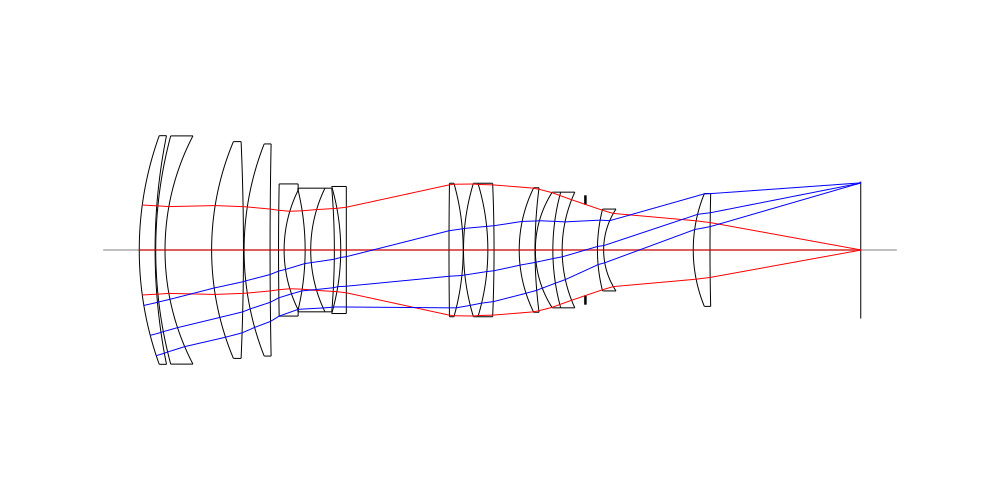
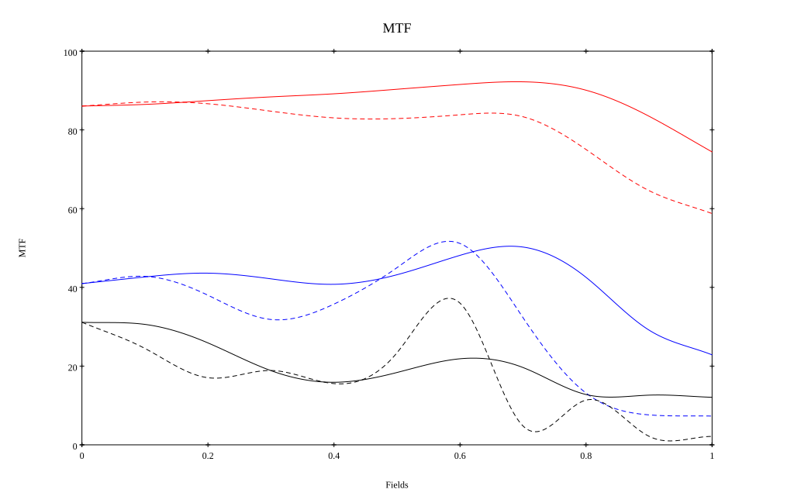
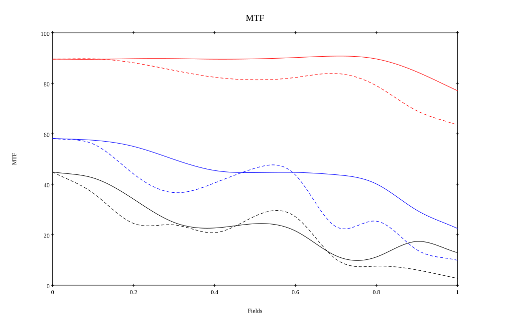
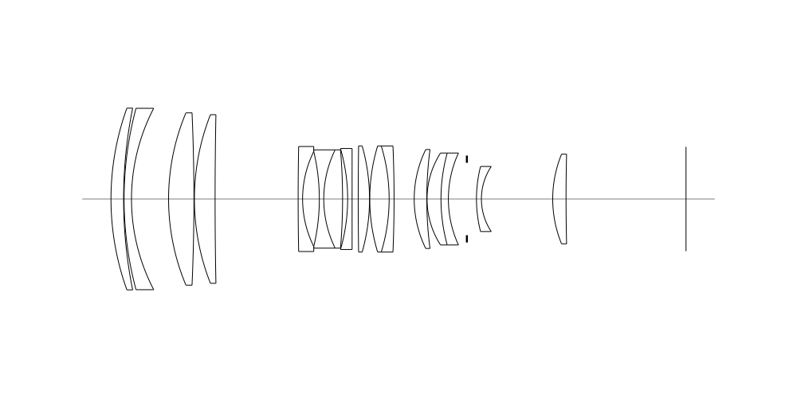
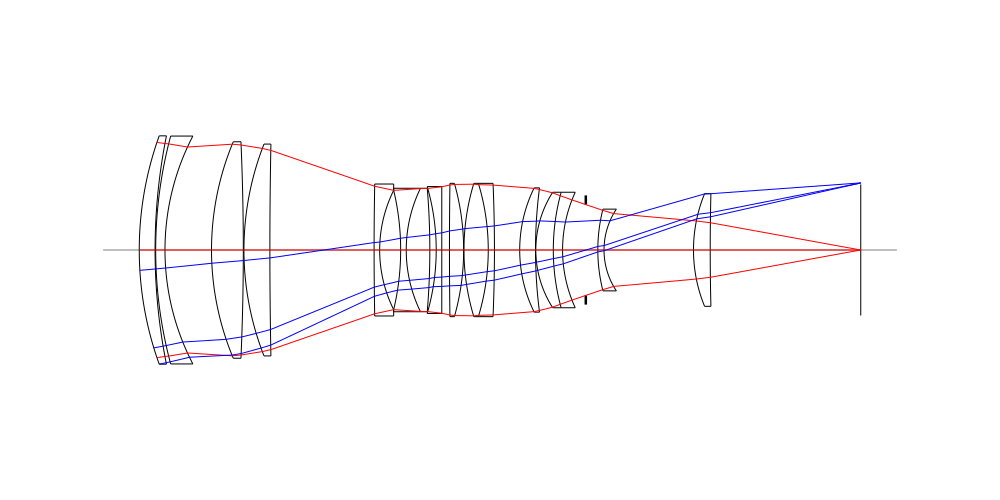
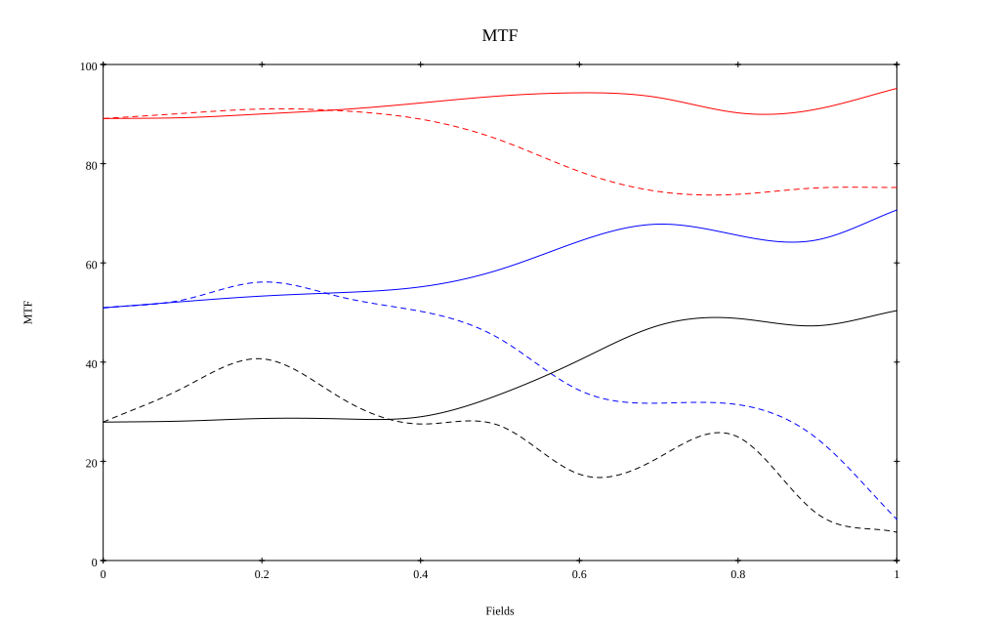
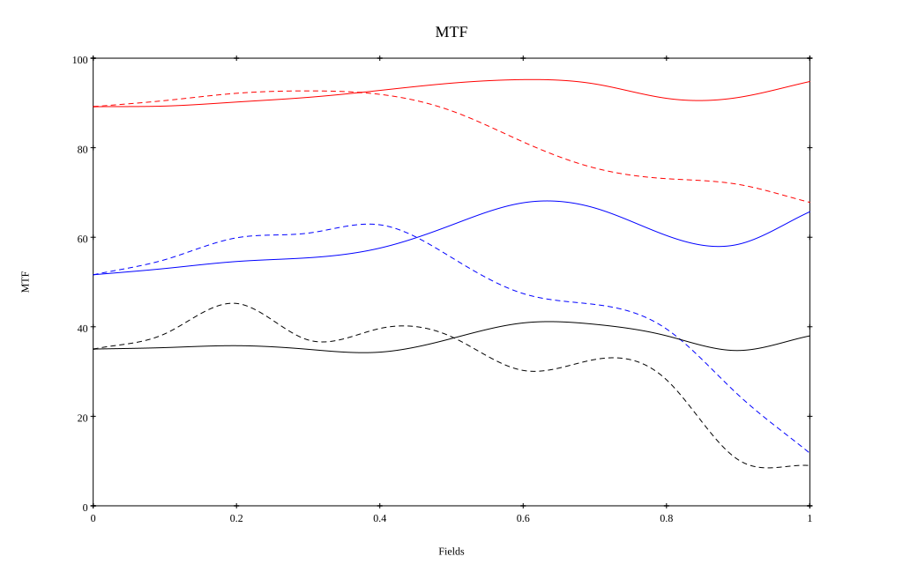

# SMC Pentax-FA* 80-200mm F2.8 ED-IF
## Patent Information
| Country | Patent Number | Example | Year of Application | Inventors | Organisation | Link |
| ---     | ---           | ---     | ---                 | ---       | ---          | ---  |
|US | US5572276 | 5 | 1993 | Jun Hirakawa | Asahi Kogaku Kogyo Co Ltd | [link](https://patents.google.com/patent/US5572276A/en) |
## Surface Data
Note that where glass types are shown the refractive index and abbe number is as per assigned glass type

| ID  | Radius | Thickness | Diameter | nd  | vd  | Glass Make | Glass |
| --- | ---    | ---       | ---      | --- | --- | ---        | ---   |
| 1 | 108.664 | 5.11 | 73.74 | 1.6968 | 55.46 | Hoya | LAC14 |
| 2 | 186.977 | 0.2 | 73.74 |  |  |  |
| 3 | 142.5 | 3.0 | 73.6 | 1.80518 | 25.46 | Hoya | FD60 |
| 4 | 79.717 | 15.03 | 73.6 |  |  |  |
| 5 | 90.458 | 10.27 | 69.92 | 1.497 | 81.61 | Hoya | FCD1 |
| 6 | -800.0 | 0.2 | 69.92 |  |  |  |
| 7 | 93.5 | 8.38 | 68.42 | 1.497 | 81.61 | Hoya | FCD1 |
| 8 | 1751.974 | d8 | 68.42 |  |  |  |
| 9 | 1123.68 | 1.8 | 42.62 | 1.60311 | 60.69 | Hoya | BACD14 |
| 10 | 43.3 | 6.78 | 38.528 |  |  |  |
| 11 | -83.29 | 1.8 | 38.528 | 1.6968 | 55.46 | Hoya | LAC14 |
| 12 | 45.57 | 7.62 | 39.88 | 1.80518 | 25.46 | Hoya | FD60 |
| 13 | -238.573 | 2.06 | 39.88 |  |  |  |
| 14 | -73.562 | 1.8 | 40.98 | 1.8061 | 40.93 | Ohara | S-LAH53 |
| 15 | 0.0 | d15 | 40.98 |  |  |  |
| 16 | 1500.0 | 4.58 | 43.06 | 1.6968 | 55.46 | Hoya | LAC14 |
| 17 | -79.199 | 0.1 | 43.06 |  |  |  |
| 18 | 74.215 | 7.85 | 43.06 | 1.48749 | 70.21 | Ohara | FSL5 |
| 19 | -74.215 | 2.0 | 43.06 | 1.76182 | 26.55 | Hoya | FD14 |
| 20 | -512.0 | d20 | 43.06 |  |  |  |
| 21 | 45.47 | 5.1 | 40.14 | 1.497 | 81.61 | Hoya | FCD1 |
| 22 | 156.0 | 0.1 | 40.14 |  |  |  |
| 23 | 34.619 | 5.65 | 37.31 | 1.48749 | 70.21 | Ohara | FSL5 |
| 24 | 70.0 | 3.0 | 37.31 | 1.6425 | 58.37 | Ohara | BSM36 |
| 25 | 44.7 | 7.5 | 37.31 |  |  |  |
| 26 | AS | 3.88 | 29.389 |  |  |  |
| 27 | 53.554 | 2.0 | 26.4 | 1.83481 | 42.72 | Hoya | TAFD5F |
| 28 | 23.86 | 28.9 | 26.4 |  |  |  |
| 29 | 48.0 | 5.4 | 36.38 | 1.48749 | 70.21 | Ohara | FSL5 |
| 30 | 737.998 | d30 | 36.38 |  |  |  |
## Variables
| Variable | 80mm f2.8 | 200mm f2.8 |
| --- | --- | --- |
| Focal length |81.62 |195.0 |
| F-Number |2.8 |2.8 |
| Angle of View |30.4 |12.4 |
| d8 | 2.73 | 33.66 |
| d15 | 33.115 | 2.48 |
| d20 | 8.116 | 8.16 |
| d30 | 48.62 | 48.62 |
# 80mm f2.8
## Layouts

## Spot Diagrams

## Paraxial Parameters
| parameter | value |
| ---       | ---   |
| effective_focal_length |81.371
| back_focal_length | 48.791
| optical_invariant | 3.942
| object_distance | 1.0E10
| image_distance | 48.791
| power | 0.012
| pp1_H | 119.912
| ppk_H' | -32.579
| ffl_F | 38.542
| fno | 2.804
| enp_dist_P | 104.155
| enp_radius | 14.508
| exp_dist_P' | -51.949
| exp_radius | 17.992
| m | -0
| red | -1.2289443185127695E8
| n_obj | 1
| n_img | 1
| img_ht | 22.108
| obj_ang | 15.2
| obj_na | 0
| img_na | -0.178|
## Spot Analysis
| Field | Spot Mean Radius | Spot Max Radius |
| ---   | ---              | ---             |
 | Field(x=0.0, y=0.0) | 12.904 | 33.856|
 | Field(x=0.0, y=0.1) | 12.556 | 39.008|
 | Field(x=0.0, y=0.2) | 12.299 | 38.012|
 | Field(x=0.0, y=0.3) | 12.319 | 35.594|
 | Field(x=0.0, y=0.4) | 12.465 | 32.322|
 | Field(x=0.0, y=0.5) | 12.297 | 36.662|
 | Field(x=0.0, y=0.6) | 11.684 | 36.136|
 | Field(x=0.0, y=0.7) | 11.439 | 30.192|
 | Field(x=0.0, y=0.8) | 14.374 | 53.862|
 | Field(x=0.0, y=0.9) | 18.727 | 69.851|
 | Field(x=0.0, y=1.0) | 21.35 | 65.95|
## Polychromatic Geometric MTF

* 10=red,30=blue,50=black cycles/mm
* Solid lines represent sagittal, dashed lines tangential
* To generate above, MTFs for wavelengths 587.5618(d), 486.1327(F), 656.2725(C) were calculated across 10 fields, and then averaged
## Polychromatic Geometric MTF (Weighted)

* 10=red,30=blue,50=black cycles/mm
* Solid lines represent sagittal, dashed lines tangential
* To generate above, MTFs for wavelengths 587.5618(d) wt(1.0), 656.2725(C) wt(0.475), 546.074(e) wt(0.98), 486.1327(F) wt(0.49), 435.8343(g) wt(0.15) were calculated across 10 fields, and then combined using weighted average
# 200mm f2.8
## Layouts

## Spot Diagrams

## Paraxial Parameters
| parameter | value |
| ---       | ---   |
| effective_focal_length |194.842
| back_focal_length | 48.642
| optical_invariant | 3.783
| object_distance | 1.0E10
| image_distance | 48.642
| power | 0.005
| pp1_H | 96.091
| ppk_H' | -146.2
| ffl_F | -98.751
| fno | 2.797
| enp_dist_P | 278.012
| enp_radius | 34.825
| exp_dist_P' | -52.098
| exp_radius | 18.01
| m | -0
| red | -5.132357707642112E7
| n_obj | 1
| n_img | 1
| img_ht | 21.167
| obj_ang | 6.2
| obj_na | 0
| img_na | -0.179|
## Spot Analysis
| Field | Spot Mean Radius | Spot Max Radius |
| ---   | ---              | ---             |
 | Field(x=0.0, y=0.0) | 10.596 | 31.573|
 | Field(x=0.0, y=0.1) | 10.439 | 35.245|
 | Field(x=0.0, y=0.2) | 10.193 | 33.343|
 | Field(x=0.0, y=0.3) | 10.303 | 31.117|
 | Field(x=0.0, y=0.4) | 10.777 | 35.799|
 | Field(x=0.0, y=0.5) | 12.09 | 49.333|
 | Field(x=0.0, y=0.6) | 14.783 | 72.233|
 | Field(x=0.0, y=0.7) | 19.06 | 100.512|
 | Field(x=0.0, y=0.8) | 24.689 | 134.618|
 | Field(x=0.0, y=0.9) | 19.589 | 102.549|
 | Field(x=0.0, y=1.0) | 13.302 | 31.382|
## Polychromatic Geometric MTF

* 10=red,30=blue,50=black cycles/mm
* Solid lines represent sagittal, dashed lines tangential
* To generate above, MTFs for wavelengths 587.5618(d), 486.1327(F), 656.2725(C) were calculated across 10 fields, and then averaged
## Polychromatic Geometric MTF (Weighted)

* 10=red,30=blue,50=black cycles/mm
* Solid lines represent sagittal, dashed lines tangential
* To generate above, MTFs for wavelengths 587.5618(d) wt(1.0), 656.2725(C) wt(0.475), 546.074(e) wt(0.98), 486.1327(F) wt(0.49), 435.8343(g) wt(0.15) were calculated across 10 fields, and then combined using weighted average
## Resources
* [OpticalBench Compatible Data File, tab delimited](./prescription.txt)
* [Zemax file](./US005572276_Example05P.zmx)

Report / Zemax file generated using [Beam42](https://github.com/BeamFour/Beam42) on 2026-08-26
