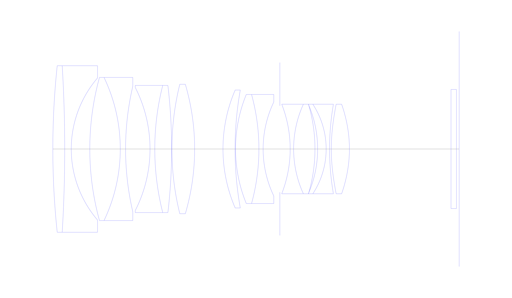
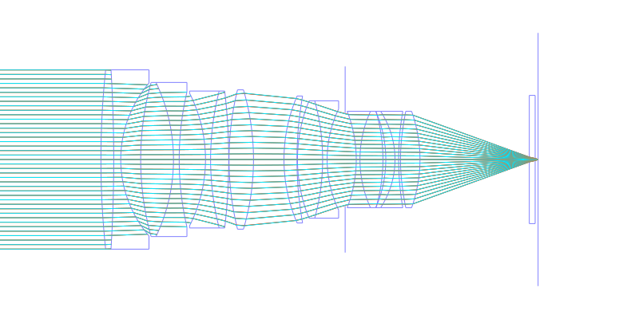
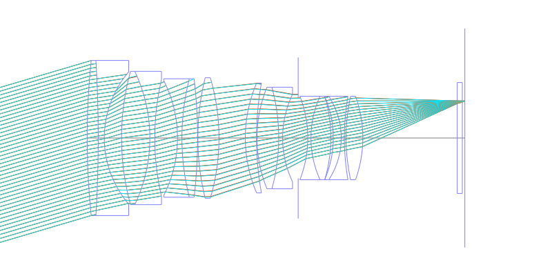
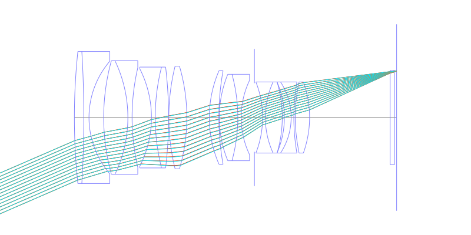
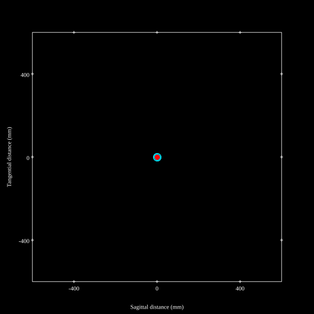
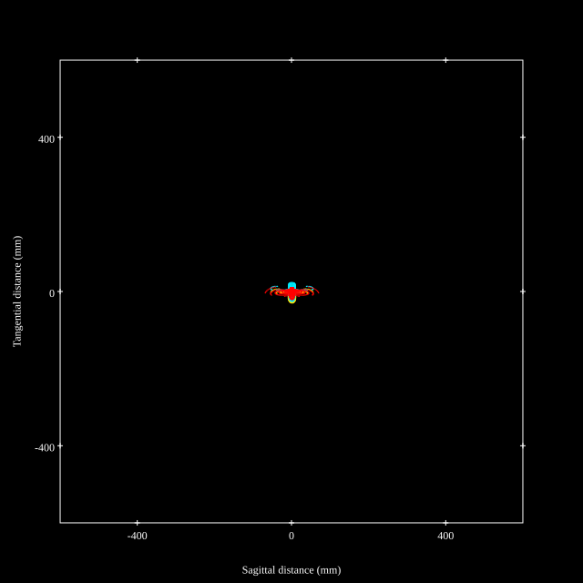
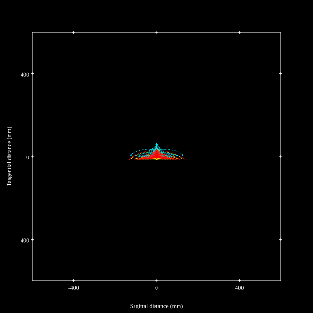
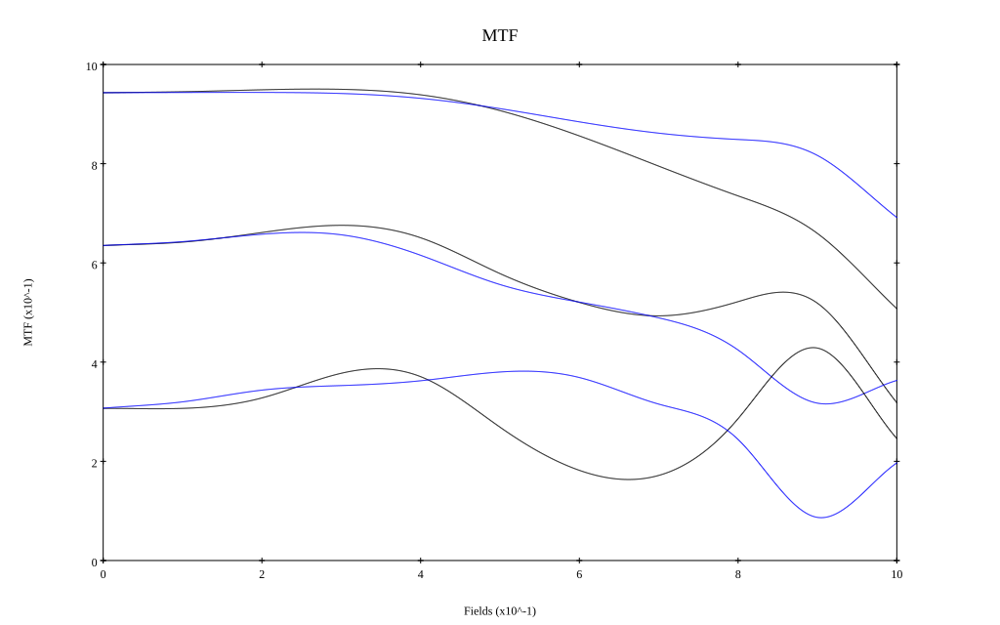
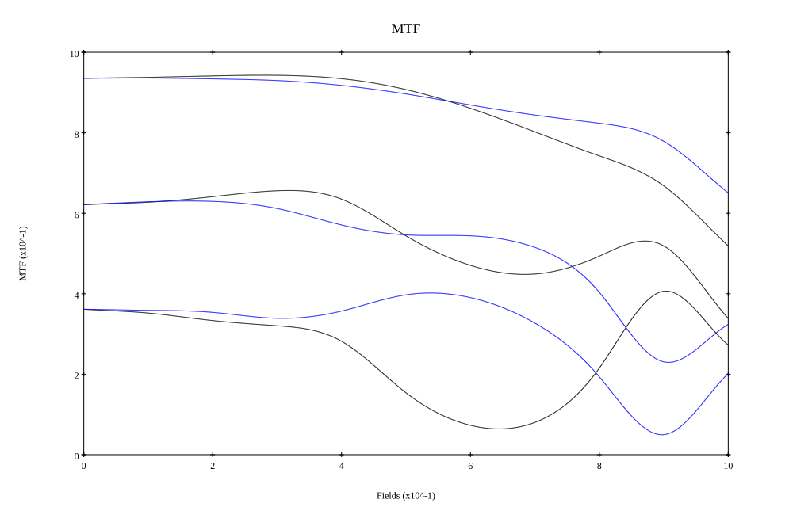

# Ricoh HD PENTAX-D FA★50mmF1.4 SDM AW / Tokina Opera 50mm f1.4 FF
## Patent Information
| Country | Patent Number | Example | Year of Application | Inventors | Organisation | Link |
| ---     | ---           | ---     | ---                 | ---       | ---          | ---  |
|US | US 2019/0250367 | EX 1 | 2018 | Minoru Murayama | Ricoh Co Ltd  | [link](https://patents.google.com/patent/US20190250367A1/en) |
## Surface Data
Note that where glass types are shown the refractive index and abbe number is as per assigned glass type

| ID  | Radius | Thickness | Diameter | nd  | vd  | Glass Make | Glass |
| --- | ---    | ---       | ---      | --- | --- | ---        | ---   |
| 1 | 292.188 | 4.368 | 61.3 | 1.60342 | 38.03 | Ohara | S-TIM5 |
| 2 | -508.04 | 2.4 | 61.3 | 1.6134 | 44.27 | Ohara | S-NBM51 |
| 3 | 40.248 | 6.809 | 52.28 |  |  |  |
| 4 | 99.387 | 11.193 | 52.7 | 1.91082 | 35.25 | Hoya | TAFD35 |
| 5 | -61.124 | 1.95 | 52.7 | 1.6134 | 44.27 | Ohara | S-NBM51 |
| 6 | 102.023 | 8.974 | 46.14 |  |  |  |
| 7 | -50.023 | 1.75 | 45.32 | 1.72047 | 34.7 | Schott | N-KZFS8 |
| 8 | 95.253 | 6.188 | 46.82 | 1.618 | 63.33 | Ohara | S-PHM52 |
| 9 | -199.658 | 0.1 | 46.82 |  |  |  |
| 10 | 99.222 | 8.352 | 47.64 | 1.83481 | 42.73 | Ohara | S-LAH55V |
| 11 | -84.561 | 10.407 | 47.64 |  |  |  |
| 12 | 54.801 | 4.434 | 43.4 | 1.8515 | 40.78 | Ohara | S-LAH89 |
| 13 | 123.303 | 0.183 | 43.4 |  |  |  |
| 14 | 53.021 | 8.578 | 40.14 | 1.59522 | 67.74 | Ohara | S-FPM2 |
| 15 | -75.909 | 1.55 | 40.14 | 1.60342 | 38.03 | Ohara | S-TIM5 |
| 16 | 40.154 | 6.141 | 34.57 |  |  |  |
| 17 | AS | 3.791 | 31.828 |  |  |  |
| 18 | -45.293 | 1.27 | 32.96 | 1.60342 | 38.03 | Ohara | S-TIM5 |
| 19 | 39.736 | 7.837 | 32.96 | 1.59522 | 67.74 | Ohara | S-FPM2 |
| 20 | -57.921 | 0.978 | 32.96 |  |  |  |
| 21 | -41.379 | 3.134 | 32.96 | 1.883 | 40.77 | Ohara | S-LAH58 |
| 22 | -30.183 | 1.25 | 32.96 | 1.56732 | 42.82 | Ohara | S-TIL26 |
| 23 | 96.931 | 0.632 | 32.96 |  |  |  |
| 24 | 67.722 | 6.658 | 32.96 | 1.7725 | 49.6 | Ohara | S-LAH66 |
| 25 | -47.005 | 37.31 | 32.96 |  |  |  |
| 26 | 0.0 | 2.0 | 43.84 | 1.51633 | 64.14 | Ohara | S-BSL7 |
| 27 | 0.0 | 1.0 | 43.84 |  |  |  |
## Aspherical Data
| ID  | k   | P1  | P2  | P3  | P3 | P5 | P6 | P7 | P8 | P9 | P10 |
| --- | --- | --- | --- | --- | --- | --- | --- | --- | --- | --- | --- |
| 24 | 0.0 | 0.0 | -3.057E-6 | -2.56E-9 | 1.404E-11 | -3.622E-14 | 0.0 | 0.0 | 0.0 | 0.0 | 0.0 |
| 25 | 0.0 | 0.0 | 2.344E-6 | -4.523E-9 | 1.659E-11 | -3.687E-14 | 0.0 | 0.0 | 0.0 | 0.0 | 0.0 |
## Layouts

## Spot Diagrams

## Paraxial Parameters
| parameter | value |
| ---       | ---   |
| effective_focal_length |49.567
| back_focal_length | 1.001
| optical_invariant | 7.432
| object_distance | 1.0E10
| image_distance | 1.001
| power | 0.02
| pp1_H | 63.554
| ppk_H' | -48.567
| ffl_F | 13.987
| fno | 1.45
| enp_dist_P | 51.071
| enp_radius | 17.092
| exp_dist_P' | -65.251
| exp_radius | 22.846
| m | -0
| red | -2.0174589572780803E8
| n_obj | 1
| n_img | 1
| img_ht | 21.552
| obj_ang | 23.5
| obj_na | 0
| img_na | -0.326|
## Spot Analysis
| Field | Spot Mean Radius | Spot Max Radius |
| ---   | ---              | ---             |
 | Field(x=0.0, y=0.0) | 7.416 | 18.204|
 | Field(x=0.0, y=0.1) | 7.084 | 19.065|
 | Field(x=0.0, y=0.2) | 6.859 | 21.4|
 | Field(x=0.0, y=0.3) | 6.922 | 22.584|
 | Field(x=0.0, y=0.4) | 7.758 | 22.494|
 | Field(x=0.0, y=0.5) | 9.589 | 35.784|
 | Field(x=0.0, y=0.6) | 12.049 | 51.477|
 | Field(x=0.0, y=0.7) | 15.268 | 69.213|
 | Field(x=0.0, y=0.8) | 19.512 | 88.489|
 | Field(x=0.0, y=0.9) | 26.031 | 109.927|
 | Field(x=0.0, y=1.0) | 36.814 | 133.903|
## Polychromatic Geometric MTF

* 10,30,50 cycles/mm
* Black lines represent sagittal, blue tangential
* To generate above, MTFs for wavelengths 587.5618(d), 486.1327(F), 656.2725(C) were calculated across 10 fields, and then averaged
## Polychromatic Geometric MTF (Weighted)

* 10,30,50 cycles/mm
* Black lines represent sagittal, blue tangential
* To generate above, MTFs for wavelengths 587.5618(d) wt(1.0), 656.2725(C) wt(0.475), 546.074(e) wt(0.98), 486.1327(F) wt(0.49), 435.8343(g) wt(0.15) were calculated across 10 fields, and then combined using weighted average
## Resources
* [OpticalBench Compatible Data File, tab delimited](./US20190250367_Example01P.txt)
* [Zemax file](./US20190250367_Example01P.zmx)
