# Sigma 120-300mm F2.8 DG OS HSM Sport
## Surface Data
Note that where glass types are shown the refractive index and abbe number is as per assigned glass type

| ID  | Radius | Thickness | Diameter | nd  | vd  | Glass Make | Glass |
| --- | ---    | ---       | ---      | --- | --- | ---        | ---   |
| 1 | 296.1563 | 3.5 | 99.9 | 1.8061 | 33.27 | Hoya | NBFD15 |
| 2 | 151.5152 | 0.15 | 98.742 |  |  |  |
| 3 | 151.5152 | 14.5835 | 98.788 | 1.437 | 95.1 | Hoya | FCD100 |
| 4 | -323.1248 | 0.15 | 98.746 |  |  |  |
| 5 | 121.9843 | 11.1548 | 96.522 | 1.437 | 95.1 | Hoya | FCD100 |
| 6 | 816.7428 | d6 | 95.568 |  |  |  |
| 7 | 106.172 | 9.7057 | 62.36 | 1.76182 | 26.55 | Hoya | FD14 |
| 8 | -241.5127 | 2.0 | 60.286 | 1.48749 | 70.44 | Hoya | FC5 |
| 9 | 169.1358 | 4.4143 | 55.572 |  |  |  |
| 10 | 269.5277 | 1.8 | 52.516 | 1.72916 | 54.67 | Hoya | TAC8 |
| 11 | 93.0684 | 4.2351 | 50.206 |  |  |  |
| 12 | -465.295 | 1.75 | 50.14 | 1.8042 | 46.5 | Hoya | TAF3 |
| 13 | 109.5567 | 5.981 | 48.74 |  |  |  |
| 14 | -95.159 | 1.75 | 48.732 | 1.8042 | 46.5 | Hoya | TAF3 |
| 15 | 422.3129 | d15 | 49.678 |  |  |  |
| 16 | 335.5392 | 8.4477 | 52.0 | 1.48749 | 70.44 | Hoya | FC5 |
| 17 | -61.4768 | 1.75 | 52.34 | 1.8061 | 33.27 | Hoya | NBFD15 |
| 18 | -94.9507 | 0.15 | 53.6 |  |  |  |
| 19 | 407.3899 | 3.239 | 54.288 | 1.5168 | 64.2 | Hoya | BSC7 |
| 20 | -407.3899 | d20 | 54.354 |  |  |  |
| 21 | 59.052 | 9.0346 | 54.394 | 1.497 | 81.61 | Hoya | FCD1 |
| 22 | -859.0671 | 8.2482 | 53.732 |  |  |  |
| 23 | 49.7493 | 8.0 | 45.958 | 1.7725 | 49.62 | Hoya | TAF1 |
| 24 | 83.0967 | 2.4272 | 42.136 |  |  |  |
| 25 | 661.9343 | 2.2 | 42.092 | 1.8061 | 33.27 | Hoya | NBFD15 |
| 26 | 30.9722 | 7.4489 | 37.798 | 1.48749 | 70.44 | Hoya | FC5 |
| 27 | 72.177 | 8.1747 | 36.706 |  |  |  |
| 28 | AS | 9.3966 | 35.4 |  |  |  |
| 29 | 54.6204 | 6.0034 | 32.96 | 1.713 | 53.94 | Hoya | LAC8 |
| 30 | 1000.0 | 5.0 | 31.8 |  |  |  |
| 31 | 514.6967 | 4.014 | 31.228 | 1.80518 | 25.46 | Hoya | FD60 |
| 32 | -55.332 | 1.0 | 30.968 | 1.48749 | 70.44 | Hoya | FC5 |
| 33 | 37.4105 | 4.7078 | 28.912 |  |  |  |
| 34 | -63.8576 | 1.0 | 28.896 | 1.713 | 53.94 | Hoya | LAC8 |
| 35 | 47.0346 | 3.8 | 29.572 |  |  |  |
| 36 | 82.0066 | 6.1165 | 31.612 | 1.58144 | 40.89 | Hoya | FL5 |
| 37 | -63.082 | 0.15 | 32.4 |  |  |  |
| 38 | 68.7019 | 8.2426 | 33.594 | 1.48749 | 70.44 | Hoya | FC5 |
| 39 | -39.107 | 1.2 | 33.628 | 1.834 | 37.35 | Hoya | NBFD10 |
| 40 | 172.0806 | 0.15 | 34.736 |  |  |  |
| 41 | 59.868 | 5.3635 | 35.816 | 1.54072 | 47.2 | Hoya | FEL2 |
| 42 | -672.9107 | d42 | 36.062 |  |  |  |
## Variables
| Variable | 120mm f2.8 | 300mm f2.8 |
| --- | --- | --- |
| Focal length |123.75 |289.47 |
| F-Number |2.9 |2.9 |
| Angle of View |19.8 |8.5 |
| d6 | 2.4995 | 67.4995 |
| d15 | 42.9416 | 4.3462 |
| d20 | 52.8452 | 26.4406 |
| d42 | 55.27 | 55.27 |
# 120mm f2.8
## Layouts
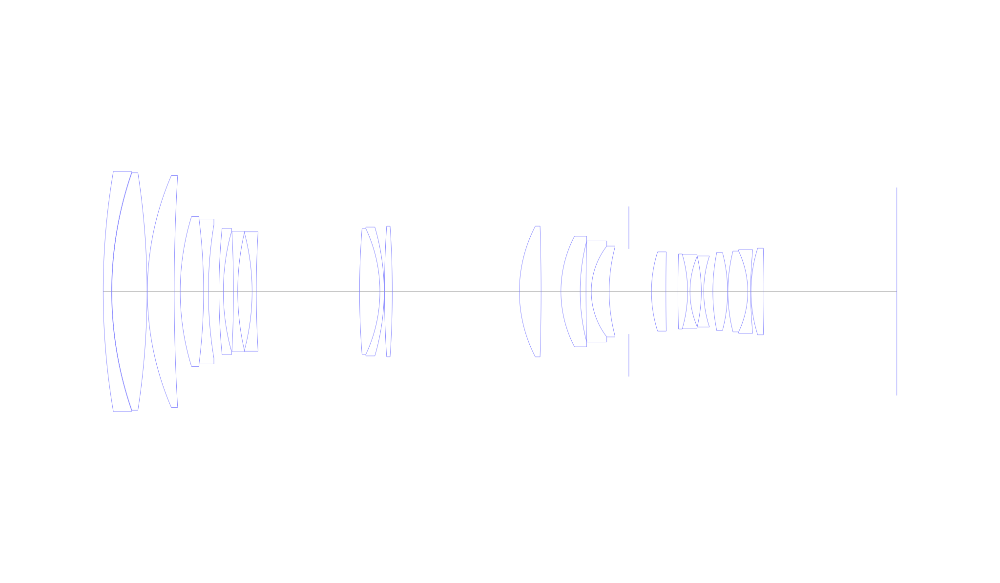
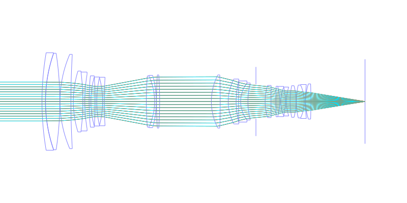
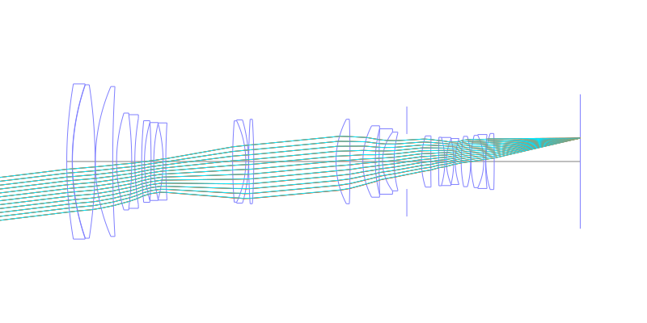
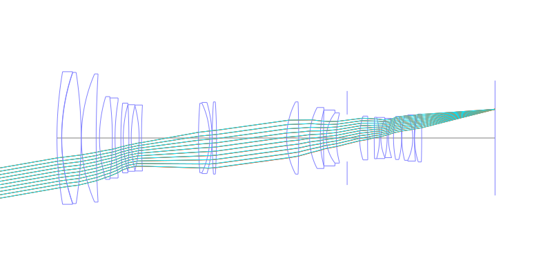
## Spot Diagrams
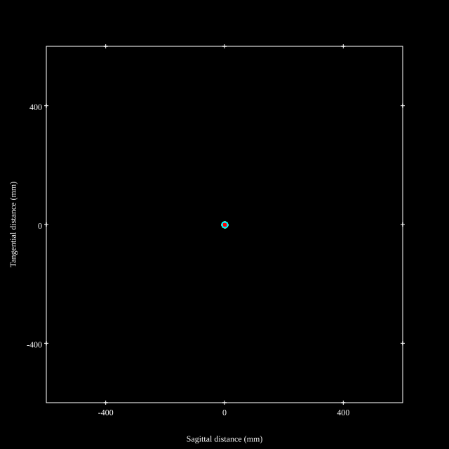
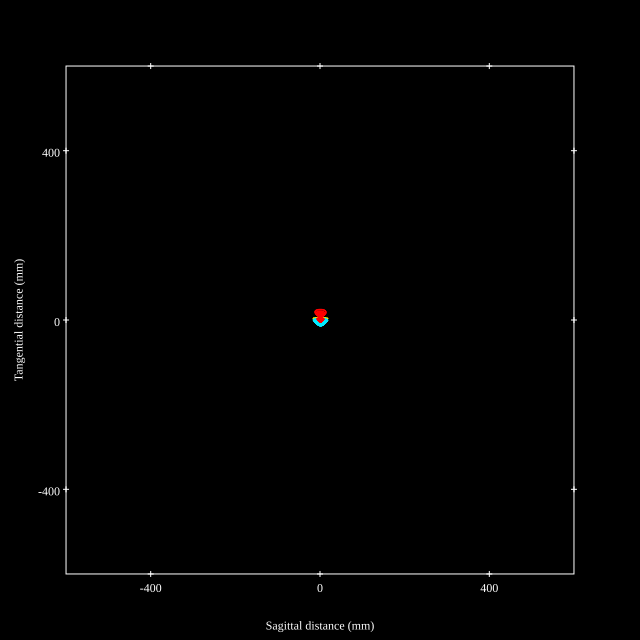
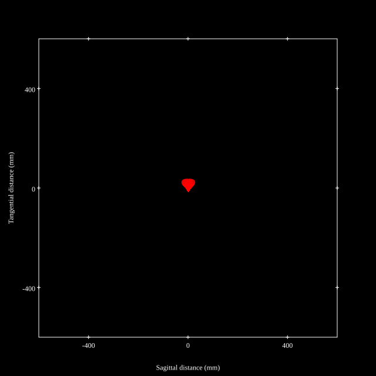
## Paraxial Parameters
| parameter | value |
| ---       | ---   |
| effective_focal_length |123.749
| back_focal_length | 55.273
| optical_invariant | 3.728
| object_distance | 1.0E10
| image_distance | 55.273
| power | 0.008
| pp1_H | 155.738
| ppk_H' | -68.476
| ffl_F | 31.989
| fno | 2.897
| enp_dist_P | 182.086
| enp_radius | 21.36
| exp_dist_P' | -46.749
| exp_radius | 17.611
| m | -0
| red | -8.080878141753207E7
| n_obj | 1
| n_img | 1
| img_ht | 21.598
| obj_ang | 9.9
| obj_na | 0
| img_na | -0.17|
## Spot Analysis
| Field | Spot Mean Radius | Spot Max Radius |
| ---   | ---              | ---             |
 | Field(x=0.0, y=0.0) | 4.703 | 10.764|
 | Field(x=0.0, y=0.1) | 5.309 | 18.089|
 | Field(x=0.0, y=0.2) | 5.713 | 24.049|
 | Field(x=0.0, y=0.3) | 6.429 | 27.8|
 | Field(x=0.0, y=0.4) | 7.356 | 29.455|
 | Field(x=0.0, y=0.5) | 7.815 | 30.348|
 | Field(x=0.0, y=0.6) | 8.27 | 30.806|
 | Field(x=0.0, y=0.7) | 8.779 | 31.693|
 | Field(x=0.0, y=0.8) | 9.457 | 33.567|
 | Field(x=0.0, y=0.9) | 10.55 | 36.842|
 | Field(x=0.0, y=1.0) | 11.72 | 39.003|
## Polychromatic Geometric MTF
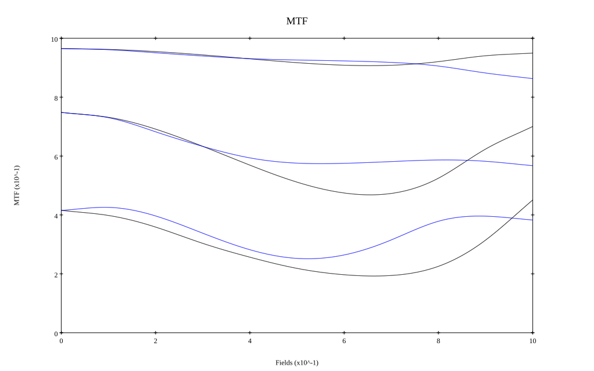
* 10,30,50 cycles/mm
* Black lines represent sagittal, blue tangential
* To generate above, MTFs for wavelengths 587.5618(d), 486.1327(F), 656.2725(C) were calculated across 10 fields, and then averaged
## Polychromatic Geometric MTF (Weighted)
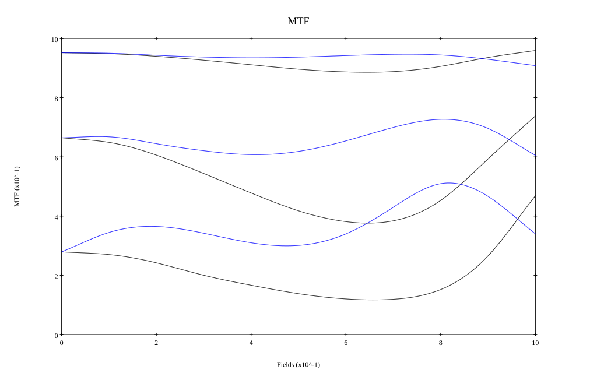
* 10,30,50 cycles/mm
* Black lines represent sagittal, blue tangential
* To generate above, MTFs for wavelengths 587.5618(d) wt(1.0), 656.2725(C) wt(0.475), 546.074(e) wt(0.98), 486.1327(F) wt(0.49), 435.8343(g) wt(0.15) were calculated across 10 fields, and then combined using weighted average
# 300mm f2.8
## Layouts
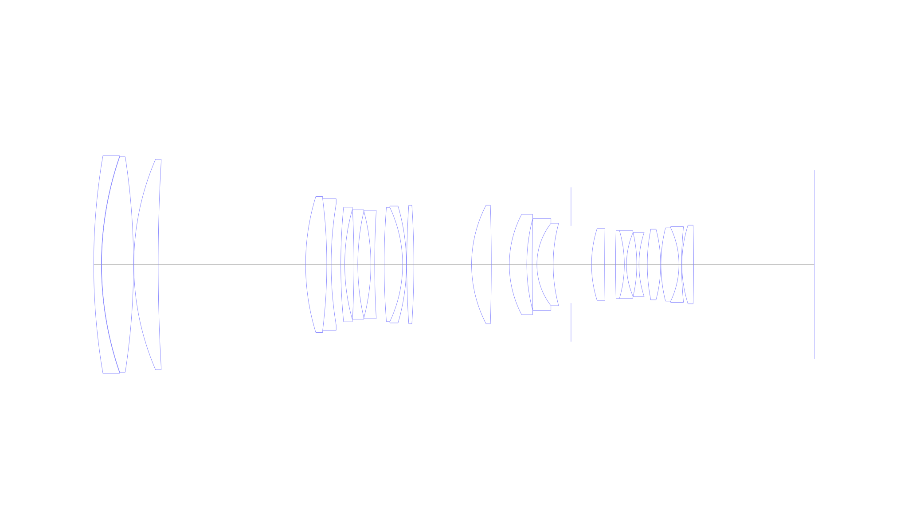
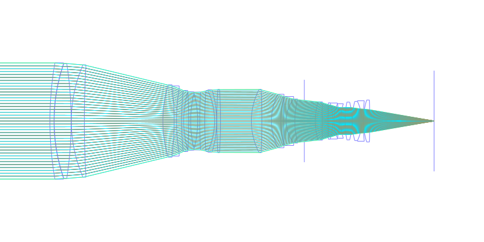
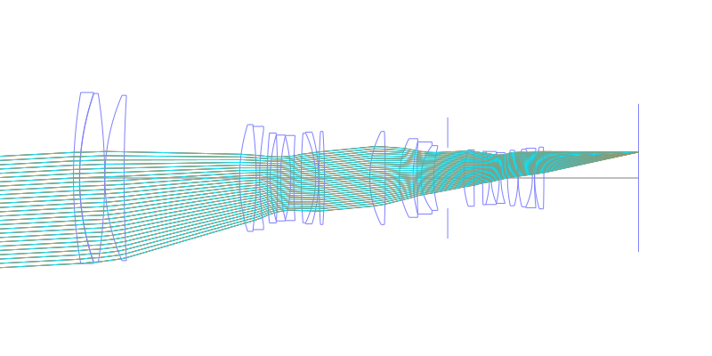
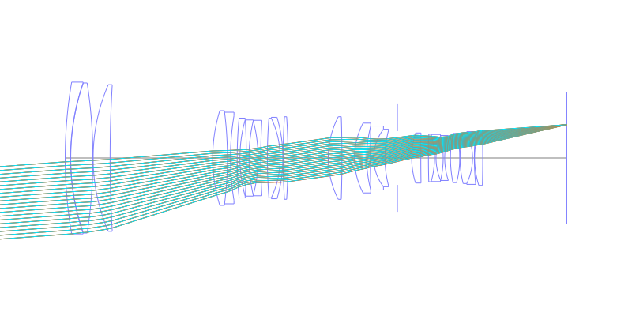
## Spot Diagrams
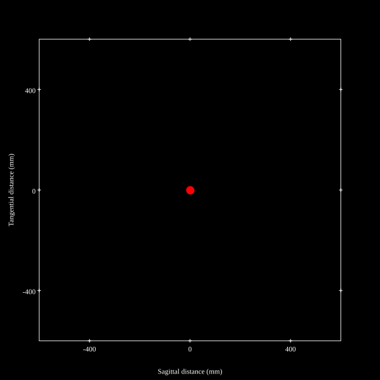
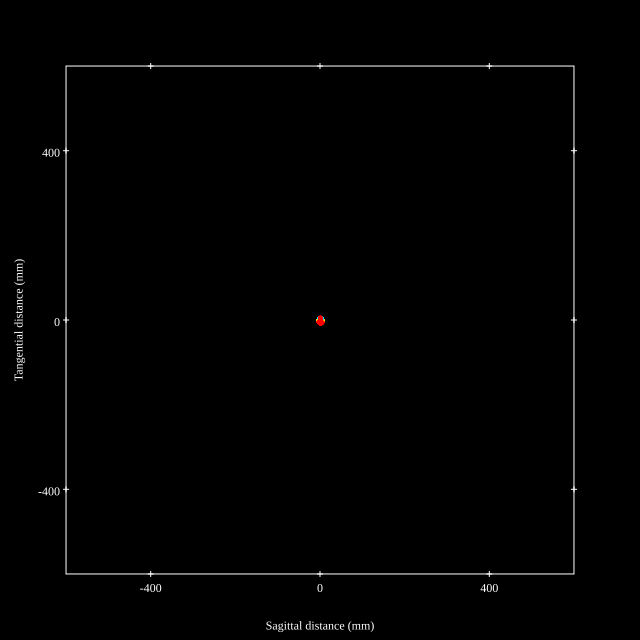
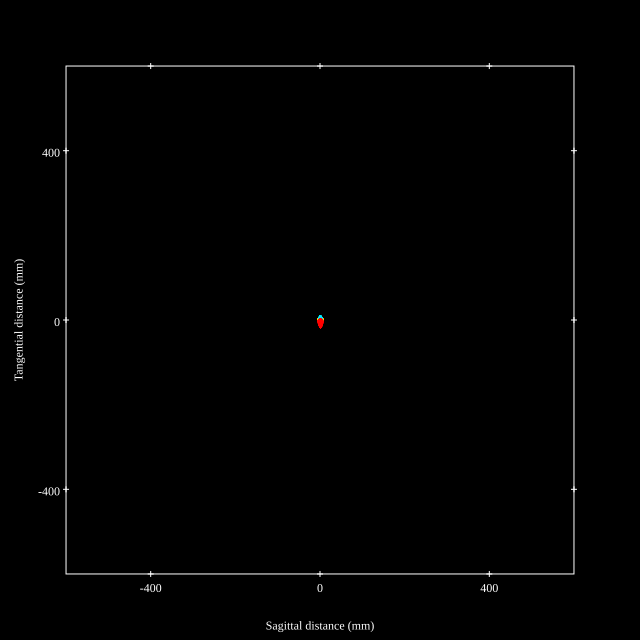
## Paraxial Parameters
| parameter | value |
| ---       | ---   |
| effective_focal_length |289.462
| back_focal_length | 55.273
| optical_invariant | 3.71
| object_distance | 1.0E10
| image_distance | 55.273
| power | 0.003
| pp1_H | 29.705
| ppk_H' | -234.189
| ffl_F | -259.757
| fno | 2.899
| enp_dist_P | 561.492
| enp_radius | 49.922
| exp_dist_P' | -46.749
| exp_radius | 17.596
| m | -0
| red | -3.454683206716403E7
| n_obj | 1
| n_img | 1
| img_ht | 21.511
| obj_ang | 4.25
| obj_na | 0
| img_na | -0.17|
## Spot Analysis
| Field | Spot Mean Radius | Spot Max Radius |
| ---   | ---              | ---             |
 | Field(x=0.0, y=0.0) | 6.057 | 14.512|
 | Field(x=0.0, y=0.1) | 5.979 | 16.141|
 | Field(x=0.0, y=0.2) | 6.053 | 16.193|
 | Field(x=0.0, y=0.3) | 6.107 | 17.22|
 | Field(x=0.0, y=0.4) | 6.092 | 17.835|
 | Field(x=0.0, y=0.5) | 6.028 | 17.837|
 | Field(x=0.0, y=0.6) | 5.913 | 17.052|
 | Field(x=0.0, y=0.7) | 5.683 | 15.332|
 | Field(x=0.0, y=0.8) | 5.473 | 12.795|
 | Field(x=0.0, y=0.9) | 5.446 | 12.211|
 | Field(x=0.0, y=1.0) | 6.101 | 14.567|
## Polychromatic Geometric MTF
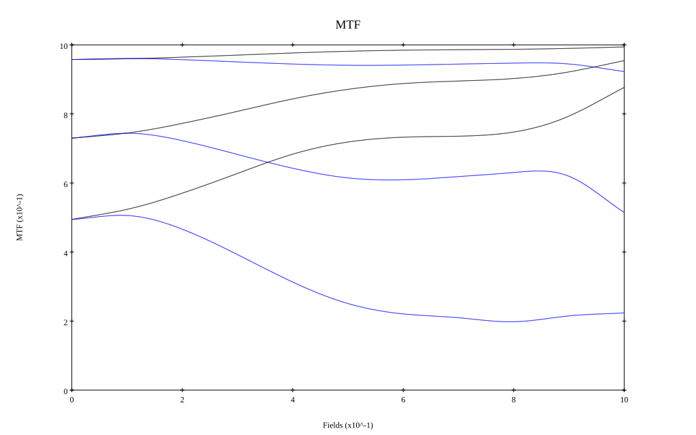
* 10,30,50 cycles/mm
* Black lines represent sagittal, blue tangential
* To generate above, MTFs for wavelengths 587.5618(d), 486.1327(F), 656.2725(C) were calculated across 10 fields, and then averaged
## Polychromatic Geometric MTF (Weighted)
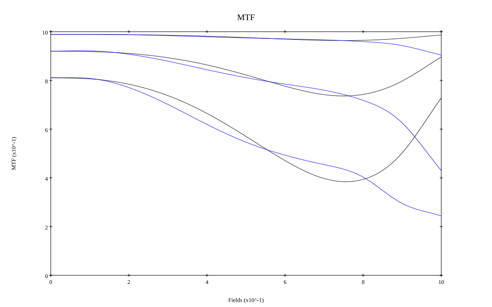
* 10,30,50 cycles/mm
* Black lines represent sagittal, blue tangential
* To generate above, MTFs for wavelengths 587.5618(d) wt(1.0), 656.2725(C) wt(0.475), 546.074(e) wt(0.98), 486.1327(F) wt(0.49), 435.8343(g) wt(0.15) were calculated across 10 fields, and then combined using weighted average
## Resources
* [OpticalBench Compatible Data File, tab delimited](./prescription.txt)
* [Zemax file](./JP2012-027217_Example05P.zmx)

Report / Zemax file generated using [Beam42](https://github.com/BeamFour/Beam42) on 2026-04-07
