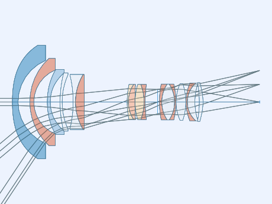
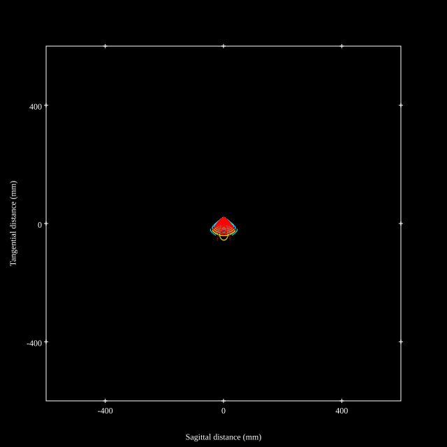
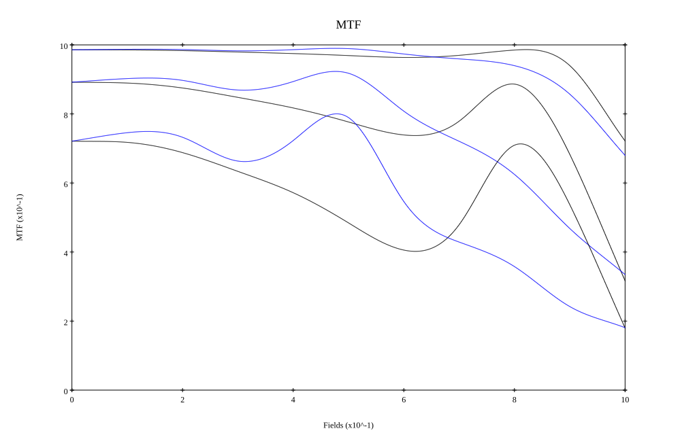
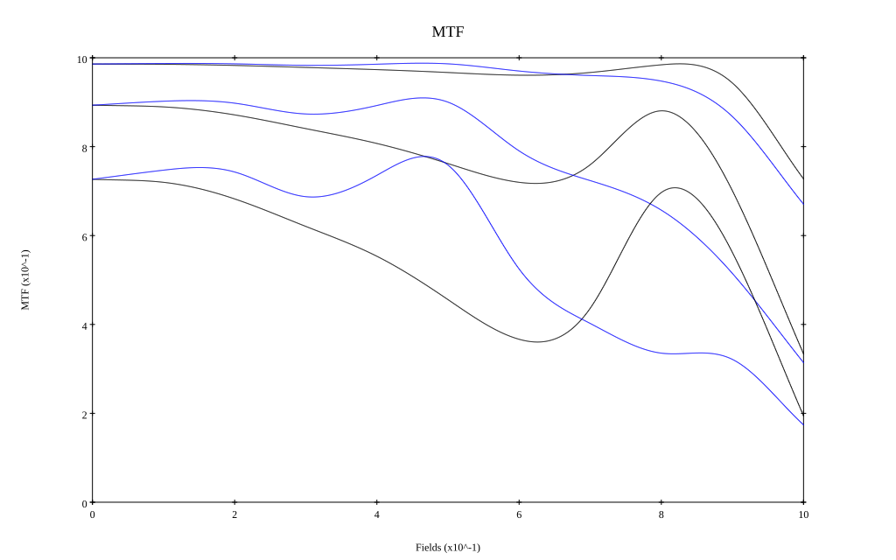
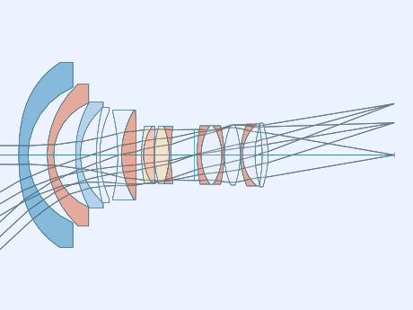
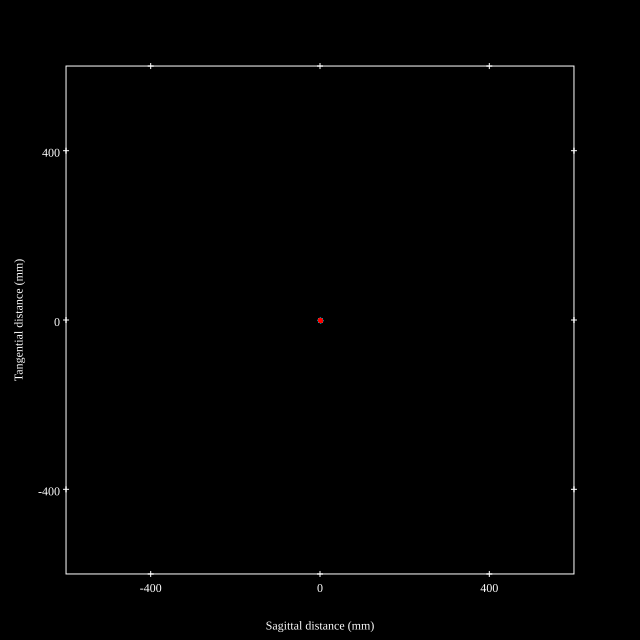
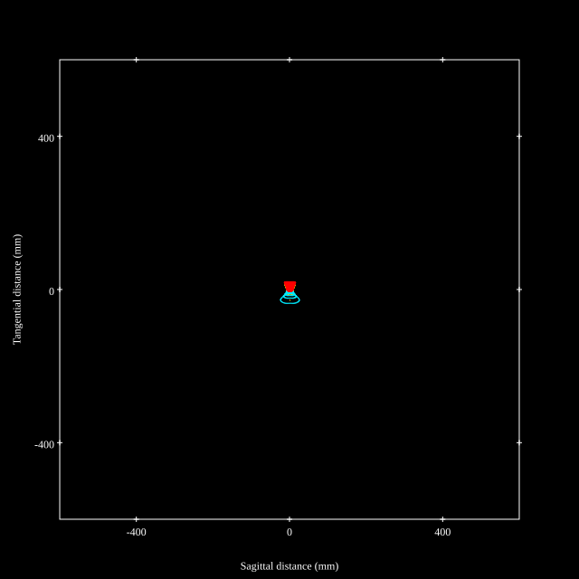
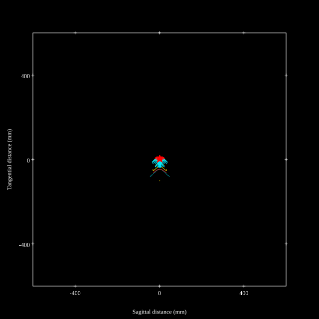
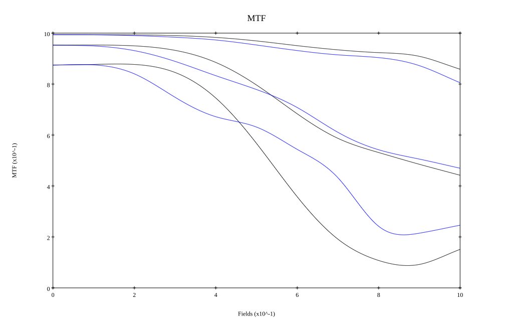
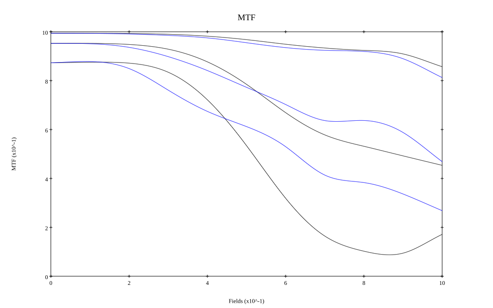

# Sigma 14-24mm F2.8 DG HSM Art
## Patent Information
| Country | Patent Number | Example | Year of Application | Inventors | Organisation | Link |
| ---     | ---           | ---     | ---                 | ---       | ---          | ---  |
|JP | JP2018-189733 | 1 | 2017 | Ryo Shioda | Sigma Corp | [link](https://patents.google.com/patent/JP2018189733A/en) |
## Surface Data
Note that where glass types are shown the refractive index and abbe number is as per assigned glass type

| ID  | Radius | Thickness | Diameter | nd  | vd  | Glass Make | Glass |
| --- | ---    | ---       | ---      | --- | --- | ---        | ---   |
| 1 | 103.2579 | 3.9 | 77.78 | 1.6935 | 53.2 | Hoya | M-LAC130 |
| 2 | 30.9115 | 8.0372 | 56.92 |  |  |  |
| 3 | 40.7164 | 2.75 | 59.66 | 2.001 | 29.13 | Hoya | TAFD55 |
| 4 | 23.7204 | 9.2439 | 43.9 |  |  |  |
| 5 | 55.7625 | 2.05 | 44.76 | 1.58913 | 61.25 | Hoya | M-BACD5N |
| 6 | 28.3734 | 6.7015 | 40.46 |  |  |  |
| 7 | 82.8041 | 1.4 | 39.94 | 1.55032 | 75.5 | Hoya | FCD705 |
| 8 | 45.0874 | 7.5827 | 37.2 |  |  |  |
| 9 | -77.7055 | 1.5463 | 36.36 | 1.437 | 95.1 | Hoya | FCD100 |
| 10 | 36.4668 | 6.133 | 37.72 | 1.90043 | 37.37 | Hoya | TAFD37 |
| 11 | -775.0963 | d11 | 37.72 |  |  |  |
| 12 | 57.615 | 0.8 | 24.06 | 1.92286 | 20.88 | Hoya | M-FDS1 |
| 13 | 21.7173 | 4.5092 | 24.06 | 1.72047 | 34.71 | Ohara | S-NBH8 |
| 14 | 178.1154 | 0.15 | 24.06 |  |  |  |
| 15 | 41.7845 | 6.1027 | 24.06 | 1.85478 | 24.8 | Ohara | S-NBH56 |
| 16 | -34.1098 | 0.8 | 24.06 | 1.8707 | 40.73 | Hoya | TAFD32 |
| 17 | 90.6372 | d17 | 24.06 |  |  |  |
| 18 | AS | 1.2451 | a18 |  |  |  |
| 19 | 61.743 | 1.6529 | 24.58 | 1.83481 | 42.72 | Hoya | TAFD5F |
| 20 | 22.4609 | 8.7241 | 24.58 | 1.437 | 95.1 | Hoya | FCD100 |
| 21 | -22.4609 | 0.9 | 24.58 | 1.883 | 40.81 | Hoya | TAFD30 |
| 22 | -54.0822 | 0.15 | 24.58 |  |  |  |
| 23 | 30.543 | 6.6588 | 25.26 | 1.437 | 95.1 | Hoya | FCD100 |
| 24 | -38.9423 | 0.15 | 25.26 |  |  |  |
| 25 | 33.4494 | 0.9 | 26.02 | 1.883 | 40.81 | Hoya | TAFD30 |
| 26 | 17.2295 | 5.1983 | 26.02 | 1.497 | 81.61 | Hoya | FCD1 |
| 27 | 40.7628 | 3.0166 | 24.48 |  |  |  |
| 28 | -59.7876 | 2.5013 | 24.48 | 1.55332 | 71.68 | Hoya | M-FCD500 |
| 29 | -33.3434 | d29 | 26.78 |  |  |  |
## Aspherical Data
| ID  | Type | k   | P1 | P2 | P3 | P4 | P5 | P6 | P7 | P8 | P9 | P10 | P11 | P12 | P13 | P14 | P15 | P16 |
| --- | --- | --- | --- | --- | --- | --- | --- | --- | --- | --- | --- | --- | --- | --- | --- | --- | --- | --- |
| 1| ODD | 0.0 | 0.0 | 0.0 | 0.0 | 6.55174E-6 | 0.0 | -5.9525E-9 | 0.0 | 5.79271E-12 | 0.0 | -2.8862E-15 | 0.0 | 6.61914E-19 | 0.0 | 0.0 | 0.0 | 0  |
| 5| ODD | 0.0 | 0.0 | 0.0 | 1.93222E-4 | -3.68159E-5 | 5.25855E-6 | -6.73333E-7 | 9.17837E-8 | -6.28671E-9 | 3.30188E-11 | 1.65903E-11 | -7.27135E-13 | 8.8693E-15 | -2.15003E-17 | -9.32433E-19 | 2.26985E-19 | -5.26081E-21 |
| 6| ODD | 0.0 | 0.0 | 0.0 | 1.94996E-4 | -2.79917E-5 | 3.65169E-6 | -2.89294E-7 | 5.54599E-8 | -4.95413E-9 | 4.32334E-12 | 1.90161E-11 | -8.8954E-13 | 1.29484E-14 | 5.98468E-17 | -2.64408E-18 | -2.71372E-19 | 1.09024E-20 |
| 28| ODD | 0.0 | 0.0 | 0.0 | 0.0 | 2.90946E-6 | 0.0 | 2.52437E-7 | 0.0 | -2.81316E-9 | 0.0 | 1.11245E-11 | 0.0 | 5.16896E-14 | 0.0 | -7.20468E-16 | 0.0 | 1.89635E-18 |
| 29| ODD | 0.0 | 0.0 | 0.0 | 0.0 | 1.2916E-5 | 0.0 | 2.41692E-7 | 0.0 | -2.80692E-9 | 0.0 | 1.94763E-11 | 0.0 | -6.96686E-14 | 0.0 | 1.18168E-17 | 0.0 | 2.9992E-19 |
## Variables
| Variable | 14mm f2.8 | 24mm f2.8 |
| --- | --- | --- |
| Focal length |14.5 |23.15 |
| F-Number |2.93 |2.93 |
| Angle of View |112.8 |85.54 |
| d11 | 29.2621 | 2.3 |
| d17 | 8.4844 | 9.7754 |
| a18 | 17.266 | 21.377 |
| d29 | 38.8 | 53.0211 |
# 14mm f2.8
## Layouts

## Spot Diagrams

## Paraxial Parameters
| parameter | value |
| ---       | ---   |
| effective_focal_length |14.5
| back_focal_length | 38.849
| optical_invariant | 3.725
| object_distance | 1.0E10
| image_distance | 38.849
| power | 0.069
| pp1_H | 38.967
| ppk_H' | 24.349
| ffl_F | 24.467
| fno | 2.929
| enp_dist_P | 27.627
| enp_radius | 2.475
| exp_dist_P' | -27.635
| exp_radius | 11.357
| m | -0
| red | -6.896611211581582E8
| n_obj | 1
| n_img | 1
| img_ht | 21.824
| obj_ang | 56.4
| obj_na | 0
| img_na | -0.168|
## Spot Analysis
| Field | Spot Mean Radius | Spot Max Radius |
| ---   | ---              | ---             |
 | Field(x=0.0, y=0.0) | 3.59 | 5.93|
 | Field(x=0.0, y=0.1) | 3.442 | 6.238|
 | Field(x=0.0, y=0.2) | 3.684 | 6.92|
 | Field(x=0.0, y=0.3) | 4.188 | 7.771|
 | Field(x=0.0, y=0.4) | 4.254 | 8.166|
 | Field(x=0.0, y=0.5) | 4.377 | 8.596|
 | Field(x=0.0, y=0.6) | 5.292 | 11.334|
 | Field(x=0.0, y=0.7) | 5.642 | 10.841|
 | Field(x=0.0, y=0.8) | 5.925 | 14.154|
 | Field(x=0.0, y=0.9) | 10.593 | 34.776|
 | Field(x=0.0, y=1.0) | 19.392 | 59.238|
## Polychromatic Geometric MTF

* 10,30,50 cycles/mm
* Black lines represent sagittal, blue tangential
* To generate above, MTFs for wavelengths 587.5618(d), 486.1327(F), 656.2725(C) were calculated across 10 fields, and then averaged
## Polychromatic Geometric MTF (Weighted)

* 10,30,50 cycles/mm
* Black lines represent sagittal, blue tangential
* To generate above, MTFs for wavelengths 587.5618(d) wt(1.0), 656.2725(C) wt(0.475), 546.074(e) wt(0.98), 486.1327(F) wt(0.49), 435.8343(g) wt(0.15) were calculated across 10 fields, and then combined using weighted average
# 24mm f2.8
## Layouts

## Spot Diagrams

## Paraxial Parameters
| parameter | value |
| ---       | ---   |
| effective_focal_length |23.15
| back_focal_length | 53.02
| optical_invariant | 3.654
| object_distance | 1.0E10
| image_distance | 53.02
| power | 0.043
| pp1_H | 42.493
| ppk_H' | 29.87
| ffl_F | 19.344
| fno | 2.93
| enp_dist_P | 25.984
| enp_radius | 3.95
| exp_dist_P' | -27.686
| exp_radius | 13.771
| m | -0
| red | -4.319701669017777E8
| n_obj | 1
| n_img | 1
| img_ht | 21.414
| obj_ang | 42.77
| obj_na | 0
| img_na | -0.168|
## Spot Analysis
| Field | Spot Mean Radius | Spot Max Radius |
| ---   | ---              | ---             |
 | Field(x=0.0, y=0.0) | 2.204 | 4.596|
 | Field(x=0.0, y=0.1) | 2.326 | 12.93|
 | Field(x=0.0, y=0.2) | 2.807 | 15.819|
 | Field(x=0.0, y=0.3) | 3.558 | 18.604|
 | Field(x=0.0, y=0.4) | 4.771 | 20.818|
 | Field(x=0.0, y=0.5) | 6.45 | 27.109|
 | Field(x=0.0, y=0.6) | 7.961 | 34.713|
 | Field(x=0.0, y=0.7) | 8.823 | 37.625|
 | Field(x=0.0, y=0.8) | 9.491 | 46.442|
 | Field(x=0.0, y=0.9) | 10.804 | 65.426|
 | Field(x=0.0, y=1.0) | 14.77 | 99.569|
## Polychromatic Geometric MTF

* 10,30,50 cycles/mm
* Black lines represent sagittal, blue tangential
* To generate above, MTFs for wavelengths 587.5618(d), 486.1327(F), 656.2725(C) were calculated across 10 fields, and then averaged
## Polychromatic Geometric MTF (Weighted)

* 10,30,50 cycles/mm
* Black lines represent sagittal, blue tangential
* To generate above, MTFs for wavelengths 587.5618(d) wt(1.0), 656.2725(C) wt(0.475), 546.074(e) wt(0.98), 486.1327(F) wt(0.49), 435.8343(g) wt(0.15) were calculated across 10 fields, and then combined using weighted average
## Resources
* [OpticalBench Compatible Data File, tab delimited](./prescription.txt)
* [Zemax file](./JP2018-189733_Example01P.zmx)

Report / Zemax file generated using [Beam42](https://github.com/BeamFour/Beam42) on 2026-01-30
