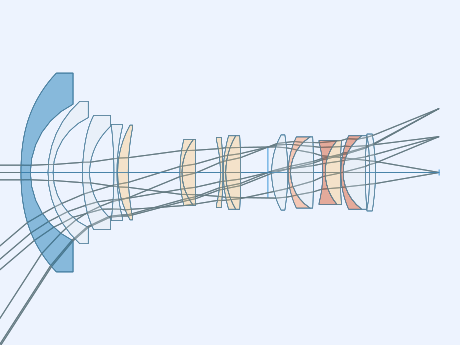
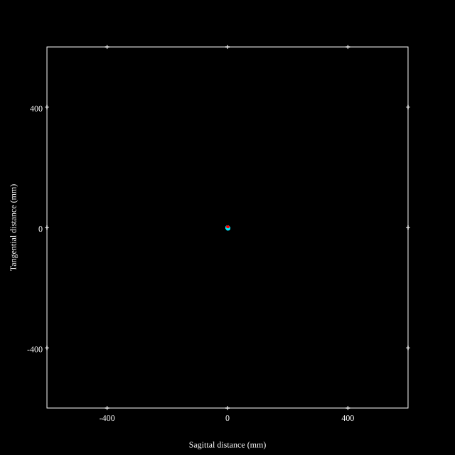
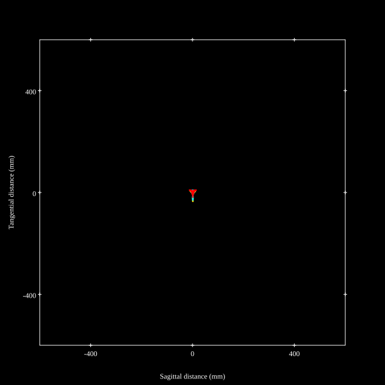
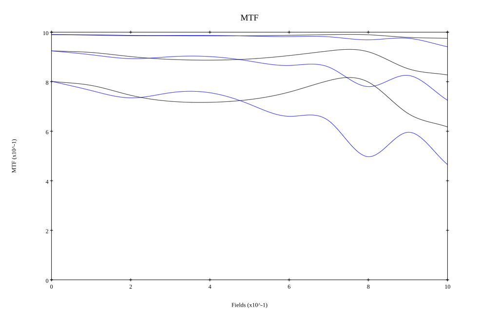
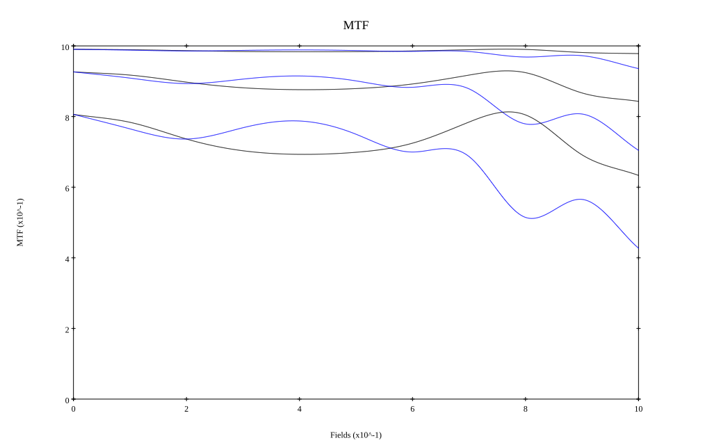
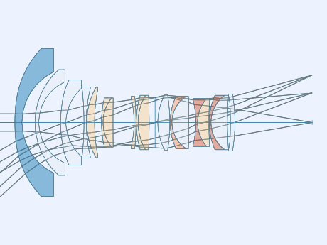
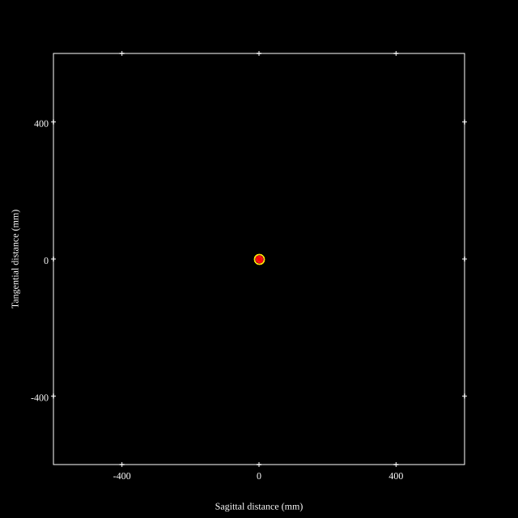
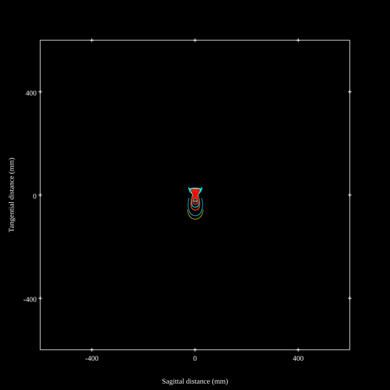
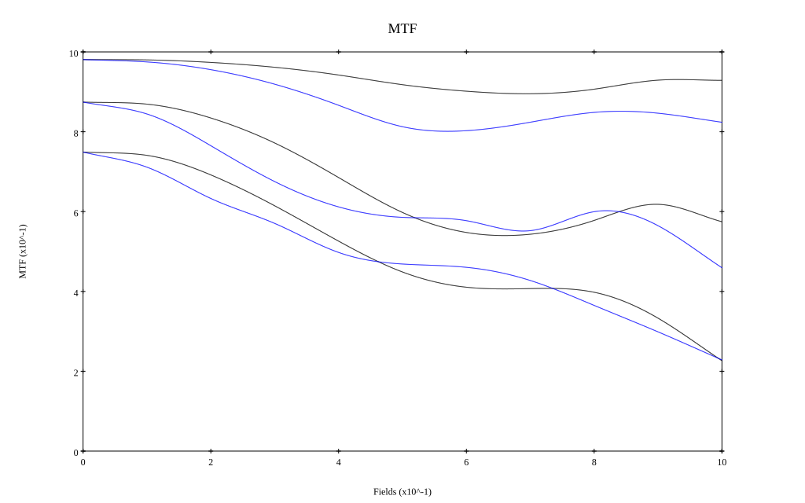
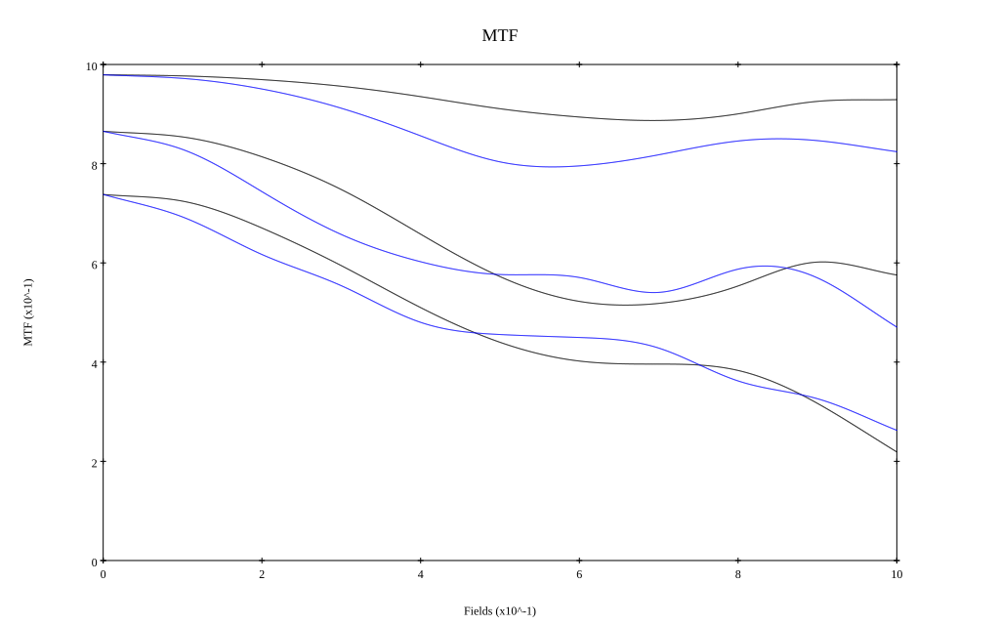

# Sigma 14-24mm F2.8 DG DN A
## Patent Information
| Country | Patent Number | Example | Year of Application | Inventors | Organisation | Link |
| ---     | ---           | ---     | ---                 | ---       | ---          | ---  |
|JP | JP2020-042221 | 1 | 2018 | Ryo Shioda | Sigma Corp | [link](https://patents.google.com/patent/JP2020042221A/en) |
## Surface Data
Note that where glass types are shown the refractive index and abbe number is as per assigned glass type

| ID  | Radius | Thickness | Diameter | nd  | vd  | Glass Make | Glass |
| --- | ---    | ---       | ---      | --- | --- | ---        | ---   |
| 1 | 85.4412 | 3.2 | 67.09 | 1.6935 | 53.2 | Hoya | M-LAC130 |
| 2 | 25.6415 | 5.9311 | 46.08 |  |  |  |
| 3 | 32.2488 | 1.7 | 48.03 | 1.59282 | 68.62 | Hoya | FCD515 |
| 4 | 20.4022 | 9.9424 | 37.07 |  |  |  |
| 5 | 44.7525 | 2.4089 | 38.56 | 1.59271 | 66.97 | Hoya | MP-PCD51-70 |
| 6 | 18.6004 | 8.2083 | 31.05 |  |  |  |
| 7 | -143.3662 | 1.0 | 32.4 | 1.59282 | 68.62 | Hoya | FCD515 |
| 8 | 65.2835 | 0.25 | 30.91 |  |  |  |
| 9 | 32.7185 | 3.5498 | 31.96 | 1.84666 | 23.78 | Hoya | FDS90 |
| 10 | 78.5742 | d10 | 30.75 |  |  |  |
| 11 | 47.9876 | 0.7 | 22.33 | 1.92119 | 23.96 | Hoya | FDS24 |
| 12 | 18.0927 | 4.5235 | 22.33 | 1.75211 | 25.05 | Hoya | FF8 |
| 13 | 1000.0 | d13 | 22.33 |  |  |  |
| 14 | -45.9274 | 0.8473 | 22.04 | 1.80809 | 22.76 | Hoya | FD225 |
| 15 | -130.5409 | 0.15 | 23.69 |  |  |  |
| 16 | 43.8526 | 0.8157 | 24.29 | 1.94594 | 17.98 | Hoya | FDS18 |
| 17 | 24.6033 | 5.0424 | 24.75 | 1.7552 | 27.51 | Ohara | S-TIH4 |
| 18 | -238.9569 | d18 | 24.75 |  |  |  |
| 19 | AS | 1.24 | a19 |  |  |  |
| 20 | 26.7826 | 5.4475 | 25.34 | 1.437 | 95.1 | Hoya | FCD100 |
| 21 | -82.1805 | 0.15 | 25.34 |  |  |  |
| 22 | 27.6053 | 0.8 | 23.99 | 1.72047 | 34.71 | Ohara | S-NBH8 |
| 23 | 14.2195 | 7.7162 | 23.39 | 1.55032 | 75.5 | Hoya | FCD705 |
| 24 | -302.0534 | 3.1611 | 23.39 |  |  |  |
| 25 | -42.7697 | 0.8 | 20.7 | 1.95375 | 32.32 | Hoya | TAFD45 |
| 26 | 16.5944 | 5.1186 | 21.74 | 1.92286 | 20.88 | Hoya | M-FDS1 |
| 27 | 165.2911 | 0.15 | 21.74 |  |  |  |
| 28 | 30.6058 | 0.8 | 24.75 | 1.883 | 40.81 | Hoya | TAFD30 |
| 29 | 15.37 | 7.4494 | 24.45 | 1.55032 | 75.5 | Hoya | FCD705 |
| 30 | 146.1642 | 1.4019 | 24.45 |  |  |  |
| 31 | -300.0 | 2.035 | 24.45 | 1.55352 | 71.72 | Hoya | MP-FCD500-20 |
| 32 | -70.4549 | d32 | 25.94 |  |  |  |
## Aspherical Data
| ID  | Type | k   | P1 | P2 | P3 | P4 | P5 | P6 | P7 | P8 | P9 | P10 | P11 | P12 | P13 | P14 | P15 | P16 | P17 | P18 | P19 | P20 |
| --- | --- | --- | --- | --- | --- | --- | --- | --- | --- | --- | --- | --- | --- | --- | --- | --- | --- | --- | --- | --- | --- | --- |
| 1| ODD | 0.0 | 0.0 | 0.0 | 0.0 | 8.58209E-6 | 0.0 | -1.40764E-8 | 0.0 | 3.05748E-11 | 0.0 | -5.97803E-14 | 0.0 | 9.0859E-17 | 0.0 | -9.58737E-20 | 0.0 | 6.40051E-23 | 0.0 | -2.39147E-26 | 0.0 | 3.78519E-30 |
| 5| ODD | 0.0 | 0.0 | 0.0 | -5.23111E-5 | -1.26716E-5 | -1.1304E-5 | 1.95245E-6 | -9.38134E-8 | -7.82976E-10 | 1.22496E-10 | 1.97968E-12 | -1.33295E-14 | -1.10265E-14 | 5.32582E-17 | 7.28532E-18 | 1.89244E-19 | -1.81192E-20 | 1.13899E-21 | -2.99255E-23 | 1.48595E-25 | -3.31214E-27 |
| 6| ODD | -0.0364842 | 0.0 | 0.0 | -3.48559E-5 | -1.50563E-5 | -1.10043E-5 | 1.72222E-6 | -4.71099E-8 | -3.15483E-9 | -5.86163E-11 | 1.76453E-11 | -1.10783E-13 | -5.28181E-15 | -8.35047E-16 | 5.89441E-17 | -9.54814E-18 | 3.21284E-19 | 6.43253E-21 | -4.91029E-23 | 1.37261E-24 | -5.09803E-25 |
| 31| ODD | 0.0 | 0.0 | 0.0 | 0.0 | -2.45667E-5 | 0.0 | -8.17092E-8 | 0.0 | 2.8137E-9 | 0.0 | -7.26008E-11 | 0.0 | 1.11778E-12 | 0.0 | -9.83681E-15 | 0.0 | 4.86452E-17 | 0.0 | -1.24975E-19 | 0.0 | 1.29336E-22 |
| 32| ODD | 0.0 | 0.0 | 0.0 | 0.0 | 5.66654E-6 | 0.0 | 5.42201E-8 | 0.0 | -2.06458E-9 | 0.0 | 3.2509E-11 | 0.0 | -2.5641E-13 | 0.0 | 1.03356E-15 | 0.0 | -1.78037E-18 | 0.0 | -8.0761E-22 | 0.0 | 5.22718E-24 |
## Variables
| Variable | 14mm f2.8 | 24mm f2.8 |
| --- | --- | --- |
| Focal length |14.5 |23.15 |
| F-Number |2.93 |2.93 |
| Angle of View |114.29 |84.92 |
| d10 | 17.4502 | 3.1517 |
| d13 | 8.4183 | 9.58 |
| d18 | 9.1955 | 2.665 |
| a19 | 17.193 | 22.957 |
| d32 | 21.47 | 35.07 |
# 14mm f2.8
## Layouts

## Spot Diagrams

## Paraxial Parameters
| parameter | value |
| ---       | ---   |
| effective_focal_length |14.5
| back_focal_length | 21.539
| optical_invariant | 3.832
| object_distance | 1.0E10
| image_distance | 21.539
| power | 0.069
| pp1_H | 34.717
| ppk_H' | 7.039
| ffl_F | 20.217
| fno | 2.929
| enp_dist_P | 24.854
| enp_radius | 2.475
| exp_dist_P' | -23.74
| exp_radius | 7.74
| m | -0
| red | -6.896379321895608E8
| n_obj | 1
| n_img | 1
| img_ht | 22.453
| obj_ang | 57.145
| obj_na | 0
| img_na | -0.168|
## Spot Analysis
| Field | Spot Mean Radius | Spot Max Radius |
| ---   | ---              | ---             |
 | Field(x=0.0, y=0.0) | 2.882 | 5.036|
 | Field(x=0.0, y=0.1) | 3.155 | 6.029|
 | Field(x=0.0, y=0.2) | 3.485 | 7.728|
 | Field(x=0.0, y=0.3) | 3.539 | 8.077|
 | Field(x=0.0, y=0.4) | 3.564 | 7.939|
 | Field(x=0.0, y=0.5) | 3.655 | 7.803|
 | Field(x=0.0, y=0.6) | 3.667 | 7.239|
 | Field(x=0.0, y=0.7) | 3.566 | 7.101|
 | Field(x=0.0, y=0.8) | 4.376 | 13.066|
 | Field(x=0.0, y=0.9) | 4.95 | 15.971|
 | Field(x=0.0, y=1.0) | 7.06 | 34.332|
## Polychromatic Geometric MTF

* 10,30,50 cycles/mm
* Black lines represent sagittal, blue tangential
* To generate above, MTFs for wavelengths 587.5618(d), 486.1327(F), 656.2725(C) were calculated across 10 fields, and then averaged
## Polychromatic Geometric MTF (Weighted)

* 10,30,50 cycles/mm
* Black lines represent sagittal, blue tangential
* To generate above, MTFs for wavelengths 587.5618(d) wt(1.0), 656.2725(C) wt(0.475), 546.074(e) wt(0.98), 486.1327(F) wt(0.49), 435.8343(g) wt(0.15) were calculated across 10 fields, and then combined using weighted average
# 24mm f2.8
## Layouts

## Spot Diagrams

## Paraxial Parameters
| parameter | value |
| ---       | ---   |
| effective_focal_length |23.151
| back_focal_length | 35.075
| optical_invariant | 3.614
| object_distance | 1.0E10
| image_distance | 35.075
| power | 0.043
| pp1_H | 37.419
| ppk_H' | 11.925
| ffl_F | 14.268
| fno | 2.93
| enp_dist_P | 23.37
| enp_radius | 3.95
| exp_dist_P' | -23.803
| exp_radius | 10.047
| m | -0
| red | -4.319512924481502E8
| n_obj | 1
| n_img | 1
| img_ht | 21.184
| obj_ang | 42.46
| obj_na | 0
| img_na | -0.168|
## Spot Analysis
| Field | Spot Mean Radius | Spot Max Radius |
| ---   | ---              | ---             |
 | Field(x=0.0, y=0.0) | 4.299 | 14.213|
 | Field(x=0.0, y=0.1) | 4.503 | 16.701|
 | Field(x=0.0, y=0.2) | 5.706 | 20.714|
 | Field(x=0.0, y=0.3) | 7.55 | 27.503|
 | Field(x=0.0, y=0.4) | 9.906 | 39.322|
 | Field(x=0.0, y=0.5) | 12.42 | 57.512|
 | Field(x=0.0, y=0.6) | 13.859 | 79.151|
 | Field(x=0.0, y=0.7) | 15.827 | 92.331|
 | Field(x=0.0, y=0.8) | 15.739 | 86.97|
 | Field(x=0.0, y=0.9) | 14.376 | 75.52|
 | Field(x=0.0, y=1.0) | 14.44 | 71.298|
## Polychromatic Geometric MTF

* 10,30,50 cycles/mm
* Black lines represent sagittal, blue tangential
* To generate above, MTFs for wavelengths 587.5618(d), 486.1327(F), 656.2725(C) were calculated across 10 fields, and then averaged
## Polychromatic Geometric MTF (Weighted)

* 10,30,50 cycles/mm
* Black lines represent sagittal, blue tangential
* To generate above, MTFs for wavelengths 587.5618(d) wt(1.0), 656.2725(C) wt(0.475), 546.074(e) wt(0.98), 486.1327(F) wt(0.49), 435.8343(g) wt(0.15) were calculated across 10 fields, and then combined using weighted average
## Resources
* [OpticalBench Compatible Data File, tab delimited](./prescription.txt)
* [Zemax file](./JP2020-042221_Example01P.zmx)

Report / Zemax file generated using [Beam42](https://github.com/BeamFour/Beam42) on 2026-01-30
