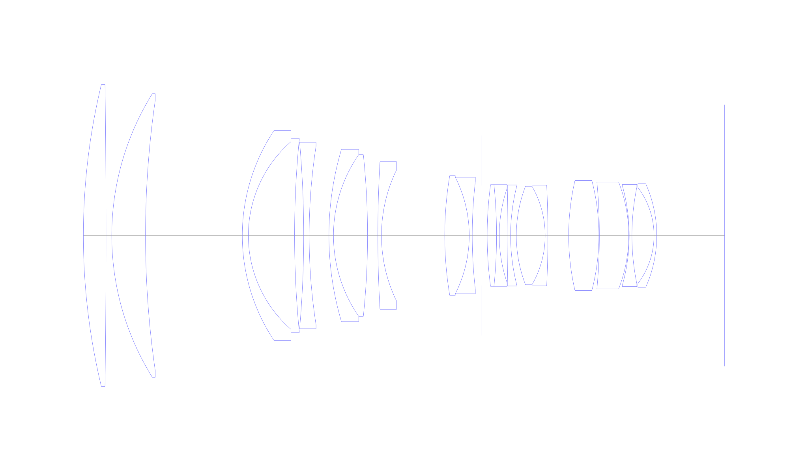
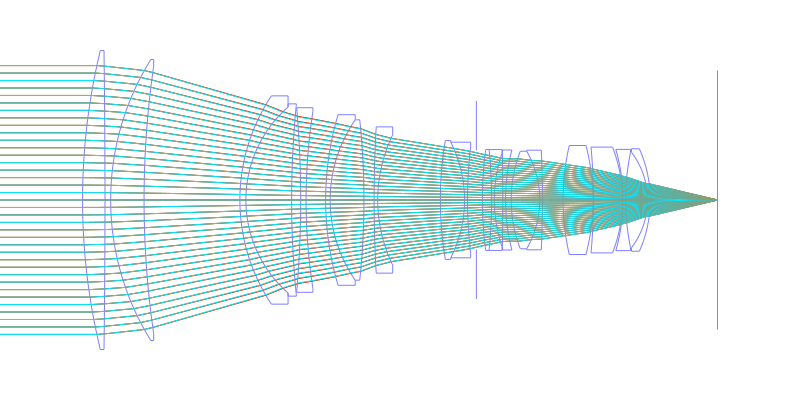
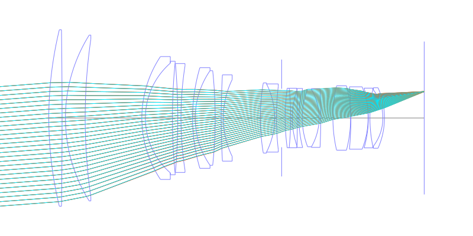
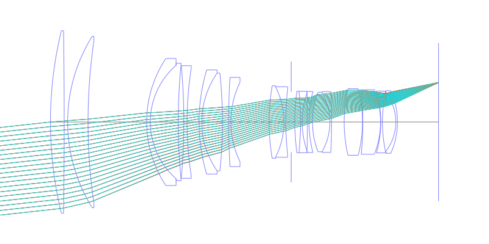
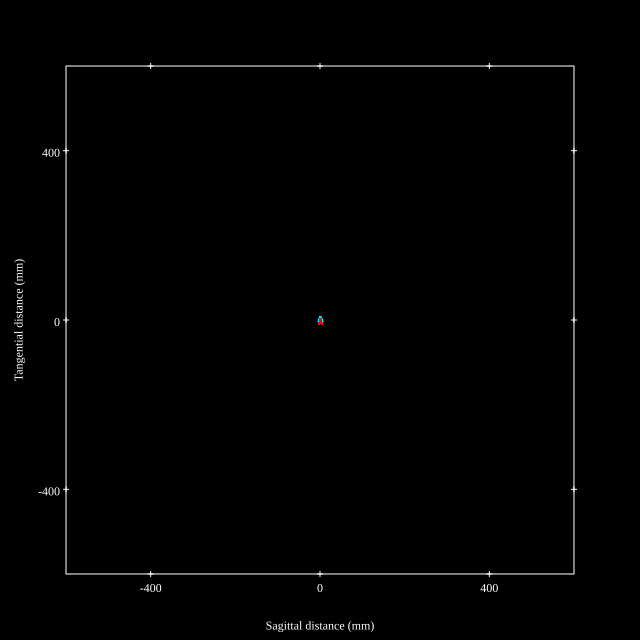
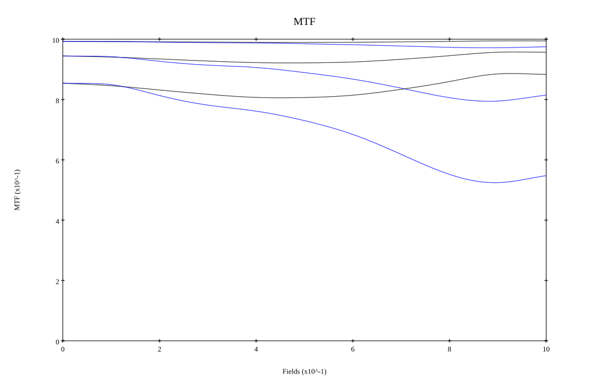
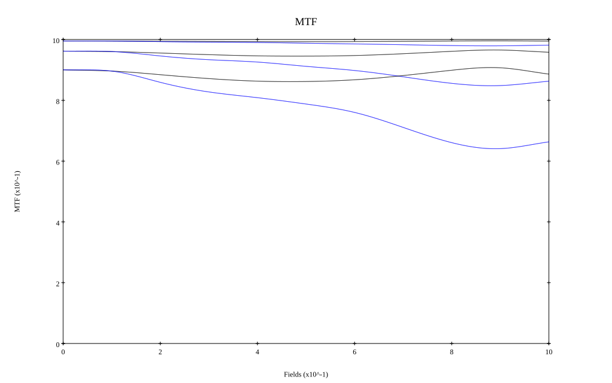

# Sigma SPORTS 200mm F2 DG OS Prototype
## Patent Information
| Country | Patent Number | Example | Year of Application | Inventors | Organisation | Link |
| ---     | ---           | ---     | ---                 | ---       | ---          | ---  |
|US | US20250321401 | 1 | 2024 | Daichi TANOUE | Sigma Corp | [link](https://patents.google.com/patent/US20250321401A1/en) |
## Surface Data
Note that where glass types are shown the refractive index and abbe number is as per assigned glass type

| ID  | Radius | Thickness | Diameter | nd  | vd  | Glass Make | Glass |
| --- | ---    | ---       | ---      | --- | --- | ---        | ---   |
| 1 | 212.8145 | 7.4926 | 99.84 | 1.48749 | 70.44 | Hoya | FC5 |
| 2 | -3741.0747 | 1.9 | 99.84 |  |  |  |
| 3 | 88.7689 | 11.1469 | 93.86 | 1.437 | 95.1 | Hoya | FCD100 |
| 4 | 311.8544 | 32.0 | 89.24 |  |  |  |
| 5 | 62.755 | 2.0 | 69.54 | 1.72916 | 54.67 | Hoya | TAC8 |
| 6 | 41.2488 | 15.2817 | 62.08 | 1.437 | 95.1 | Hoya | FCD100 |
| 7 | 326.4366 | 3.0213 | 64.2 |  |  |  |
| 8 | -352.0999 | 1.8 | 61.64 | 1.85451 | 25.15 | Hoya | NBFD25 |
| 9 | 192.6785 | 6.54 | 59.08 |  |  |  |
| 10 | 100.1622 | 1.5 | 56.96 | 1.755 | 52.32 | Hoya | TAC6 |
| 11 | 47.0478 | 11.2712 | 53.54 | 1.5941 | 60.47 | Hoya | FCD600 |
| 12 | -256.881 | 3.4 | 53.54 |  |  |  |
| 13 | 424.4891 | 1.2 | 48.84 | 1.51823 | 58.96 | Hoya | C3 |
| 14 | 49.7913 | 20.9224 | 43.52 |  |  |  |
| 15 | 119.8435 | 8.0834 | 39.68 | 1.85883 | 30.0 | Hoya | NBFD30 |
| 16 | -42.6903 | 1.0 | 38.6 | 1.8044 | 39.58 | Ohara | S-LAH63Q |
| 17 | 155.7968 | 2.9331 | 35.84 |  |  |  |
| 18 | AS | 1.9984 | 33.075 |  |  |  |
| 19 | 126.1592 | 3.1081 | 33.68 | 1.98612 | 16.48 | Hoya | FDS16-W |
| 20 | -164.7066 | 0.9 | 33.68 | 1.713 | 53.94 | Hoya | LAC8 |
| 21 | 48.6121 | 2.8437 | 31.22 |  |  |  |
| 22 | -750.1799 | 0.9 | 31.22 | 1.85451 | 25.15 | Hoya | NBFD25 |
| 23 | 66.7431 | 1.8897 | 33.4 |  |  |  |
| 24 | 45.255 | 9.5268 | 32.58 | 1.7725 | 49.62 | Hoya | TAF1 |
| 25 | -32.6534 | 0.9 | 32.58 | 2.00069 | 25.46 | Hoya | TAFD40 |
| 26 | -360.8672 | 6.8814 | 33.26 |  |  |  |
| 27 | 80.6631 | 10.0 | 36.4 | 1.77047 | 29.74 | Hoya | NBFD29 |
| 28 | -71.9091 | 0.15 | 36.4 |  |  |  |
| 29 | -192.5873 | 9.7103 | 35.32 | 1.56732 | 42.84 | Hoya | FL6 |
| 30 | -48.2101 | 0.15 | 35.32 |  |  |  |
| 31 | -60.9006 | 0.9 | 33.82 | 1.57144 | 71.62 | Hoya | FCD615 |
| 32 | 78.9803 | 7.3037 | 31.9 |  |  |  |
| 33 | -26.3842 | 0.9 | 31.9 | 1.98612 | 16.48 | Hoya | FDS16-W |
| 34 | -42.1224 | 22.4457 | 34.22 |  |  |  |
## Layouts

## Spot Diagrams

## Paraxial Parameters
| parameter | value |
| ---       | ---   |
| effective_focal_length |194.304
| back_focal_length | 22.447
| optical_invariant | 5.119
| object_distance | 1.0E10
| image_distance | 22.447
| power | 0.005
| pp1_H | -182.679
| ppk_H' | -171.857
| ffl_F | -376.984
| fno | 2.07
| enp_dist_P | 340.736
| enp_radius | 46.93
| exp_dist_P' | -30.154
| exp_radius | 12.705
| m | -0
| red | -5.146572348286186E7
| n_obj | 1
| n_img | 1
| img_ht | 21.194
| obj_ang | 6.225
| obj_na | 0
| img_na | -0.235|
## Spot Analysis
| Field | Spot Mean Radius | Spot Max Radius |
| ---   | ---              | ---             |
 | Field(x=0.0, y=0.0) | 2.468 | 5.326|
 | Field(x=0.0, y=0.1) | 2.571 | 7.05|
 | Field(x=0.0, y=0.2) | 2.793 | 7.401|
 | Field(x=0.0, y=0.3) | 2.992 | 7.67|
 | Field(x=0.0, y=0.4) | 3.168 | 9.514|
 | Field(x=0.0, y=0.5) | 3.464 | 17.165|
 | Field(x=0.0, y=0.6) | 3.729 | 20.08|
 | Field(x=0.0, y=0.7) | 3.876 | 18.199|
 | Field(x=0.0, y=0.8) | 3.989 | 14.234|
 | Field(x=0.0, y=0.9) | 3.944 | 9.238|
 | Field(x=0.0, y=1.0) | 3.73 | 9.251|
## Polychromatic Geometric MTF

* 10,30,50 cycles/mm
* Black lines represent sagittal, blue tangential
* To generate above, MTFs for wavelengths 587.5618(d), 486.1327(F), 656.2725(C) were calculated across 10 fields, and then averaged
## Polychromatic Geometric MTF (Weighted)

* 10,30,50 cycles/mm
* Black lines represent sagittal, blue tangential
* To generate above, MTFs for wavelengths 587.5618(d) wt(1.0), 656.2725(C) wt(0.475), 546.074(e) wt(0.98), 486.1327(F) wt(0.49), 435.8343(g) wt(0.15) were calculated across 10 fields, and then combined using weighted average
## Resources
* [OpticalBench Compatible Data File, tab delimited](./prescription.txt)
* [Zemax file](./US20250321401_Example01.zmx)

Report / Zemax file generated using [Beam42](https://github.com/BeamFour/Beam42) on 2026-05-25
