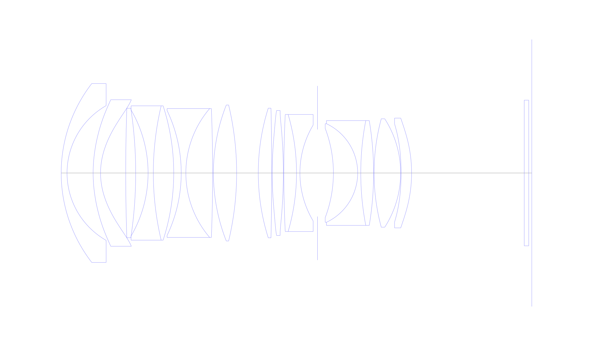
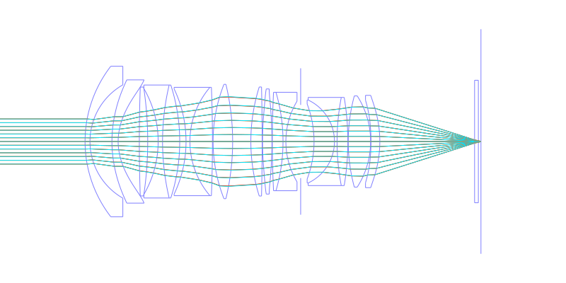
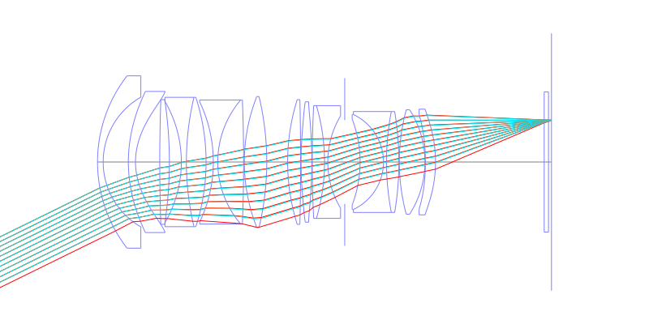
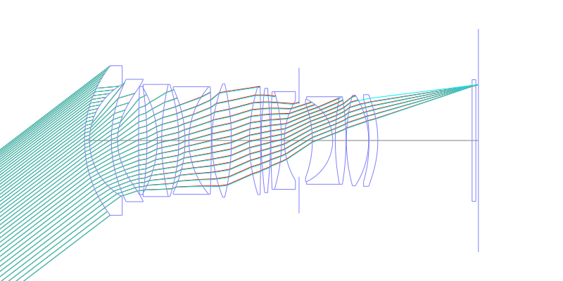
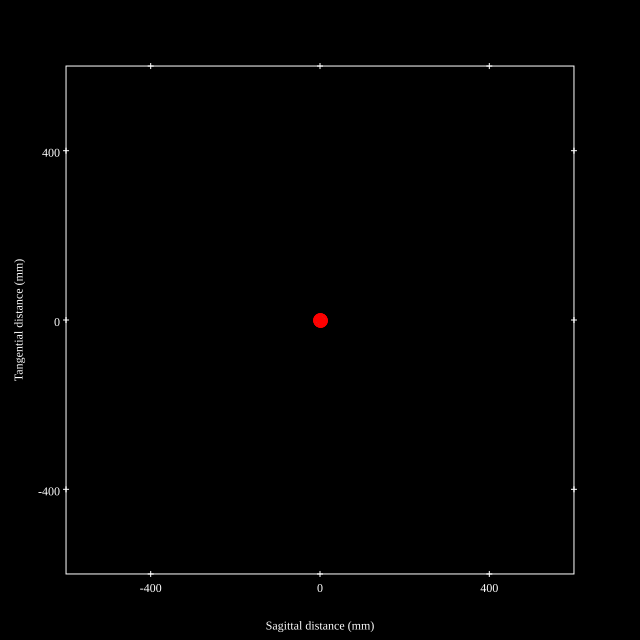
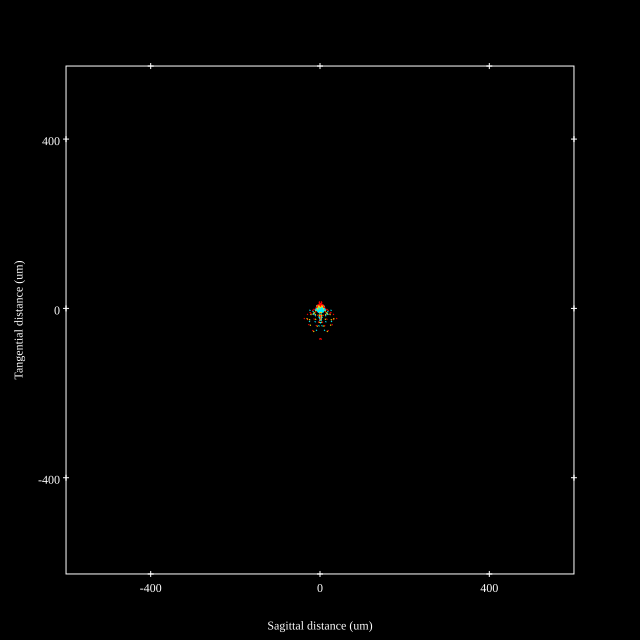
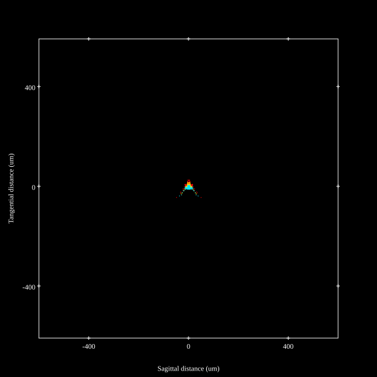

# Sigma 28mm F1.4 DG HSM A
## Patent Information
| Country | Patent Number | Example | Year of Application | Inventors | Organisation | Link |
| ---     | ---           | ---     | ---                 | ---       | ---          | ---  |
|JP | 2019-219472 | EX 6 | 2018 | Hokuto Usami, Kenta Fujita | Sigma Corp | [link](https://patents.google.com/patent/JP2019219472A/en) |
## Surface Data
Note that where glass types are shown the refractive index and abbe number is as per assigned glass type

| ID  | Radius | Thickness | Diameter | nd  | vd  | Glass Make | Glass |
| --- | ---    | ---       | ---      | --- | --- | ---        | ---   |
| 1 | 47.3207 | 1.9 | 57.98 | 1.76385 | 48.49 | Ohara | S-LAH96 |
| 2 | 25.137 | 8.4554 | 43.64 |  |  |  |
| 3 | 46.9543 | 2.4 | 47.48 | 1.59201 | 67.02 | Hoya | M-PCD51 |
| 4 | 23.2091 | 8.1561 | 47.48 |  |  |  |
| 5 | 618.4976 | 3.233 | 41.94 | 1.95375 | 32.32 | Hoya | TAFD45 |
| 6 | -139.999 | 4.0127 | 41.94 |  |  |  |
| 7 | -40.5659 | 1.7 | 40.81 | 1.437 | 95.1 | Hoya | FCD100 |
| 8 | 94.3906 | 6.6136 | 43.52 | 1.91082 | 35.25 | Hoya | TAFD35 |
| 9 | -70.5544 | 2.4296 | 43.52 |  |  |  |
| 10 | -46.9968 | 1.5 | 40.5 | 1.738 | 32.33 | Ohara | S-NBH53V |
| 11 | 32.1175 | 8.6744 | 41.74 | 1.59282 | 68.62 | Hoya | FCD515 |
| 12 | -544.2563 | 0.25 | 41.74 |  |  |  |
| 13 | 60.1374 | 7.5297 | 44.06 | 1.8042 | 46.5 | Hoya | TAF3D |
| 14 | -94.6982 | 7.0149 | 44.06 |  |  |  |
| 15 | 69.9167 | 4.356 | 42.0 | 1.76385 | 48.49 | Ohara | S-LAH96 |
| 16 | -904.2656 | 0.15 | 42.0 |  |  |  |
| 17 | 112.6199 | 3.6175 | 40.5 | 1.76802 | 49.24 | Hoya | M-TAF101 |
| 18 | -158.1655 | 0.15 | 40.5 |  |  |  |
| 19 | 385.7929 | 4.1192 | 37.92 | 1.92286 | 20.88 | Hoya | E-FDS1 |
| 20 | -67.3866 | 1.1 | 37.92 | 1.738 | 32.33 | Ohara | S-NBH53V |
| 21 | 30.2728 | 5.694 | 31.08 |  |  |  |
| 22 | AS | 5.1548 | 28.2 |  |  |  |
| 23 | -40.645 | 7.8692 | 28.9 | 1.497 | 81.61 | Hoya | FCD1 |
| 24 | -17.6592 | 1.0 | 31.94 | 1.72047 | 34.7 | Schott | N-KZFS8 |
| 25 | 89.6119 | 4.161 | 33.96 | 1.497 | 81.61 | Hoya | FCD1 |
| 26 | -102.4644 | 0.15 | 33.96 |  |  |  |
| 27 | 67.2593 | 8.6087 | 35.12 | 1.59282 | 68.62 | Hoya | FCD515 |
| 28 | -32.5264 | 0.15 | 35.12 |  |  |  |
| 29 | -74.3568 | 3.4 | 31.78 | 1.76802 | 49.24 | Hoya | M-TAF101 |
| 30 | -43.9446 | 36.5101 | 35.56 |  |  |  |
| 31 | 0.0 | 1.45 | 47.18 | 1.52308 | 58.57 | Schott | B270 |
| 32 | 0.0 | 1.0 | 47.18 |  |  |  |
## Aspherical Data
| ID  | k   | A4  | A6  | A8  | A10 | A12 | A14 | A16 | A18 |
| --- | --- | --- | --- | --- | --- | --- | --- | --- | --- |
| 3 | 0.0 | -5.1231E-6 | 1.0612E-8 | -9.9412E-12 | 0.0 | 0.0 | 0.0 | 0.0 | 0.0 |
| 4 | -1.0 | -4.8891E-6 | 3.7734E-9 | 9.3013E-12 | -5.7662E-14 | 3.3125E-17 | 0.0 | 0.0 | 0.0 |
| 17 | 0.0 | -2.6581E-6 | -1.9882E-9 | -1.8211E-11 | 5.9593E-14 | 0.0 | 0.0 | 0.0 | 0.0 |
| 18 | 0.0 | 1.0964E-6 | -4.7729E-9 | -3.7791E-12 | 4.3214E-14 | 0.0 | 0.0 | 0.0 | 0.0 |
| 29 | 0.0 | -7.2907E-6 | -9.4121E-9 | 8.7358E-11 | -1.2811E-13 | 0.0 | 0.0 | 0.0 | 0.0 |
| 30 | 0.0 | -3.3343E-7 | -6.1575E-9 | 7.6511E-11 | -9.5067E-14 | 0.0 | 0.0 | 0.0 | 0.0 |
## Layouts

## Spot Diagrams

## Paraxial Parameters
| parameter | value |
| ---       | ---   |
| effective_focal_length |28.704
| back_focal_length | 1
| optical_invariant | 7.513
| object_distance | 1.0E10
| image_distance | 1
| power | 0.035
| pp1_H | 51.968
| ppk_H' | 27.703
| ffl_F | 23.265
| fno | 1.46
| enp_dist_P | 32.874
| enp_radius | 9.83
| exp_dist_P' | -84.742
| exp_radius | 29.364
| m | 0
| red | -3.4838692018670815E8
| n_obj | 1
| n_img | 1
| img_ht | 21.938
| obj_ang | 37.39
| obj_na | 0
| img_na | -0.324|
## Spot Analysis
| Field | Spot Mean Radius | Spot Max Radius |
| ---   | ---              | ---             |
 | 0.0 | 4.718 | 11.513|
 | 0.7 | 9.113 | 71.335|
 | 1.0 | 10.62 | 65.979|
## Resources
* [OpticalBench Compatible Data File, tab delimited](./JP2019-219472_Example06P.txt)
* [Zemax file](./JP2019-219472_Example06P.zmx)
