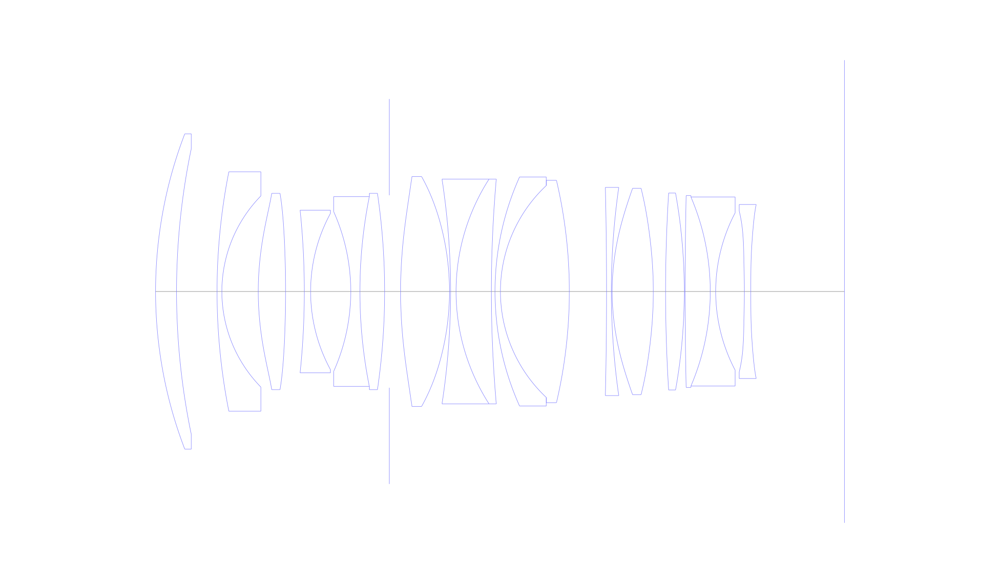
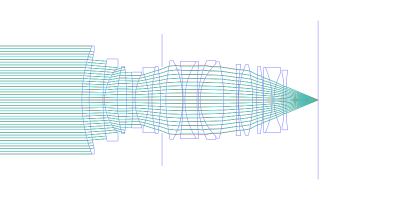
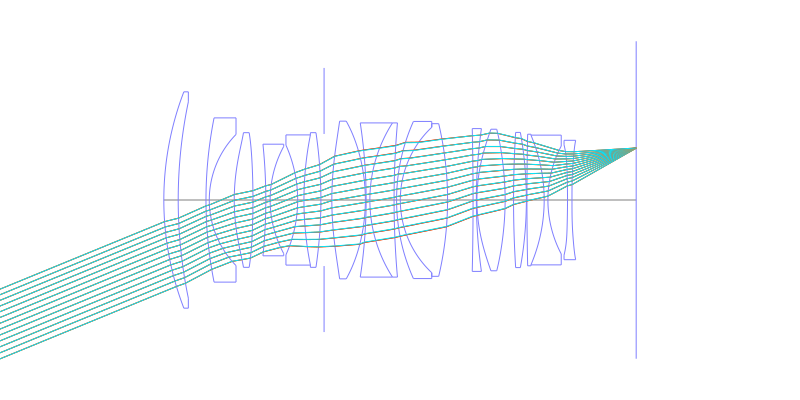
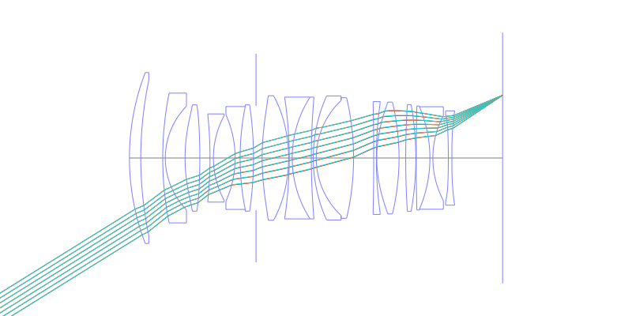
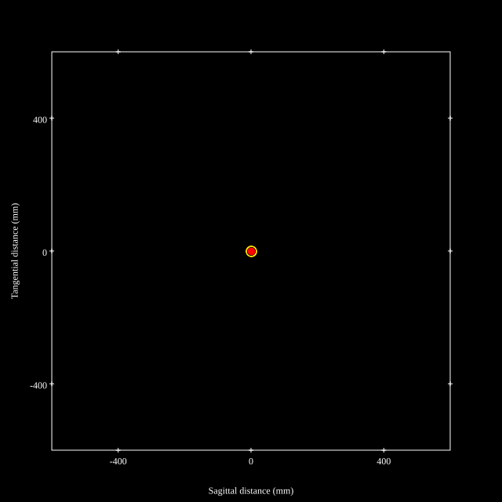
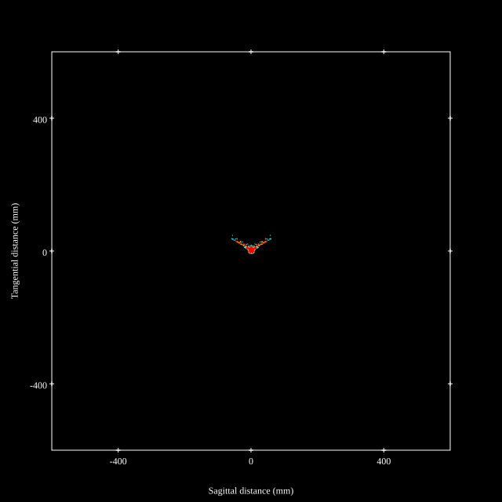
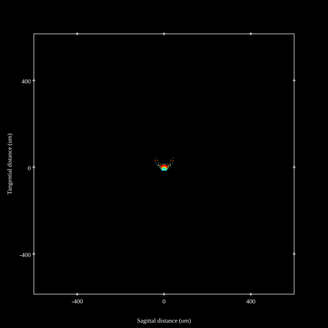
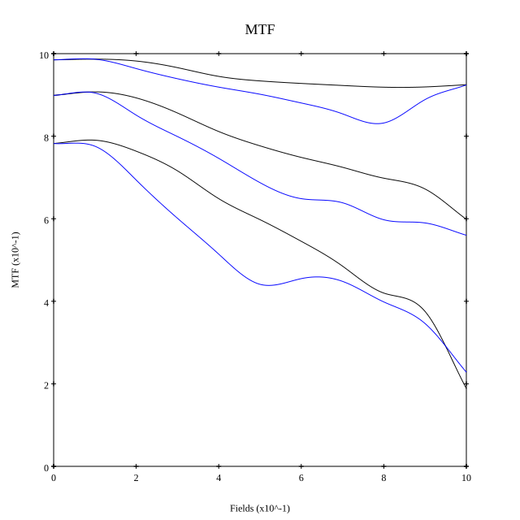
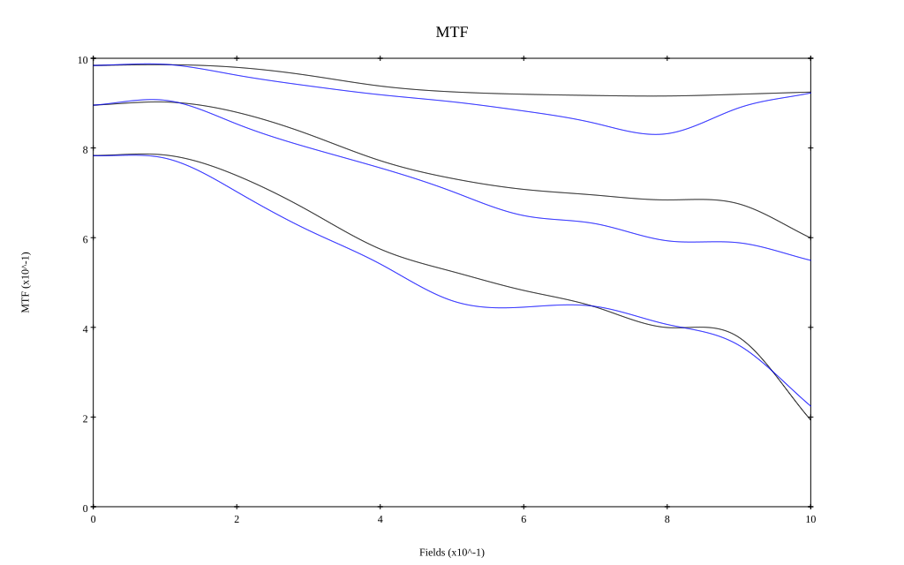

# Sigma 35mm f1.2 DG ART II
## Patent Information
| Country | Patent Number | Example | Year of Application | Inventors | Organisation | Link |
| ---     | ---           | ---     | ---                 | ---       | ---          | ---  |
|US | US 2025/0334778 | EX 2 | 2024 | Ryosuke Sato | Sigma Corp  | [link](https://patents.google.com/patent/US20250334778A1/en) |
## Surface Data
Note that where glass types are shown the refractive index and abbe number is as per assigned glass type

| ID  | Radius | Thickness | Diameter | nd  | vd  | Glass Make | Glass |
| --- | ---    | ---       | ---      | --- | --- | ---        | ---   |
| 1 | 82.3764 | 3.9192 | 58.96 | 1.80809 | 22.76 | Hoya | FD225 |
| 2 | 130.8893 | 7.5696 | 53.5 |  |  |  |
| 3 | 114.6913 | 0.9 | 44.76 | 1.54072 | 47.2 | Hoya | FEL2 |
| 4 | 25.5542 | 6.8043 | 35.74 |  |  |  |
| 5 | 56.8249 | 5.0982 | 36.7 | 1.8061 | 40.74 | Hoya | M-NBFD13 |
| 6 | -211.8812 | 3.5035 | 36.7 |  |  |  |
| 7 | -148.2676 | 1.1795 | 30.42 | 1.48749 | 70.44 | Hoya | FC5 |
| 8 | 30.65 | 7.5007 | 29.2 |  |  |  |
| 9 | -36.554 | 1.7147 | 29.88 | 1.69895 | 30.05 | Hoya | E-FD15 |
| 10 | 90.4412 | 4.6177 | 35.48 | 1.94594 | 17.98 | Hoya | FDS18 |
| 11 | -125.9694 | 0.8682 | 36.7 |  |  |  |
| 12 | AS | 2.1148 | 35.995 |  |  |  |
| 13 | 90.0023 | 9.1378 | 42.98 | 1.77377 | 47.17 | Hoya | M-TAF401 |
| 14 | -48.2139 | 0.2057 | 42.98 |  |  |  |
| 15 | -138.5636 | 1.0225 | 42.02 | 1.7888 | 28.42 | Hikari | J-KZFH10 |
| 16 | 38.9207 | 6.5952 | 42.02 | 1.755 | 52.32 | Hoya | TAC6 |
| 17 | 240.3404 | 0.6848 | 42.02 |  |  |  |
| 18 | 52.3045 | 1.0136 | 42.82 | 1.85451 | 25.15 | Hoya | NBFD25 |
| 19 | 27.2 | 12.8779 | 39.64 | 1.59282 | 68.62 | Hoya | FCD515 |
| 20 | -90.7789 | 6.9518 | 41.6 |  |  |  |
| 21 | -848.1912 | 0.9 | 38.92 | 1.69895 | 30.05 | Hoya | E-FD15 |
| 22 | 138.144 | 0.15 | 38.92 |  |  |  |
| 23 | 46.2651 | 7.6904 | 38.58 | 1.7645 | 49.1 | Ohara | L-LAH91 |
| 24 | -76.0969 | 2.2921 | 38.58 |  |  |  |
| 25 | 296.4918 | 3.4967 | 36.84 | 1.755 | 52.32 | Hoya | TAC6 |
| 26 | -104.4793 | 0.1532 | 36.84 |  |  |  |
| 27 | 820.4806 | 4.6992 | 35.86 | 1.98612 | 16.48 | Hoya | FDS16-W |
| 28 | -45.0663 | 1.0168 | 35.36 | 1.7888 | 28.42 | Hikari | J-KZFH10 |
| 29 | 31.6 | 5.3461 | 29.42 |  |  |  |
| 30 | -169.2643 | 1.2141 | 30.08 | 1.85135 | 40.1 | Hoya | M-TAFD305 |
| 31 | 1000.0 | 17.4972 | 32.54 |  |  |  |
## Aspherical Data
| ID  | k   | P1  | P2  | P3  | P3 | P5 | P6 | P7 | P8 | P9 | P10 |
| --- | --- | --- | --- | --- | --- | --- | --- | --- | --- | --- | --- |
| 5 | 0.0 | 0.0 | -1.99816E-6 | -1.32897E-9 | -2.08157E-11 | 3.9595E-15 | 0.0 | 0.0 | 0.0 | 0.0 | 0.0 |
| 6 | 0.0 | 0.0 | -4.72277E-7 | -3.3885E-10 | -2.11984E-11 | 2.3176E-14 | 0.0 | 0.0 | 0.0 | 0.0 | 0.0 |
| 13 | 0.0 | 0.0 | -1.03559E-6 | -1.87709E-9 | -7.13483E-12 | 1.19593E-14 | 0.0 | 0.0 | 0.0 | 0.0 | 0.0 |
| 14 | 0.0 | 0.0 | 7.7168E-7 | -1.40925E-9 | -8.22545E-12 | 9.14549E-15 | 0.0 | 0.0 | 0.0 | 0.0 | 0.0 |
| 23 | 0.0 | 0.0 | -1.71933E-6 | 7.19596E-10 | -1.65373E-11 | 1.66871E-14 | 0.0 | 0.0 | 0.0 | 0.0 | 0.0 |
| 24 | 0.0 | 0.0 | 3.82753E-6 | -5.16977E-9 | -8.71093E-12 | 1.35974E-14 | 0.0 | 0.0 | 0.0 | 0.0 | 0.0 |
| 30 | 0.0 | 0.0 | 2.91423E-5 | -2.82416E-7 | 6.89447E-10 | -5.1977E-13 | 0.0 | 0.0 | 0.0 | 0.0 | 0.0 |
| 31 | 0.0 | 0.0 | 4.31949E-5 | -2.72422E-7 | 7.46965E-10 | -4.3181E-13 | -6.05302E-16 | 0.0 | 0.0 | 0.0 | 0.0 |
## Layouts

## Spot Diagrams

## Paraxial Parameters
| parameter | value |
| ---       | ---   |
| effective_focal_length |34.601
| back_focal_length | 17.498
| optical_invariant | 8.674
| object_distance | 1.0E10
| image_distance | 17.498
| power | 0.029
| pp1_H | 51.359
| ppk_H' | -17.103
| ffl_F | 16.758
| fno | 1.24
| enp_dist_P | 35.195
| enp_radius | 13.952
| exp_dist_P' | -47.436
| exp_radius | 26.183
| m | -0
| red | -2.890125546661752E8
| n_obj | 1
| n_img | 1
| img_ht | 21.512
| obj_ang | 31.87
| obj_na | 0
| img_na | -0.374|
## Spot Analysis
| Field | Spot Mean Radius | Spot Max Radius |
| ---   | ---              | ---             |
 | Field(x=0.0, y=0.0) | 4.483 | 15.222|
 | Field(x=0.0, y=0.1) | 4.052 | 19.236|
 | Field(x=0.0, y=0.2) | 7.406 | 73.381|
 | Field(x=0.0, y=0.3) | 9.341 | 102.822|
 | Field(x=0.0, y=0.4) | 8.236 | 97.021|
 | Field(x=0.0, y=0.5) | 10.933 | 85.242|
 | Field(x=0.0, y=0.6) | 11.352 | 93.543|
 | Field(x=0.0, y=0.7) | 11.814 | 83.683|
 | Field(x=0.0, y=0.8) | 13.022 | 74.887|
 | Field(x=0.0, y=0.9) | 10.806 | 67.717|
 | Field(x=0.0, y=1.0) | 9.118 | 51.809|
## Geometric MTF

* 10,30,50 cycles/mm
* Black lines represent sagittal, blue tangential
* Wavelengths 587.5618(d), 486.1327(F), 656.2725(C) equal weight
## Geometric MTF (Weighted)

* 10,30,50 cycles/mm
* Black lines represent sagittal, blue tangential
* Wavelengths 587.5618(d), 656.2725(C), 546.074(e), 486.1327(F), 435.8343(g) weighted 1.0,0.475,0.98,0.49,0.15
## Resources
* [OpticalBench Compatible Data File, tab delimited](./US20250334778_Example02.txt)
* [Zemax file](./US20250334778_Example02.zmx)
