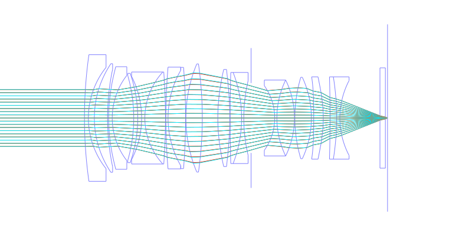
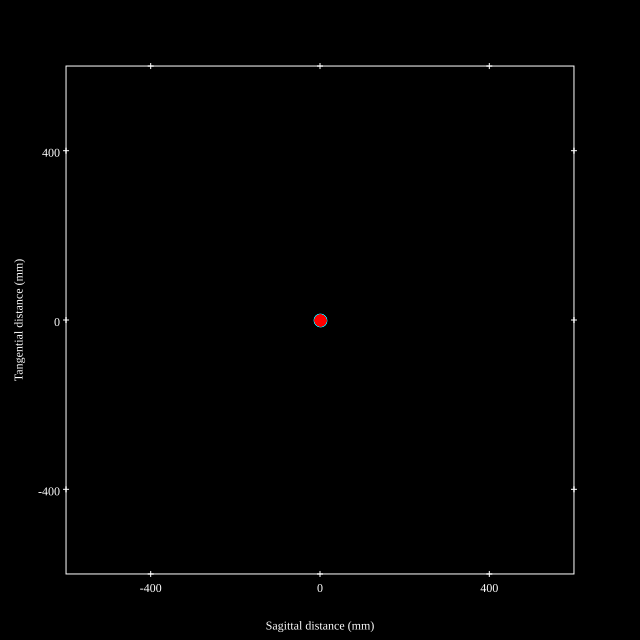
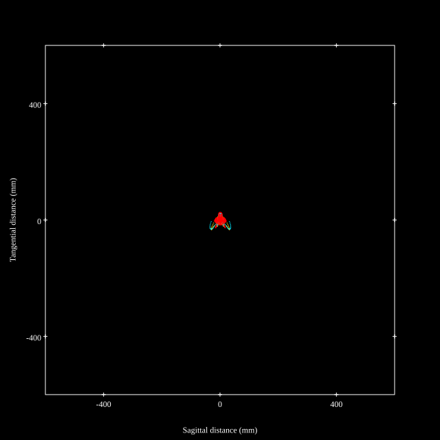
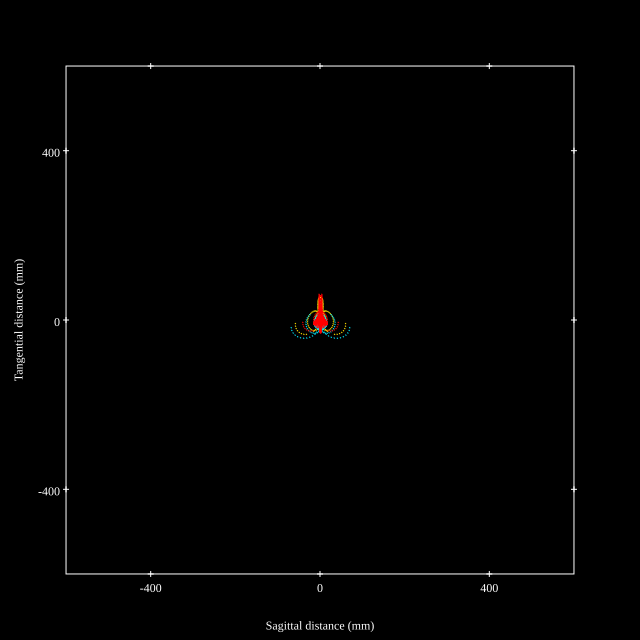
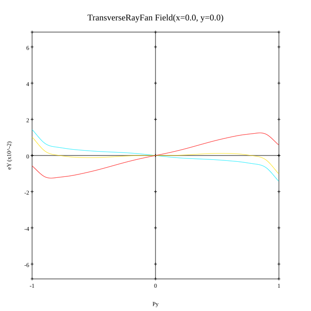
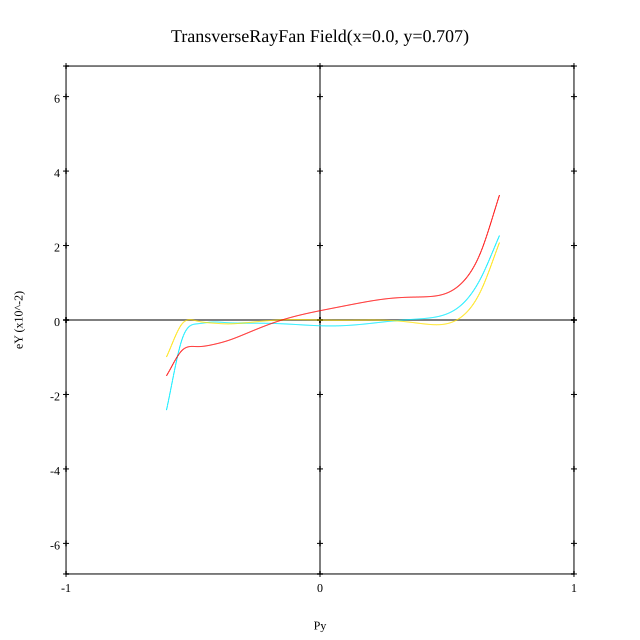
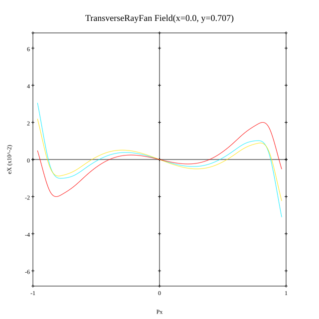
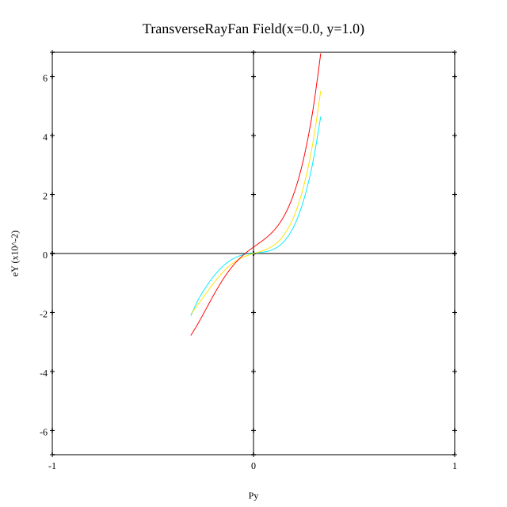
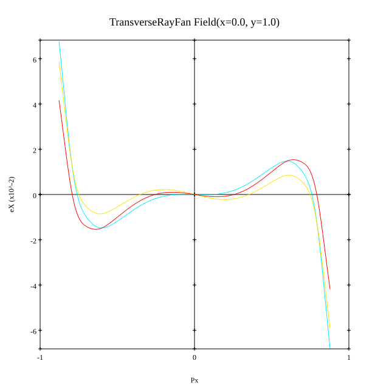

# Sigma ART 35mm F1.2 DG DN Prototype
## Patent Information
| Country | Patent Number | Example | Year of Application | Inventors | Organisation | Link |
| ---     | ---           | ---     | ---                 | ---       | ---          | ---  |
|JP | 2019-197125 | EX 6 | 2018 | Kenta Fujita | Sigma Corp | [link](https://patents.google.com/patent/JP2019197125A/en) |
## Surface Data
Note that where glass types are shown the refractive index and abbe number is as per assigned glass type

| ID  | Radius | Thickness | Diameter | nd  | vd  | Glass Make | Glass |
| --- | ---    | ---       | ---      | --- | --- | ---        | ---   |
| 1 | 208.7963 | 1.8 | 58.5 | 1.55032 | 75.5 | Hoya | FCD705 |
| 2 | 37.5679 | 2.7643 | 46.79 |  |  |  |
| 3 | 45.0047 | 6.0937 | 50.18 | 1.90366 | 31.32 | Hoya | TAFD25 |
| 4 | 109.3983 | 0.5 | 45.06 |  |  |  |
| 5 | 78.5119 | 1.6663 | 47.4 | 1.58313 | 59.46 | Hoya | MC-BACD12 |
| 6 | 31.4439 | 9.9385 | 39.32 |  |  |  |
| 7 | -70.9895 | 1.8501 | 39.09 | 2.00069 | 25.46 | Hoya | TAFD40 |
| 8 | -62.6798 | 1.7867 | 41.28 |  |  |  |
| 9 | -42.2155 | 1.5004 | 38.44 | 1.80518 | 25.46 | Hoya | FD60 |
| 10 | 31.3468 | 9.506 | 42.5 | 1.7725 | 49.62 | Hoya | TAF1 |
| 11 | -292.0488 | 0.2 | 42.5 |  |  |  |
| 12 | 276.7254 | 1.0 | 46.98 | 1.68893 | 31.16 | Hoya | E-FD8 |
| 13 | 44.2467 | 8.1039 | 44.0 | 1.7725 | 49.62 | Hoya | TAF1 |
| 14 | -290.6421 | 0.15 | 46.76 |  |  |  |
| 15 | 64.574 | 7.5729 | 49.96 | 1.92286 | 20.88 | Hoya | E-FDS1 |
| 16 | -177.0858 | 7.1633 | 49.96 |  |  |  |
| 17 | 87.5103 | 5.5489 | 44.84 | 1.8061 | 40.73 | Hoya | NBFD13 |
| 18 | -136.1628 | 0.15 | 44.84 |  |  |  |
| 19 | 785.1137 | 5.2948 | 42.08 | 1.497 | 81.61 | Hoya | FCD1 |
| 20 | -58.4639 | 1.0 | 42.08 | 1.62004 | 36.3 | Hoya | E-F2 |
| 21 | 74.9789 | 3.381 | 34.4 |  |  |  |
| 22 | AS | 10.909 | 32.295 |  |  |  |
| 23 | -25.5428 | 1.0 | 29.8 | 1.71736 | 29.5 | Hoya | E-FD1 |
| 24 | 39.998 | 8.1122 | 35.04 | 1.497 | 81.61 | Hoya | FCD1 |
| 25 | -39.998 | 0.2 | 35.04 |  |  |  |
| 26 | 66.02 | 7.6222 | 37.6 | 1.7725 | 49.62 | Hoya | TAF1 |
| 27 | -44.396 | 1.0844 | 37.6 |  |  |  |
| 28 | -500.0 | 4.4095 | 38.02 | 1.8061 | 40.73 | Hoya | NBFD13 |
| 29 | -63.0102 | 3.1483 | 38.02 |  |  |  |
| 30 | -652.6258 | 3.0248 | 38.02 | 2.00069 | 25.46 | Hoya | TAFD40 |
| 31 | -120.1715 | 1.5 | 38.02 | 1.62004 | 36.3 | Hoya | E-F2 |
| 32 | 37.3343 | 18.5186 | 34.61 |  |  |  |
| 33 | 0.0 | 2.5 | 46.34 | 1.5168 | 64.17 | Schott | N-BK7 |
| 34 | 0.0 | 1.0 | 46.34 |  |  |  |
## Aspherical Data
| ID  | k   | P1  | P2  | P3  | P3 | P5 | P6 | P7 | P8 | P9 | P10 |
| --- | --- | --- | --- | --- | --- | --- | --- | --- | --- | --- | --- |
| 5 | 0.0 | 0.0 | -2.4193E-6 | 4.2279E-9 | -6.4066E-13 | -6.3635E-15 | 1.7532E-18 | 0.0 | 0.0 | 0.0 | 0.0 |
| 6 | 0.0 | 0.0 | -2.5703E-6 | 5.992E-10 | 2.0057E-11 | -4.2154E-14 | 2.9611E-17 | 0.0 | 0.0 | 0.0 | 0.0 |
| 17 | 0.0 | 0.0 | -6.1262E-7 | -9.4062E-10 | 8.865E-13 | 6.6622E-16 | 0.0 | 0.0 | 0.0 | 0.0 | 0.0 |
| 18 | 0.0 | 0.0 | 1.8077E-6 | -2.0087E-9 | 2.3893E-12 | -6.7002E-16 | 0.0 | 0.0 | 0.0 | 0.0 | 0.0 |
| 28 | 0.0 | 0.0 | -4.371E-6 | -8.1297E-9 | 3.9617E-11 | -5.2134E-14 | 0.0 | 0.0 | 0.0 | 0.0 | 0.0 |
| 29 | 0.0 | 0.0 | 4.0846E-6 | -8.8949E-9 | 3.9681E-11 | -4.464E-14 | 0.0 | 0.0 | 0.0 | 0.0 | 0.0 |
## Layouts

## Spot Diagrams

## Paraxial Parameters
| parameter | value |
| ---       | ---   |
| effective_focal_length |35.99
| back_focal_length | 1
| optical_invariant | 9.032
| object_distance | 1.0E10
| image_distance | 1
| power | 0.028
| pp1_H | 55.324
| ppk_H' | -34.991
| ffl_F | 19.334
| fno | 1.26
| enp_dist_P | 39.563
| enp_radius | 14.282
| exp_dist_P' | -63.033
| exp_radius | 25.41
| m | -0
| red | -2.77852510814402E8
| n_obj | 1
| n_img | 1
| img_ht | 22.761
| obj_ang | 32.31
| obj_na | 0
| img_na | -0.369|
## Spot Analysis
| Field | Spot Mean Radius | Spot Max Radius |
| ---   | ---              | ---             |
 | Field(x=0.0, y=0.0) | 6.975 | 14.289|
 | Field(x=0.0, y=0.707) | 9.481 | 45.971|
 | Field(x=0.0, y=1.0) | 16.445 | 71.293|
## Ray Aberrations
### Field 0.0

### Field 0.7

### Field 1.0

## Resources
* [OpticalBench Compatible Data File, tab delimited](./JP2019-197125_Example06.txt)
* [Zemax file](./JP2019-197125_Example06.zmx)
