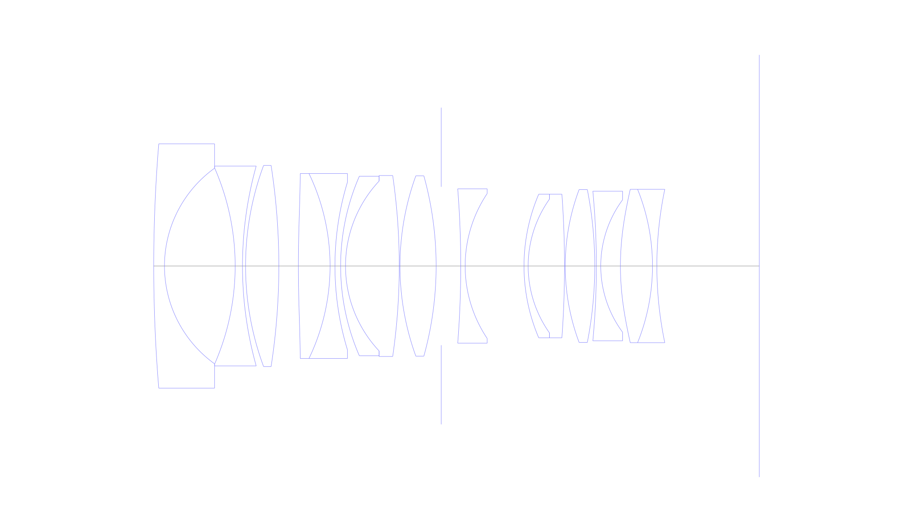
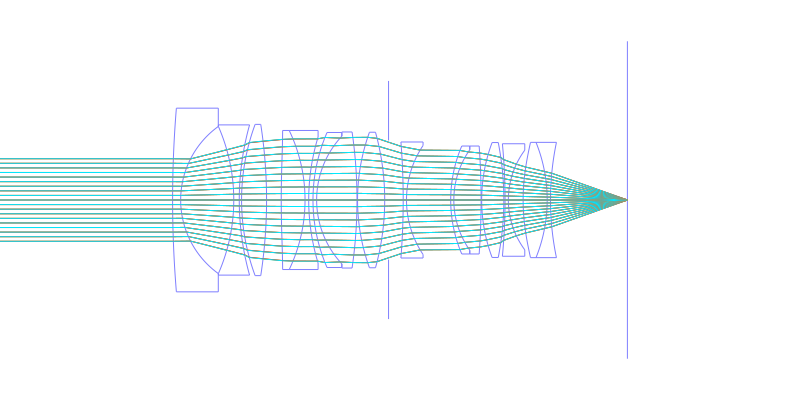
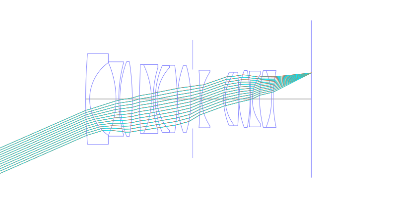
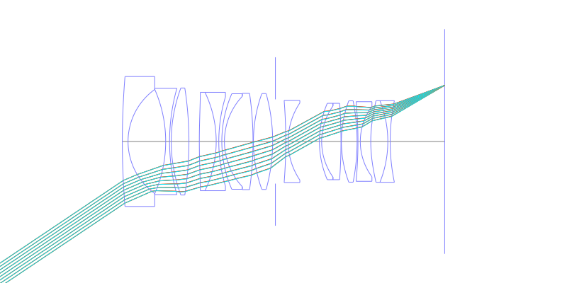
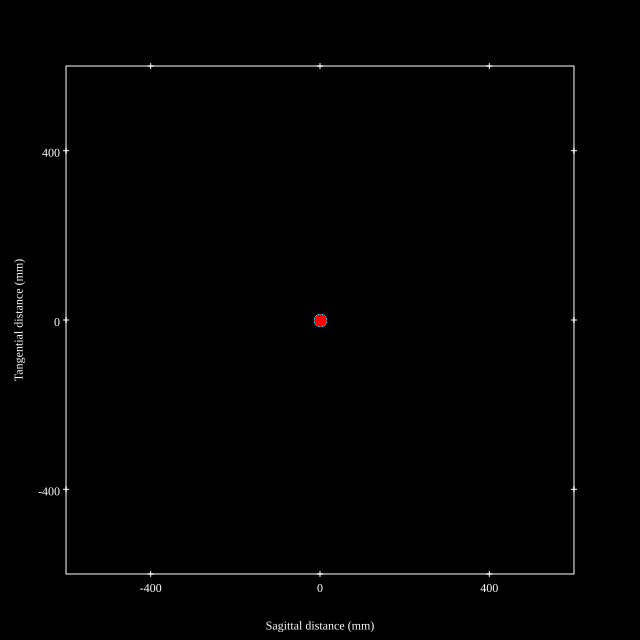
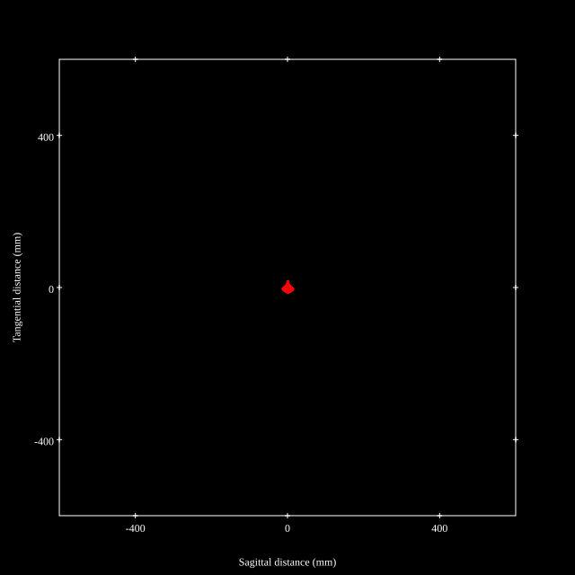
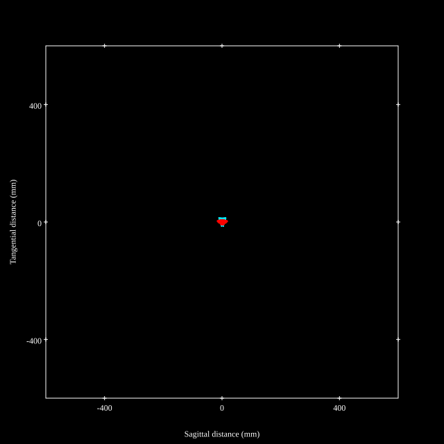
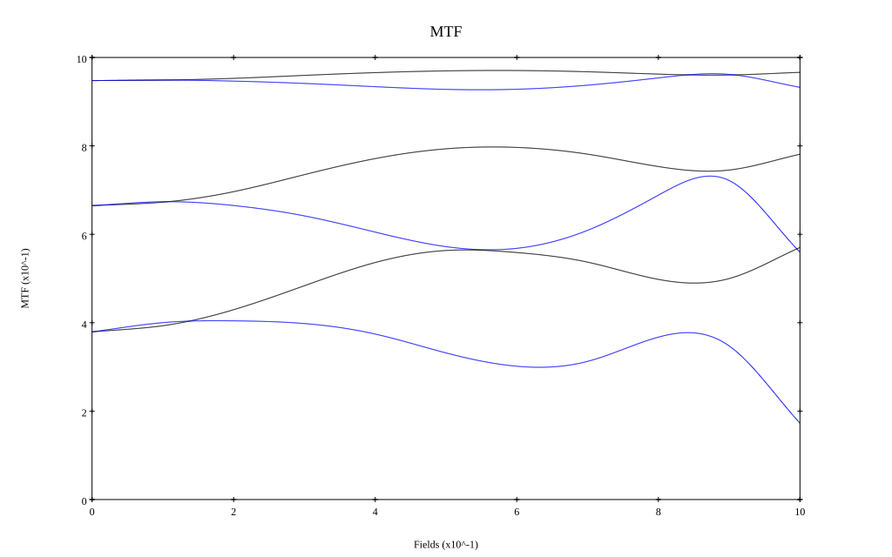
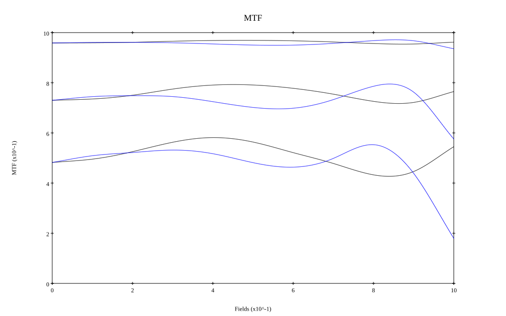

# Sigma 35mm F1.4 DG DN Art
## Patent Information
| Country | Patent Number | Example | Year of Application | Inventors | Organisation | Link |
| ---     | ---           | ---     | ---                 | ---       | ---          | ---  |
|JP | JP2022-033487 | EX 1 | 2020 | Ryo Shioda | Sigma Corp | [link](https://patents.google.com/patent/JP2022033487A/en) |
## Surface Data
Note that where glass types are shown the refractive index and abbe number is as per assigned glass type

| ID  | Radius | Thickness | Diameter | nd  | vd  | Glass Make | Glass |
| --- | ---    | ---       | ---      | --- | --- | ---        | ---   |
| 1 | 305.0235 | 2.2 | 50.06 | 1.48749 | 70.44 | Hoya | FC5 |
| 2 | 24.7212 | 14.4681 | 40.09 |  |  |  |
| 3 | -50.0835 | 1.5 | 40.09 | 1.437 | 95.1 | Hoya | FCD100 |
| 4 | 76.0889 | 0.63 | 40.94 |  |  |  |
| 5 | 59.3842 | 6.8109 | 41.22 | 1.881 | 40.14 | Hoya | TAFD33 |
| 6 | -134.6441 | 3.9968 | 41.22 |  |  |  |
| 7 | 240.5313 | 6.4886 | 37.9 | 1.7725 | 49.5 | Hoya | MC-TAF105 |
| 8 | -43.7781 | 1.0 | 37.9 | 1.5927 | 35.45 | Hoya | FF5 |
| 9 | 58.963 | 1.1632 | 34.34 |  |  |  |
| 10 | 46.0805 | 1.0 | 36.8 | 1.6134 | 44.27 | Ohara | S-NBM51 |
| 11 | 25.4742 | 10.9986 | 34.8 | 1.4586 | 90.19 | Hoya | FCD10A |
| 12 | -128.5813 | 0.15 | 37.08 |  |  |  |
| 13 | 54.1975 | 7.3991 | 36.94 | 1.55032 | 75.5 | Hoya | FCD705 |
| 14 | -69.1018 | 1.05 | 36.94 |  |  |  |
| 15 | AS | 3.9908 | 32.452 |  |  |  |
| 16 | -201.4141 | 0.9 | 31.62 | 1.48749 | 70.44 | Hoya | FC5 |
| 17 | 26.6994 | 12.0473 | 29.7 |  |  |  |
| 18 | 37.4241 | 0.85 | 29.42 | 1.85451 | 25.15 | Hoya | NBFD25 |
| 19 | 23.7169 | 7.4401 | 27.38 | 1.55032 | 75.5 | Hoya | FCD705 |
| 20 | -202.1596 | 0.15 | 29.42 |  |  |  |
| 21 | 44.6216 | 6.0412 | 31.32 | 1.95375 | 32.32 | Hoya | TAFD45 |
| 22 | -81.3192 | 0.3285 | 31.32 |  |  |  |
| 23 | -163.446 | 0.9 | 30.66 | 1.6134 | 44.27 | Ohara | S-NBM51 |
| 24 | 22.8329 | 4.026 | 27.16 |  |  |  |
| 25 | 54.8915 | 6.5602 | 31.42 | 1.7725 | 49.5 | Hoya | MC-TAF105 |
| 26 | -42.0436 | 0.9 | 31.42 | 1.77047 | 29.74 | Hoya | NBFD29 |
| 27 | 76.9936 | 20.9607 | 31.42 |  |  |  |
## Aspherical Data
| ID  | k   | P1  | P2  | P3  | P3 | P5 | P6 | P7 | P8 | P9 | P10 |
| --- | --- | --- | --- | --- | --- | --- | --- | --- | --- | --- | --- |
| 7 | 0.0 | 0.0 | -3.04814E-6 | 6.39807E-10 | 4.52327E-13 | -1.6076E-14 | 7.81018E-17 | -1.3303E-19 | 8.3289E-23 | 0.0 | 0.0 |
| 25 | 0.0 | 0.0 | -4.06671E-6 | 6.92529E-10 | -6.11485E-11 | 6.42866E-13 | -3.52967E-15 | 8.54521E-18 | -6.58266E-21 | 0.0 | 0.0 |
## Layouts

## Spot Diagrams

## Paraxial Parameters
| parameter | value |
| ---       | ---   |
| effective_focal_length |33.719
| back_focal_length | 20.961
| optical_invariant | 7.757
| object_distance | 1.0E10
| image_distance | 20.961
| power | 0.03
| pp1_H | 42.876
| ppk_H' | -12.758
| ffl_F | 9.157
| fno | 1.46
| enp_dist_P | 27.91
| enp_radius | 11.548
| exp_dist_P' | -39.668
| exp_radius | 20.764
| m | -0
| red | -2.965648962236207E8
| n_obj | 1
| n_img | 1
| img_ht | 22.65
| obj_ang | 33.89
| obj_na | 0
| img_na | -0.324|
## Spot Analysis
| Field | Spot Mean Radius | Spot Max Radius |
| ---   | ---              | ---             |
 | Field(x=0.0, y=0.0) | 6.747 | 13.575|
 | Field(x=0.0, y=0.1) | 6.683 | 13.841|
 | Field(x=0.0, y=0.2) | 6.652 | 14.639|
 | Field(x=0.0, y=0.3) | 6.666 | 16.279|
 | Field(x=0.0, y=0.4) | 6.723 | 16.679|
 | Field(x=0.0, y=0.5) | 6.795 | 16.385|
 | Field(x=0.0, y=0.6) | 6.742 | 17.411|
 | Field(x=0.0, y=0.7) | 6.542 | 17.724|
 | Field(x=0.0, y=0.8) | 6.169 | 16.396|
 | Field(x=0.0, y=0.9) | 6.036 | 18.144|
 | Field(x=0.0, y=1.0) | 6.944 | 19.397|
## Geometric MTF

* 10,30,50 cycles/mm
* Black lines represent sagittal, blue tangential
* Wavelengths 587.5618(d), 486.1327(F), 656.2725(C) equal weight
## Geometric MTF (Weighted)

* 10,30,50 cycles/mm
* Black lines represent sagittal, blue tangential
* Wavelengths 587.5618(d), 656.2725(C), 546.074(e), 486.1327(F), 435.8343(g) weighted 1.0,0.475,0.98,0.49,0.15
## Resources
* [OpticalBench Compatible Data File, tab delimited](./JP2022-033487_Example01P.txt)
* [Zemax file](./JP2022-033487_Example01P.zmx)
