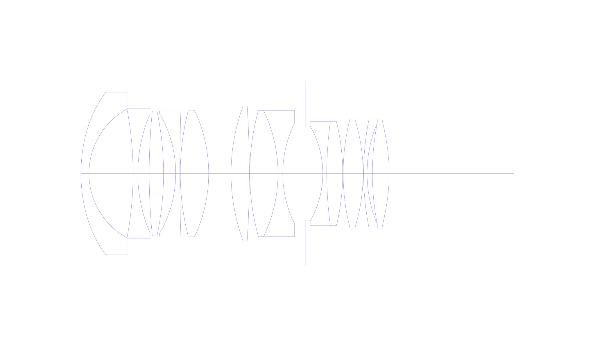
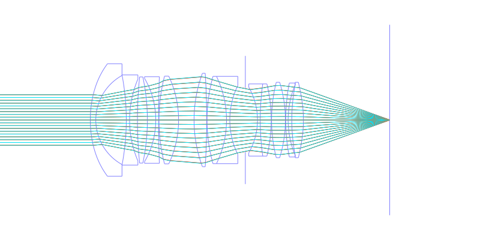
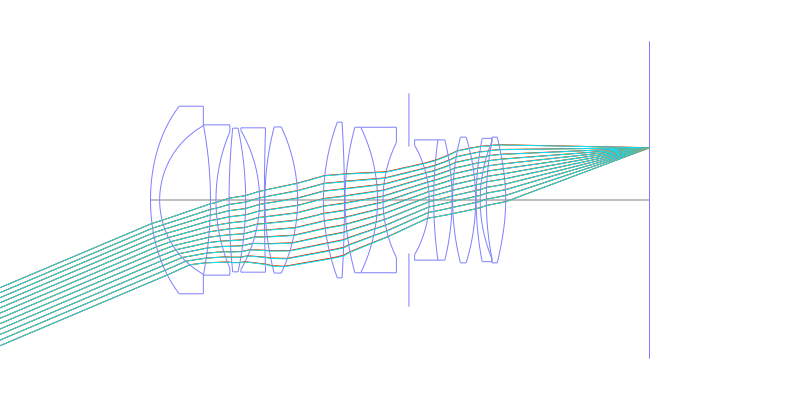
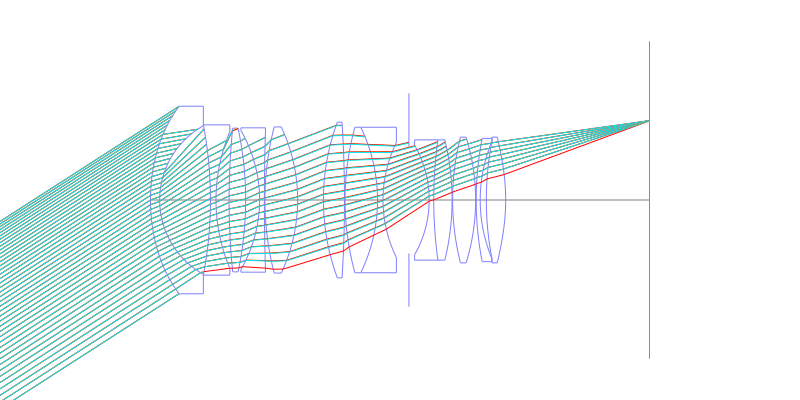
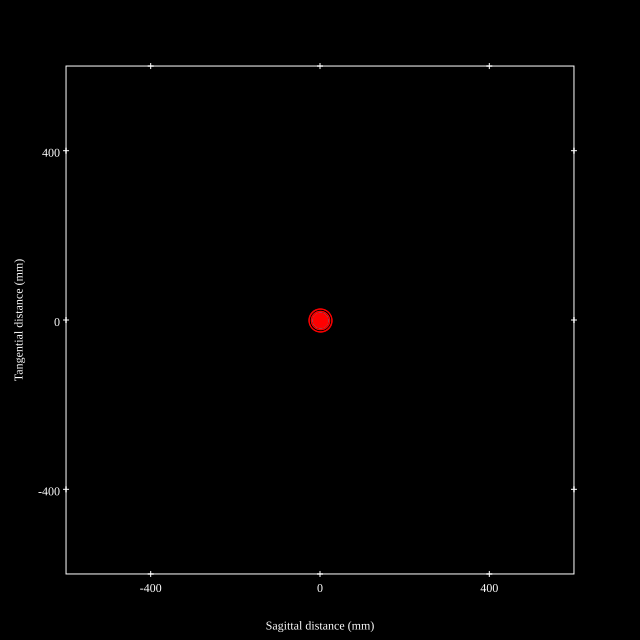
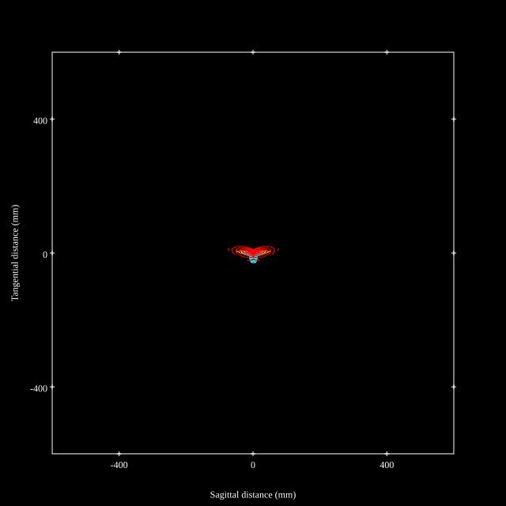
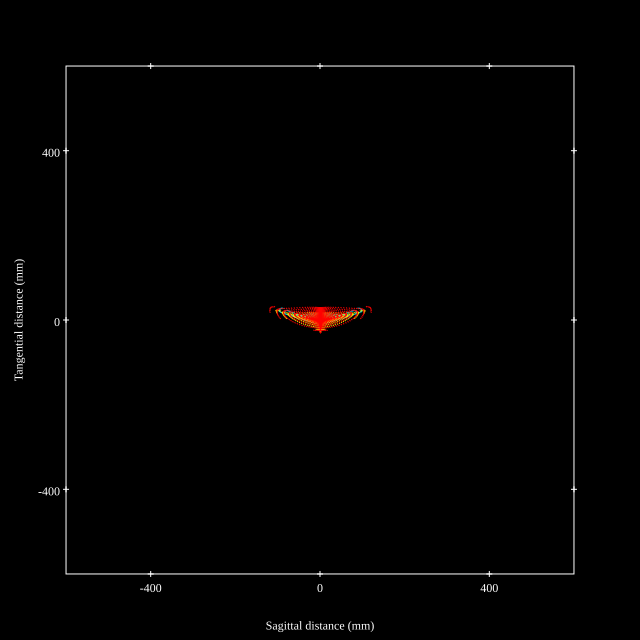
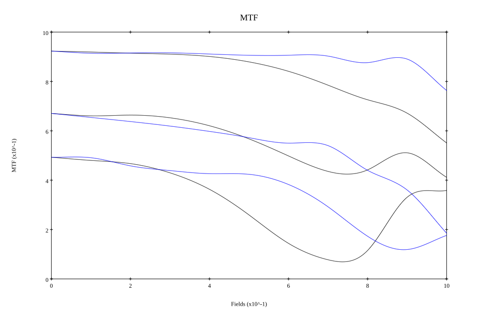
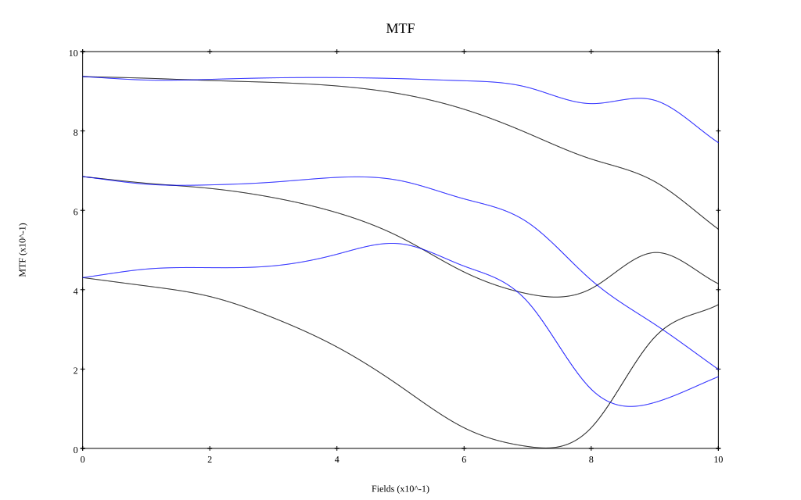

# Sigma 35mm F1.4 DG HSM Art
## Patent Information
| Country | Patent Number | Example | Year of Application | Inventors | Organisation | Link |
| ---     | ---           | ---     | ---                 | ---       | ---          | ---  |
|JP | JP 2014-048488 | EX 3 | 2012 | Ryo Shioda | Sigma Corp | [link](https://patents.google.com/patent/JP2014048488A/en) |
## Surface Data
Note that where glass types are shown the refractive index and abbe number is as per assigned glass type

| ID  | Radius | Thickness | Diameter | nd  | vd  | Glass Make | Glass |
| --- | ---    | ---       | ---      | --- | --- | ---        | ---   |
| 1 | 51.6928 | 2.5 | 51.12 | 1.58913 | 61.25 | Hoya | BACD5 |
| 2 | 23.1387 | 13.8467 | 40.45 |  |  |  |
| 3 | -108.959 | 1.5 | 40.96 | 1.437 | 95.1 | Hoya | FCD100 |
| 4 | 47.6787 | 3.5755 | 37.2 |  |  |  |
| 5 | 196.1242 | 4.5045 | 39.16 | 2.001 | 29.13 | Hoya | TAFD55 |
| 6 | -94.0062 | 3.8127 | 39.16 |  |  |  |
| 7 | -37.6685 | 1.3 | 37.86 | 1.72825 | 28.32 | Hoya | FD10 |
| 8 | 606.2428 | 0.15 | 39.34 |  |  |  |
| 9 | 79.8753 | 8.9087 | 39.82 | 1.59282 | 68.62 | Hoya | FCD505 |
| 10 | -46.6701 | 7.0345 | 39.82 |  |  |  |
| 11 | 61.2667 | 5.7369 | 42.44 | 2.001 | 29.13 | Hoya | TAFD55 |
| 12 | -336.7562 | 0.15 | 42.44 |  |  |  |
| 13 | 74.1753 | 8.8511 | 39.66 | 1.59282 | 68.62 | Hoya | FCD505 |
| 14 | -45.397 | 1.5 | 39.66 | 1.60342 | 38.03 | Schott | F5 |
| 15 | 35.4664 | 7.0624 | 31.3 |  |  |  |
| 16 | AS | 5.5151 | 29.102 |  |  |  |
| 17 | -30.0 | 1.25 | 29.82 | 1.80518 | 25.47 | Hoya | FD6 |
| 18 | 119.7609 | 4.996 | 32.78 | 1.437 | 95.1 | Hoya | FCD100 |
| 19 | -68.8075 | 0.15 | 32.78 |  |  |  |
| 20 | 70.0035 | 6.265 | 34.26 | 1.56883 | 56.04 | Hoya | BAC4 |
| 21 | -57.8073 | 0.15 | 34.26 |  |  |  |
| 22 | 86.6673 | 1.1 | 33.6 | 1.48749 | 70.44 | Hoya | FC5 |
| 23 | 41.4963 | 1.6662 | 31.96 |  |  |  |
| 24 | 83.8165 | 5.2749 | 31.96 | 1.7725 | 49.46 | Hoya | M-TAF1 |
| 25 | -56.3959 | 39.2 | 34.26 |  |  |  |
## Aspherical Data
| ID  | k   | P1  | P2  | P3  | P3 | P5 | P6 | P7 | P8 | P9 | P10 |
| --- | --- | --- | --- | --- | --- | --- | --- | --- | --- | --- | --- |
| 1 | 0.0 | 0.0 | 1.65056E-6 | 1.96288E-9 | -3.8208E-12 | 7.44465E-15 | -5.09935E-18 | 0.0 | 0.0 | 0.0 | 0.0 |
| 25 | 0.0 | 0.0 | 4.3716E-6 | -2.8629E-10 | -4.07099E-13 | 7.96087E-15 | -7.28754E-18 | 0.0 | 0.0 | 0.0 | 0.0 |
## Layouts

## Spot Diagrams

## Paraxial Parameters
| parameter | value |
| ---       | ---   |
| effective_focal_length |34
| back_focal_length | 39.201
| optical_invariant | 7.54
| object_distance | 1.0E10
| image_distance | 39.201
| power | 0.029
| pp1_H | 53.385
| ppk_H' | 5.201
| ffl_F | 19.385
| fno | 1.45
| enp_dist_P | 34.909
| enp_radius | 11.724
| exp_dist_P' | -35.263
| exp_radius | 25.677
| m | -0
| red | -2.941165850292295E8
| n_obj | 1
| n_img | 1
| img_ht | 21.865
| obj_ang | 32.745
| obj_na | 0
| img_na | -0.326|
## Spot Analysis
| Field | Spot Mean Radius | Spot Max Radius |
| ---   | ---              | ---             |
 | Field(x=0.0, y=0.0) | 9.588 | 27.006|
 | Field(x=0.0, y=0.1) | 10.137 | 32.117|
 | Field(x=0.0, y=0.2) | 10.611 | 40.672|
 | Field(x=0.0, y=0.3) | 10.344 | 44.21|
 | Field(x=0.0, y=0.4) | 10.549 | 48.92|
 | Field(x=0.0, y=0.5) | 11.491 | 47.49|
 | Field(x=0.0, y=0.6) | 12.761 | 64.152|
 | Field(x=0.0, y=0.7) | 14.881 | 76.493|
 | Field(x=0.0, y=0.8) | 18.467 | 90.591|
 | Field(x=0.0, y=0.9) | 23.011 | 105.789|
 | Field(x=0.0, y=1.0) | 32.029 | 122.303|
## Geometric MTF

* 10,30,50 cycles/mm
* Black lines represent sagittal, blue tangential
* Wavelengths 587.5618(d), 486.1327(F), 656.2725(C) equal weight
## Geometric MTF (Weighted)

* 10,30,50 cycles/mm
* Black lines represent sagittal, blue tangential
* Wavelengths 587.5618(d), 656.2725(C), 546.074(e), 486.1327(F), 435.8343(g) weighted 1.0,0.475,0.98,0.49,0.15
## Resources
* [OpticalBench Compatible Data File, tab delimited](./JP2014-048488_Example03P.txt)
* [Zemax file](./JP2014-048488_Example03P.zmx)
