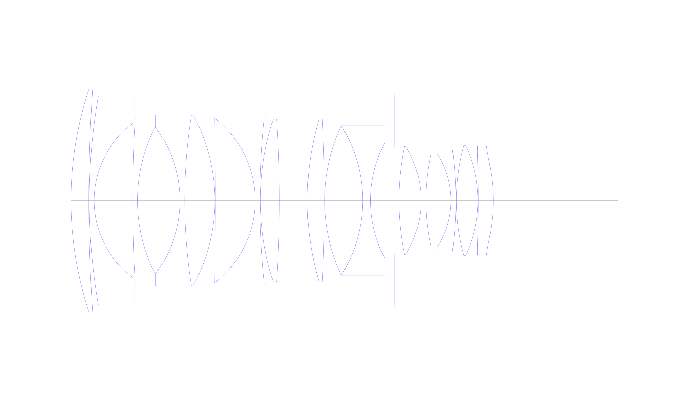
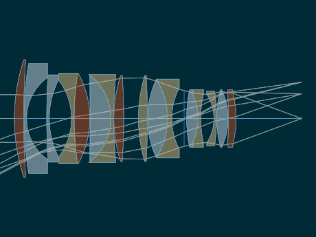
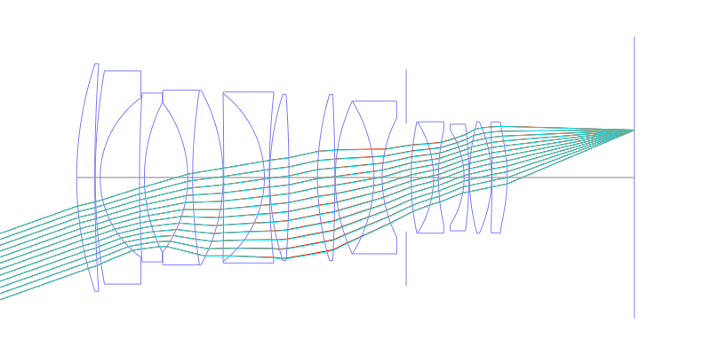
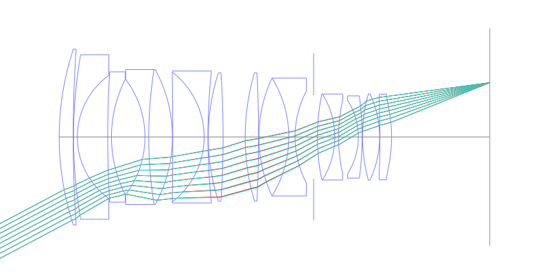
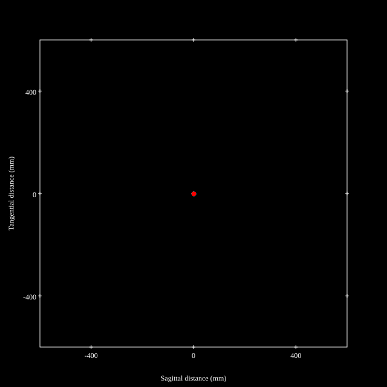
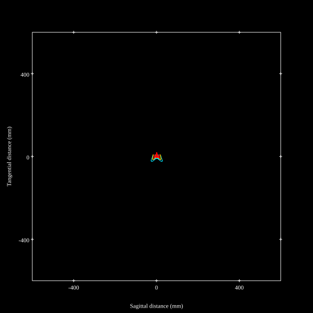
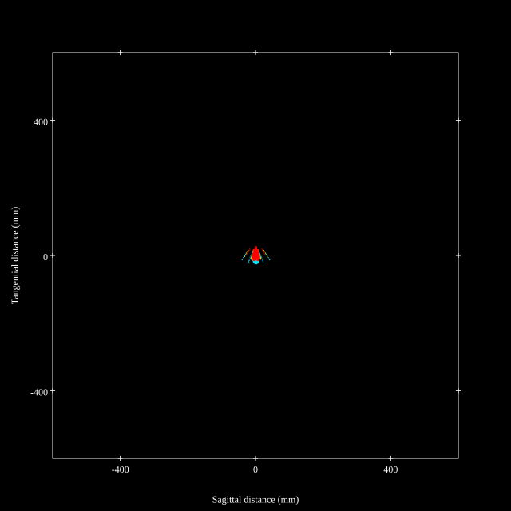
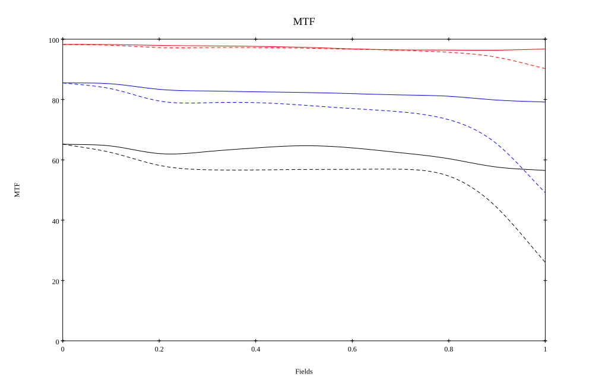
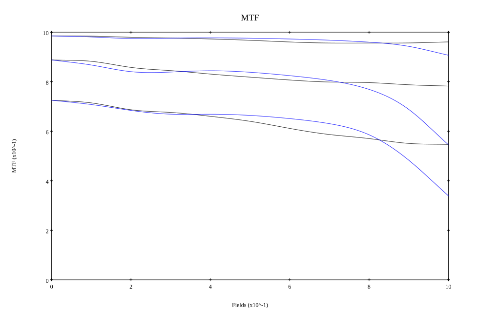

# Sigma 40mm f1.4 DG ART
## Patent Information
| Country | Patent Number | Example | Year of Application | Inventors | Organisation | Link |
| ---     | ---           | ---     | ---                 | ---       | ---          | ---  |
|JP | JP2020-012952 | EX 1 | 2018 | Takeshi Yamanaka | Sigma Corp | [link](https://patents.google.com/patent/JP2020012952A/en) |
## Surface Data
Note that where glass types are shown the refractive index and abbe number is as per assigned glass type

| ID  | Radius | Thickness | Diameter | nd  | vd  | Glass Make | Glass |
| --- | ---    | ---       | ---      | --- | --- | ---        | ---   |
| 1 | 111.7037 | 5.5478 | 69.87 | 1.7725 | 49.62 | Hoya | TAF1 |
| 2 | 514.0093 | 0.15 | 69.87 |  |  |  |
| 3 | 191.8963 | 1.5 | 65.47 | 1.437 | 95.1 | Hoya | FCD100 |
| 4 | 30.2492 | 12.0599 | 49.0 |  |  |  |
| 5 | 423.9805 | 1.5 | 51.84 | 1.437 | 95.1 | Hoya | FCD100 |
| 6 | 50.8216 | 13.2984 | 45.9 |  |  |  |
| 7 | -38.1791 | 1.5 | 45.9 | 1.64769 | 33.84 | Hoya | E-FD2 |
| 8 | 172.544 | 9.3857 | 53.69 | 1.83481 | 42.72 | Hoya | TAFD5F |
| 9 | -56.304 | 0.15 | 53.69 |  |  |  |
| 10 | -1641.6822 | 12.4672 | 51.59 | 1.55032 | 75.5 | Hoya | FCD705 |
| 11 | -32.7021 | 1.5 | 51.59 | 1.60342 | 38.01 | Hoya | E-F5 |
| 12 | 246.8799 | 0.15 | 52.48 |  |  |  |
| 13 | 83.2754 | 5.882 | 51.07 | 1.7725 | 49.62 | Hoya | TAF1 |
| 14 | -377.0503 | 8.7665 | 51.07 |  |  |  |
| 15 | 90.4416 | 5.3037 | 51.07 | 1.92286 | 20.88 | Hoya | E-FDS1 |
| 16 | -527.4885 | 0.15 | 51.07 |  |  |  |
| 17 | 55.6364 | 11.866 | 46.89 | 1.59282 | 68.62 | Hoya | FCD515 |
| 18 | -44.6058 | 2.482 | 46.89 | 1.58144 | 40.89 | Hoya | E-FL5 |
| 19 | 39.3845 | 7.3907 | 36.5 |  |  |  |
| 20 | AS | 1.5 | 33.213 |  |  |  |
| 21 | 84.0231 | 6.8887 | 34.22 | 1.437 | 95.1 | Hoya | FCD100 |
| 22 | -32.202 | 1.5 | 34.22 | 1.64769 | 33.84 | Hoya | E-FD2 |
| 23 | 66.2242 | 7.8613 | 29.25 |  |  |  |
| 24 | -26.9856 | 1.5 | 29.25 | 1.62588 | 35.74 | Hoya | E-F1 |
| 25 | -121.029 | 0.15 | 32.74 |  |  |  |
| 26 | 64.6922 | 6.7685 | 34.35 | 1.59282 | 68.62 | Hoya | FCD515 |
| 27 | -40.8255 | 0.15 | 34.35 |  |  |  |
| 28 | -430.037 | 4.6315 | 34.08 | 1.85135 | 40.1 | Hoya | M-TAFD305 |
| 29 | -54.9865 | 39.0002 | 34.08 |  |  |  |
## Aspherical Data
| ID  | k   | P1  | P2  | P3  | P3 | P5 | P6 | P7 | P8 | P9 | P10 |
| --- | --- | --- | --- | --- | --- | --- | --- | --- | --- | --- | --- |
| 28 | 0.0 | 0.0 | -2.73662E-6 | 3.07519E-9 | 3.90515E-11 | -1.94154E-14 | 0.0 | 0.0 | 0.0 | 0.0 | 0.0 |
| 29 | 0.0 | 0.0 | 3.26804E-6 | 3.98767E-9 | 3.58258E-11 | 0.0 | 0.0 | 0.0 | 0.0 | 0.0 | 0.0 |
## Layouts

## Spot Diagrams

## Paraxial Parameters
| parameter | value |
| ---       | ---   |
| effective_focal_length |41.2
| back_focal_length | 39.001
| optical_invariant | 7.533
| object_distance | 1.0E10
| image_distance | 39.001
| power | 0.024
| pp1_H | 71.886
| ppk_H' | -2.199
| ffl_F | 30.686
| fno | 1.45
| enp_dist_P | 50.74
| enp_radius | 14.207
| exp_dist_P' | -45.641
| exp_radius | 29.187
| m | -0
| red | -2.4271567371252346E8
| n_obj | 1
| n_img | 1
| img_ht | 21.847
| obj_ang | 27.935
| obj_na | 0
| img_na | -0.326|
## Spot Analysis
| Field | Spot Mean Radius | Spot Max Radius |
| ---   | ---              | ---             |
 | Field(x=0.0, y=0.0) | 4.17 | 7.174|
 | Field(x=0.0, y=0.1) | 4.5 | 15.464|
 | Field(x=0.0, y=0.2) | 5.365 | 19.602|
 | Field(x=0.0, y=0.3) | 5.471 | 20.152|
 | Field(x=0.0, y=0.4) | 5.086 | 22.541|
 | Field(x=0.0, y=0.5) | 5.358 | 27.888|
 | Field(x=0.0, y=0.6) | 5.72 | 42.609|
 | Field(x=0.0, y=0.7) | 6.261 | 33.723|
 | Field(x=0.0, y=0.8) | 6.35 | 40.047|
 | Field(x=0.0, y=0.9) | 7.148 | 55.572|
 | Field(x=0.0, y=1.0) | 8.51 | 41.648|
## Polychromatic Geometric MTF

* 10,30,50 cycles/mm
* Black lines represent sagittal, blue tangential
* To generate above, MTFs for wavelengths 587.5618(d), 486.1327(F), 656.2725(C) were calculated across 10 fields, and then averaged
## Polychromatic Geometric MTF (Weighted)

* 10,30,50 cycles/mm
* Black lines represent sagittal, blue tangential
* To generate above, MTFs for wavelengths 587.5618(d) wt(1.0), 656.2725(C) wt(0.475), 546.074(e) wt(0.98), 486.1327(F) wt(0.49), 435.8343(g) wt(0.15) were calculated across 10 fields, and then combined using weighted average
## Resources
* [OpticalBench Compatible Data File, tab delimited](./Sigma-40mmf1.4.txt)
* [Zemax file](./Sigma-40mmf1.4.zmx)
