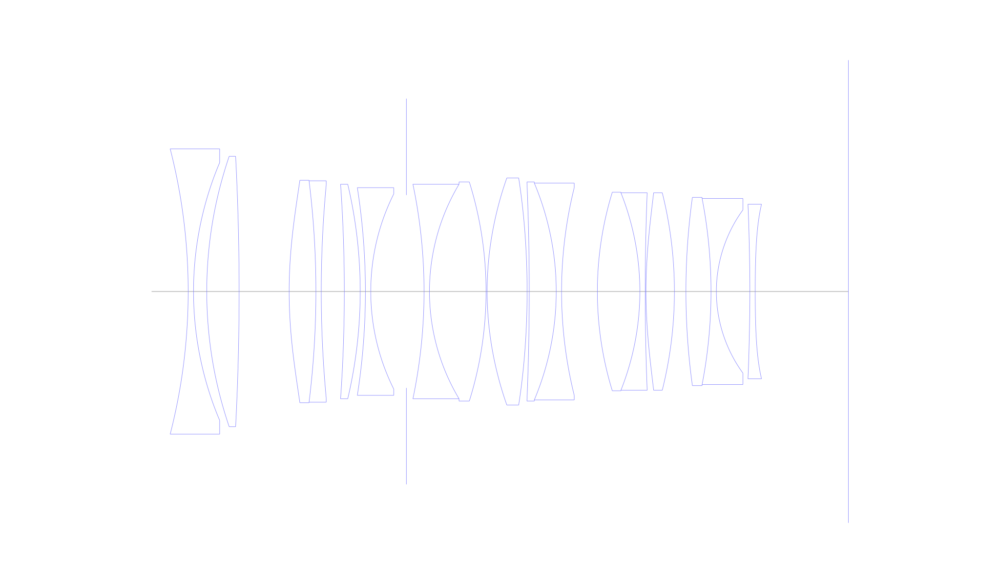
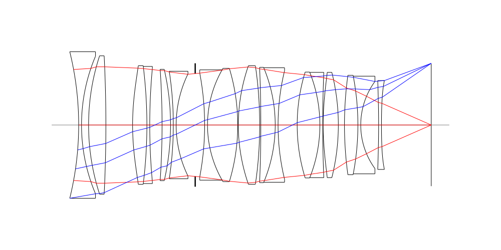
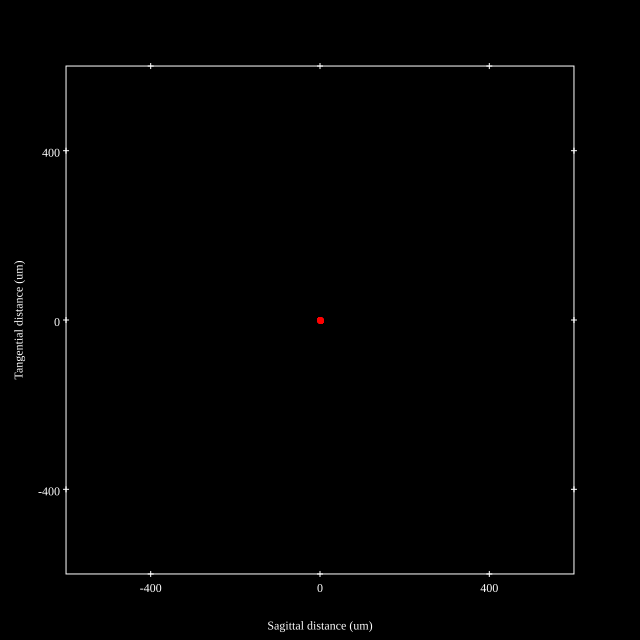
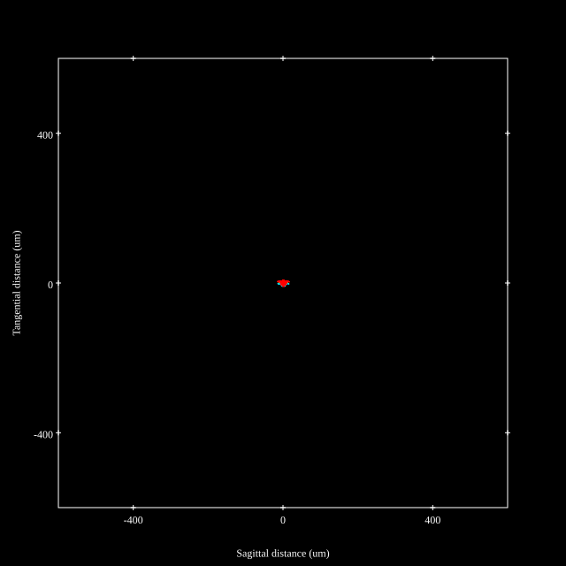
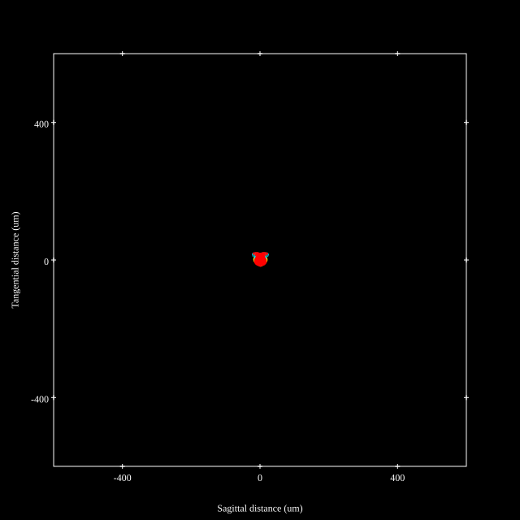
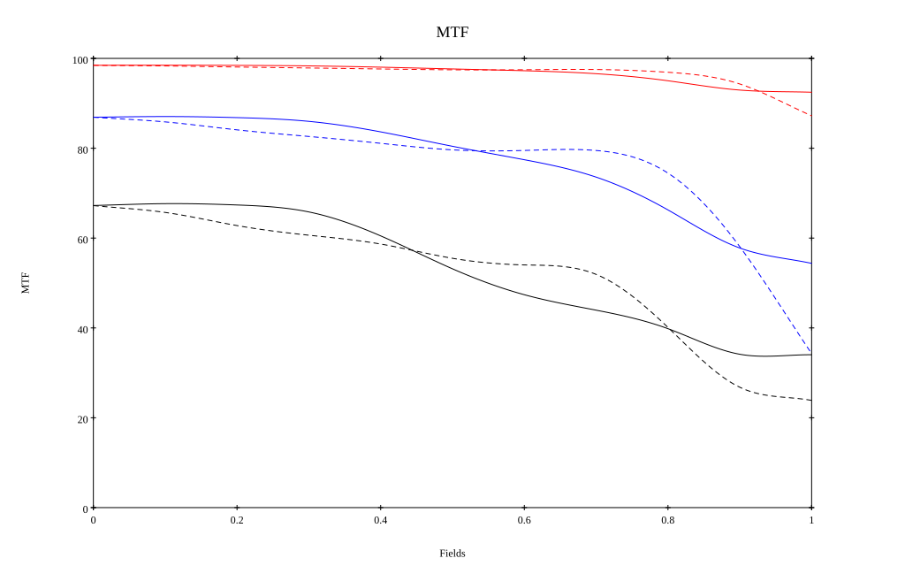
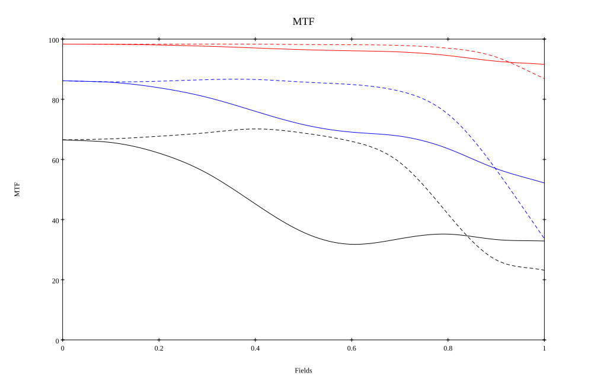

# Sigma 50mm f1.2 DG DN ART
## Patent Information
| Country | Patent Number | Example | Year of Application | Inventors | Organisation | Link |
| ---     | ---           | ---     | ---                 | ---       | ---          | ---  |
|US | US 2025/0258361 | EX 1 | 2024 | UEDA HIROAKI | Sigma Corp  | [link](https://worldwide.espacenet.com/patent/search?q=pn%3DUS2025258361A1) |
## Surface Data
Note that where glass types are shown the refractive index and abbe number is as per assigned glass type

| ID  | Radius | Thickness | Diameter | nd  | vd  | Glass Make | Glass |
| --- | ---    | ---       | ---      | --- | --- | ---        | ---   |
| 1 | -107.51 | 1.0 | 51.3888 | 1.51742 | 52.15 | Hoya | E-CF6 |
| 2 | 61.93 | 2.47 | 48.22 |  |  |  |
| 3 | 78.33 | 6.05 | 48.507 | 2.001 | 29.13 | Hoya | TAFD55 |
| 4 | -489.3 | 9.35 | 48.1449 |  |  |  |
| 5 | 88.26 | 5.0 | 41.6 | 1.7645 | 49.1 | Ohara | L-LAH91 |
| 6 | -167.85 | 1.0 | 41.0675 | 1.5927 | 35.45 | Hoya | FF5 |
| 7 | 215.05 | 4.31 | 39.9 |  |  |  |
| 8 | -287.49 | 2.97 | 39.0436 | 2.001 | 29.13 | Hoya | TAFD55 |
| 9 | -87.34 | 0.97 | 38.9188 |  |  |  |
| 10 | -125.88 | 1.0 | 37.708 | 1.5927 | 35.45 | Hoya | FF5 |
| 11 | 40.89 | 6.66 | 35.7807 |  |  |  |
| 12 | AS | 3.3 | 36.0637 |  |  |  |
| 13 | -97.6 | 1.01 | 36.3761 | 1.85451 | 25.15 | Hoya | NBFD25 |
| 14 | 39.17 | 10.58 | 38.6751 | 1.755 | 52.32 | Ohara | S-LAH97 |
| 15 | -68.52 | 0.2 | 39.7264 |  |  |  |
| 16 | 61.71 | 7.47 | 41.5617 | 1.7645 | 49.1 | Ohara | L-LAH91 |
| 17 | -151.3 | 0.4 | 41.1996 |  |  |  |
| 18 | -487.97 | 5.04 | 40.4467 | 1.98612 | 16.48 | Hoya | FDS16-W |
| 19 | -52.2 | 1.0 | 40.1427 | 1.85451 | 25.15 | Hoya | NBFD25 |
| 20 | 80.81 | 6.69 | 38.0327 |  |  |  |
| 21 | 63.1 | 7.94 | 37.12 | 1.755 | 52.32 | Ohara | S-LAH97 |
| 22 | -49.94 | 1.0 | 36.92 | 1.85451 | 25.15 | Hoya | NBFD25 |
| 23 | 463.31 | 0.15 | 36.858 |  |  |  |
| 24 | 96.76 | 5.31 | 36.92 | 1.8061 | 40.73 | Hoya | NBFD13 |
| 25 | -76.07 | 2.15 | 36.92 |  |  |  |
| 26 | 128.54 | 4.69 | 34.8582 | 2.00069 | 25.46 | Hoya | TAFD40 |
| 27 | -91.46 | 1.0 | 34.2543 | 1.61396 | 44.29 | Hoya | LAF45 |
| 28 | 25.95 | 6.26 | 30.52 |  |  |  |
| 29 | -300.0 | 1.0 | 30.7602 | 1.85135 | 40.1 | Hoya | M-TAFD305 |
| 30 | 267.11 | 17.4116 | 31.1596 |  |  |  |
## Aspherical Data
| ID  | Type | k   | P1 | P2 | P3 | P4 | P5 | P6 | P7 |
| --- | --- | --- | --- | --- | --- | --- | --- | --- | --- |
| 5| EVEN | 0.0 | 0.0 | -2.1774E-6 | -8.5908E-10 | -3.9991E-13 | 4.2419E-16 | 0.0 | 0  |
| 16| EVEN | 0.0 | 0.0 | -6.4826E-7 | 7.1294E-10 | -6.6137E-13 | 4.5967E-16 | 0.0 | 0  |
| 17| EVEN | 0.0 | 0.0 | -4.3597E-7 | 3.0441E-10 | -7.5013E-13 | 5.3928E-16 | 0.0 | 0  |
| 24| EVEN | 0.0 | 0.0 | -2.7523E-6 | -8.3384E-10 | 3.371E-13 | 0.0 | 0.0 | 0  |
| 29| EVEN | 0.0 | 0.0 | 4.0914E-6 | -2.8321E-8 | 1.7934E-10 | -7.1336E-13 | 1.3086E-15 | -8.762E-19 |
| 30| EVEN | 0.0 | 0.0 | 1.0591E-5 | -2.7395E-8 | 2.2115E-10 | -8.8172E-13 | 1.8537E-15 | -1.5758E-18 |
## Layouts

## Spot Diagrams

## Paraxial Parameters
| parameter | value |
| ---       | ---   |
| effective_focal_length |48.27
| back_focal_length | 17.412
| optical_invariant | 8.645
| object_distance | 1.0E10
| image_distance | 17.412
| power | 0.021
| pp1_H | 44.264
| ppk_H' | -30.857
| ffl_F | -4.006
| fno | 1.24
| enp_dist_P | 34.659
| enp_radius | 19.464
| exp_dist_P' | -42.848
| exp_radius | 24.299
| m | -0
| red | -2.0716916260903558E8
| n_obj | 1
| n_img | 1
| img_ht | 21.441
| obj_ang | 23.95
| obj_na | 0
| img_na | -0.403|
## Spot Analysis
| Field | Spot Mean Radius (µm) | Spot Max Radius (µm) |
| ---   | ---              | ---             |
 | Field(x=0.0, y=0.0) | 3.918 | 6.266|
 | Field(x=0.0, y=0.1) | 4.01 | 8.27|
 | Field(x=0.0, y=0.2) | 4.195 | 8.231|
 | Field(x=0.0, y=0.3) | 4.388 | 9.104|
 | Field(x=0.0, y=0.4) | 4.687 | 9.497|
 | Field(x=0.0, y=0.5) | 4.994 | 9.654|
 | Field(x=0.0, y=0.6) | 5.189 | 11.965|
 | Field(x=0.0, y=0.7) | 5.48 | 16.287|
 | Field(x=0.0, y=0.8) | 6.475 | 22.767|
 | Field(x=0.0, y=0.9) | 8.23 | 28.244|
 | Field(x=0.0, y=1.0) | 10.521 | 29.336|
## Polychromatic Geometric MTF

* 10=red,30=blue,50=black cycles/mm
* Solid lines represent sagittal, dashed lines tangential
* To generate above, MTFs for wavelengths 587.5618(d), 486.1327(F), 656.2725(C) were calculated across 10 fields, and then averaged
## Polychromatic Geometric MTF (Weighted)

* 10=red,30=blue,50=black cycles/mm
* Solid lines represent sagittal, dashed lines tangential
* To generate above, MTFs for wavelengths 587.5618(d) wt(1.0), 656.2725(C) wt(0.475), 546.074(e) wt(0.98), 486.1327(F) wt(0.49), 435.8343(g) wt(0.15) were calculated across 10 fields, and then combined using weighted average
## Resources
* [OpticalBench Compatible Data File, tab delimited](./prescription.txt)
* [Zemax file](./US20250258361_Example01.zmx)

Generated from `US20250258361_Example01.txt`, status **TODO**

Report / Zemax file generated using [Beam42](https://github.com/BeamFour/Beam42) on 2026-10-02
