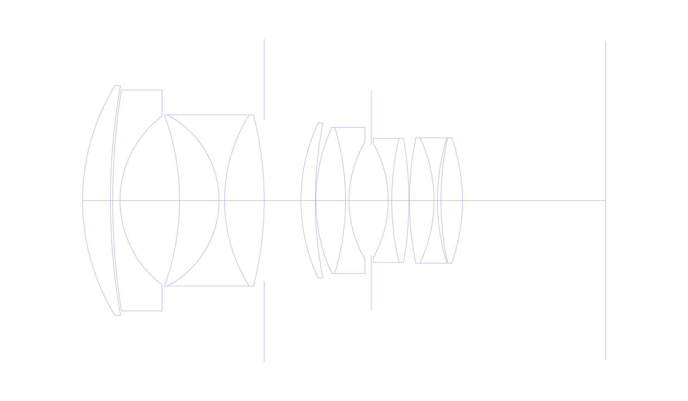
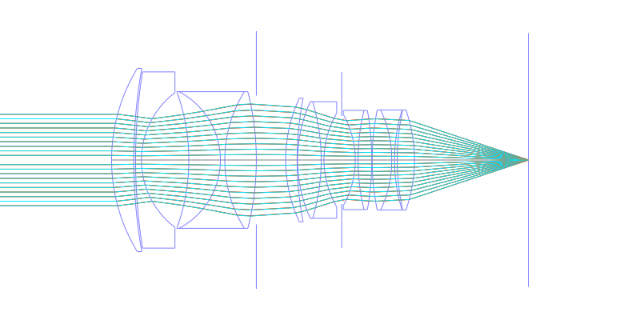
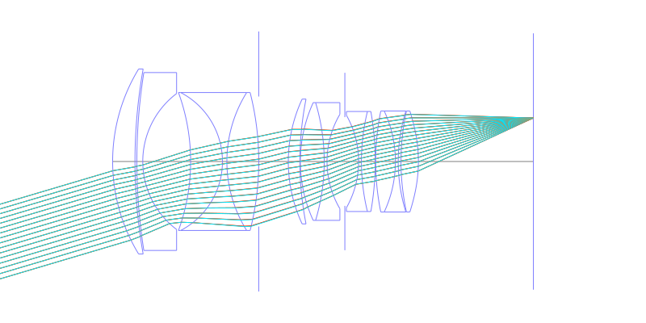
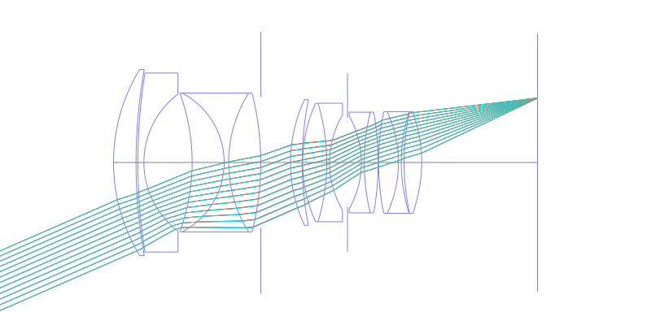
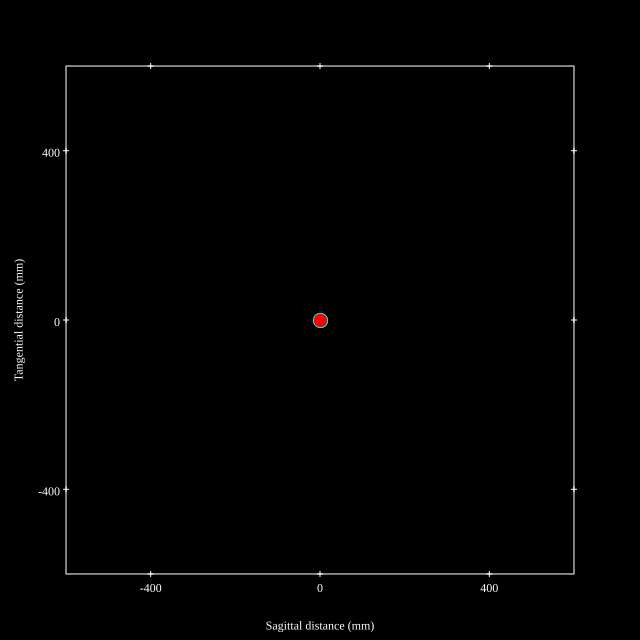
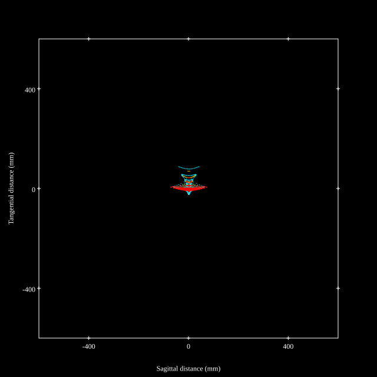
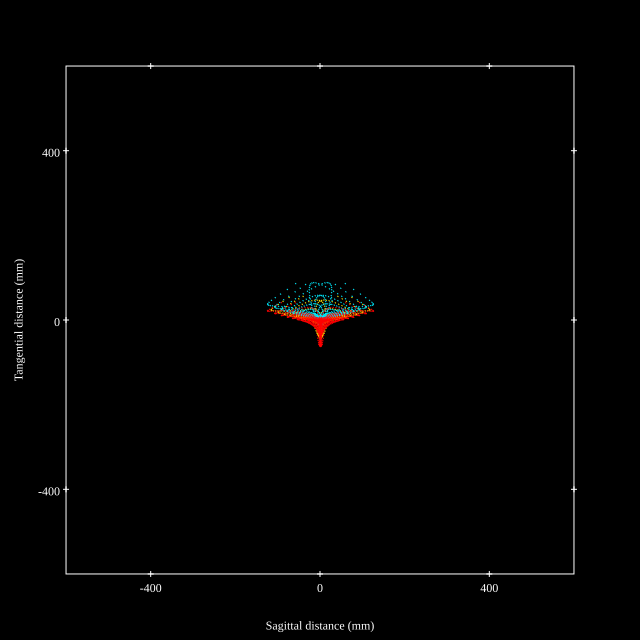

# Sigma 50mm f1.4 DG HSM ART
## Patent Information
| Country | Patent Number | Example | Year of Application | Inventors | Organisation | Link |
| ---     | ---           | ---     | ---                 | ---       | ---          | ---  |
|JP | 2015-114366 | EX 1 | 2013 | Ryo Shioda | Sigma Corp  | [link](https://patents.google.com/patent/JP2015114366A/en) |
## Surface Data
Note that where glass types are shown the refractive index and abbe number is as per assigned glass type

| ID  | Radius | Thickness | Diameter | nd  | vd  | Glass Make | Glass |
| --- | ---    | ---       | ---      | --- | --- | ---        | ---   |
| 1 | 59.9687 | 7.5464 | 62.44 | 1.91082 | 35.25 | Hoya | TAFD35 |
| 2 | 178.4018 | 0.6242 | 62.44 |  |  |  |
| 3 | 192.0154 | 2.0 | 60.04 | 1.62588 | 35.74 | Hoya | E-F1 |
| 4 | 28.7552 | 16.1562 | 45.88 |  |  |  |
| 5 | -67.9622 | 10.7338 | 46.56 | 1.497 | 81.61 | Hoya | FCD1 |
| 6 | -26.2761 | 1.5 | 46.56 | 1.54814 | 45.82 | Hoya | E-FEL1 |
| 7 | 43.9346 | 10.7524 | 46.56 | 1.883 | 40.81 | Hoya | TAFD30 |
| 8 | -94.4447 | 0.0 | 46.56 |  |  |  |
| 9 | FS | 9.9796 | 43.88 |  |  |  |
| 10 | 49.8944 | 3.9121 | 42.12 | 1.92286 | 20.88 | Hoya | M-FDS1 |
| 11 | 108.4891 | 0.15 | 42.12 |  |  |  |
| 12 | 47.6761 | 8.0538 | 39.74 | 1.72916 | 54.67 | Hoya | TAC8 |
| 13 | -69.2432 | 0.95 | 39.74 | 1.72825 | 28.32 | Hoya | E-FD10 |
| 14 | 31.4317 | 6.0186 | 31.88 |  |  |  |
| 15 | AS | 4.6436 | 29.944 |  |  |  |
| 16 | -31.6556 | 0.95 | 31.2 | 1.62588 | 35.74 | Hoya | E-F1 |
| 17 | 71.6171 | 4.661 | 33.76 | 1.59282 | 68.62 | Hoya | FCD505 |
| 18 | -96.5972 | 0.15 | 33.76 |  |  |  |
| 19 | 85.5221 | 6.6571 | 34.1 | 1.59282 | 68.62 | Hoya | FCD505 |
| 20 | -40.3262 | 0.95 | 34.1 | 1.51742 | 52.15 | Hoya | E-CF6 |
| 21 | 57.5543 | 0.9291 | 34.1 |  |  |  |
| 22 | 77.4702 | 5.8822 | 34.1 | 1.7725 | 49.63 | Hoya | TAF1 |
| 23 | -47.5092 | 38.7999 | 34.1 |  |  |  |
## Aspherical Data
| ID  | k   | A4  | A6  | A8  | A10 | A12 | A14 | A16 | A18 |
| --- | --- | --- | --- | --- | --- | --- | --- | --- | --- |
| 22 | 0.0 | -9.93095E-7 | 1.24366E-9 | -7.51084E-13 | 0.0 | 0.0 | 0.0 | 0.0 | 0.0 |
| 23 | 0.0 | 3.17495E-6 | -1.01711E-10 | 2.0025E-12 | -1.26705E-15 | 0.0 | 0.0 | 0.0 | 0.0 |
## Layouts

## Spot Diagrams

## Paraxial Parameters
| parameter | value |
| ---       | ---   |
| effective_focal_length |49.583
| back_focal_length | 38.8
| optical_invariant | 7.417
| object_distance | 1.0E10
| image_distance | 38.8
| power | 0.02
| pp1_H | 68.72
| ppk_H' | 10.783
| ffl_F | 19.137
| fno | 1.46
| enp_dist_P | 56.624
| enp_radius | 16.98
| exp_dist_P' | -26.782
| exp_radius | 22.46
| m | 0
| red | -2.016818431909079E8
| n_obj | 1
| n_img | 1
| img_ht | 21.657
| obj_ang | 23.595
| obj_na | 0
| img_na | -0.324|
## Spot Analysis
| Field | Spot Mean Radius | Spot Max Radius |
| ---   | ---              | ---             |
 | 0.0 | 6.882 | 14.639|
 | 0.7 | 21.073 | 103.922|
 | 1.0 | 41.199 | 155.503|
## Resources
* [OpticalBench Compatible Data File, tab delimited](./JP2015-114366_Example01.txt)
* [Zemax file](./JP2015-114366_Example01.zmx)
