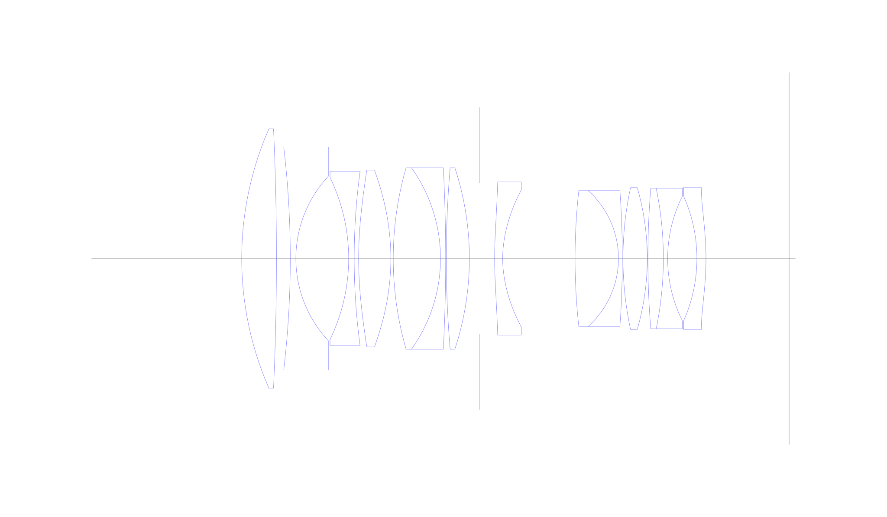
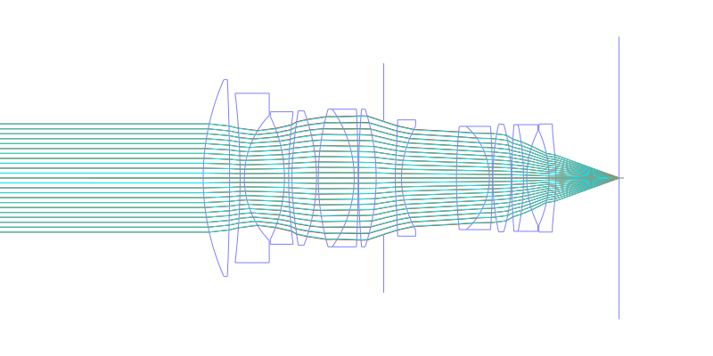
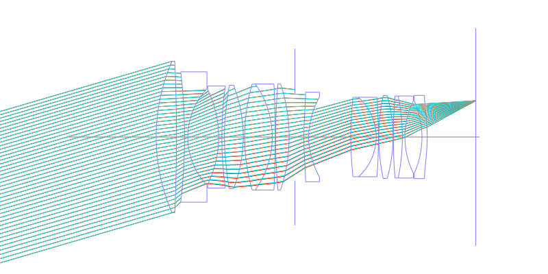
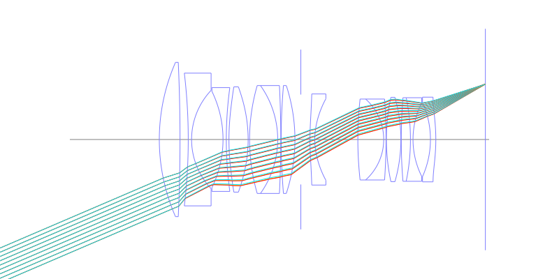
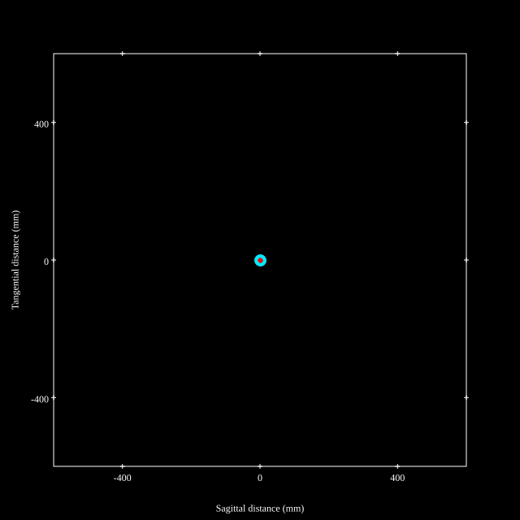
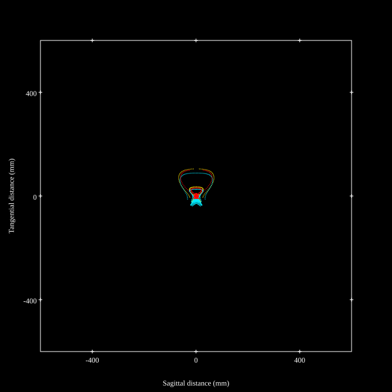
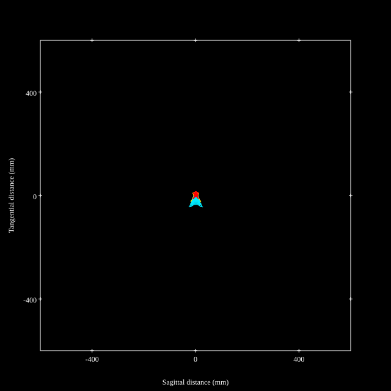

# Sigma 50mm f1.4 DG DN ART
## Patent Information
| Country | Patent Number | Example | Year of Application | Inventors | Organisation | Link |
| ---     | ---           | ---     | ---                 | ---       | ---          | ---  |
|JP | JP2023-183894 | EX 1 | 2022 | Yukihiro Yamamoto | Sigma Corp  | [link](https://patents.google.com/patent/JP2023183894A/en) |
## Surface Data
Note that where glass types are shown the refractive index and abbe number is as per assigned glass type

| ID  | Radius | Thickness | Diameter | nd  | vd  | Glass Make | Glass |
| --- | ---    | ---       | ---      | --- | --- | ---        | ---   |
| 1 | 75.1052 | 8.0761 | 60.3 | 1.92286 | 20.88 | Hoya | M-FDS1 |
| 2 | -663.2678 | 3.2104 | 60.3 |  |  |  |
| 3 | -221.0442 | 1.3 | 51.86 | 1.51742 | 52.15 | Hoya | E-CF6 |
| 4 | 28.0267 | 12.2601 | 38.41 |  |  |  |
| 5 | -43.0741 | 1.2859 | 37.64 | 1.80518 | 25.46 | Hoya | FD60 |
| 6 | 150.887 | 1.0283 | 40.56 |  |  |  |
| 7 | 89.29 | 7.4823 | 41.12 | 1.7645 | 49.09 | Ohara | L-LAH91 |
| 8 | -55.1739 | 0.5621 | 41.12 |  |  |  |
| 9 | 76.095 | 10.974 | 42.16 | 1.59282 | 68.62 | Hoya | FCD515 |
| 10 | -36.3741 | 1.2 | 42.16 | 1.69895 | 30.05 | Hoya | E-FD15 |
| 11 | -419.5413 | 0.15 | 42.16 |  |  |  |
| 12 | 249.5104 | 5.3632 | 42.16 | 1.883 | 40.81 | Hoya | TAFD30 |
| 13 | -67.6164 | 2.3076 | 42.16 |  |  |  |
| 14 | AS | 3.55 | 35.127 |  |  |  |
| 15 | 89.357 | 1.8779 | 35.6 | 1.59201 | 67.02 | Hoya | M-PCD51 |
| 16 | 26.4444 | 16.8119 | 31.86 |  |  |  |
| 17 | 143.6922 | 10.0848 | 31.62 | 1.755 | 52.3 | Ohara | S-LAH97 |
| 18 | -21.2474 | 0.9 | 31.62 | 1.85451 | 25.15 | Hoya | NBFD25 |
| 19 | -220.4492 | 0.15 | 31.62 |  |  |  |
| 20 | 78.1343 | 5.6421 | 32.96 | 2.001 | 29.13 | Hoya | TAFD55 |
| 21 | -59.5828 | 0.15 | 32.96 |  |  |  |
| 22 | 202.6288 | 3.5861 | 32.66 | 1.94594 | 17.98 | Hoya | FDS18 |
| 23 | -80.8939 | 1.0025 | 32.66 | 1.620041 | 36.3 | Ohara | S-TIM2 |
| 24 | 32.3684 | 6.7925 | 28.87 |  |  |  |
| 25 | -35.5202 | 2.1 | 28.95 | 1.688931 | 31.1 | Ohara | S-TIM28 |
| 26 | -68.5557 | 19.3272 | 33.1 |  |  |  |
## Aspherical Data
| ID  | k   | A4  | A6  | A8  | A10 | A12 | A14 | A16 | A18 |
| --- | --- | --- | --- | --- | --- | --- | --- | --- | --- |
| 7 | -2.0205 | -2.8022E-6 | -1.9538E-9 | 3.3127E-11 | -2.6429E-13 | 1.2732E-15 | -3.5497E-18 | 5.3556E-21 | -3.3225E-24 |
| 8 | 0.3182 | 1.1423E-6 | -1.6319E-9 | 1.2848E-11 | -8.069E-14 | 3.8126E-16 | -1.1181E-18 | 1.8667E-21 | -1.2695E-24 |
| 15 | 0.0 | -3.0079E-5 | 1.9319E-7 | -1.112E-9 | 4.9002E-12 | -1.6981E-14 | 4.4651E-17 | -7.3729E-20 | 5.3157E-23 |
| 16 | 0.0 | -3.2846E-5 | 1.8693E-7 | -9.2909E-10 | 2.5316E-12 | -2.7979E-15 | 0.0 | 0.0 | 0.0 |
| 26 | 0.0 | 1.0284E-5 | 6.2726E-9 | -7.0515E-11 | 1.8284E-12 | -1.6967E-14 | 7.8024E-17 | -1.7394E-19 | 1.4654E-22 |
## Layouts

## Spot Diagrams

## Paraxial Parameters
| parameter | value |
| ---       | ---   |
| effective_focal_length |48.718
| back_focal_length | 19.324
| optical_invariant | 7.216
| object_distance | 1.0E10
| image_distance | 19.327
| power | 0.021
| pp1_H | 55.249
| ppk_H' | 29.394
| ffl_F | 6.53
| fno | 1.45
| enp_dist_P | 41.311
| enp_radius | 16.799
| exp_dist_P' | -48.917
| exp_radius | 23.532
| m | -0
| red | -2.0526232025107476E8
| n_obj | 1
| n_img | 1
| img_ht | 20.926
| obj_ang | 23.245
| obj_na | 0
| img_na | -0.326|
## Spot Analysis
| Field | Spot Mean Radius | Spot Max Radius |
| ---   | ---              | ---             |
 | 0.0 | 6.581 | 15.178|
 | 0.7 | 30.33 | 254.244|
 | 1.0 | 24.348 | 241.473|
## Resources
* [OpticalBench Compatible Data File, tab delimited](./JP2023-183894_Example01P.txt)
* [Zemax file](./JP2023-183894_Example01P.zmx)
