# Sigma 70-200mm F2.8 DG DN OS S
## Patent Information
| Country | Patent Number | Example | Year of Application | Inventors | Organisation | Link |
| ---     | ---           | ---     | ---                 | ---       | ---          | ---  |
|US | US 2025/0093627 | 1 | 2023 | Masakazu HIBINO | Sigma Corp | [link](https://patents.google.com/patent/US20250093627A1/en) |
## Surface Data
Note that where glass types are shown the refractive index and abbe number is as per assigned glass type

| ID  | Radius | Thickness | Diameter | nd  | vd  | Glass Make | Glass |
| --- | ---    | ---       | ---      | --- | --- | ---        | ---   |
| 1 | 204.5881 | 2.0 | 69.66 | 1.7859 | 43.93 | Hoya | NBFD11 |
| 2 | 100.7496 | 8.2048 | 66.16 | 1.437 | 95.1 | Hoya | FCD100 |
| 3 | -580.7362 | 0.187 | 68.76 |  |  |  |
| 4 | 85.9171 | 8.145 | 68.62 | 1.437 | 95.1 | Hoya | FCD100 |
| 5 | -41123.6542 | d5 | 68.62 |  |  |  |
| 6 | 200.2421 | 1.5 | 45.6 | 1.437 | 95.1 | Hoya | FCD100 |
| 7 | 41.4556 | d7 | 38.08 |  |  |  |
| 8 | -90.8162 | 1.1 | 36.72 | 1.55032 | 75.5 | Hoya | FCD705 |
| 9 | 61.0863 | 2.2411 | 36.72 | 1.85883 | 30.0 | Hoya | NBFD30 |
| 10 | 111.1309 | d10 | 36.72 |  |  |  |
| 11 | 49.2382 | 2.7307 | 37.26 | 1.8707 | 40.73 | Hoya | TAFD32 |
| 12 | 87.0547 | d12 | 37.26 |  |  |  |
| 13 | AS | 1.201 | 33.4 |  |  |  |
| 14 | 54.8111 | 3.6155 | 35.12 | 1.8061 | 40.73 | Hoya | M-NBFD130 |
| 15 | 133.7051 | 0.9441 | 35.12 |  |  |  |
| 16 | 64.7697 | 1.05 | 34.3 | 1.8061 | 33.27 | Hoya | NBFD15 |
| 17 | 27.869 | 7.1018 | 32.12 | 1.437 | 95.1 | Hoya | FCD100 |
| 18 | 123138.0915 | 2.6175 | 33.74 |  |  |  |
| 19 | -86.3491 | 2.2798 | 32.52 | 1.80809 | 22.76 | Hoya | FD225 |
| 20 | -49.4003 | 1.69 | 32.52 | 1.6935 | 53.2 | Hoya | M-LAC130 |
| 21 | 72.9054 | 1.4361 | 32.52 |  |  |  |
| 22 | 43.1721 | 8.0877 | 33.62 | 1.437 | 95.1 | Hoya | FCD100 |
| 23 | -42.3401 | 1.05 | 33.62 | 1.85451 | 25.15 | Hoya | NBFD25 |
| 24 | -5373.3673 | 0.8069 | 33.62 |  |  |  |
| 25 | 71.0779 | 6.351 | 34.02 | 1.7645 | 49.1 | Ohara | L-LAH91 |
| 26 | -51.6774 | d26 | 34.02 |  |  |  |
| 27 | -361.8675 | 2.0048 | 30.48 | 1.86966 | 20.02 | Hoya | FDS20-W |
| 28 | -88.3811 | 0.15 | 30.48 |  |  |  |
| 29 | 425.009 | 0.8 | 30.06 | 1.755 | 52.32 | Hoya | TAC6 |
| 30 | 31.9317 | d30 | 27.2 |  |  |  |
| 31 | 52.9222 | 5.8799 | 34.98 | 1.651 | 56.24 | Ohara | S-LAL54Q |
| 32 | -93.436 | d32 | 34.98 |  |  |  |
| 33 | -135.9088 | 1.0 | 34.2 | 1.437 | 95.1 | Hoya | FCD100 |
| 34 | 55.0218 | 6.3943 | 31.46 |  |  |  |
| 35 | -36.614 | 1.0 | 31.46 | 1.497 | 81.61 | Hoya | FCD1 |
| 36 | -116.6815 | 29.351 | 33.98 |  |  |  |
| 37 | 0.0 | 2.5 | 45.44 | 1.5168 | 64.2 |  |
| 38 | 0.0 | 1.0 | 45.44 |  |  |  |
## Aspherical Data
| ID  | Type | k   | P1 | P2 | P3 | P4 | P5 | P6 | P7 | P8 | P9 | P10 |
| --- | --- | --- | --- | --- | --- | --- | --- | --- | --- | --- | --- | --- |
| 14| EVEN | 0.0 | 0.0 | -1.70699E-6 | -9.83571E-10 | -1.48085E-12 | 2.58015E-16 | 0.0 | 0.0 | 0.0 | 0.0 | 0  |
| 21| EVEN | 0.0 | 0.0 | -2.05493E-6 | 1.55966E-8 | -2.58234E-10 | 2.85196E-12 | -2.04687E-14 | 9.26512E-17 | -2.51983E-19 | 3.72342E-22 | -2.27627E-25 |
| 25| EVEN | 5.73849 | 0.0 | -6.68946E-6 | 6.52223E-9 | -4.7766E-11 | 1.22707E-13 | -1.23679E-16 | 0.0 | 0.0 | 0.0 | 0  |
| 26| EVEN | -0.04777 | 0.0 | 5.98132E-7 | 3.49487E-9 | -2.96468E-11 | 7.5959E-14 | -6.8443E-17 | 0.0 | 0.0 | 0.0 | 0  |
## Variables
| Variable | 70mm f2.8 | 200mm f2.8 |
| --- | --- | --- |
| Focal length |72.1 |194.0 |
| F-Number |2.91 |2.92 |
| Angle of View |32.93 |12.18 |
| d5 | 2.0 | 68.5506 |
| d7 | 16.5679 | 8.0959 |
| d10 | 39.4276 | 1.0 |
| d12 | 23.4999 | 3.8477 |
| d26 | 9.0036 | 3.0 |
| d30 | 11.0632 | 20.0809 |
| d32 | 6.0146 | 3.0011 |
# 70mm f2.8
## Layouts
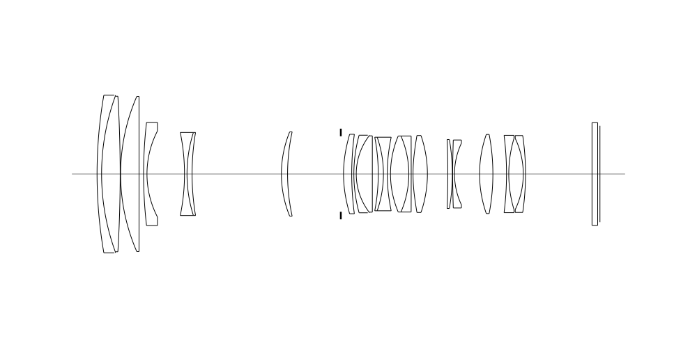
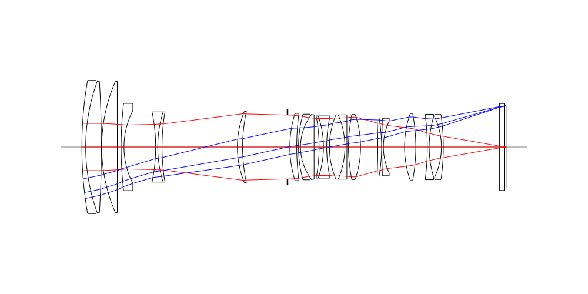
## Spot Diagrams
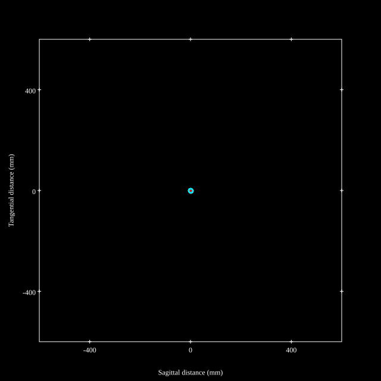
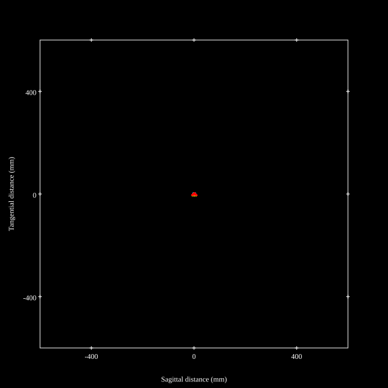
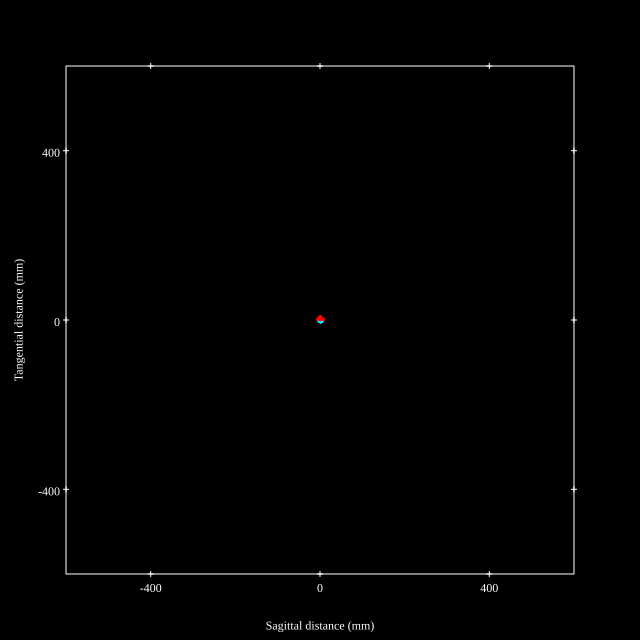
## Paraxial Parameters
| parameter | value |
| ---       | ---   |
| effective_focal_length |72.104
| back_focal_length | 1.002
| optical_invariant | 3.662
| object_distance | 1.0E10
| image_distance | 1.002
| power | 0.014
| pp1_H | 84.347
| ppk_H' | -71.102
| ffl_F | 12.243
| fno | 2.91
| enp_dist_P | 80.291
| enp_radius | 12.39
| exp_dist_P' | -75.399
| exp_radius | 13.129
| m | -0
| red | -1.3868858134469762E8
| n_obj | 1
| n_img | 1
| img_ht | 21.31
| obj_ang | 16.465
| obj_na | 0
| img_na | -0.172|
## Spot Analysis
| Field | Spot Mean Radius | Spot Max Radius |
| ---   | ---              | ---             |
 | Field(x=0.0, y=0.0) | 3.785 | 9.367|
 | Field(x=0.0, y=0.1) | 3.93 | 15.306|
 | Field(x=0.0, y=0.2) | 4.3 | 18.766|
 | Field(x=0.0, y=0.3) | 4.419 | 16.396|
 | Field(x=0.0, y=0.4) | 4.352 | 15.02|
 | Field(x=0.0, y=0.5) | 4.269 | 13.888|
 | Field(x=0.0, y=0.6) | 3.938 | 12.22|
 | Field(x=0.0, y=0.7) | 3.64 | 11.165|
 | Field(x=0.0, y=0.8) | 3.557 | 11.059|
 | Field(x=0.0, y=0.9) | 3.681 | 10.429|
 | Field(x=0.0, y=1.0) | 4.199 | 10.78|
## Polychromatic Geometric MTF
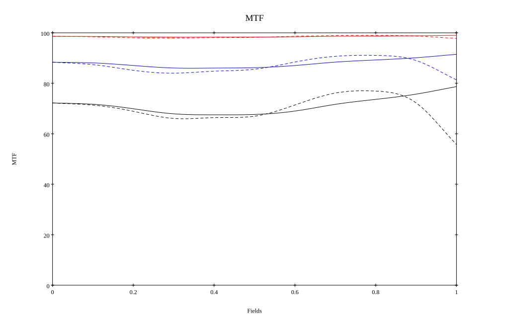
* 10=red,30=blue,50=black cycles/mm
* Solid lines represent sagittal, dashed lines tangential
* To generate above, MTFs for wavelengths 587.5618(d), 486.1327(F), 656.2725(C) were calculated across 10 fields, and then averaged
## Polychromatic Geometric MTF (Weighted)
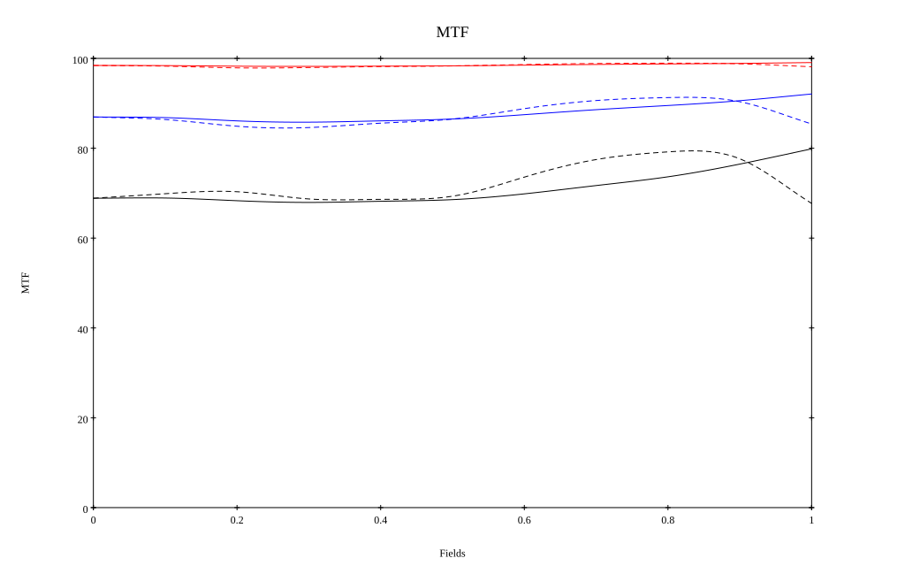
* 10=red,30=blue,50=black cycles/mm
* Solid lines represent sagittal, dashed lines tangential
* To generate above, MTFs for wavelengths 587.5618(d) wt(1.0), 656.2725(C) wt(0.475), 546.074(e) wt(0.98), 486.1327(F) wt(0.49), 435.8343(g) wt(0.15) were calculated across 10 fields, and then combined using weighted average
# 200mm f2.8
## Layouts
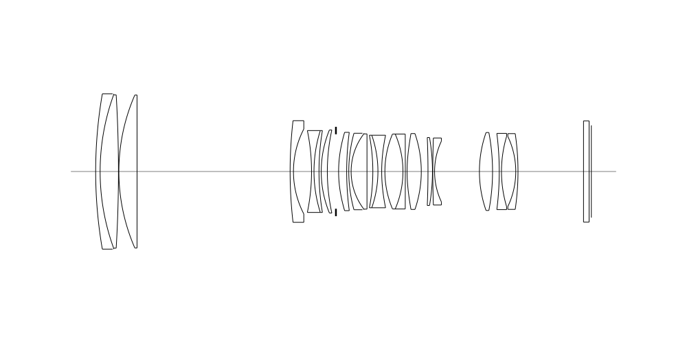
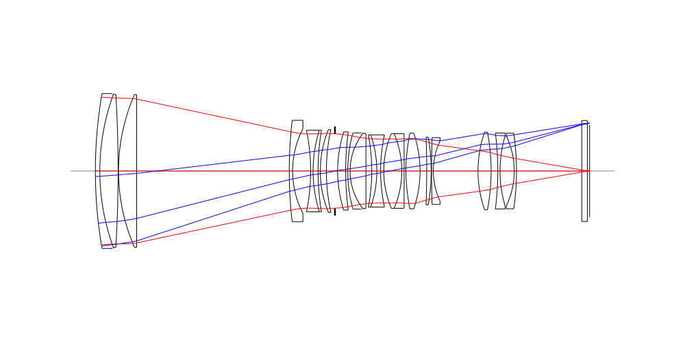
## Spot Diagrams

## Paraxial Parameters
| parameter | value |
| ---       | ---   |
| effective_focal_length |194.001
| back_focal_length | 1.002
| optical_invariant | 3.544
| object_distance | 1.0E10
| image_distance | 1.002
| power | 0.005
| pp1_H | -51.577
| ppk_H' | -192.999
| ffl_F | -245.578
| fno | 2.92
| enp_dist_P | 213.433
| enp_radius | 33.215
| exp_dist_P' | -80.99
| exp_radius | 14.038
| m | -0
| red | -5.154618040509589E7
| n_obj | 1
| n_img | 1
| img_ht | 20.698
| obj_ang | 6.09
| obj_na | 0
| img_na | -0.171|
## Spot Analysis
| Field | Spot Mean Radius | Spot Max Radius |
| ---   | ---              | ---             |
 | Field(x=0.0, y=0.0) | 2.466 | 8.294|
 | Field(x=0.0, y=0.1) | 2.25 | 8.445|
 | Field(x=0.0, y=0.2) | 2.387 | 9.117|
 | Field(x=0.0, y=0.3) | 2.541 | 12.133|
 | Field(x=0.0, y=0.4) | 2.547 | 7.758|
 | Field(x=0.0, y=0.5) | 2.724 | 7.164|
 | Field(x=0.0, y=0.6) | 3.062 | 6.675|
 | Field(x=0.0, y=0.7) | 3.531 | 8.834|
 | Field(x=0.0, y=0.8) | 4.058 | 10.922|
 | Field(x=0.0, y=0.9) | 4.545 | 11.577|
 | Field(x=0.0, y=1.0) | 4.976 | 10.06|
## Polychromatic Geometric MTF
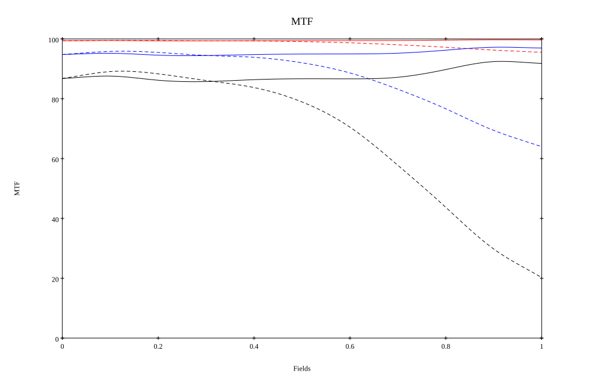
* 10=red,30=blue,50=black cycles/mm
* Solid lines represent sagittal, dashed lines tangential
* To generate above, MTFs for wavelengths 587.5618(d), 486.1327(F), 656.2725(C) were calculated across 10 fields, and then averaged
## Polychromatic Geometric MTF (Weighted)
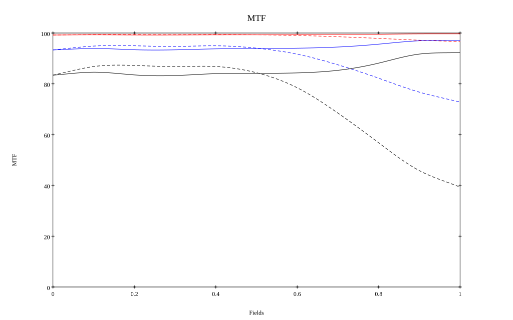
* 10=red,30=blue,50=black cycles/mm
* Solid lines represent sagittal, dashed lines tangential
* To generate above, MTFs for wavelengths 587.5618(d) wt(1.0), 656.2725(C) wt(0.475), 546.074(e) wt(0.98), 486.1327(F) wt(0.49), 435.8343(g) wt(0.15) were calculated across 10 fields, and then combined using weighted average
## Resources
* [OpticalBench Compatible Data File, tab delimited](./prescription.txt)
* [Zemax file](./US20250093627_Example01P.zmx)

Report / Zemax file generated using [Beam42](https://github.com/BeamFour/Beam42) on 2026-09-04
