# Sigma APO Zoom 70-210mm F2.8
## Patent Information
| Country | Patent Number | Example | Year of Application | Inventors | Organisation | Link |
| ---     | ---           | ---     | ---                 | ---       | ---          | ---  |
|JP | JP,06-051202 | 1 | 1992 | MINATO ATSUO | Sigma Corp | [link](https://www.j-platpat.inpit.go.jp/c1801/PU/JP-H06-051202/11/en) |
## Surface Data
Note that where glass types are shown the refractive index and abbe number is as per assigned glass type

| ID  | Radius | Thickness | Diameter | nd  | vd  | Glass Make | Glass |
| --- | ---    | ---       | ---      | --- | --- | ---        | ---   |
| 1 | 106.07 | 2.5 | 72.92 | 1.80518 | 25.47 | Hoya | FD6 |
| 2 | 75.2 | 0.1 | 71.72 |  |  |  |
| 3 | 75.2 | 12.46 | 71.72 | 1.497 | 81.61 | Hoya | FCD1 |
| 4 | -737.38 | d4 | 71.72 |  |  |  |
| 5 | 99.41 | 6.81 | 66.96 | 1.497 | 81.61 | Hoya | FCD1 |
| 6 | 689.18 | d6 | 66.96 |  |  |  |
| 7 | -176.83 | 5.12 | 38.62 | 1.62588 | 35.74 | Hoya | E-F1 |
| 8 | -43.08 | 1.4 | 38.62 | 1.58913 | 61.25 | Hoya | BACD5 |
| 9 | 50.79 | 5.56 | 34.18 |  |  |  |
| 10 | -150.66 | 1.4 | 34.36 | 1.51009 | 63.44 | Hoya | BSC1 |
| 11 | 42.5 | 3.73 | 34.36 | 1.80518 | 25.47 | Hoya | FD6 |
| 12 | 127.94 | 2.8 | 32.76 |  |  |  |
| 13 | -77.72 | 1.4 | 32.76 | 1.713 | 53.94 | Hoya | LAC8 |
| 14 | 239.25 | d14 | 34.36 |  |  |  |
| 15 | -197.11 | 2.25 | 38.44 | 1.51742 | 52.15 | Hoya | CF6 |
| 16 | -82.22 | 0.15 | 38.44 |  |  |  |
| 17 | 160.87 | 6.59 | 38.54 | 1.5697 | 49.44 | CDGM | BAF2 |
| 18 | -42.71 | 1.5 | 38.54 | 1.76182 | 26.55 | Hoya | FD14 |
| 19 | -107.88 | d19 | 38.54 |  |  |  |
| 20 | 57.39 | 3.99 | 39.92 | 1.497 | 81.61 | Hoya | FCD1 |
| 21 | 331.18 | 0.2 | 39.92 |  |  |  |
| 22 | 36.56 | 4.89 | 38.38 | 1.497 | 81.61 | Hoya | FCD1 |
| 23 | 88.73 | 3.5 | 36.84 |  |  |  |
| 24 | AS | 11.37 | 33.537 |  |  |  |
| 25 | 110.59 | 2.44 | 30.18 | 1.68893 | 31.16 | Hoya | FD8 |
| 26 | 28.52 | 10.93 | 26.26 |  |  |  |
| 27 | 65.94 | 4.42 | 29.0 | 1.54072 | 47.2 | Hoya | FEL2 |
| 28 | -65.24 | 7.08 | 29.0 |  |  |  |
| 29 | -37.65 | 1.77 | 28.14 | 1.7725 | 49.62 | Hoya | TAF1 |
| 30 | 218.0 | 0.61 | 34.36 |  |  |  |
| 31 | 96.27 | 4.8 | 34.36 | 1.7433 | 49.22 | Hoya | NBF1 |
| 32 | -64.55 | d32 | 34.36 |  |  |  |
## Variables
| Variable | 70mm f2.8 | 210mm f2.8 |
| --- | --- | --- |
| Focal length |72.56 |202.91 |
| F-Number |2.93 |2.93 |
| Angle of View |33.2 |12.16 |
| d4 | 15.62 | 15.62 |
| d6 | 3.0 | 43.2427 |
| d14 | 28.93 | 2.5186 |
| d19 | 17.52 | 3.6893 |
| d32 | 59.85 | 59.84 |
# 70mm f2.8
## Layouts
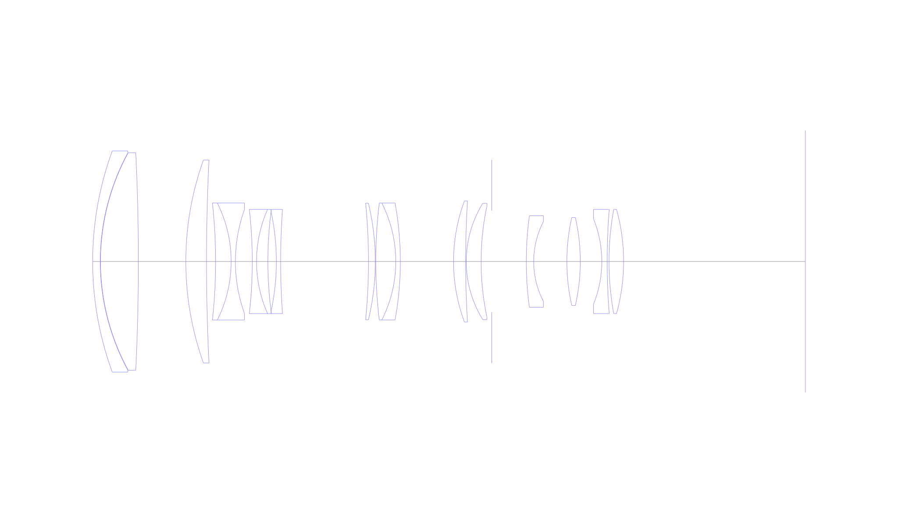
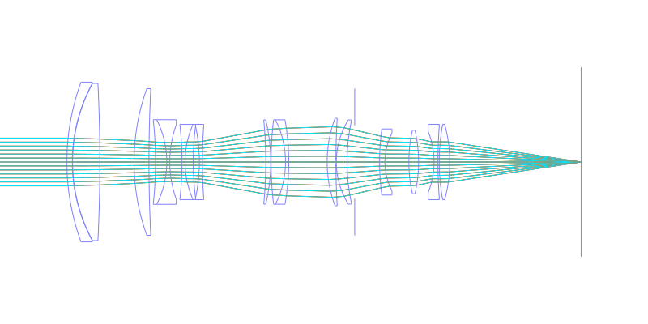
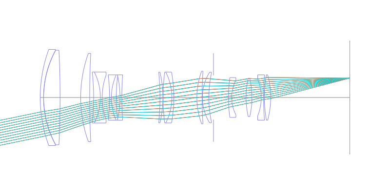
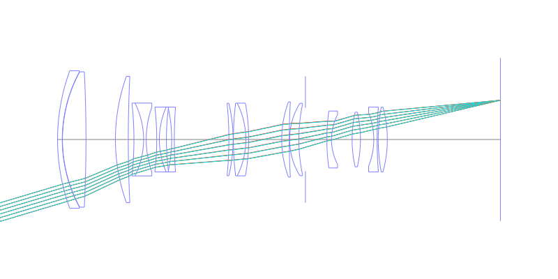
## Spot Diagrams
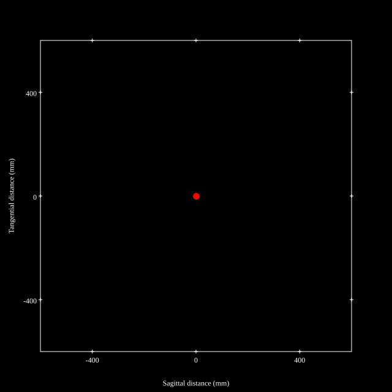
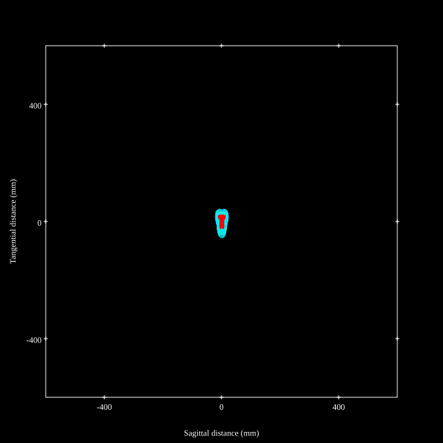
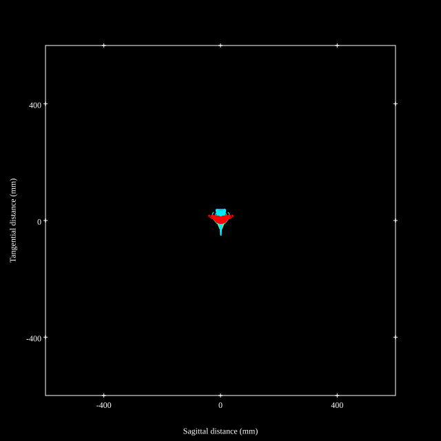
## Paraxial Parameters
| parameter | value |
| ---       | ---   |
| effective_focal_length |72.991
| back_focal_length | 59.958
| optical_invariant | 3.691
| object_distance | 1.0E10
| image_distance | 59.958
| power | 0.014
| pp1_H | 127.776
| ppk_H' | -13.033
| ffl_F | 54.785
| fno | 2.948
| enp_dist_P | 104.44
| enp_radius | 12.38
| exp_dist_P' | -47.23
| exp_radius | 18.199
| m | -0
| red | -1.3700293093584612E8
| n_obj | 1
| n_img | 1
| img_ht | 21.76
| obj_ang | 16.6
| obj_na | 0
| img_na | -0.167|
## Spot Analysis
| Field | Spot Mean Radius | Spot Max Radius |
| ---   | ---              | ---             |
 | Field(x=0.0, y=0.0) | 4.899 | 10.169|
 | Field(x=0.0, y=0.1) | 4.947 | 11.301|
 | Field(x=0.0, y=0.2) | 5.208 | 12.077|
 | Field(x=0.0, y=0.3) | 5.801 | 13.733|
 | Field(x=0.0, y=0.4) | 6.706 | 18.665|
 | Field(x=0.0, y=0.5) | 7.686 | 25.607|
 | Field(x=0.0, y=0.6) | 9.107 | 32.445|
 | Field(x=0.0, y=0.7) | 10.431 | 36.343|
 | Field(x=0.0, y=0.8) | 11.988 | 36.546|
 | Field(x=0.0, y=0.9) | 15.159 | 46.193|
 | Field(x=0.0, y=1.0) | 20.25 | 64.427|
## Polychromatic Geometric MTF
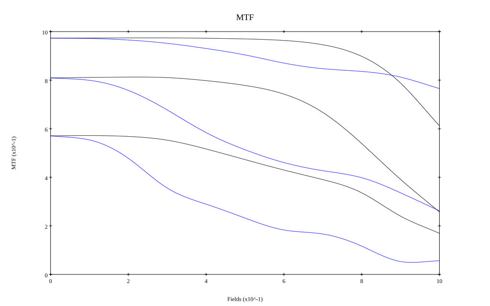
* 10,30,50 cycles/mm
* Black lines represent sagittal, blue tangential
* To generate above, MTFs for wavelengths 587.5618(d), 486.1327(F), 656.2725(C) were calculated across 10 fields, and then averaged
## Polychromatic Geometric MTF (Weighted)
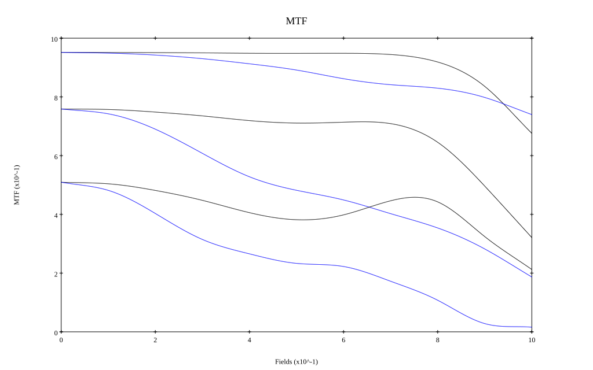
* 10,30,50 cycles/mm
* Black lines represent sagittal, blue tangential
* To generate above, MTFs for wavelengths 587.5618(d) wt(1.0), 656.2725(C) wt(0.475), 546.074(e) wt(0.98), 486.1327(F) wt(0.49), 435.8343(g) wt(0.15) were calculated across 10 fields, and then combined using weighted average
# 210mm f2.8
## Layouts
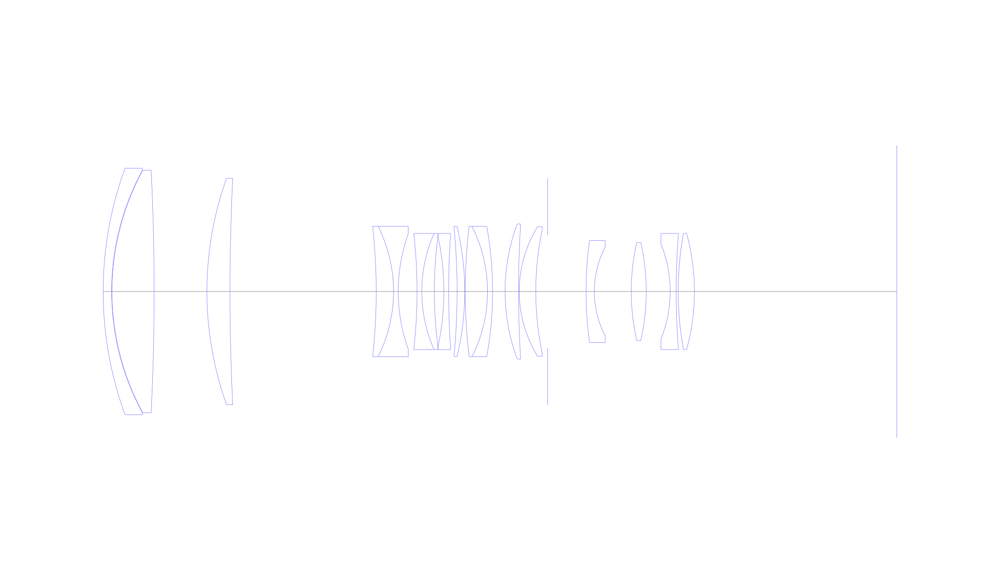
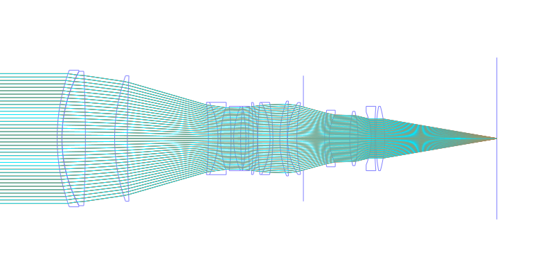
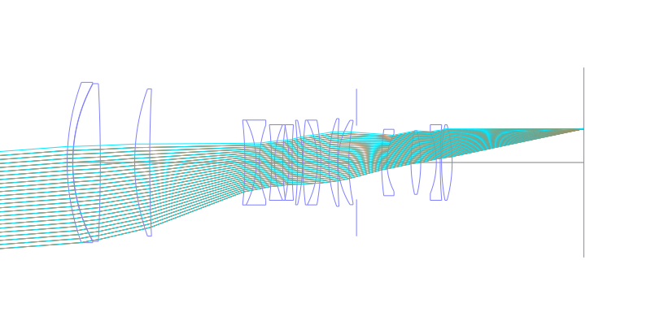
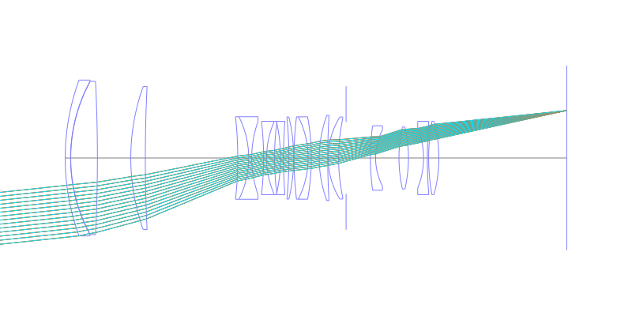
## Spot Diagrams
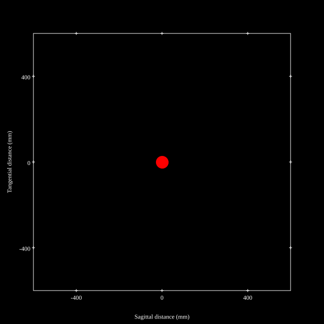
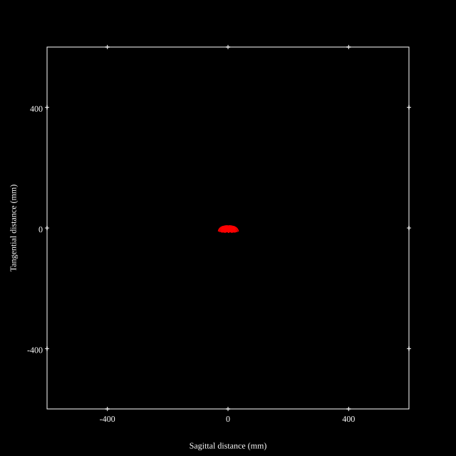
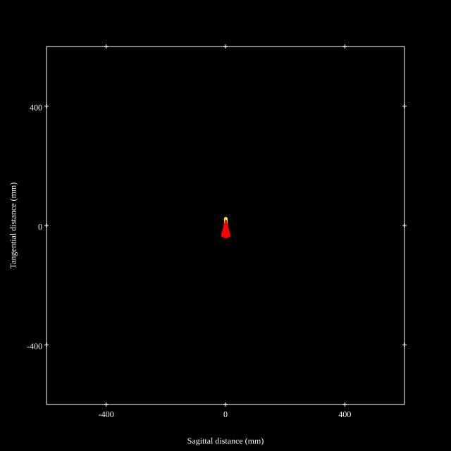
## Paraxial Parameters
| parameter | value |
| ---       | ---   |
| effective_focal_length |204.112
| back_focal_length | 59.809
| optical_invariant | 3.689
| object_distance | 1.0E10
| image_distance | 59.809
| power | 0.005
| pp1_H | 110.725
| ppk_H' | -144.303
| ffl_F | -93.387
| fno | 2.947
| enp_dist_P | 295.442
| enp_radius | 34.635
| exp_dist_P' | -47.369
| exp_radius | 18.182
| m | -0
| red | -4.89925962815866E7
| n_obj | 1
| n_img | 1
| img_ht | 21.741
| obj_ang | 6.08
| obj_na | 0
| img_na | -0.167|
## Spot Analysis
| Field | Spot Mean Radius | Spot Max Radius |
| ---   | ---              | ---             |
 | Field(x=0.0, y=0.0) | 9.445 | 24.412|
 | Field(x=0.0, y=0.1) | 9.951 | 30.715|
 | Field(x=0.0, y=0.2) | 10.178 | 31.795|
 | Field(x=0.0, y=0.3) | 10.444 | 31.403|
 | Field(x=0.0, y=0.4) | 10.221 | 32.986|
 | Field(x=0.0, y=0.5) | 9.74 | 34.398|
 | Field(x=0.0, y=0.6) | 9.021 | 34.229|
 | Field(x=0.0, y=0.7) | 8.21 | 31.49|
 | Field(x=0.0, y=0.8) | 8.726 | 25.281|
 | Field(x=0.0, y=0.9) | 12.566 | 24.797|
 | Field(x=0.0, y=1.0) | 20.126 | 40.343|
## Polychromatic Geometric MTF
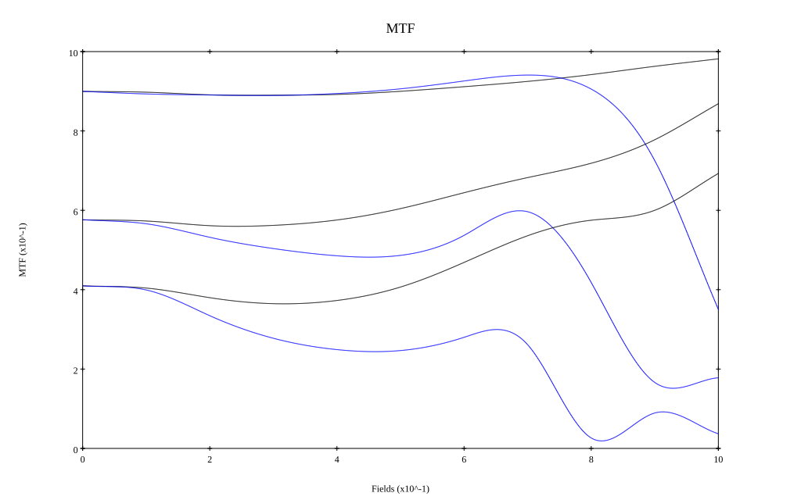
* 10,30,50 cycles/mm
* Black lines represent sagittal, blue tangential
* To generate above, MTFs for wavelengths 587.5618(d), 486.1327(F), 656.2725(C) were calculated across 10 fields, and then averaged
## Polychromatic Geometric MTF (Weighted)
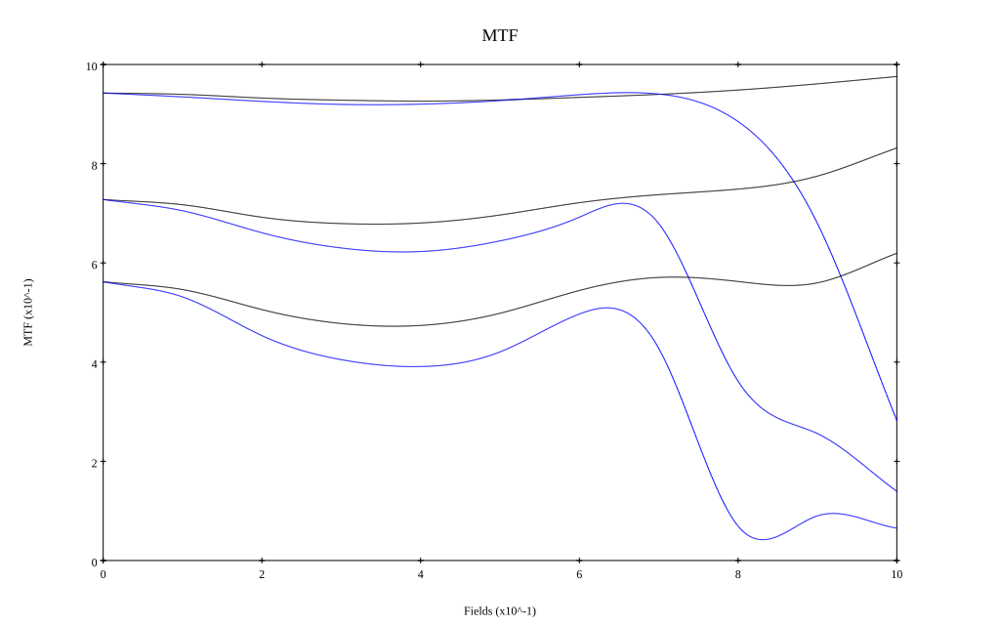
* 10,30,50 cycles/mm
* Black lines represent sagittal, blue tangential
* To generate above, MTFs for wavelengths 587.5618(d) wt(1.0), 656.2725(C) wt(0.475), 546.074(e) wt(0.98), 486.1327(F) wt(0.49), 435.8343(g) wt(0.15) were calculated across 10 fields, and then combined using weighted average
## Resources
* [OpticalBench Compatible Data File, tab delimited](./prescription.txt)
* [Zemax file](./JP1994-051202_Example01P.zmx)

Report / Zemax file generated using [Beam42](https://github.com/BeamFour/Beam42) on 2026-06-06
